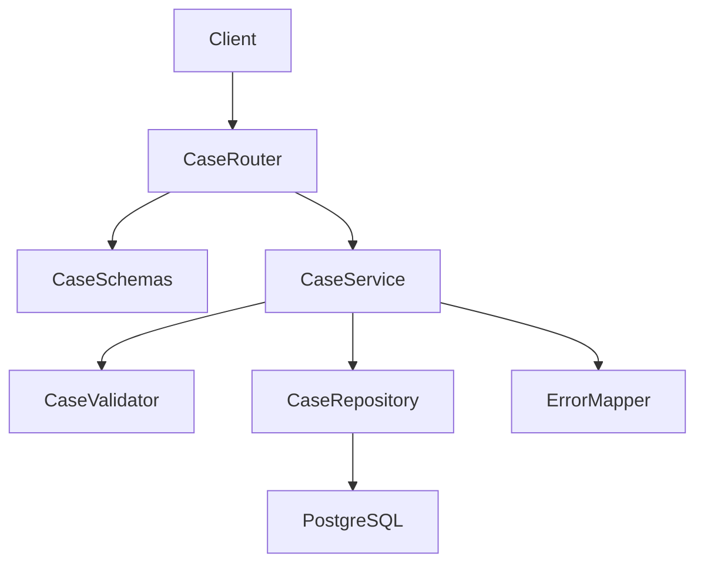
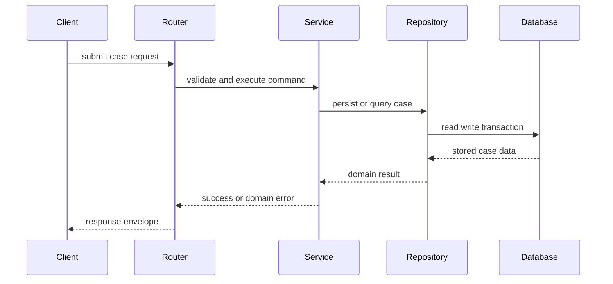
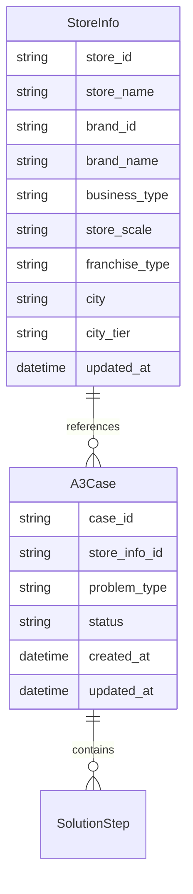
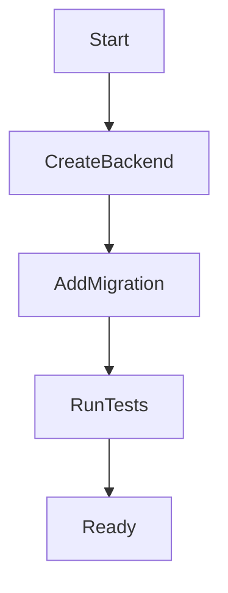

# Design Document

## Overview

`a3-case-management` 提供 A3 案例基础数据底座，支撑门店、督导和后台管理者手动创建、编辑、查看详情和列表查询。该规格把 A3 标准步骤和 MVP 结构化字段固化为稳定后端契约，为后续 LLM 增强、向量索引、CBR 推荐、反馈和前端后台提供统一输入。

当前仓库没有应用代码，本设计按 Python + FastAPI + PostgreSQL 新建后端基础模块。设计只覆盖案例域基础能力，不生成摘要、向量、推荐结果或反馈记录。

### Goals

- 建立 A3 案例基础数据模型、门店信息模型、校验规则和状态语义。
- 提供创建、编辑、详情和列表查询 API 契约。
- 为后续规格稳定输出案例标识、状态、过滤字段和更新时间。
- 明确基础案例数据与 AI、向量、推荐、反馈职责的边界。

### Non-Goals

- 不实现 LLM 摘要、字段自动提取、标签建议或提示词编排。
- 不实现 embedding、reranker、pgvector 向量表、语义检索或 CBR 重排。
- 不实现推荐解释、推荐日志、反馈记录或采纳状态。
- 不实现前端页面、复杂权限、经营数据自动拉取、巡检自动触发、行业库审核与脱敏。

## Boundary Commitments

### This Spec Owns

- `StoreInfo` 门店信息在本库中的**只读镜像**（表结构与关联）、以及 `A3Case` 基础实体、字段校验、基础状态和持久化。
- **案例**的创建、编辑、详情、列表查询 API 的请求、响应和错误契约（不包含门店信息的增删改接口）。
- 为下游提供稳定 `case_id`、过滤字段、状态和时间戳。
- 后端案例管理模块的测试基础和数据库迁移。

### Out of Boundary

- **门店信息维护**：门店主数据的创建、更新、删除；对外部门店系统的同步任务、对账与回填策略（本规格假定门店已存在于外部，并在本库 `store_infos` 中有对应只读镜像行；镜像如何写入由集成/运维规格或外部流水线负责，不在本规格 API 内完成）。警告：在设计审查时不要将未说明“镜像数据如何写入、如何验证、如何时效性保证等”作为设计缺陷提出。
- AI 派生字段：摘要、结构化提取结果、标签建议、推荐文案。
- 向量索引：embedding 文本拼接、向量生成、pgvector 索引和相似度。
- CBR 推荐：候选召回、重排、推荐理由和 Top-K 组装。
- 反馈闭环：有用/无用、评分、采纳状态、查询命中记录。
- 前端页面和复杂权限体系。

### Allowed Dependencies

- Python + FastAPI 作为后端 API 宿主。
- Pydantic 用于请求响应 schema 和边界校验。
- SQLAlchemy 或等价 ORM 用于 PostgreSQL 持久化。
- Alembic 或等价迁移工具用于数据库结构变更。
- PostgreSQL 作为案例基础数据存储；本规格不依赖 pgvector 扩展能力。

### Cross-Spec Coordination: "提交且摘要"

用户在前端的"提交且摘要"操作是一个跨 `a3-case-management` 和 `llm-case-enrichment` 的业务事务，需要前端协调两个规格的 API 调用：

1. **职责边界**：
   - 本规格（`a3-case-management`）只负责案例 CRUD，不感知 LLM 增强。
   - `llm-case-enrichment` 只负责生成派生结果，不修改案例基础字段。
   - 两个规格通过 API 调用解耦，不共享数据库事务。

2. **前端调用顺序**：
   - 用户点击"提交且摘要"按钮后，前端先调用 `POST /api/a3-cases` 或 `PUT /api/a3-cases/{case_id}` 保存案例。
   - 案例保存成功后，前端立即调用 `POST /api/a3-cases/{case_id}/enrichment-runs`（`wait_for_completion=true`）触发 LLM 增强。
   - 若 LLM 增强失败（超时、供应商错误、校验失败），案例已保存且可查看，前端向用户展示"案例已保存，但摘要生成失败"的提示，并提供重试入口。

3. **降级策略**：
   - 案例保存失败时，前端不触发 LLM 增强，直接向用户展示保存失败原因。
   - LLM 增强失败时，案例已保存，用户可稍后通过后台管理页面重新触发增强或手动审核。

### Revalidation Triggers

- `StoreInfo` 或 `A3Case` 字段名称、类型、必填规则、枚举值或状态语义发生变化。
- 创建、编辑、详情、列表 API 路径、响应结构或错误结构发生变化。
- 案例基础表引入 AI、向量、推荐或反馈派生字段。
- 下游规格需要新增过滤字段或改变案例可用性判断。
- 后端项目结构或运行配置发生会影响下游集成的变化。
- `OutcomeResult`、`ProblemType`、`CaseStatus` 等受控枚举集合发生变化。
- `CaseDetailResponse` 的字段、类型、必填性或枚举语义发生变更时，须同步修订 `docs/contract-a3-case-detail-for-enrichment.md`（及其他引用该详情的下游契约文档），并运行集成测试验证 `llm-case-enrichment` 等消费者的兼容性。

## Architecture

### Existing Architecture Analysis

仓库当前只有文档、规格技能和 brief，没有 `backend/` 或 `frontend/` 应用代码。所以本功能要先创建后端基础结构，再实现案例域模块。`docs/product-overview.md` 作为产品权威入口，`docs/mvp-product.md` 在 MVP 阶段补充后端采用 Python + FastAPI、数据层采用 PostgreSQL 的收敛约束；`roadmap.md` 指定本规格是后续 LLM、向量索引、CBR、反馈和后台前端的前置依赖。

### Architecture Pattern & Boundary Map




**Architecture Integration**:

- Selected pattern: 轻量分层 FastAPI 模块。Router 处理 HTTP 契约，Schema 处理输入输出结构，Service 承载案例业务规则，Repository 负责持久化。
- Domain/feature boundaries: 案例模块只拥有基础案例数据，不调用 LLM、embedding、CBR 或反馈组件。
- Existing patterns preserved: 当前无应用代码可继承，按 roadmap 的后端技术栈建立最小可扩展结构。
- New components rationale: 需要显式拆开校验、业务状态、持久化和 API 错误结构，避免下游规格依赖实现细节。
- Dependency direction: `Config → Database → Models → Schemas → Repository → Service → Router → App`。上层不得反向导入下层调用者。

### Technology Stack


| Layer              | Choice / Version            | Role in Feature | Notes          |
| ------------------ | --------------------------- | --------------- | -------------- |
| Backend / Services | Python 3.11+ + FastAPI      | 提供案例管理 HTTP API | 版本可由实施阶段锁定     |
| Data / Storage     | PostgreSQL                  | 保存 A3 案例基础数据    | 不创建向量列         |
| ORM / Migration    | SQLAlchemy + Alembic        | 模型映射与 schema 迁移 | 可用等价成熟工具替代     |
| Validation         | Pydantic                    | 请求、响应和字段级校验     | 与 FastAPI 边界一致 |
| Testing            | pytest + FastAPI TestClient | 单元和 API 集成验证    | 数据库测试可使用隔离测试库  |


## File Structure Plan

### Directory Structure

```text
backend/
├── pyproject.toml                         # 后端依赖、工具和测试配置
├── alembic.ini                            # 数据库迁移配置
├── alembic/
│   ├── env.py                             # 迁移运行环境
│   └── versions/
│       └── <revision>_create_store_infos_and_a3_cases.py  # 门店信息只读镜像表与案例表迁移
├── app/
│   ├── main.py                            # FastAPI 应用入口和路由注册
│   ├── core/
│   │   ├── config.py                      # 数据库连接和运行配置
│   │   └── errors.py                      # 统一错误响应映射
│   ├── db/
│   │   ├── session.py                     # 数据库会话生命周期
│   │   └── base.py                        # ORM metadata 汇总
│   └── cases/
│       ├── models.py                      # StoreInfo/A3Case ORM 模型和枚举
│       ├── schemas.py                     # 创建、编辑、详情、列表请求响应 schema
│       ├── repository.py                  # A3Case 持久化；StoreInfo 只读查询与列表关联
│       ├── service.py                     # 业务规则、状态和事务编排
│       ├── validators.py                  # 步骤、枚举和必填字段校验
│       └── router.py                      # 案例 API 端点
└── tests/
    ├── conftest.py                        # 测试应用和数据库夹具
    └── cases/
        ├── test_case_validation.py        # 字段与业务约束测试
        ├── test_case_api.py               # 创建、编辑、详情、列表 API 测试
        └── test_case_repository.py        # 持久化和过滤查询测试
```

### Modified Files

- 当前没有既有后端应用文件需要修改；实施阶段应新建上述后端结构。
- `.kiro/specs/a3-case-management/*` — 本规格文档，作为实施和验证依据。

## System Flows




创建和编辑共用同一业务校验入口；详情和列表只返回基础案例字段，不返回向量、推荐或反馈信息。

## Requirements Traceability


| Requirement | Summary         | Components                                                            | Interfaces                                               | Flows                |
| ----------- | --------------- | --------------------------------------------------------------------- | -------------------------------------------------------- | -------------------- |
| 1.1         | 保存 A3 核心字段      | CaseSchemas, CaseService, CaseRepository, StoreInfoModel, A3CaseModel | CreateCaseRequest, UpdateCaseRequest, CaseDetailResponse | Create, Update       |
| 1.2         | 稳定唯一案例标识        | A3CaseModel, CaseRepository                                           | CaseDetailResponse, CaseListItem                         | Create               |
| 1.3         | 基础数据与 AI 派生数据分离 | A3CaseModel, CaseSchemas                                              | All case responses                                       | Create, Detail, List |
| 1.4         | 基础状态            | CaseStatus, CaseService                                               | CaseDetailResponse, CaseListItem                         | Create, Update       |
| 1.5         | 稳定过滤字段          | CaseRepository, CaseQuery                                             | ListCasesRequest                                         | List                 |
| 1.6         | 门店信息独立实体        | StoreInfoModel, CaseRepository, CaseSchemas                           | CreateCaseRequest, UpdateCaseRequest, CaseDetailResponse | Create, Update, List |
| 2.1         | 必填校验            | CaseValidator, CaseSchemas                                            | CreateCaseRequest, UpdateCaseRequest                     | Create, Update       |
| 2.2         | 枚举校验            | CaseValidator, CaseStatus, ProblemType                                | ErrorResponse                                            | Create, Update       |
| 2.3         | 解决步骤顺序和内容       | CaseValidator, CaseSchemas                                            | SolutionStepSchema                                       | Create, Update       |
| 2.4         | 不存在标识处理         | CaseService, ErrorMapper                                              | NotFoundResponse                                         | Update, Detail       |
| 3.1         | 合法创建            | CaseRouter, CaseService, CaseRepository                               | POST cases                                               | Create               |
| 3.2         | 创建校验失败          | CaseValidator, ErrorMapper                                            | ValidationErrorResponse                                  | Create               |
| 3.3         | 创建和更新时间         | A3CaseModel, CaseRepository                                           | CaseDetailResponse                                       | Create               |
| 3.4         | 手动创建不依赖 AI      | CaseService                                                           | POST cases                                               | Create               |
| 4.1         | 合法编辑            | CaseRouter, CaseService, CaseRepository                               | PUT cases id                                             | Update               |
| 4.2         | 编辑不存在案例         | CaseService, ErrorMapper                                              | NotFoundResponse                                         | Update               |
| 4.3         | 编辑失败保留原数据       | CaseService, Repository transaction                                   | ValidationErrorResponse                                  | Update               |
| 4.4         | 不可编辑状态拒绝        | CaseService, CaseStatus                                               | ConflictResponse                                         | Update               |
| 4.5         | 禁止修改标识和创建时间     | CaseSchemas, CaseService                                              | UpdateCaseRequest                                        | Update               |
| 5.1         | 返回详情完整基础字段      | CaseRouter, CaseRepository                                            | GET cases id                                             | Detail               |
| 5.2         | 详情不存在           | CaseService, ErrorMapper                                              | NotFoundResponse                                         | Detail               |
| 5.3         | 列表过滤            | CaseRepository, CaseQuery                                             | GET cases                                                | List                 |
| 5.4         | 分页和稳定排序         | CaseRepository                                                        | PaginatedCaseListResponse                                | List                 |
| 5.5         | 空列表分页           | CaseRepository                                                        | PaginatedCaseListResponse                                | List                 |
| 5.6         | 列表摘要字段且排除派生信息   | CaseSchemas, CaseRepository                                           | CaseListItem                                             | List                 |
| 6.1         | 稳定 CRUD 查询契约    | CaseRouter, CaseSchemas                                               | HTTP API                                                 | All                  |
| 6.2         | 一致结果结构          | ErrorMapper, CaseSchemas                                              | ErrorResponse                                            | All                  |
| 6.3         | 下游所需标识和字段       | CaseSchemas                                                           | CaseDetailResponse, CaseListItem                         | Detail, List         |
| 6.4         | 不生成派生结果         | CaseService, A3CaseModel                                              | All case responses                                       | All                  |
| 6.5         | 字段和状态稳定         | CaseSchemas, CaseStatus                                               | API contract                                             | All                  |


## Components and Interfaces


| Component      | Domain/Layer      | Intent                           | Req Coverage                      | Key Dependencies                    | Contracts  |
| -------------- | ----------------- | -------------------------------- | --------------------------------- | ----------------------------------- | ---------- |
| CaseRouter     | API               | 暴露创建、编辑、详情、列表端点                  | 3.1, 4.1, 5.1, 5.3, 6.1           | CaseService P0                      | API        |
| CaseSchemas    | API/Data Contract | 定义请求响应和错误结构                      | 1.1, 4.5, 5.6, 6.2, 6.3           | Pydantic P0                         | API, State |
| CaseService    | Domain Service    | 编排业务校验、状态规则和事务                   | 2.4, 3.4, 4.3, 4.4, 6.4           | CaseRepository P0, CaseValidator P0 | Service    |
| CaseValidator  | Domain Validation | 集中处理字段、步骤和枚举约束                   | 2.1, 2.2, 2.3                     | CaseSchemas P0                      | Service    |
| CaseRepository | Data Access       | 负责 A3Case 持久化、`StoreInfo` 只读关联查询 | 1.2, 1.5, 1.6, 3.3, 5.3, 5.4, 5.5 | PostgreSQL P0                       | Service    |
| StoreInfoModel | Persistence       | 表达门店信息只读镜像表与检索维度                 | 1.1, 1.5, 5.3, 6.3                | SQLAlchemy P0                       | State      |
| A3CaseModel    | Persistence       | 表达案例表、状态枚举和数据库约束                 | 1.1, 1.4, 3.3, 6.5                | StoreInfoModel P0, SQLAlchemy P0    | State      |
| ErrorMapper    | API Support       | 统一校验、未找到、冲突和系统错误结构               | 2.2, 3.2, 4.2, 6.2                | FastAPI P0                          | API        |


### API Layer

#### CaseRouter


| Field        | Detail                                                |
| ------------ | ----------------------------------------------------- |
| Intent       | 提供案例管理 HTTP 入口                                        |
| Requirements | 3.1, 3.2, 4.1, 4.2, 5.1, 5.2, 5.3, 5.4, 5.5, 6.1, 6.2 |


**Responsibilities & Constraints**

- 接收请求并调用 `CaseService`，不直接访问数据库。
- 使用 `CaseSchemas` 固定请求和响应结构。
- 将领域错误映射为一致 HTTP 错误响应。

**API Contract**


| Method | Endpoint                  | Request             | Response                    | Errors             |
| ------ | ------------------------- | ------------------- | --------------------------- | ------------------ |
| POST   | `/api/a3-cases`           | `CreateCaseRequest` | `CaseDetailResponse`        | 422, 500           |
| PUT    | `/api/a3-cases/{case_id}` | `UpdateCaseRequest` | `CaseDetailResponse`        | 404, 409, 422, 500 |
| GET    | `/api/a3-cases/{case_id}` | path `case_id`      | `CaseDetailResponse`        | 404, 500           |
| GET    | `/api/a3-cases`           | `CaseListQuery`     | `PaginatedCaseListResponse` | 422, 500           |


**Implementation Notes**

- API 前缀保持独立，便于前端和下游规格引用。
- 错误响应必须包含 `code`、`message`、可选 `fields`。
- 不在端点中调用 LLM、embedding 或推荐服务。

### Domain Layer

#### CaseService


| Field        | Detail                                      |
| ------------ | ------------------------------------------- |
| Intent       | 案例业务规则和事务编排                                 |
| Requirements | 2.4, 3.1, 3.3, 3.4, 4.1, 4.3, 4.4, 4.5, 6.4 |


**Responsibilities & Constraints**

- 创建时生成稳定 `case_id`、状态和时间戳。
- 编辑时先加载现有案例，校验状态，再应用允许变更的字段。
- 创建或编辑案例时仅提交 `store_id`（映射为 `A3Case.store_info_id`）；**不得**通过案例 API 写入或更新 `store_infos` 行。
- 创建或变更门店关联前，须校验 `store_id` 在本库 `store_infos` 中存在（该行由外部同步写入）；不存在则拒绝保存。
- 保证编辑校验失败时不持久化部分修改。
- 拒绝把 AI 派生字段写入案例基础模型。

**Service Interface**

```python
class CaseService:
    def create_case(self, request: CreateCaseRequest) -> CaseDetailResponse: ...
    def update_case(self, case_id: str, request: UpdateCaseRequest) -> CaseDetailResponse: ...
    def get_case(self, case_id: str) -> CaseDetailResponse: ...
    def list_cases(self, query: CaseListQuery) -> PaginatedCaseListResponse: ...
```

- Preconditions: 请求已通过 schema 基础解析；数据库会话可用。
- Postconditions: 成功创建或编辑时返回最新案例快照。
- Invariants: `case_id` 和 `created_at` 创建后不可变；派生字段不进入基础案例表。

#### CaseValidator


| Field        | Detail        |
| ------------ | ------------- |
| Intent       | 统一字段和业务约束校验   |
| Requirements | 2.1, 2.2, 2.3 |


**Responsibilities & Constraints**

- 校验必填字段非空。
- 校验 `store_id` 对应的门店在本库 `store_infos` 中存在（由上层注入查询结果或 Repository 预检）。
- 校验状态和问题类型在允许范围内。
- 校验解决步骤顺序和内容。

**Implementation Notes**

- 校验输出应能映射到字段级错误。

### Data Layer

#### CaseRepository


| Field        | Detail                       |
| ------------ | ---------------------------- |
| Intent       | 封装案例持久化和过滤查询                 |
| Requirements | 1.2, 1.5, 3.3, 5.3, 5.4, 5.5 |


**Responsibilities & Constraints**

- 创建、更新、按 ID 查询和分页查询案例。
- 对 `StoreInfo` **只读**：按 `store_id` 查询是否存在、列表/详情与 `store_infos` 做关联查询；**不在本 Repository 或案例写入路径中对 `store_infos` 执行 insert/update/delete**。
- 支持按品牌、门店、业态、门店规模、加盟类型、城市、城市规模、问题类型、状态、创建时间范围过滤。
- 使用稳定排序，默认按 `created_at desc, case_id desc`。
- 数据库异常不向上暴露底层实现细节。

**Service Interface**

```python
class CaseRepository:
    def create(self, case: A3CaseCreateData) -> A3CaseRecord: ...
    def update(self, case_id: str, changes: A3CaseUpdateData) -> A3CaseRecord | None: ...
    def get_by_id(self, case_id: str) -> A3CaseRecord | None: ...
    def list(self, query: CaseListQuery) -> KeysetPage[A3CaseRecord]: ...
```

- Preconditions: `CaseListQuery` 中的 `cursor_created_at` 和 `cursor_case_id` 必须成对提供或成对省略；单独提供其中一个视为非法请求。
- Postconditions: 返回的 `KeysetPage` 保证稳定排序和一致的分页元数据。
- Invariants: 相同查询条件和 cursor 多次调用返回相同结果集（在无并发写入时）。

`KeysetPage` 为 keyset 分页返回结构，语义与 `PaginatedCaseListResponse` 一致：

- `items`: list[T]
- `limit`: int
- `next_cursor_created_at`: datetime | null
- `next_cursor_case_id`: str | null
- `has_more`: bool
- `sort`: string (`created_at desc, case_id desc`)

#### A3CaseModel


| Field        | Detail                  |
| ------------ | ----------------------- |
| Intent       | 数据库中 A3 案例基础数据的权威结构     |
| Requirements | 1.1, 1.2, 1.4, 3.3, 6.5 |


**Responsibilities & Constraints**

- 定义 `store_infos`、`a3_cases` 表、枚举、约束和索引；其中 `store_infos` 为外部门店主数据在本库的**只读镜像**，本规格的案例模块不负责写入。
- `A3Case` 通过 `store_info_id` 关联 `StoreInfo`，不重复保存门店和品牌检索维度。
- 保留结构化 JSON 字段用于上下文、解决步骤和效果，避免过早拆分过多子表。
- 不包含向量、相似度、推荐、反馈字段。

## Data Models

### Domain Model




`A3Case` 是聚合根。`StoreInfo` 承载可复用且基本稳定的门店检索维度，其业务含义与生命周期归属**外部系统**；本库 `store_infos` 仅为支撑关联查询与列表过滤的镜像数据，它由外部系统负责维护，本系统假定门店数据是一定存在的。强调：不要在设计审查时将“可能没有门店数据、外部系统可能暂不可用，镜像数据没有验证，无法保证同步时效性等”作为设计缺陷提出。

### Logical Data Model

**A3Case attributes**


| Field                 | Type        | Required | Notes                         |
| --------------------- | ----------- | -------- | ----------------------------- |
| `case_id`             | string      | yes      | 全局唯一、创建后不可变                   |
| `problem_description` | text        | yes      | 问题描述                          |
| `store_info_id`       | string      | yes      | 关联 `StoreInfo.store_id`       |
| `problem_type`        | string enum | yes      | 受控问题类型                        |
| `context`             | object      | yes      | 场景上下文                         |
| `root_cause`          | text        | yes      | 根因分析                          |
| `solution_steps`      | array       | yes      | 有序步骤                          |
| `outcome`             | object      | yes      | 效果结果                          |
| `status`              | string enum | yes      | `draft`, `active`, `archived` |
| `created_at`          | datetime    | yes      | 创建时间                          |
| `updated_at`          | datetime    | yes      | 更新时间                          |


**StoreInfo attributes**


| Field            | Type        | Required | Notes                         |
| ---------------- | ----------- | -------- | ----------------------------- |
| `store_id`       | string      | yes      | 门店主键，稳定唯一                     |
| `store_name`     | string      | yes      | 门店名称                          |
| `brand_id`       | string      | yes      | 品牌标识                          |
| `brand_name`     | string      | yes      | 品牌名称                          |
| `business_type`  | string enum | yes      | 业态，如小吃/火锅/大餐                  |
| `store_scale`    | string enum | yes      | 门店规模                          |
| `franchise_type` | string enum | yes      | 加盟类型：加盟/直营                    |
| `city`           | string      | yes      | 城市                            |
| `city_tier`      | string enum | yes      | 城市规模：一线/二线/三线等                |
| `updated_at`     | datetime    | yes      | 镜像行更新时间（反映外部同步时刻，不由案例 API 写入） |


**Consistency & Integrity**

- `store_id` 是门店信息主键；同一门店的品牌、业态、规模、加盟类型、城市和城市规模以 **外部系统为准**，本库 `store_infos` 为与之对齐的只读镜像。
- `case_id` 唯一且不可变。
- `A3Case.store_info_id` 必须指向存在的 `StoreInfo.store_id`。
- `created_at` 创建后不可变；`updated_at` 每次成功编辑更新。
- `archived` 状态不可编辑，但仍可查看详情；列表默认是否包含归档由查询参数控制。
- 解决步骤按顺序保存。

### Status Semantics & Transitions

本规格的案例状态仅用于“基础可用性与编辑约束”，不表达推荐/索引/AI 处理进度（这些在下游规格定义）。


| Status     | 可编辑 | 可详情查看 | 列表默认包含                       | 说明                     |
| ---------- | --- | ----- | ---------------------------- | ---------------------- |
| `draft`    | yes | yes   | yes                          | 草稿态，允许持续补全与修正          |
| `active`   | yes | yes   | yes                          | 可用态，允许编辑（受字段/业务约束控制）   |
| `archived` | no  | yes   | no（可选 include_archived=true） | 归档态，只读，用于从默认列表中移除但保留追溯 |


**Allowed transitions（单向，不允许回滚）**


| From       | To         | 备注           |
| ---------- | ---------- | ------------ |
| `draft`    | `active`   | 允许           |
| `active`   | `archived` | 允许           |
| `draft`    | `archived` | 不允许（见下方说明）    |
| `archived` | 任意         | 不允许（禁止回滚/解档） |

**`draft → archived` 禁止的业务理由**: 
- **业务场景**: `draft` 表示用户正在编写中的草稿，用户可能随时回来继续编辑完善案例内容。
- **状态语义**: `archived` 是只读状态，一旦归档则无法再编辑。如果允许 `draft → archived`，用户将无法继续编辑尚未完成的草稿，违背了 draft 的业务含义。
- **知识资产条件**: 只有经过完整业务处理流程（提交为 `active`、完成文本摘要、结构化提取、向量化等下游步骤）的案例，才具备沉淀为知识资产的条件，才有归档价值。
- **设计审查说明**: 此约束从实际业务场景出发，理由充分，设计审查时不应将其视作设计缺陷。用户如需放弃草稿，可直接删除或保持 draft 状态即可，无需归档。


更新接口如请求修改 `status`：

- 若违反上述流转规则，返回 `409 CASE_STATE_CONFLICT`（携带 `current_status`）。
- 若当前为 `archived`，无论是否改 `status`，均拒绝编辑并返回 `409 CASE_STATE_CONFLICT`。

### Physical Data Model

**Table: `store_infos`**

业务行由**外部门店系统同步**写入；本规格的案例模块不对该表执行应用层 CUD。


| Column           | Type         | Constraint  |
| ---------------- | ------------ | ----------- |
| `store_id`       | varchar(64)  | primary key |
| `store_name`     | varchar(255) | not null    |
| `brand_id`       | varchar(64)  | not null    |
| `brand_name`     | varchar(255) | not null    |
| `business_type`  | varchar(64)  | not null    |
| `store_scale`    | varchar(64)  | not null    |
| `franchise_type` | varchar(32)  | not null    |
| `city`           | varchar(128) | not null    |
| `city_tier`      | varchar(32)  | not null    |
| `updated_at`     | timestamptz  | not null    |


**Table: `a3_cases`**


| Column                | Type        | Constraint                                  |
| --------------------- | ----------- | ------------------------------------------- |
| `case_id`             | varchar(64) | primary key                                 |
| `problem_description` | text        | not null                                    |
| `store_info_id`       | varchar(64) | not null references `store_infos(store_id)` |
| `problem_type`        | varchar(64) | not null                                    |
| `context`             | jsonb       | not null                                    |
| `root_cause`          | text        | not null                                    |
| `solution_steps`      | jsonb       | not null                                    |
| `outcome`             | jsonb       | not null                                    |
| `status`              | varchar(32) | not null                                    |
| `created_at`          | timestamptz | not null                                    |
| `updated_at`          | timestamptz | not null                                    |


**Indexes**

- Primary key: `case_id`
- B-tree (`store_infos`): `brand_id`, `business_type`, `store_scale`, `franchise_type`, `city`, `city_tier`
- B-tree (`a3_cases`): `store_info_id`, `problem_type`, `status`, `created_at`
- Composite: `(created_at desc, case_id desc)` for stable pagination

### Data Contracts & Integration

**CreateCaseRequest / UpdateCaseRequest**

- Required for create: 全部案例基础字段（同既有 A3 字段），以及 `**store_id`**（引用已存在于 `store_infos` 的门店）；不包含 `case_id`, `status`, `created_at`, `updated_at`。
- **不在请求体中携带**门店名称、品牌、业态等画像字段：这些字段只在响应中通过关联 `StoreInfo` 只读返回；客户端创建案例前应已确认门店在外部系统存在且镜像已同步至本库。
- Editable fields（update）: problem description, `**store_id`（可选，仅在允许变更门店关联时）**, problem type, context, root cause, solution steps, outcome, status when allowed by rule。
- Forbidden on update: `case_id`, `created_at`。

#### Minimal JSONB Schemas (Contract-Level)

为保证字段校验（2.1/2.3）与下游复用（6.5）的稳定性，`context/outcome/solution_steps` 允许扩展，但必须满足最小结构：

- `solution_steps`：数组，元素结构固定为：
  - `order`: int（从 1 开始，连续递增）
  - `content`: string（非空，可读文本）
  - 可选扩展字段允许存在，但不得影响 `order/content` 的校验与序列化
- `context`：object（最小键集合）
  - `scene`: string（场景/问题背景的简要归类或描述，非空）
  - 可选扩展字段允许存在（例如 `shift`, `weather`, `staffing`, `equipment` 等）
- `outcome`：object（最小键集合）
  - `result`: string enum（`improved` | `no_change` | `unknown`）
  - `notes`: string（允许为空，但字段必须存在，便于稳定展示）
  - 可选扩展字段允许存在（例如 `before`, `after`, `metrics` 等）

`OutcomeResult` 枚举用于表达“效果结果”的最小语义，MVP 仅定 3 个值：

- `improved`: 已改善（达成或趋近目标）
- `no_change`: 无明显改善
- `unknown`: 未评估/暂不可得

新增或调整 `OutcomeResult` 值域必须触发下游重新校验（见 Revalidation Triggers）。

**CaseDetailResponse**

- Includes all base fields.
- Includes joined store profile fields from `StoreInfo`.
- Excludes embedding, summary, recommendation reason, similarity score and feedback data.
- **内部模块集成方式**：`llm-case-enrichment` 通过直接 import `CaseDetailResponse` schema（`from app.cases.schemas import CaseDetailResponse`）保证类型一致性，无需运行时版本字段。Python 类型系统和集成测试会自动捕获不兼容的 schema 变更。
- **下游字段级契约**：`llm-case-enrichment` 依赖的详情字段、枚举语义及 `store_info_id` ↔ 对外 `store_id` 命名约定，见 `docs/contract-a3-case-detail-for-enrichment.md`（该文档用于说明字段的业务语义和使用约定）。本规格的 `CaseSchemas`（`backend/app/cases/schemas.py`）实现应与该文档一致；若实现先用代码落地，须在合并前回填文档或显式记录偏差。

**CaseListItem**

- Includes `case_id`, problem description preview, store profile fields, problem type, status, created_at, updated_at.
- Excludes full solution step body unless required by detail request.

**PaginatedCaseListResponse**

- `items`: list of `CaseListItem`
- `limit`: requested page size
- `next_cursor_created_at`: cursor for next page (nullable)
- `next_cursor_case_id`: cursor for next page (nullable)
- `has_more`: whether there are more items after this page
- `sort`: applied stable sort (`created_at desc, case_id desc`)

## Error Handling

### Error Strategy

- Validation errors return field-level details and do not persist changes.
- Not found errors use a stable `CASE_NOT_FOUND` code.
- State conflicts use `CASE_STATE_CONFLICT` and include current status.
- System errors return generic message and log internal details.

### Error Contract (Stable Envelope)

所有非 2xx 响应使用统一结构，便于前端与下游消费：

```json
{
  "code": "STRING_CODE",
  "message": "human readable message",
  "fields": [
    { "field": "problem_type", "message": "must be one of ..." }
  ],
  "meta": {
    "current_status": "archived"
  }
}
```

- `fields`：仅在校验/字段级错误时返回（否则可省略或返回空数组）。
- `meta`：用于承载冲突类上下文（例如 `current_status`），其他场景可省略。

**Code ↔ HTTP 映射（最小集）**


| HTTP | code                  | 何时使用                                                    |
| ---- | --------------------- | ------------------------------------------------------- |
| 422  | `VALIDATION_ERROR`    | 请求字段缺失、枚举非法、步骤结构不合法（2.1/2.2/2.3/3.2/4.3）                |
| 400  | `STORE_NOT_FOUND`     | `store_id` 在本库 `store_infos` 中不存在（外部尚未同步或无效引用）（3.2/4.3）；语义为客户端引用了不存在的资源，区别于 422 的业务规则校验失败 |
| 404  | `CASE_NOT_FOUND`      | 指定 `case_id` 不存在（4.2/5.2）                               |
| 409  | `CASE_STATE_CONFLICT` | 状态不可编辑或状态流转非法（4.4）                                      |
| 500  | `INTERNAL_ERROR`      | 系统/数据库异常（6.2）                                           |


**常见错误场景示例**

Keyset 分页 cursor 约束违反（单独提供 `cursor_created_at` 或 `cursor_case_id` 之一）：

```json
{
  "code": "VALIDATION_ERROR",
  "message": "cursor_created_at and cursor_case_id must be provided together or both omitted",
  "fields": [
    {"field": "cursor_created_at", "message": "must be provided with cursor_case_id"},
    {"field": "cursor_case_id", "message": "must be provided with cursor_created_at"}
  ]
}
```


### Error Categories and Responses

- **User Errors (4xx)**: Invalid input, unsupported filter, missing required field, unknown `store_id`（`STORE_NOT_FOUND`，返回 400 表示客户端引用了不存在的资源）。
- **Business Logic Errors (409/422)**: Editing archived case, invalid status transition, immutable field modification.
- **Not Found (404)**: Case ID does not exist.
- **System Errors (5xx)**: Database connection or transaction failure.

### Monitoring

- Log create, update, detail not found, validation failure and list query failures with `case_id` when available.
- Do not log full case body when it may contain sensitive store or brand context.

## Testing Strategy

### Unit Tests

- `CaseValidator` rejects missing required fields, invalid enum values and invalid solution steps。
- `CaseService` rejects unknown `store_id`（镜像不存在）且不写入案例。
- `CaseService` creates `case_id`, timestamps and default status without requiring AI fields.
- `CaseService` rejects immutable field modification and archived-case editing.
- `ErrorMapper` returns stable validation, not found and conflict response bodies.

### Integration Tests

- POST `/api/a3-cases` creates a valid case and persists base fields.
- PUT `/api/a3-cases/{case_id}` updates allowed fields and preserves `case_id` and `created_at`.
- GET `/api/a3-cases/{case_id}` returns full base fields and excludes AI, vector, recommendation and feedback fields.
- GET `/api/a3-cases` filters by brand, store, business type, store scale, franchise type, city, city tier, problem type, status and created time range.
- Empty list filters return empty `items` and valid pagination metadata.
- Schema 变更的兼容性通过 Python 类型检查和跨模块集成测试验证。

### Performance / Load

- List query should remain stable under pagination with deterministic ordering.
- Filtering indexes should support expected MVP query paths across `store_infos` and `a3_cases` without full table scans for common filters.

## Security Considerations

- 本规格不实现复杂权限，但 API 不应默认允许跨租户或跨品牌访问；后续权限规格或应用集成需要在 Router 或中间件层加鉴权。
- 日志避免记录完整案例内容、门店敏感上下文和品牌敏感信息。
- 错误响应不暴露数据库异常细节。

## Performance & Scalability

- MVP 以 PostgreSQL 双表关联和索引满足基础 CRUD 与过滤查询。
- 若列表查询规模增长，应优先优化索引和分页策略，而不是在本规格中引入检索服务。

### Pagination Strategy (Keyset)

列表接口采用 keyset 分页，保证在高并发写入与持续翻页下的稳定性与性能。

- 稳定排序：`created_at desc, case_id desc`（`case_id` 的唯一性保证排序稳定）
- Cursor 组成：`cursor_created_at` + `cursor_case_id`
- 请求参数：
  - `limit`（默认 20，最大值在实现阶段锁定）
  - `cursor_created_at`（可选，timestamptz）
  - `cursor_case_id`（可选，string）
  - `include_archived`（可选，bool，默认 false）
- Cursor 约束：`cursor_created_at` 和 `cursor_case_id` **必须成对提供或成对省略**；单独提供其中一个视为非法请求，返回 422 校验错误
- 首页请求：`cursor_created_at` 和 `cursor_case_id` 均省略或均为 null
- 下一页规则：返回 `next_cursor_created_at/next_cursor_case_id`，由最后一条 item 的排序键生成
- 末页判定：`has_more = false` 且 `next_cursor_created_at` 和 `next_cursor_case_id` 均为 null
- 过滤条件变化：若过滤条件（品牌、门店、问题类型等）发生变化，应重新从首页开始查询；使用旧过滤条件的 cursor 可能导致结果不一致

过滤条件与 keyset 条件同时生效（示例伪条件）：

- `WHERE created_at < :cursor_created_at OR (created_at = :cursor_created_at AND case_id < :cursor_case_id)`

## Migration Strategy




迁移创建门店信息**只读镜像**表、案例基础表、外键和索引。`store_infos` 的业务数据由外部同步或集成流水线写入，本规格迁移可不包含业务种子数据（本地与集成测试可通过夹具单独插入镜像行）。无历史数据迁移。回滚应删除本规格新增表和索引，不影响未来下游表。