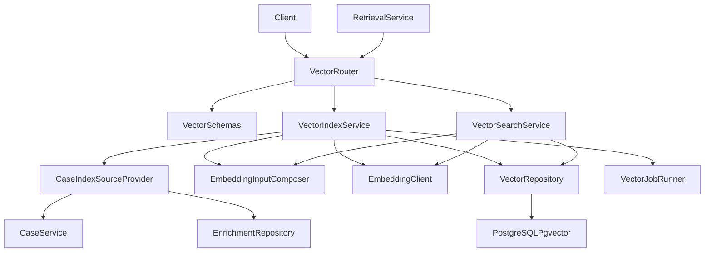
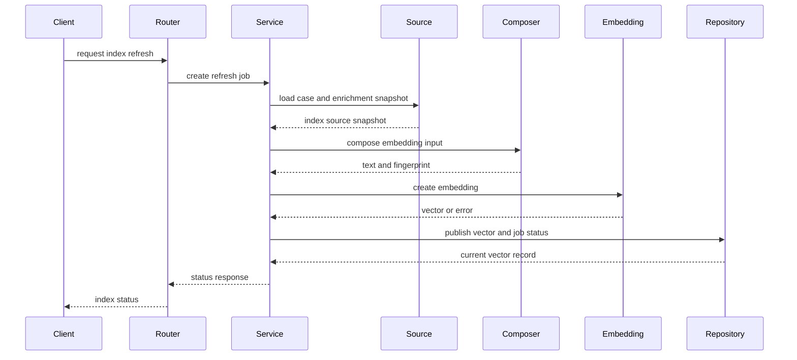
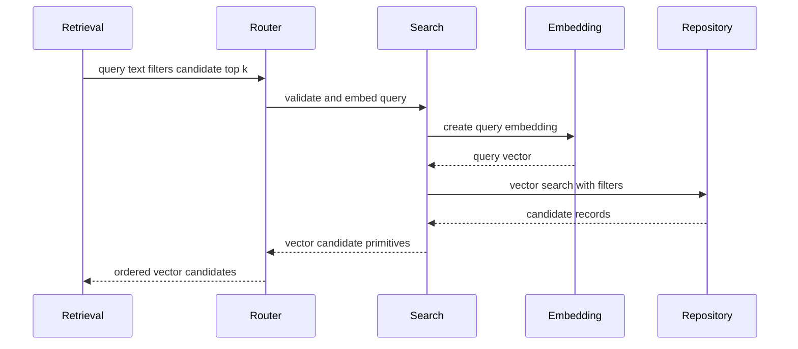
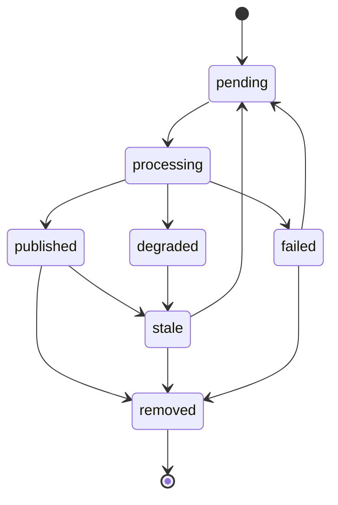
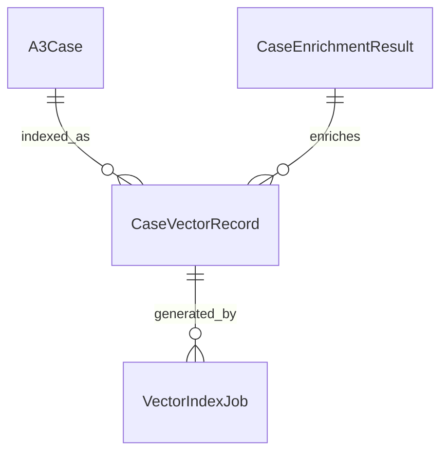
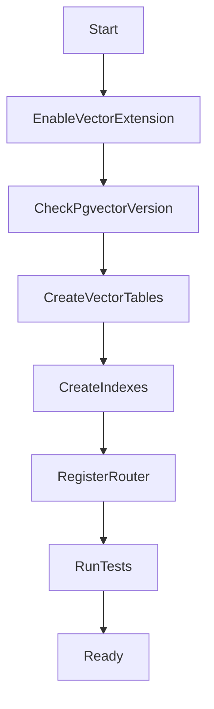

# Design Document

## Overview

`case-vector-indexing` 在案例基础数据和 LLM 派生内容之上建立独立的问题侧语义向量索引。该模块负责：组合问题侧 embedding 输入文本、调用云端 BGE-M3 embedding 接口、保存 PostgreSQL + pgvector 向量记录、维护索引状态，以及向下游提供基础 Top-K 问题语义搜索原语。

本设计延续 Python + FastAPI + PostgreSQL 的后端路线。它不修改 `a3-case-management` 的基础案例表，不接管 `llm-case-enrichment` 的派生内容生成，也不承担 `cbr-retrieval-recommendation` 的 CBRKit 编排、reranker、推荐理由和最终排序职责。

### Goals

- 建立可复现、可审计的问题侧 embedding 输入文本组合策略。
- 通过云端 embedding API 默认接入 `bge-large-zh`，校验模型、维度、状态和错误响应。
- 使用 PostgreSQL + pgvector `0.8.2+` 保存向量、过滤字段和 HNSW 索引。
- 提供刷新、删除、重试、状态查询和基础向量搜索能力。
- 保持向量索引与 CBR 推荐边界解耦，不硬绑定 CBRKit。

### Non-Goals

- 不实现 A3 案例 CRUD、基础字段校验或状态生命周期。
- 不生成 LLM 摘要、结构化建议、标签建议或推荐理由文案。
- 不实现 CBRKit 编排、reranker 重排、推荐解释、反馈学习排序或最终推荐展示顺序。
- 不引入 Milvus 等独立向量库，不做本地模型部署、多模型候选搜索或推理成本优化。
- 不实现前端页面，仅提供后端契约供下游和管理后台消费。

## Boundary Commitments

### This Spec Owns

- `EmbeddingInputComposer`：问题侧输入文本组合规则、来源分段、输入指纹和输入版本。
- `EmbeddingClient`：云端 embedding 调用、默认模型 `bge-large-zh`、维度校验和错误归一化。
- `CaseVectorRecord`、`VectorIndexJob` 及候选向量搜索运行所需的状态、错误、重试和审计数据。
- PostgreSQL + pgvector 向量列、HNSW 索引、过滤字段索引和版本运行检查。
- 向下游提供的原语：查询文本向量化、过滤、Top-K 候选返回和索引状态查询。

### Out of Boundary

- `A3Case` 基础实体、案例字段、创建、编辑、详情、列表查询。
- `CaseEnrichmentResult` 的 LLM 摘要、结构化建议、审核状态和推荐文案生成。
- CBRKit 编排、候选重排、推荐理由、推荐展示排序、反馈记录和排序学习。
- 独立向量数据库、百万级以上专用向量集群、模型本地部署和多模型融合。
- 将向量、相似度或推荐信息写回案例基础表。

### Allowed Dependencies

- `a3-case-management` 的案例详情读取契约：`case_id`、基础 A3 字段、状态、过滤字段、`created_at`、`updated_at`。
- `llm-case-enrichment` 的当前可消费派生结果：`enrichment_id`、`case_updated_at`、`status`、`problem_summary`、结构化建议、适用场景建议和标签建议。`solution_summary` 可供下游展示或精排使用，但不进入本规格主召回向量。
- Python 3.11+、FastAPI、Pydantic、SQLAlchemy、Alembic、pytest，与上游后端规格保持一致。
- PostgreSQL + pgvector `0.8.2+`，默认向量维度 1024，默认 HNSW cosine 索引。
- 云端 embedding 服务，默认模型 ID `bge-large-zh`，通过独立的 `provider/model/base_url` 配置项指定。

### Revalidation Triggers

- `a3-case-management` 的案例字段、状态语义、过滤字段、详情响应或 `updated_at` 语义发生变化。
- `llm-case-enrichment` 的派生结果状态、字段名称、发布条件或输出版本发生变化。
- embedding 的 `provider/model/base_url`、默认向量维度、供应商隐私配置或响应格式发生变化。
- pgvector 最低版本、索引策略、距离度量或过滤字段索引策略发生变化。
- 下游 `cbr-retrieval-recommendation` 需要改变向量搜索的请求或响应契约。

## Architecture

### Existing Architecture Analysis

`a3-case-management` 规格计划建立 FastAPI 后端、案例模块、数据库配置、错误结构和迁移基础；`llm-case-enrichment` 规格计划建立 LLM 派生内容模块。本规格作为第三个后端领域模块，新增 `backend/app/vector_indexing`，复用上游数据库会话、配置、错误映射和案例读取边界。

### Architecture Pattern & Boundary Map




**Architecture Integration**:

- Selected pattern: 轻量分层 FastAPI 模块。Router 暴露 API，Service 编排索引刷新和状态，Repository 封装 pgvector，Client 隔离云端 embedding。
- Domain/feature boundaries: `VectorIndexService` 管理案例向量生命周期；`VectorSearchService` 只返回候选原语，不执行推荐编排。
- Existing patterns preserved: 复用上游 Pydantic schema、SQLAlchemy/Alembic、统一错误结构和数据库会话。
- New components rationale: embedding 输入、云端模型、向量状态、重试和搜索原语均需独立审计和边界控制。
- Dependency direction: `Config → Schemas → SourceProvider → Composer → EmbeddingClient → Repository → Service → Router`。`vector_indexing` 可读取 `cases` 和 `enrichment` 的公开服务/仓储契约，但不得反向修改上游模块。

### Technology Stack


| Layer              | Choice / Version                                                  | Role in Feature     | Notes                    |
| ------------------ | ----------------------------------------------------------------- | ------------------- | ------------------------ |
| Backend / Services | Python 3.11+ + FastAPI                                            | 暴露向量索引、状态和搜索 API    | 延续上游后端栈                  |
| Validation         | Pydantic                                                          | 请求响应、配置、状态和错误结构校验   | 禁止不匹配向量维度发布              |
| Data / Storage     | PostgreSQL + pgvector `0.8.2+`                                    | 保存向量、状态、过滤字段和运行记录   | MVP 单库部署                 |
| ORM / Migration    | SQLAlchemy + Alembic                                              | 新增向量表、任务表和索引迁移      | 启动或迁移时检查 pgvector 版本     |
| External AI        | Remote embedding model `bge-large-zh` (`provider/model/base_url`) | 生成案例和查询 embedding   | 默认维度 1024，可配置但必须校验       |
| Testing            | pytest + FastAPI TestClient                                       | 单元、API、索引、失败和搜索集成测试 | embedding 使用 fake client |


## File Structure Plan

### Directory Structure

```text
backend/
├── app/
│   ├── core/
│   │   ├── config.py                         # 增加 embedding、pgvector、重试、隐私确认配置
│   │   └── errors.py                         # 增加 VECTOR_* 和 EMBEDDING_* 错误码映射
│   ├── db/
│   │   └── base.py                           # 纳入 vector_indexing ORM metadata
│   ├── cases/
│   │   └── service.py                        # 被 CaseIndexSourceProvider 读取案例快照
│   ├── enrichment/
│   │   └── repository.py                     # 被 CaseIndexSourceProvider 读取当前可消费派生结果
│   └── vector_indexing/
│       ├── models.py                         # 向量记录、索引任务和状态枚举 ORM 模型
│       ├── schemas.py                        # 索引请求、状态响应、搜索请求和候选响应 schema
│       ├── repository.py                     # pgvector 持久化、过滤查询和 Top-K 搜索
│       ├── source_provider.py                # 读取案例基础快照和 LLM 派生文本
│       ├── input_composer.py                 # 问题侧 embedding 输入文本模板、来源分段和指纹
│       ├── embedding_client.py               # bge-large-zh 云端 embedding 适配
│       ├── service.py                        # 索引刷新、发布、删除、状态和一致性编排
│       ├── search.py                         # 查询 embedding 和向量搜索原语
│       ├── jobs.py                           # 同步任务、重试、未来异步 worker 边界
│       ├── pgvector_checks.py                # pgvector 版本、扩展和索引运行检查
│       └── router.py                         # 向量索引状态、刷新、重试、搜索 API
├── alembic/
│   └── versions/
│       └── <revision>_create_case_vectors.py
└── tests/
    └── vector_indexing/
        ├── test_input_composer.py            # 输入文本、来源分段、降级和指纹测试
        ├── test_embedding_client.py          # 远程调用、维度校验和错误映射测试
        ├── test_vector_index_service.py      # 刷新、发布、过期、删除和重试逻辑测试
        ├── test_vector_repository.py         # pgvector 持久化、过滤和搜索测试
        ├── test_vector_api.py                # 状态、刷新、重试和搜索 API 测试
        └── test_vector_privacy.py            # 日志、隐私配置和敏感内容边界测试
```

### Modified Files

- `backend/app/main.py` — 仅追加注册 `VectorRouter`，不改写应用入口基础实现。
- `backend/app/core/config.py` — 仅追加 embedding 的 provider、model、base_url、维度、超时、重试、pgvector 版本和隐私确认配置值，不拥有共享配置基础设施。
- `backend/app/core/errors.py` — 仅追加向量索引与 embedding 错误码映射，不拥有 `ErrorMapper` 基础实现。
- `backend/app/db/base.py` — 仅追加导入 `vector_indexing` ORM metadata，不拥有数据库基础设施。
- `backend/app/cases/service.py` — 不改变案例契约，仅供 `CaseIndexSourceProvider` 读取案例快照。
- `backend/app/enrichment/repository.py` — 不改变派生结果契约，仅供读取当前可消费派生结果。

## System Flows

### 索引刷新流程




### 候选向量搜索流程




### 向量状态流




## Requirements Traceability


| Requirement | Summary               | Components                                                          | Interfaces                                | Flows  |
| ----------- | --------------------- | ------------------------------------------------------------------- | ----------------------------------------- | ------ |
| 1.1         | 组合问题侧基础字段和已发布派生文本     | CaseIndexSourceProvider, EmbeddingInputComposer                     | IndexSourceSnapshot, EmbeddingInput       | 索引刷新流程 |
| 1.2         | 保留问题侧来源分段             | EmbeddingInputComposer                                              | EmbeddingInputSection                     | 索引刷新流程 |
| 1.3         | 排除解法、效果和推荐文案          | EmbeddingInputComposer                                              | EmbeddingInputPolicy                      | 索引刷新流程 |
| 1.4         | LLM 不可用时降级输入          | CaseIndexSourceProvider, EmbeddingInputComposer, VectorIndexService | DegradedIndexReason                       | 索引刷新流程 |
| 1.5         | 内容不足拒绝生成              | EmbeddingInputComposer, ErrorMapper                                 | VECTOR_INPUT_INSUFFICIENT                 | 索引刷新流程 |
| 1.6         | 保存指纹和来源版本             | EmbeddingInputComposer, VectorRepository                            | CaseVectorRecord                          | 索引刷新流程 |
| 2.1         | 调用云端 embedding        | EmbeddingClient, VectorIndexService                                 | EmbeddingRequest                          | 索引刷新流程 |
| 2.2         | 记录供应商模型维度状态           | EmbeddingClient, VectorRepository                                   | EmbeddingMetadata                         | 索引刷新流程 |
| 2.3         | 超时限流失败可重试             | EmbeddingClient, VectorJobRunner                                    | VectorIndexJob                            | 索引刷新流程 |
| 2.4         | 响应格式和维度校验             | EmbeddingClient, VectorIndexService                                 | EMBEDDING_INVALID_RESPONSE                | 索引刷新流程 |
| 2.5         | 默认 bge-large-zh 可配置替换 | Config, EmbeddingClient                                             | EmbeddingProviderConfig                   | 索引刷新流程 |
| 3.1         | 保存向量和过滤字段             | VectorRepository, CaseVectorModel                                   | CaseVectorRecord                          | 索引刷新流程 |
| 3.2         | 当前有效向量唯一              | VectorRepository, VectorIndexService                                | publish_vector                            | 索引刷新流程 |
| 3.3         | 返回明确状态                | VectorSchemas, VectorRouter                                         | VectorIndexStatusResponse                 | 状态流    |
| 3.4         | 不可检索状态移除              | VectorIndexService, VectorRepository                                | remove_from_search                        | 状态流    |
| 3.5         | 不写回上游案例               | VectorIndexService, CaseIndexSourceProvider                         | module boundary                           | 索引刷新流程 |
| 4.1         | 判断过期并创建刷新任务           | VectorIndexService, VectorJobRunner                                 | RefreshIndexRequest                       | 索引刷新流程 |
| 4.2         | 发布新向量并停用旧版本           | VectorRepository                                                    | publish_vector                            | 索引刷新流程 |
| 4.3         | 受控重试                  | VectorJobRunner, VectorRepository                                   | RetryPolicy                               | 状态流    |
| 4.4         | 失败状态和最近有效向量说明         | VectorIndexService, VectorSchemas                                   | VectorIndexStatusResponse                 | 状态流    |
| 4.5         | 删除归档不可命中              | VectorIndexService, VectorRepository                                | searchable flag                           | 搜索流程   |
| 5.1         | 查询文本 Top-K 候选         | VectorSearchService, EmbeddingClient, VectorRepository              | VectorSearchRequest, VectorSearchResponse | 搜索流程   |
| 5.2         | 过滤可检索案例               | VectorRepository                                                    | VectorSearchFilters                       | 搜索流程   |
| 5.3         | 查询参数校验                | VectorSchemas, ErrorMapper                                          | ValidationErrorResponse                   | 搜索流程   |
| 5.4         | 空结果元数据                | VectorSearchService                                                 | VectorSearchResponse                      | 搜索流程   |
| 5.5         | 不生成推荐职责               | VectorSearchService                                                 | candidate primitives only                 | 搜索流程   |
| 6.1         | 限制外发输入范围              | EmbeddingInputComposer, EmbeddingClient                             | EmbeddingInput                            | 索引刷新流程 |
| 6.2         | 任务生命周期记录              | VectorJobRunner, VectorRepository                                   | VectorIndexJob                            | 状态流    |
| 6.3         | 按案例查询状态和失败原因          | VectorRouter, VectorRepository                                      | GET status                                | 状态流    |
| 6.4         | 生产配置缺失 fail closed    | Config, EmbeddingClient, PgvectorChecks                             | StartupCheckResult                        | 索引刷新流程 |
| 6.5         | 日志和错误脱敏               | ErrorMapper, VectorIndexService                                     | SafeLogContext                            | 全部流程   |


## Components and Interfaces


| Component               | Domain/Layer      | Intent                       | Req Coverage                 | Key Dependencies                              | Contracts      |
| ----------------------- | ----------------- | ---------------------------- | ---------------------------- | --------------------------------------------- | -------------- |
| VectorRouter            | API               | 暴露刷新、重试、状态和搜索端点              | 3.3, 4.1, 5.1, 6.3           | VectorIndexService P0, VectorSearchService P0 | API            |
| VectorSchemas           | API/Data Contract | 定义请求响应、状态、过滤和错误 schema       | 3.3, 5.3, 5.4                | Pydantic P0                                   | API, State     |
| CaseIndexSourceProvider | Integration       | 读取案例和 LLM 派生输入快照             | 1.1, 1.3, 3.5                | CaseService P0, EnrichmentRepository P1       | Service        |
| EmbeddingInputComposer  | Domain Service    | 组合输入文本、来源分段和指纹               | 1.1, 1.2, 1.4, 1.5, 6.1      | SourceProvider P0                             | Service        |
| EmbeddingClient         | External Adapter  | 调用云端 embedding 并校验响应         | 2.1, 2.2, 2.4, 2.5, 6.4      | Remote provider/model/base_url P0             | Service        |
| VectorIndexService      | Domain Service    | 编排刷新、发布、过期、删除和状态             | 3.1, 3.2, 3.4, 4.1, 4.2, 4.4 | Repository P0, Client P0                      | Service        |
| VectorSearchService     | Domain Service    | 生成用户问题查询向量并返回 Top-K 问题语义候选原语 | 5.1, 5.2, 5.4, 5.5           | EmbeddingClient P0, Repository P0             | API, Service   |
| VectorRepository        | Data Access       | 保存向量、任务、状态并执行 pgvector 搜索    | 3.1, 4.2, 4.5, 5.2           | PostgreSQL pgvector P0                        | Service, State |
| VectorJobRunner         | Runtime           | 管理同步任务、重试和未来异步边界             | 2.3, 4.3, 6.2                | VectorIndexService P0                         | Batch          |
| PgvectorChecks          | Infrastructure    | 校验扩展、版本、维度和索引前置条件            | 6.4                          | PostgreSQL P0                                 | Batch          |
| ErrorMapper             | API Support       | 输出稳定错误码并执行日志脱敏               | 1.4, 2.3, 5.3, 6.5           | FastAPI P0                                    | API            |


### API Layer

#### VectorRouter


| Field        | Detail                       |
| ------------ | ---------------------------- |
| Intent       | 提供向量索引管理和搜索入口                |
| Requirements | 3.3, 4.1, 4.3, 5.1, 5.3, 6.3 |


**API Contract**


| Method | Endpoint                                       | Request                     | Response                    | Errors             |
| ------ | ---------------------------------------------- | --------------------------- | --------------------------- | ------------------ |
| POST   | `/api/a3-cases/{case_id}/vector-index/refresh` | `RefreshVectorIndexRequest` | `VectorIndexJobResponse`    | 404, 409, 422, 503 |
| GET    | `/api/a3-cases/{case_id}/vector-index`         | path `case_id`              | `VectorIndexStatusResponse` | 404                |
| POST   | `/api/vector-index/jobs/{job_id}/retry`        | path `job_id`               | `VectorIndexJobResponse`    | 404, 409, 503      |
| POST   | `/api/vector-search`                           | `VectorSearchRequest`       | `VectorSearchResponse`      | 422, 503           |
| POST   | `/api/vector-index/maintenance/refresh-stale`  | `RefreshStaleRequest`       | `VectorBatchJobResponse`    | 409, 503           |


**Implementation Notes**

- 刷新端点可同步完成或返回运行状态，但必须始终保存 `job_id`。
- 搜索响应只返回候选案例、相似度、距离、输入索引版本和过滤元数据。
- 不返回推荐理由、reranker 分数、CBRKit 内部结构或反馈字段。

### Integration Layer

#### CaseIndexSourceProvider


| Field        | Detail                  |
| ------------ | ----------------------- |
| Intent       | 将上游案例和派生结果转换为索引输入快照     |
| Requirements | 1.1, 1.3, 3.4, 3.5, 4.1 |


**Service Interface**

```python
class CaseIndexSourceProvider:
    def load_source(self, case_id: str) -> IndexSourceSnapshot: ...
```

- Snapshot includes: `case_id`、案例基础字段、状态、过滤字段、`case_updated_at`、当前可消费 `CaseEnrichmentResult`。
- Snapshot excludes: 既有向量、推荐分值、反馈、未发布派生结果和未授权敏感扩展字段。
- 状态不可检索时返回可识别原因，由 `VectorIndexService` 标记不可检索。

### Domain Layer

#### EmbeddingInputComposer


| Field        | Detail                       |
| ------------ | ---------------------------- |
| Intent       | 生成稳定的问题侧 embedding 输入文本      |
| Requirements | 1.1, 1.2, 1.3, 1.4, 1.5, 6.1 |


**Service Interface**

```python
class EmbeddingInputComposer:
    def compose_case_input(self, source: IndexSourceSnapshot) -> EmbeddingInput: ...
    def compose_query_input(self, query_text: str) -> EmbeddingInput: ...
```

- Preconditions: 输入快照来自授权的上游读契约。
- Postconditions: 输出 `text`、`sections`、`content_hash`、`source_version`、`degraded_reason`。
- Invariants: 段落顺序稳定；空值不编造；主召回输入只表达问题侧语义画像，不包含解决步骤、效果结果、方案摘要、推荐文案、推荐分值或反馈。

#### VectorIndexService


| Field        | Detail                                 |
| ------------ | -------------------------------------- |
| Intent       | 管理案例向量生命周期                             |
| Requirements | 2.1, 3.1, 3.2, 3.4, 4.1, 4.2, 4.4, 4.5 |


**Service Interface**

```python
class VectorIndexService:
    def refresh_case_index(self, case_id: str, request: RefreshVectorIndexRequest) -> VectorIndexJobResponse: ...
    def get_case_status(self, case_id: str) -> VectorIndexStatusResponse: ...
    def retry_job(self, job_id: str) -> VectorIndexJobResponse: ...
    def mark_case_unsearchable(self, case_id: str, reason: str) -> VectorIndexStatusResponse: ...
```

- Preconditions: pgvector 检查通过；生产 embedding 配置可用；上游案例存在。
- Postconditions: 成功时发布当前向量；失败时保存失败阶段、错误码、重试状态和最近有效向量说明。
- Invariants: 同一 `case_id` 只有一个当前有效向量；不修改上游 `a3_cases` 或 LLM 派生结果表。

#### VectorSearchService


| Field        | Detail                  |
| ------------ | ----------------------- |
| Intent       | 提供基础候选向量搜索原语            |
| Requirements | 5.1, 5.2, 5.3, 5.4, 5.5 |


**Service Interface**

```python
class VectorSearchService:
    def search(self, request: VectorSearchRequest) -> VectorSearchResponse: ...
```

- Preconditions: 查询文本非空，`top_k` 在允许范围内，过滤字段有效。
- Postconditions: 返回按距离排序的候选列表和搜索元数据，供推荐服务继续补齐、重排和解释。
- Invariants: 只执行查询向量生成和 pgvector Top-K 候选搜索；不调用 CBRKit、不调用 reranker、不生成推荐理由、不改变下游最终排序策略。

### External Adapter

#### EmbeddingClient


| Field        | Detail                       |
| ------------ | ---------------------------- |
| Intent       | 隔离远程 embedding 供应商调用         |
| Requirements | 2.1, 2.2, 2.3, 2.4, 2.5, 6.4 |


**Service Interface**

```python
class EmbeddingClient:
    def embed(self, request: EmbeddingRequest) -> EmbeddingResult: ...
```

- Default config: `provider`、`model_id="bge-large-zh"`、`base_url`、`dimension=1024`、超时、重试上限和隐私确认；仅用于 Embedding，不复用 LLM 或 Reranker 配置。
- Errors: `EMBEDDING_TIMEOUT`、`EMBEDDING_RATE_LIMITED`、`EMBEDDING_PROVIDER_ERROR`、`EMBEDDING_INVALID_RESPONSE`、`EMBEDDING_DIMENSION_MISMATCH`、`EMBEDDING_CONFIG_MISSING`。
- Logging: 记录供应商、模型、任务类型、状态、错误码和输入哈希，不记录完整输入文本或向量数组。

### Data Layer

#### VectorRepository


| Field        | Detail                            |
| ------------ | --------------------------------- |
| Intent       | 封装向量持久化、状态和 pgvector 查询           |
| Requirements | 1.5, 3.1, 3.2, 4.2, 4.5, 5.2, 6.2 |


**Service Interface**

```python
class VectorRepository:
    def create_job(self, job: VectorIndexJobCreate) -> VectorIndexJobRecord: ...
    def publish_vector(self, vector: CaseVectorCreate) -> CaseVectorRecord: ...
    def get_current_vector(self, case_id: str) -> CaseVectorRecord | None: ...
    def update_status(self, case_id: str, status: str, reason: str | None = None) -> CaseVectorRecord | None: ...
    def search(self, query: VectorSearchQuery) -> list[VectorCandidateRecord]: ...
```

- 使用事务保证新向量发布与旧向量停用一致。
- 搜索只包含 `status='published'` 且 `searchable=true` 的记录。
- 数据库异常映射为稳定错误，不暴露 SQL 或底层向量数据。

## Data Models

### Domain Model




`A3Case` 和 `CaseEnrichmentResult` 由上游拥有。`CaseVectorRecord` 是本规格拥有的向量记录，`VectorIndexJob` 记录每次生成、刷新、失败和重试尝试。

### Logical Data Model

**CaseVectorRecord**


| Field                    | Type     | Required | Notes                                                                          |
| ------------------------ | -------- | -------- | ------------------------------------------------------------------------------ |
| `vector_id`              | string   | yes      | 向量记录标识                                                                         |
| `case_id`                | string   | yes      | 上游案例标识                                                                         |
| `case_updated_at`        | datetime | yes      | 输入所依据的案例更新时间                                                                   |
| `enrichment_id`          | string   | no       | 使用的 LLM 派生结果标识                                                                 |
| `enrichment_status`      | string   | no       | 使用时的派生结果状态                                                                     |
| `input_template_version` | string   | yes      | 输入文本模板版本                                                                       |
| `input_content_hash`     | string   | yes      | 输入文本哈希                                                                         |
| `embedding_model_id`     | string   | yes      | 默认 `bge-large-zh`                                                              |
| `embedding_dimension`    | integer  | yes      | 默认 1024                                                                        |
| `embedding_vector`       | vector   | yes      | 问题侧语义画像的 pgvector 向量                                                           |
| `status`                 | enum     | yes      | `pending`, `processing`, `degraded`, `published`, `stale`, `failed`, `removed` |
| `searchable`             | boolean  | yes      | 是否可被搜索返回                                                                       |
| `degraded_reason`        | string   | no       | LLM 派生文本不可用等原因                                                                 |
| `last_error_code`        | string   | no       | 最近失败错误码                                                                        |
| `created_at`             | datetime | yes      | 创建时间                                                                           |
| `updated_at`             | datetime | yes      | 更新时间                                                                           |


**VectorIndexJob**


| Field            | Type     | Required | Notes                                                                             |
| ---------------- | -------- | -------- | --------------------------------------------------------------------------------- |
| `job_id`         | string   | yes      | 任务标识                                                                              |
| `case_id`        | string   | yes      | 上游案例标识                                                                            |
| `job_type`       | enum     | yes      | `refresh`, `retry`, `remove`, `batch_refresh`                                     |
| `status`         | enum     | yes      | `queued`, `running`, `succeeded`, `failed`, `retryable`, `cancelled`              |
| `source_version` | object   | yes      | 案例和派生结果版本                                                                         |
| `error_code`     | string   | no       | 失败错误码                                                                             |
| `error_stage`    | string   | no       | `load_source`, `compose_input`, `embedding_call`, `validate_embedding`, `persist` |
| `retry_count`    | integer  | yes      | 当前重试次数                                                                            |
| `next_retry_at`  | datetime | no       | 下一次允许重试时间                                                                         |
| `started_at`     | datetime | no       | 开始时间                                                                              |
| `finished_at`    | datetime | no       | 结束时间                                                                              |


### Physical Data Model

**Extension**

- `CREATE EXTENSION IF NOT EXISTS vector;`
- 启动或迁移时检查 `vector` 扩展版本必须为 `0.8.2+`。

**Table: `case_vectors`**


| Column                   | Type         | Constraint             |
| ------------------------ | ------------ | ---------------------- |
| `vector_id`              | varchar(64)  | primary key            |
| `case_id`                | varchar(64)  | not null               |
| `case_updated_at`        | timestamptz  | not null               |
| `enrichment_id`          | varchar(64)  | nullable               |
| `input_template_version` | varchar(32)  | not null               |
| `input_content_hash`     | varchar(128) | not null               |
| `embedding_model_id`     | varchar(128) | not null               |
| `embedding_dimension`    | integer      | not null               |
| `embedding_vector`       | vector(1024) | not null               |
| `status`                 | varchar(32)  | not null               |
| `searchable`             | boolean      | not null default false |
| `brand_id`               | varchar(64)  | not null               |
| `store_id`               | varchar(64)  | not null               |
| `problem_type`           | varchar(64)  | not null               |
| `tags`                   | jsonb        | not null               |
| `case_status`            | varchar(32)  | not null               |
| `created_at`             | timestamptz  | not null               |
| `updated_at`             | timestamptz  | not null               |


**Indexes**

- HNSW: `embedding_vector vector_cosine_ops` for semantic search.
- B-tree: `case_id`, `brand_id`, `store_id`, `problem_type`, `case_status`, `status`, `created_at`, `updated_at`.
- Composite: `(case_id, status, input_content_hash)` for current vector lookup and duplicate prevention.
- GIN: `tags` when JSONB tag filtering is used.

**Table: `vector_index_jobs`**

- Primary key: `job_id`
- Indexes: `case_id`, `status`, `(case_id, started_at desc)`, `next_retry_at`
- Stores lifecycle, source version, error stage and retry metadata; does not store full input text or vector array.

### Data Contracts & Integration

**VectorSearchRequest**

- `query_text`: required non-empty text，表示用户当前问题的摘要或标准化表达。
- `top_k`: bounded positive integer.
- `filters`: optional `brand_id`, `store_id`, `problem_type`, `tags`, `case_status`, `created_at_from`, `created_at_to`.
- `include_metadata`: optional boolean for returning index metadata.

**VectorSearchResponse**

- `items`: ordered list of `VectorSearchCandidate`，按问题语义相似度排序。
- `query_metadata`: query hash, model id, dimension, filters applied, total candidates considered when available.
- Excludes recommendation reason, reranker score, CBRKit state and feedback data.

**VectorSearchCandidate**

- `case_id`
- `vector_id`
- `similarity_score`
- `distance`
- `case_updated_at`
- `input_content_hash`
- `filter_metadata`: brand/store/problem type/tags/status needed by downstream.

## Error Handling

### Error Strategy

- 输入文本不足、查询参数无效和过滤字段错误返回字段级 4xx。
- embedding 超时、限流、供应商失败和配置缺失返回稳定错误码，并写入任务状态。
- 维度不匹配或响应不可解析时拒绝发布向量。
- 删除、归档或不可检索状态通过 `searchable=false` 和状态记录处理，不物理删除审计数据。

### Error Categories and Responses

- **User Errors (4xx)**: 空查询文本、Top-K 越界、无效过滤字段、案例不可索引。
- **Business Logic Errors (409/422)**: 正在处理中的重复刷新、输入内容不足、不可重试任务、状态冲突。
- **External Dependency Errors (503)**: embedding 超时、限流、供应商失败、生产配置缺失。
- **System Errors (5xx)**: 数据库连接、pgvector 扩展不可用、索引查询异常。

### Monitoring

- Log: job requested、source loaded、input composed、embedding requested、embedding validated、vector published、retry scheduled、search executed。
- Metrics: embedding latency、success rate、dimension mismatch count、retry count、index stale count、search latency、empty result count。
- Logs and errors must include `case_id`、`job_id`、model id、status and error code only; never include full input text or vector array.

## Testing Strategy

### Unit Tests

- `EmbeddingInputComposer` 按固定段落顺序组合问题摘要、问题描述、问题类型、场景上下文、根因分类、适用场景和标签，生成稳定 hash。
- `EmbeddingInputComposer` 不把解决步骤、效果结果、方案摘要或推荐文案纳入主召回 embedding 输入。
- `EmbeddingInputComposer` 在 LLM 派生结果缺失、未发布或过期时返回降级原因。
- `EmbeddingClient` 将超时、限流、供应商错误、维度不匹配和不可解析响应映射为稳定错误。
- `VectorIndexService` 对相同输入版本避免重复发布当前有效向量。
- `VectorSearchService` 校验空查询、Top-K 越界和无效过滤条件。

### Integration Tests

- POST `/api/a3-cases/{case_id}/vector-index/refresh` 读取案例和派生结果，生成 fake embedding，并保存可检索向量。
- GET `/api/a3-cases/{case_id}/vector-index` 返回 pending、processing、published、stale、failed、removed 等状态和最近失败原因。
- Retry endpoint 只允许可重试失败任务，并递增重试次数。
- 案例归档或删除后，`/api/vector-search` 不再返回该案例。
- `/api/vector-search` 同时应用问题语义排序和品牌、门店、问题类型、标签、状态过滤。

### Database / pgvector Tests

- 迁移启用 pgvector 并拒绝低于 `0.8.2` 的扩展版本。
- `case_vectors.embedding_vector` 使用配置维度，默认 `vector(1024)`。
- HNSW cosine 索引和过滤字段索引存在。
- 搜索只返回 `status='published'` 且 `searchable=true` 的向量记录。

### Security and Privacy Tests

- 生产 embedding 配置缺少 provider、model、base_url、凭据来源、超时、重试或隐私确认时 fail closed。
- 日志、错误响应和任务记录不包含完整案例正文、完整 embedding 输入文本或向量数组。
- 外发 embedding payload 只包含组合后的问题侧必要文本和任务元数据，不包含解决步骤、效果结果、推荐反馈或未授权字段。

### Performance / Load

- Top-K 搜索在 MVP 规模下使用 HNSW 索引，常用过滤字段避免全表扫描。
- 批量刷新任务应限制并发和重试上限，避免耗尽 embedding 供应商配额。
- 查询路径不依赖 CBRKit 或 LLM 推荐文案，保持问题语义候选向量搜索原语低耦合。

## Security Considerations

- 案例内容视为敏感业务数据，embedding 输入仅包含问题侧候选搜索所需文本片段。
- 生产环境必须显式配置 provider、model、base_url、凭据来源、超时、重试上限和数据保留确认。
- 不在日志、错误响应、任务记录中保存完整输入文本或向量数组。
- pgvector 版本必须为 `0.8.2+`，避免已知 HNSW 并行构建漏洞风险。

## Performance & Scalability

- MVP 使用 PostgreSQL + pgvector 单库部署，优先 HNSW cosine 索引满足低延迟 Top-K 候选搜索。
- 过滤字段建立 B-tree/GIN 索引，可通过 pgvector iterative scan 配置改善过滤后的 ANN 候选搜索质量。
- 若数据规模超过单库可接受范围，未来可在不改变下游搜索原语的前提下迁移到独立向量服务；本规格不实现该迁移。

## Migration Strategy




迁移新增 pgvector 扩展、`case_vectors`、`vector_index_jobs` 和相关索引，不修改 `a3_cases` 或 LLM 派生结果表。回滚应删除本规格新增表和索引；若生产已有向量数据，回滚前必须确认下游搜索已停用。