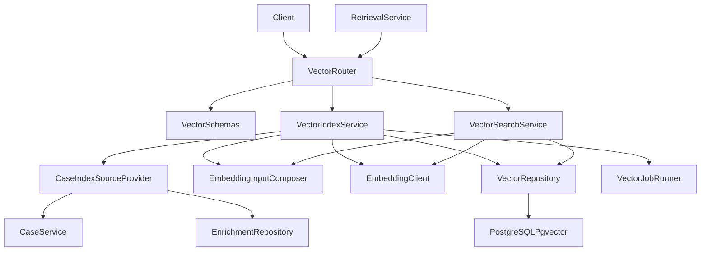
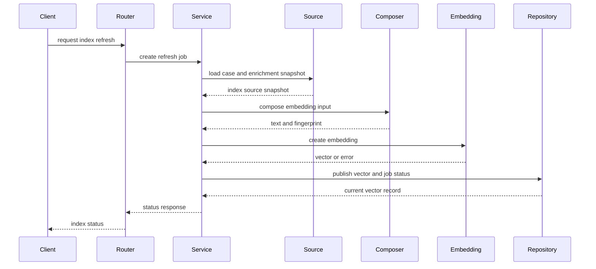
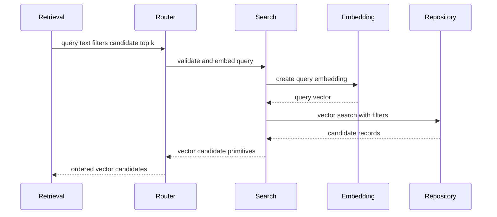
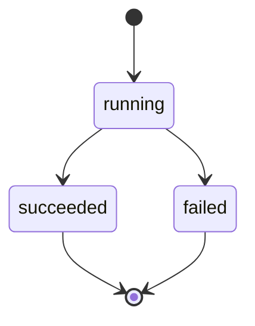
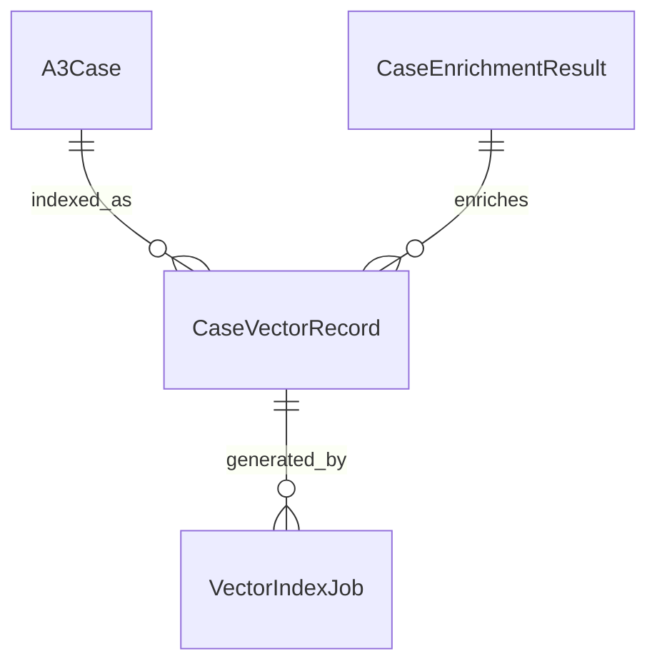
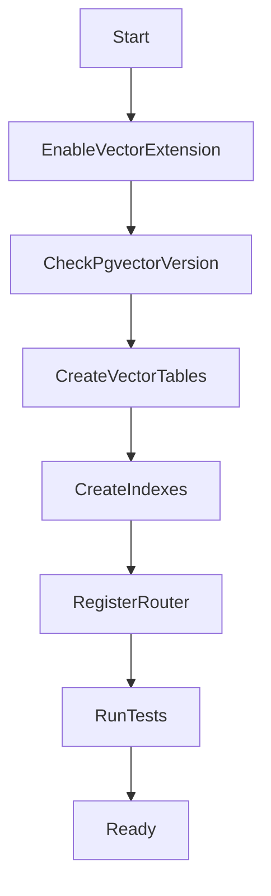

# Design Document

## Overview

`case-vector-indexing` 在案例基础数据和 LLM 派生内容之上建立独立的问题侧语义向量索引。该模块负责：组合问题侧 embedding 输入文本、调用云端 `bge-large-zh` embedding 接口、保存 PostgreSQL + pgvector 向量记录、维护索引状态，以及向下游提供基础 Top-K 问题语义搜索原语。

本设计延续 Python + FastAPI + PostgreSQL 的后端路线。它不修改 `a3-case-management` 的基础案例表，不接管 `llm-case-enrichment` 的派生内容生成，也不承担 `cbr-retrieval-recommendation` 的分数加权聚合、reranker、推荐理由和最终排序职责。

**并发与防御策略说明**：本系统不考虑并发控制问题（如同一案例的并发刷新请求），此类问题由外部系统（如网关层、API Gateway）负责处理。数据库操作失败即整体失败，返回失败响应，不强制修正所有不一致状态（如日志、已生成的 embedding 等），在不影响业务的前提下，这些不一致不会造成影响。

### Goals

- 建立可审计的问题侧 embedding 输入文本组合策略。
- 通过云端 embedding API 默认接入 `bge-large-zh`，校验模型、维度、状态和错误响应。
- 使用 PostgreSQL + pgvector `0.8.2+` 保存向量、过滤字段和 HNSW 索引。
- 提供手动刷新、手动删除、重试、状态查询和基础向量搜索能力。
- 通过案例和派生结果的时间戳判断是否需要刷新向量。
- 保持向量索引与推荐编排边界解耦，仅提供候选搜索原语。

### Non-Goals

- 不实现 A3 案例 CRUD、基础字段校验或状态生命周期。
- 不生成 LLM 摘要、结构化建议、标签建议或推荐理由文案。
- 不实现分数加权聚合、reranker 重排、推荐解释、反馈学习排序或最终推荐展示顺序。
- 不引入 Milvus 等独立向量库，不做本地模型部署、多模型候选搜索或推理成本优化。
- 不实现前端页面，仅提供后端契约供下游和管理后台消费。

## Boundary Commitments

### This Spec Owns

- `EmbeddingInputComposer`：问题侧输入文本组合规则和来源分段。
- `EmbeddingClient`：云端 embedding 调用、默认模型 `bge-large-zh`、维度校验和错误归一化。
- `CaseVectorRecord`、`VectorIndexJob` 及候选向量搜索运行所需的错误、重试和审计数据；`case_vectors` 仅保存成功生成的向量记录，每个案例最多一条记录，任务状态和历史操作由 `vector_index_jobs` 承担。
- PostgreSQL + pgvector 向量列、HNSW 索引、过滤字段索引和版本运行检查。
- 向下游提供的原语：查询文本向量化、过滤、Top-K 候选返回和索引状态查询。

### Out of Boundary

- `A3Case` 基础实体、案例字段、创建、编辑、详情、列表查询。
- `CaseEnrichmentResult` 的 LLM 摘要、结构化建议、审核状态和推荐文案生成。
- 分数加权聚合、候选重排、推荐理由、推荐展示排序、反馈记录和排序学习。
- 独立向量数据库、百万级以上专用向量集群、模型本地部署和多模型融合。
- 将向量、相似度或推荐信息写回案例基础表。

### Allowed Dependencies

- `a3-case-management` 的案例详情读取契约：`case_id`、基础 A3 字段、状态、过滤字段、`created_at`、`updated_at`。
- `llm-case-enrichment` 的当前可消费派生结果：`enrichment_id`、`case_updated_at`、`status`、`problem_summary`、结构化建议、适用场景建议和标签建议。`solution_summary` 可供下游展示或精排使用，但不进入本规格主召回向量。
- Python 3.11+、FastAPI、Pydantic、SQLAlchemy、Alembic、官方 **`pgvector`**（PyPI，`pgvector-python`）适配器、pytest，与上游后端规格保持一致；向量列类型须来自 `pgvector.sqlalchemy`，不得从 `sqlalchemy.dialects.postgresql` 臆造 `VECTOR`。
- PostgreSQL + pgvector `0.8.2+`，默认向量维度 1024，默认 HNSW cosine 索引。
- 云端 embedding 服务，默认模型 ID `bge-large-zh`，通过独立的 `api_key/model/base_url` 配置项指定。

### Manual Revalidation Triggers

- 当调用方已知 `a3-case-management` 的案例字段、状态语义、过滤字段、详情响应或 `updated_at` 语义发生变化时，应手动调用刷新或删除接口。
- 当调用方已知 `llm-case-enrichment` 的派生结果状态、字段名称、发布条件或输出版本发生变化时，应手动调用刷新接口。
- embedding 的 `api_key/model/base_url`、默认向量维度、供应商隐私配置或响应格式发生变化。
- pgvector 最低版本、索引策略、距离度量或过滤字段索引策略发生变化。
- 下游 `cbr-retrieval-recommendation` 需要改变向量搜索的请求或响应契约。

本规格不实现事件监听、自动刷新或自动过期扫描。MVP 中索引一致性由上游流程、运营动作或下游编排显式触发，刷新接口负责幂等判断输入版本是否已变化。

### Cross-Spec Coordination: "删除案例"

用户在前端的"删除案例"操作是一个跨规格的业务事务。**完整的级联删除设计见 `docs/cascade-deletion-design.md`**，本节仅说明本规格在级联删除中的职责边界。

1. **职责边界**：
   - 本规格（`case-vector-indexing`）负责删除对应的向量索引数据（向量记录、索引任务记录）。
   - 本规格**不主动触发下游删除**，由级联删除协调器（`CaseDeleteCoordinator`，部署在 `a3-case-management` 服务中）统一编排。

2. **删除 API 契约**：
   - **端点**：`POST /api/vector-index/delete`
   - **请求体**：
     ```json
     {
       "case_id": "string (optional)",
       "vector_id": "string (optional)",
       "reason": "case_deleted | enrichment_deleted | vector_deleted | feedback_deleted | schedule_deleted",
       "requested_by": "anonymous_user | system"
     }
     ```
   - **参数说明**：
     - `case_id` (optional)：案例标识，按案例删除向量索引
     - `vector_id` (optional)：向量标识，删除特定向量记录
     - **至少提供 `case_id` 或 `vector_id` 之一**
     - `reason` (required)：删除原因枚举
     - `requested_by` (required)：删除者标识（`anonymous_user` 表示前端用户触发，`system` 表示异步清理程序触发）
   - **响应**：
     - 200：删除成功，返回 `{"success": true, "deleted_count": 1, "deleted_at": "2026-05-07T10:30:00Z"}`
     - 422：参数校验失败（未提供任何标识）
     - 500：删除失败（数据库错误）
   - **行为**：创建 `job_type=remove` 的审计任务，在单个事务内删除 `case_vectors` 和 `vector_index_jobs`，**不主动触发下游删除**（由调用方协调）。
   - **幂等性**：对不存在的向量索引返回 `deleted_count: 0`。

3. **级联删除场景**：
   - **从案例节点发起**：见 `docs/cascade-deletion-design.md` §3.1
   - **从案例增强节点发起**：见 `docs/cascade-deletion-design.md` §3.2
   - **从向量索引节点发起**：见 `docs/cascade-deletion-design.md` §3.3

4. **后台异步清理**：
   - 本规格提供 `VectorCleanupService`，定期扫描并清理孤立的向量数据（`case_id` 在 `a3_cases` 中不存在，或 `enrichment_id` 在 `case_enrichment_results` 中不存在）。
   - 清理任务在应用启动时自动启动，清理间隔通过配置项 `vector_cleanup_interval_seconds` 指定（默认 86400 秒，即每日执行）。
   - 详细设计见 `docs/cascade-deletion-design.md` §4.5 "向量索引清理"。

## Architecture

### Existing Architecture Analysis

`a3-case-management` 规格计划建立 FastAPI 后端、案例模块、数据库配置、错误结构和迁移基础；`llm-case-enrichment` 规格计划建立 LLM 派生内容模块。本规格作为第三个后端领域模块，新增 `backend/app/vector_indexing`，复用上游数据库会话、配置、错误映射和案例读取边界。

### Architecture Pattern & Boundary Map




**Architecture Integration**:

- Selected pattern: 轻量分层 FastAPI 模块。Router 暴露 API，Service 编排索引刷新和状态，Repository 封装 pgvector，Client 隔离云端 embedding。
- Domain/feature boundaries: `VectorIndexService` 管理案例向量生命周期；`VectorSearchService` 只返回候选原语，不执行推荐编排。
- Existing patterns preserved: 复用上游 Pydantic schema、SQLAlchemy/Alembic、统一错误结构和数据库会话。
- New components rationale: embedding 输入、云端模型、向量状态、重试和搜索原语均需独立审计和边界控制。
- Dependency direction: `Config → Schemas → SourceProvider → Composer → EmbeddingClient → Repository → Service → Router`。`vector_indexing` 可读取 `cases` 和 `enrichment` 的公开服务/仓储契约，但不得反向修改上游模块。

### Technology Stack


| Layer              | Choice / Version                                                  | Role in Feature     | Notes                    |
| ------------------ | ----------------------------------------------------------------- | ------------------- | ------------------------ |
| Backend / Services | Python 3.11+ + FastAPI                                            | 暴露向量索引、状态和搜索 API    | 延续上游后端栈                  |
| Validation         | Pydantic                                                          | 请求响应、配置、状态和错误结构校验   | 禁止不匹配向量维度发布              |
| Data / Storage     | PostgreSQL + pgvector `0.8.2+`                                    | 保存向量、状态、过滤字段和运行记录   | MVP 单库部署                 |
| ORM / Migration    | SQLAlchemy + Alembic + **`pgvector`**（PyPI）                      | 新增向量表、任务表和索引迁移      | 向量列统一用 `pgvector.sqlalchemy`；迁移脚本与 ORM 一致；启动或迁移时检查 pgvector 扩展版本     |
| External AI        | Remote embedding model `bge-large-zh` (`api_key/model/base_url`) | 生成案例和查询 embedding   | 默认维度 1024，可配置但必须校验       |
| Testing            | pytest + FastAPI TestClient                                       | 单元、API、索引、失败和搜索集成测试 | embedding 使用 fake client |

### PostgreSQL pgvector 与 SQLAlchemy 类型约束（实现必读）

为避免编码与迁移时疏漏，须同时满足 **数据库扩展**、**Python 依赖** 与 **ORM/迁移类型来源** 三方面：

1. **数据库侧**：PostgreSQL 实例须安装 pgvector 扩展（满足本文 `0.8.2+`）；物理模型中的 `CREATE EXTENSION IF NOT EXISTS vector` 仅启用扩展，前提是服务端已具备对应扩展包（镜像/运维负责安装）。
2. **Python 依赖**：在 `backend` 中声明并安装 PyPI 包 **`pgvector`**（官方维护的 [pgvector-python](https://github.com/pgvector/pgvector-python)），用于向量列与 Python 列表/numpy 等在驱动层的互操作。
3. **禁止误用 SQLAlchemy 内置方言类型**：SQLAlchemy **不提供**与 pgvector `vector` 列对应的官方类型；**不得**从 `sqlalchemy.dialects.postgresql` 引用或自创名为 `VECTOR` 的类型来映射向量列。
4. **应用 ORM**：`vector_indexing` 等模块中的向量列必须使用 **`pgvector.sqlalchemy`** 提供的类型（例如带维度的 `Vector(dim)`），与配置中的 embedding 维度一致。
5. **Alembic 迁移**：生成/变更 `vector(...)` 列的 revision **同样**通过 **`pgvector.sqlalchemy`** 中的类型声明列，与 `models.py` 保持一致；避免手写与 ORM 不一致的 DDL 类型或混用错误导入路径。

## File Structure Plan

### Directory Structure

```text
backend/
├── app/
│   ├── core/
│   │   ├── config.py                         # 增加 embedding、pgvector、HNSW、重试、隐私确认配置
│   │   └── errors.py                         # 增加 VECTOR_* 和 EMBEDDING_* 错误码映射
│   ├── db/
│   │   └── base.py                           # 纳入 vector_indexing ORM metadata
│   ├── cases/
│   │   └── service.py                        # 被 CaseIndexSourceProvider 读取案例快照
│   ├── enrichment/
│   │   └── repository.py                     # 被 CaseIndexSourceProvider 读取当前可消费派生结果
│   └── vector_indexing/
│       ├── models.py                         # 向量记录、索引任务和状态枚举 ORM 模型
│       ├── schemas.py                        # 索引请求、状态响应、搜索请求和候选响应 schema
│       ├── repository.py                     # pgvector 持久化、过滤查询和 Top-K 搜索
│       ├── source_provider.py                # 读取案例基础快照和 LLM 派生文本
│       ├── input_composer.py                 # 问题侧 embedding 输入文本模板、来源分段和指纹
│       ├── embedding_client.py               # bge-large-zh 云端 embedding 适配
│       ├── service.py                        # 索引刷新、发布、删除、状态和一致性编排
│       ├── search.py                         # 查询 embedding 和向量搜索原语
│       ├── cleanup.py                        # 后台异步清理服务（VectorCleanupService）
│       ├── pgvector_checks.py                # pgvector 版本、扩展和索引运行检查
│       └── router.py                         # 向量索引状态、刷新、删除、重试、搜索 API
├── alembic/
│   └── versions/
│       └── <revision>_create_case_vectors.py
└── tests/
    └── vector_indexing/
        ├── test_input_composer.py            # 输入文本、来源分段、降级和指纹测试
        ├── test_embedding_client.py          # 远程调用、维度校验和错误映射测试
        ├── test_vector_index_service.py      # 刷新、发布、过期、删除逻辑测试
        ├── test_vector_repository.py         # pgvector 持久化、过滤和搜索测试
        ├── test_vector_cleanup.py            # 后台清理服务、孤立数据识别测试
        ├── test_vector_api.py                # 状态、刷新、删除、重试和搜索 API 测试
        └── test_vector_privacy.py            # 日志、隐私配置和敏感内容边界测试
```

### Modified Files

- `backend/app/main.py` — 仅追加注册 `VectorRouter` 和启动 `VectorCleanupService`，不改写应用入口基础实现。
- `backend/app/core/config.py` — 仅追加 embedding 的 api_key、model、base_url、维度、索引路径超时/重试（`index_timeout`/`index_max_retries`）、搜索路径超时/重试（`search_timeout`/`search_max_retries`）、pgvector 版本、`PGVECTOR_HNSW_EF_SEARCH`（默认 40）、清理服务配置（`vector_cleanup_interval_seconds` 默认 86400）和隐私确认配置值，不拥有共享配置基础设施。
- `backend/app/core/errors.py` — 仅追加向量索引与 embedding 错误码映射，不拥有 `ErrorMapper` 基础实现。
- `backend/app/db/base.py` — 仅追加导入 `vector_indexing` ORM metadata，不拥有数据库基础设施。
- `backend/app/cases/service.py` — 不改变案例契约，仅供 `CaseIndexSourceProvider` 读取案例快照。
- `backend/app/enrichment/repository.py` — 不改变派生结果契约，仅供读取当前可消费派生结果。

## System Flows

### 索引刷新流程




### 候选向量搜索流程




### 向量任务与索引状态流



`vector_index_jobs` 记录索引刷新、删除等运行状态的审计来源。MVP 阶段刷新任务在请求线程内同步执行，状态直接从 `running` 转换为 `succeeded` 或 `failed`。失败后的重试由用户手动触发，Router 层防抖保证不会并发刷新同一案例。`case_vectors` 只保存 embedding 校验通过后的向量记录，每个案例最多一条记录；向量存在即可参与搜索，失败和处理中状态不在 `case_vectors` 中占位。


## Requirements Traceability


| Requirement | Summary               | Components                                                          | Interfaces                                | Flows  |
| ----------- | --------------------- | ------------------------------------------------------------------- | ----------------------------------------- | ------ |
| 1.1         | 组合问题侧基础字段和已发布派生文本     | CaseIndexSourceProvider, EmbeddingInputComposer                     | IndexSourceSnapshot, EmbeddingInput       | 索引刷新流程 |
| 1.2         | 保留问题侧来源分段             | EmbeddingInputComposer                                              | EmbeddingInputSection                     | 索引刷新流程 |
| 1.3         | 排除解法、效果和推荐文案          | EmbeddingInputComposer                                              | EmbeddingInputPolicy                      | 索引刷新流程 |
| 1.4         | LLM 不可用时降级输入          | CaseIndexSourceProvider, EmbeddingInputComposer, VectorIndexService | DegradedIndexReason                       | 索引刷新流程 |
| 1.5         | 内容不足拒绝生成              | EmbeddingInputComposer, ErrorMapper                                 | VECTOR_INPUT_INSUFFICIENT                 | 索引刷新流程 |
| 2.1         | 调用云端 embedding        | EmbeddingClient, VectorIndexService                                 | EmbeddingRequest                          | 索引刷新流程 |
| 2.2         | 记录供应商模型维度状态           | EmbeddingClient, VectorRepository                                   | EmbeddingMetadata                         | 索引刷新流程 |
| 2.3         | 超时限流失败可重试             | EmbeddingClient, VectorJobRunner                                    | VectorIndexJob                            | 索引刷新流程 |
| 2.4         | 响应格式和维度校验             | EmbeddingClient, VectorIndexService                                 | EMBEDDING_INVALID_RESPONSE                | 索引刷新流程 |
| 2.5         | 默认 bge-large-zh 可配置替换 | Config, EmbeddingClient                                             | EmbeddingProviderConfig                   | 索引刷新流程 |
| 3.1         | 保存成功向量和过滤字段           | VectorRepository, CaseVectorModel                                   | CaseVectorRecord                          | 索引刷新流程 |
| 3.2         | 每个案例最多一个向量            | VectorRepository, VectorIndexService                                | refresh_case_vector                       | 索引刷新流程 |
| 3.3         | 返回明确状态                | VectorSchemas, VectorRouter, VectorJobRunner                        | VectorIndexStatusResponse                 | 状态流    |
| 3.4         | 物理删除向量                | VectorIndexService, VectorRepository, VectorJobRunner               | remove_case_vector                        | 状态流    |
| 3.5         | 不写回上游案例               | VectorIndexService, CaseIndexSourceProvider                         | module boundary                           | 索引刷新流程 |
| 4.1         | 手动刷新时判断案例或派生结果是否更新    | VectorIndexService, VectorJobRunner                                 | RefreshIndexRequest                       | 索引刷新流程 |
| 4.2         | 删除旧向量并插入新向量           | VectorRepository                                                    | refresh_case_vector                       | 索引刷新流程 |
| 4.3         | 受控重试                  | VectorJobRunner, VectorRepository                                   | RetryPolicy                               | 状态流    |
| 4.4         | 失败状态和最近有效向量说明         | VectorIndexService, VectorSchemas                                   | VectorIndexStatusResponse                 | 状态流    |
| 4.5         | 手动删除后不可命中             | VectorIndexService, VectorRepository, VectorJobRunner               | remove_case_vector, VECTOR_CASE_NOT_INDEXABLE | 搜索流程、索引刷新流程 |
| 5.1         | 查询文本 Top-K 候选         | VectorSearchService, EmbeddingClient, VectorRepository              | VectorSearchRequest, VectorSearchResponse | 搜索流程   |
| 5.2         | 过滤可检索案例               | VectorRepository                                                    | VectorSearchFilters                       | 搜索流程   |
| 5.3         | 查询参数校验                | VectorSchemas, ErrorMapper                                          | ValidationErrorResponse                   | 搜索流程   |
| 5.4         | 空结果元数据                | VectorSearchService                                                 | VectorSearchResponse                      | 搜索流程   |
| 5.5         | 不生成推荐职责               | VectorSearchService                                                 | candidate primitives only                 | 搜索流程   |
| 6.1         | 限制外发输入范围              | EmbeddingInputComposer, EmbeddingClient                             | EmbeddingInput                            | 索引刷新流程 |
| 6.2         | 任务生命周期记录              | VectorJobRunner, VectorRepository                                   | VectorIndexJob                            | 状态流    |
| 6.3         | 按案例查询状态和失败原因          | VectorRouter, VectorRepository                                      | GET status                                | 状态流    |
| 6.4         | 生产配置缺失 fail closed    | Config, EmbeddingClient, PgvectorChecks                             | StartupCheckResult                        | 索引刷新流程 |
| 6.5         | 日志和错误脱敏               | ErrorMapper, VectorIndexService                                     | SafeLogContext                            | 全部流程   |


## Components and Interfaces


| Component               | Domain/Layer      | Intent                       | Req Coverage                 | Key Dependencies                              | Contracts      |
| ----------------------- | ----------------- | ---------------------------- | ---------------------------- | --------------------------------------------- | -------------- |
| VectorRouter            | API               | 暴露手动刷新、重试、状态和搜索端点            | 3.3, 4.1, 5.1, 6.3           | VectorIndexService P0, VectorSearchService P0 | API            |
| VectorSchemas           | API/Data Contract | 定义请求响应、状态、过滤和错误 schema       | 3.3, 5.3, 5.4                | Pydantic P0                                   | API, State     |
| CaseIndexSourceProvider | Integration       | 读取案例和 LLM 派生输入快照             | 1.1, 1.3, 3.5                | CaseService P0, EnrichmentRepository P1       | Service        |
| EmbeddingInputComposer  | Domain Service    | 组合输入文本和来源分段               | 1.1, 1.2, 1.4, 1.5, 6.1      | SourceProvider P0                             | Service        |
| EmbeddingClient         | External Adapter  | 调用云端 embedding 并校验响应         | 2.1, 2.2, 2.4, 2.5, 6.4      | Remote api_key/model/base_url P0             | Service        |
| VectorIndexService      | Domain Service    | 编排手动刷新、发布、删除和状态         | 3.1, 3.2, 3.4, 4.1, 4.2, 4.4 | Repository P0, Client P0                      | Service        |
| VectorSearchService     | Domain Service    | 生成用户问题查询向量并返回 Top-K 问题语义候选原语 | 5.1, 5.2, 5.4, 5.5           | EmbeddingClient P0, Repository P0             | API, Service   |
| VectorRepository        | Data Access       | 保存成功向量、任务审计并执行 pgvector 搜索    | 3.1, 4.2, 4.5, 5.2           | PostgreSQL pgvector P0                        | Service, State |
| VectorJobRunner         | Domain Service    | 管理任务生命周期、状态转换和重试编排            | 2.3, 4.3, 4.4, 4.5           | Repository P0, ErrorMapper P0                 | Service, State |
| VectorCleanupService    | Infrastructure    | 后台定期扫描并清理孤立向量数据              | 3.4（间接）, 级联删除协同           | Repository P0, CaseService P1, EnrichmentRepository P1 | Batch          |
| PgvectorChecks          | Infrastructure    | 校验扩展、版本、维度和索引前置条件            | 6.4                          | PostgreSQL P0                                 | Batch          |
| ErrorMapper             | API Support       | 输出稳定错误码并执行日志脱敏               | 1.4, 2.3, 5.3, 6.5           | FastAPI P0                                    | API            |


### API Layer

#### VectorRouter


| Field        | Detail                       |
| ------------ | ---------------------------- |
| Intent       | 提供向量索引管理和搜索入口                |
| Requirements | 3.3, 3.4, 4.1, 4.3, 4.5, 5.1, 5.3, 6.2, 6.3 |


**API Contract**


| Method | Endpoint                                       | Request                     | Response                    | Errors             |
| ------ | ---------------------------------------------- | --------------------------- | --------------------------- | ------------------ |
| POST   | `/api/a3-cases/{case_id}/vector-index/refresh` | `RefreshVectorIndexRequest` | `VectorIndexJobResponse`    | 404, 409, 422, 503 |
| GET    | `/api/a3-cases/{case_id}/vector-index`         | path `case_id`              | `VectorIndexStatusResponse` | 404                |
| POST   | `/api/vector-index/delete`                     | `DeleteVectorIndexRequest`  | `DeleteVectorIndexResponse` | 422, 500           |
| POST   | `/api/vector-index/jobs/{job_id}/retry`        | path `job_id`               | `VectorIndexJobResponse`    | 404, 409, 503      |
| POST   | `/api/vector-search`                           | `VectorSearchRequest`       | `VectorSearchResponse`      | 422, 503           |


**Implementation Notes**

- 刷新端点在请求线程内同步执行索引逻辑，完成后返回最终状态（`succeeded` 或 `failed`），必须始终保存 `job_id`。
- 不提供自动刷新或 stale 扫描 API；案例或 LLM 派生内容变化后的刷新由调用方显式触发。
- 删除端点（`POST /api/vector-index/delete`）用于级联删除场景，支持按 `case_id` 或 `vector_id` 删除；它必须创建 `job_type=remove` 的审计任务，在单个事务内物理删除 `case_vectors` 和 `vector_index_jobs` 记录。若当前没有向量，端点仍返回成功状态（幂等操作，`deleted_count: 0`）。
- 搜索响应只返回候选案例、相似度、距离、输入索引版本和过滤元数据。
- 不返回推荐理由、reranker 分数、聚合分数或反馈字段。

### Integration Layer

#### CaseIndexSourceProvider


| Field        | Detail                  |
| ------------ | ----------------------- |
| Intent       | 将上游案例和派生结果转换为索引输入快照     |
| Requirements | 1.1, 1.3, 3.4, 3.5, 4.1 |


**Service Interface**

```python
class CaseIndexSourceProvider:
    def load_source(self, case_id: str) -> IndexSourceSnapshot: ...
```

- Snapshot includes: `case_id`、案例基础字段、状态、过滤字段、`case_updated_at`、当前可消费 `CaseEnrichmentResult`。
- Snapshot excludes: 既有向量、推荐分值、反馈、未发布派生结果和未授权敏感扩展字段。
- 状态不可检索时返回可识别原因，由 `VectorIndexService` 标记不可检索。

### Domain Layer

#### EmbeddingInputComposer


| Field        | Detail                        |
| ------------ | ----------------------------- |
| Intent       | 生成问题侧 embedding 输入文本 |
| Requirements | 1.1, 1.2, 1.3, 1.4, 1.5, 6.1  |


**Service Interface**

```python
class EmbeddingInputComposer:
    def compose_case_input(self, source: IndexSourceSnapshot) -> EmbeddingInput: ...
    def compose_query_input(self, query_text: str) -> EmbeddingInput: ...
```

- Preconditions: 输入快照来自授权的上游读契约。
- Postconditions: 输出 `text`、`sections`、`degraded_reason`。
- Invariants: 段落顺序稳定；空值不编造；主召回输入只表达问题侧语义画像，不包含解决步骤、效果结果、方案摘要、推荐文案、推荐分值或反馈。

##### 问题侧 embedding 输入段落与上游字段映射（案例索引）

以下字段路径引用上游规格中的**稳定契约名**：`A3Case` 与 `a3_cases` 表列见 `a3-case-management` 设计文档 **A3Case attributes**；`CaseEnrichmentResult`、`CaseEnrichmentOutput.structured_suggestions` 子键见 `llm-case-enrichment` 设计文档 **CaseEnrichmentResult** / **CaseEnrichmentOutput**。

- **案例索引**（`compose_case_input`）：按下表七个语义段落顺序组合。
- **查询向量**（`compose_query_input`）：仅使用搜索契约中的 **`query_text`**（见 **VectorSearchRequest**），不拼接下表任何案例或派生字段。

| 输入段落（与 Req 1.2 / 单测所述顺序一致） | 上游规格 | 契约字段路径 | 组合说明 |
| --- | --- | --- | --- |
| 问题摘要 | `llm-case-enrichment` | `CaseEnrichmentResult.problem_summary` | LLM 问题摘要；缺失、未发布或不可消费时走 Req 1.4 降级路径，`degraded_reason` 记录原因，段落可为空或按降级策略省略。 |
| 问题描述 | `a3-case-management` | `A3Case.problem_description` | 案例问题正文。 |
| 问题类型 | `a3-case-management` + `llm-case-enrichment` | `A3Case.problem_type`；`CaseEnrichmentResult.structured_suggestions.problem_type_suggestion` | **同一段落**内拼接：人工录入的受控问题类型枚举 + LLM 建议文本。仅一侧有值时只输出有值侧。 |
| 场景上下文 | `a3-case-management` | `A3Case.context` | JSON 对象；Composer 仅做稳定序列化（键顺序、空格、换行规则固定），不改写业务语义。 |
| 根因分类 | `llm-case-enrichment` + `a3-case-management` | `CaseEnrichmentResult.structured_suggestions.root_cause_category`；`A3Case.root_cause`（可选） | **同一段落**：结构化「根因分类」建议为主；是否将人工根因叙述 `root_cause` 并入该段落由实现固定（同属问题侧，非解法/效果）。 |
| 适用场景 | `llm-case-enrichment` | `CaseEnrichmentResult.structured_suggestions.applicable_scenarios` | LLM 适用场景建议。 |
| 标签 | `llm-case-enrichment` | `CaseEnrichmentResult.tag_suggestions`；详情 API `GET /api/a3-cases/{case_id}` 同步暴露为 `CaseDetailResponse.tag_suggestions` | 规范化标签字符串数组；展开为稳定文本格式（分隔符、排序规则固定）。 |

**明确排除（不得进入主召回组合文本）**：`A3Case.solution_steps`、`A3Case.outcome`、`CaseEnrichmentResult.solution_summary`、推荐文案类载荷（如 `RecommendationCopyRun` 相关）、推荐分值与反馈字段；与上文 Invariants 一致。

**默认不纳入主召回段落的派生字段**：`CaseEnrichmentResult.structured_suggestions.confidence_notes` 仅作置信说明，不进入上述七段；若未来纳入须修订本表与 Req 1.2。

**过滤与索引元数据（段落外）**：`case_id`、`StoreInfo` 镜像维度（如 `brand_id` / `store_id`）、`A3Case.status`、`problem_type`（列）、`tags`、`created_at`、`updated_at` 等用于 `case_vectors` 过滤列与手动刷新时的来源版本判断；默认**不**拼入 `EmbeddingInput.text`，除非经规格修订显式扩展。

#### VectorIndexService


| Field        | Detail                                 |
| ------------ | -------------------------------------- |
| Intent       | 管理案例向量生命周期                             |
| Requirements | 2.1, 3.1, 3.2, 3.4, 4.1, 4.2, 4.4, 4.5 |


**Service Interface**

```python
class VectorIndexService:
    def refresh_case_index(self, case_id: str, request: RefreshVectorIndexRequest) -> VectorIndexJobResponse: ...
    def get_case_status(self, case_id: str) -> VectorIndexStatusResponse: ...
    def retry_job(self, job_id: str) -> VectorIndexJobResponse: ...
    def delete_case_vector(self, request: DeleteVectorIndexRequest) -> DeleteVectorIndexResponse: ...
```

- Preconditions: pgvector 检查通过；生产 embedding 配置可用；上游案例存在。
- Postconditions: 成功时发布当前向量；失败时在任务记录中保存失败阶段、错误码和最近有效向量说明。
- Invariants: 同一 `case_id` 最多一个向量记录；不修改上游 `a3_cases` 或 LLM 派生结果表。
- **向量生命周期规则**：`refresh_case_index` 在创建刷新任务前检查案例当前状态——若案例状态为 `archived` 或该案例已存在 `job_type=remove` 且状态为 `succeeded` 的任务记录，刷新应拒绝执行并返回明确的业务错误码（`VECTOR_CASE_NOT_INDEXABLE`），防止已删除向量的案例被意外刷新后重新出现在搜索结果中。若案例状态正常且不存在已完成的 remove 任务，刷新成功后新向量正常可搜索。

#### VectorSearchService


| Field        | Detail                  |
| ------------ | ----------------------- |
| Intent       | 提供基础候选向量搜索原语            |
| Requirements | 5.1, 5.2, 5.3, 5.4, 5.5 |


**Service Interface**

```python
class VectorSearchService:
    def search(self, request: VectorSearchRequest) -> VectorSearchResponse: ...
```

- Preconditions: 查询文本非空，`top_k` 在允许范围内，过滤字段有效。
- Postconditions: 返回按距离排序的候选列表和搜索元数据，供推荐服务继续补齐、重排和解释。
- Invariants: 只执行查询向量生成和 pgvector Top-K 候选搜索；不执行分数加权聚合、不调用 reranker、不生成推荐理由、不改变下游最终排序策略。

### External Adapter

#### EmbeddingClient


| Field        | Detail                       |
| ------------ | ---------------------------- |
| Intent       | 隔离远程 embedding 供应商调用         |
| Requirements | 2.1, 2.2, 2.3, 2.4, 2.5, 6.4 |


**Service Interface**

```python
class EmbeddingClient:
    def embed_for_index(self, request: EmbeddingRequest) -> EmbeddingResult: ...
    def embed_for_query(self, request: EmbeddingRequest) -> EmbeddingResult: ...
```

- Default config: `api_key`、`model_id="bge-large-zh"`、`base_url`、`dimension=1024`、隐私确认；仅用于 Embedding，不复用 LLM 或 Reranker 配置。
- **索引路径与搜索路径的超时/重试分离**：`EmbeddingConfig` 区分 `index_timeout`（默认 30 秒）/ `index_max_retries`（默认 2 次）和 `search_timeout`（默认 5 秒）/ `search_max_retries`（默认 0 次，即不重试）。`embed_for_index` 使用索引路径配置，适用于刷新任务中对延迟容忍度较高的场景；`embed_for_query` 使用搜索路径配置，适用于候选搜索中对延迟敏感的场景——embedding 调用失败直接返回 503，避免下游推荐服务阻塞。两个方法共享同一供应商和模型配置，仅超时和重试策略不同。
- Errors: `EMBEDDING_TIMEOUT`、`EMBEDDING_RATE_LIMITED`、`EMBEDDING_PROVIDER_ERROR`、`EMBEDDING_INVALID_RESPONSE`、`EMBEDDING_DIMENSION_MISMATCH`、`EMBEDDING_CONFIG_MISSING`。
- Logging: 记录供应商、模型、任务类型、状态、错误码和输入哈希，不记录完整输入文本或向量数组。

### Data Layer

#### VectorRepository


| Field        | Detail                            |
| ------------ | --------------------------------- |
| Intent       | 封装向量持久化、状态和 pgvector 查询           |
| Requirements | 1.5, 3.1, 3.2, 4.2, 4.5, 5.2, 6.2 |


**Service Interface**

```python
class VectorRepository:
    def create_job(self, job: VectorIndexJobCreate) -> VectorIndexJobRecord: ...
    def refresh_case_vector(self, case_id: str, vector: CaseVectorCreate) -> tuple[CaseVectorRecord, str | None]: ...
    def get_current_vector(self, case_id: str) -> CaseVectorRecord | None: ...
    def delete_case_vector(self, case_id: str | None, vector_id: str | None) -> tuple[list[str], list[str]]: ...
    def search(self, query: VectorSearchQuery) -> list[VectorCandidateRecord]: ...
```

- `refresh_case_vector` 在单数据库事务内执行以下原子操作：(1) 查询并删除旧向量记录（如果存在），记录 `old_vector_id` 和 `old_content_hash`；(2) `INSERT` 新向量记录。事务保证两步操作的原子性——若插入失败，旧向量不会被删除，避免出现案例无向量的中间态。返回新向量记录和旧向量 ID（用于审计）。
- `delete_case_vector` 在单数据库事务内物理删除向量记录和相关任务记录，支持按 `case_id` 或 `vector_id` 删除。返回 `(deleted_vector_ids, deleted_job_ids)` 元组用于审计。若目标不存在，返回空列表（幂等操作）。
- 搜索只包含存在于 `case_vectors` 表中的记录（向量存在即可搜索）。
- 搜索策略使用 pgvector `0.8.2+` 的 iterative scan：在 HNSW 遍历过程中同时检查过滤条件（`brand_id`、`store_id`、`problem_type`、`tags`、`case_status`、时间范围），避免"先 ANN 后过滤"导致候选为空或"先过滤后 ANN"退化为全表扫描。迁移时通过 `SET hnsw.iterative_scan = strict_order` 启用。
- 数据库异常映射为稳定错误，不暴露 SQL 或底层向量数据。

## Data Models

### Domain Model




`A3Case` 和 `CaseEnrichmentResult` 由上游拥有。`CaseVectorRecord` 是本规格拥有的向量记录，`VectorIndexJob` 记录每次生成、刷新、失败和重试尝试。

### Logical Data Model

**CaseVectorRecord**


| Field                    | Type     | Required | Notes                           |
| ------------------------ | -------- | -------- | --------------------------------|
| `vector_id`              | string   | yes      | 向量记录标识                      |
| `case_id`                | string   | yes      | 上游案例标识                      |
| `case_updated_at`        | datetime | yes      | 输入所依据的案例更新时间            |
| `enrichment_id`          | string   | no       | 使用的 LLM 派生结果标识            |
| `enrichment_status`      | string   | no       | 使用时的派生结果状态               |
| `embedding_model_id`     | string   | yes      | 默认 `bge-large-zh`              |
| `embedding_dimension`    | integer  | yes      | 默认 1024                        |
| `embedding_vector`       | vector   | yes      | 问题侧语义画像的 pgvector 向量      |
| `degraded_reason`        | string   | no       | LLM 派生文本不可用等原因            |

`CaseVectorRecord` 仅表示成功生成并通过维度校验的向量记录，每个案例最多一条记录。失败、重试、删除等生命周期审计由 `VectorIndexJob` 保存；状态查询响应聚合最近任务记录与当前向量记录。


**VectorIndexJob**


| Field            | Type     | Required | Notes                                 |
| ---------------- | -------- | -------- | ------------------------------------- |
| `job_id`         | string   | yes      | 任务标识                               |
| `case_id`        | string   | yes      | 上游案例标识                            |
| `job_type`       | enum     | yes      | `refresh`, `remove`                   |
| `status`         | enum     | yes      | `running`, `succeeded`, `failed`      |
| `source_version` | jsonb    | yes      | `{"case_updated_at": datetime, "enrichment_id": str | null, "enrichment_status": str | null}`；用于刷新时判断输入版本是否变化（Req 4.1） |
| `old_vector_id`  | string   | no       | 刷新或删除时记录被替换/删除的向量 ID，用于审计追溯  |
| `old_content_hash` | string | no       | 记录旧向量的内容哈希，用于审计追溯          |
| `new_vector_id`  | string   | no       | 刷新成功时记录新向量 ID                  |
| `error_code`     | string   | no       | 失败错误码                             |
| `error_stage`    | string   | no       | `load_source`, `compose_input`, `embedding_call`, `validate_embedding`, `persist` |
| `retry_count`    | integer  | yes      | 当前重试次数（用户手动重试时递增）        |
| `started_at`     | datetime | no       | 开始时间                              |
| `finished_at`    | datetime | no       | 结束时间                               |


### Physical Data Model

**Extension**

- `CREATE EXTENSION IF NOT EXISTS vector;`
- 启动或迁移时检查 `vector` 扩展版本必须为 `0.8.2+`。

**ORM / Alembic 映射**：表中 `embedding_vector` 的 SQL 类型为 `vector(维度)`；在 SQLAlchemy 模型与 Alembic 脚本中须使用 **`pgvector.sqlalchemy`** 的类型（见上文「PostgreSQL pgvector 与 SQLAlchemy 类型约束」），禁止从 `sqlalchemy.dialects.postgresql` 冒充向量类型。

**Table: `case_vectors`**


| Column                   | Type         | Constraint             |
| ------------------------ | ------------ | ---------------------- |
| `vector_id`              | varchar(64)  | primary key            |
| `case_id`                | varchar(64)  | not null, unique       |
| `case_updated_at`        | timestamptz  | not null               |
| `enrichment_id`          | varchar(64)  | nullable               |
| `enrichment_status`      | varchar(32)  | nullable               |
| `embedding_model_id`     | varchar(128) | not null               |
| `embedding_dimension`    | integer      | not null               |
| `embedding_vector`       | vector(1024) | not null               |
| `brand_id`               | varchar(64)  | not null               |
| `store_id`               | varchar(64)  | not null               |
| `problem_type`           | varchar(64)  | not null               |
| `tags`                   | jsonb        | not null               |
| `case_status`            | varchar(32)  | not null               |


**Indexes**

- HNSW: `embedding_vector vector_cosine_ops WITH (m = 16, ef_construction = 200)` for semantic search；`m` 和 `ef_construction` 在迁移时固定，`ef_search` 通过配置 `PGVECTOR_HNSW_EF_SEARCH`（默认 40）在连接初始化时 `SET hnsw.ef_search` 动态调整。
- B-tree: `case_id` (unique), `brand_id`, `store_id`, `problem_type`, `case_status`, `case_updated_at`.
- GIN: `tags` when JSONB tag filtering is used.

**Table: `vector_index_jobs`**

- Primary key: `job_id`
- Indexes: `case_id`, `status`, `(case_id, started_at desc)`, `next_retry_at`
- Columns: 增加 `old_vector_id`、`old_content_hash`、`new_vector_id` 用于审计追溯
- Stores lifecycle, source version, error stage and retry metadata; does not store full input text or vector array.

### Data Contracts & Integration

**DeleteVectorIndexRequest**

- `case_id`: optional string，按案例删除向量索引。
- `vector_id`: optional string，删除特定向量记录。
- **至少提供 `case_id` 或 `vector_id` 之一**。
- `reason`: required enum，删除原因（`case_deleted` | `enrichment_deleted` | `vector_deleted` | `feedback_deleted` | `schedule_deleted`）。
- `requested_by`: required string，删除者标识（`anonymous_user` 表示前端用户触发，`system` 表示异步清理程序触发）。

**DeleteVectorIndexResponse**

- `success`: boolean，删除是否成功。
- `deleted_count`: integer，删除的向量记录数量。
- `deleted_at`: datetime，删除时间戳。
- 幂等性：对不存在的向量索引返回 `deleted_count: 0`。

**VectorSearchRequest**

- `query_text`: required non-empty text，表示用户当前问题的摘要或标准化表达。
- `top_k`: bounded positive integer.
- `filters`: optional `brand_id`, `store_id`, `problem_type`, `tags`, `case_status`, `case_updated_at_from`, `case_updated_at_to`；时间范围过滤直接使用 `case_vectors.case_updated_at`。
- `include_metadata`: optional boolean for returning index metadata.

**VectorSearchResponse**

- `items`: ordered list of `VectorSearchCandidate`，按问题语义相似度排序。
- `query_metadata`: query hash, model id, dimension, filters applied, total candidates considered when available.
- `query_metadata` 还须携带批次信封字段 `search_ref`（追踪引用）与 `index_version`（本次检索所用索引/模型版本表述），与下游 `VectorSearchPort` 对齐。
- Excludes recommendation reason, reranker score, aggregated score and feedback data.

**VectorSearchCandidate**

- `case_id`
- `vector_id`
- `similarity_score`
- `distance`
- `case_updated_at`
- `filter_metadata`: brand/store/problem type/tags/status needed by downstream.
- `index_status`: 候选检索态字面量（当前为 `searchable`），与下游必填字段对齐。

**VectorSearchQueryMetadata**

- `search_ref`：批次级追踪引用（非空字符串）。
- `index_version`：索引/模型版本标识（非空字符串，例如 ``model@dim``）。

## Error Handling

### Error Strategy

- 输入文本不足、查询参数无效和过滤字段错误返回字段级 4xx。
- embedding 超时、限流、供应商失败和配置缺失返回稳定错误码，并写入任务状态。
- 维度不匹配或响应不可解析时拒绝发布向量。
- 删除、归档或不可检索案例通过手动删除请求物理删除向量记录，状态审计写入 `vector_index_jobs`。

### Error Categories and Responses

- **User Errors (4xx)**: 空查询文本、Top-K 越界、无效过滤字段、案例不可索引。
- **Business Logic Errors (409/422)**: 正在处理中的重复刷新（`VECTOR_REFRESH_IN_PROGRESS`）、输入内容不足、案例不可索引（`VECTOR_CASE_NOT_INDEXABLE`）。
- **External Dependency Errors (503)**: embedding 超时、限流、供应商失败、生产配置缺失。
- **System Errors (5xx)**: 数据库连接、pgvector 扩展不可用、索引查询异常。

### Monitoring

- Log: job requested、source loaded、input composed、embedding requested、embedding validated、vector published、retry scheduled、search executed。
- Metrics: embedding latency、success rate、dimension mismatch count、retry count、manual refresh count、search latency、empty result count。
- Logs and errors must include `case_id`、`job_id`、model id、status and error code only; never include full input text or vector array.

## Testing Strategy

### Unit Tests

- `EmbeddingInputComposer` 按固定段落顺序组合问题摘要、问题描述、问题类型、场景上下文、根因分类、适用场景和标签。
- `EmbeddingInputComposer` 不把解决步骤、效果结果、方案摘要或推荐文案纳入主召回 embedding 输入。
- `EmbeddingInputComposer` 在 LLM 派生结果缺失、未发布或过期时返回降级原因。
- `EmbeddingClient` 将超时、限流、供应商错误、维度不匹配和不可解析响应映射为稳定错误。
- `VectorIndexService` 通过比较 `case_updated_at` 和 `enrichment_id` 判断是否需要刷新向量。
- `VectorIndexService` 在案例状态为 `archived` 或存在已完成 remove 任务时拒绝刷新，返回 `VECTOR_CASE_NOT_INDEXABLE`。
- `VectorRepository.refresh_case_vector` 在事务内先删除旧向量再插入新向量，返回新向量记录和旧向量 ID。
- `VectorSearchService` 校验空查询、Top-K 越界和无效过滤条件。

### Integration Tests

- POST `/api/a3-cases/{case_id}/vector-index/refresh` 读取案例和派生结果，生成 fake embedding，并保存向量记录。
- GET `/api/a3-cases/{case_id}/vector-index` 基于最近任务和当前向量返回 running、succeeded、failed、published/degraded 等状态和最近失败原因。
- POST `/api/vector-index/delete` 支持按 `case_id` 或 `vector_id` 删除，创建 `job_type=remove` 的审计任务，在单个事务内物理删除 `case_vectors` 和 `vector_index_jobs` 记录；当前无向量时仍返回成功状态（幂等操作，`deleted_count: 0`）。
- POST `/api/vector-index/jobs/{job_id}/retry` 允许失败任务重试，并递增重试次数。
- 案例归档或删除并显式调用删除接口后，`/api/vector-search` 不再返回该案例。
- 案例删除后再次触发刷新，若案例状态为 `archived` 则刷新被拒绝（`VECTOR_CASE_NOT_INDEXABLE`）；若案例状态正常则刷新成功且新向量正常可搜索。
- `EmbeddingClient.embed_for_query` 超时直接返回 503 不重试；`embed_for_index` 超时触发重试逻辑。
- `/api/vector-search` 同时应用问题语义排序和品牌、门店、问题类型、标签、状态过滤。

### Database / pgvector Tests

- 迁移启用 pgvector 并拒绝低于 `0.8.2` 的扩展版本。
- `case_vectors.embedding_vector` 使用配置维度，默认 `vector(1024)`。
- HNSW cosine 索引和过滤字段索引存在。
- `case_id` 列有唯一约束，确保每个案例最多一条向量记录。
- 搜索返回所有存在于 `case_vectors` 表中的向量记录（向量存在即可搜索）。

### Security and Privacy Tests

- 生产 embedding 配置缺少 api_key、model、base_url、凭据来源、超时、重试或隐私确认时 fail closed。
- 日志、错误响应和任务记录不包含完整案例正文、完整 embedding 输入文本或向量数组。
- 外发 embedding payload 只包含组合后的问题侧必要文本和任务元数据，不包含解决步骤、效果结果、推荐反馈或未授权字段。

### Performance / Load

- Top-K 搜索在 MVP 规模下使用 HNSW 索引，常用过滤字段避免全表扫描。
- 手动刷新和重试任务应限制并发和重试上限，避免耗尽 embedding 供应商配额。
- 查询路径不依赖分数加权聚合或 LLM 推荐文案，保持问题语义候选向量搜索原语低耦合。

## Security Considerations

- 案例内容视为敏感业务数据，embedding 输入仅包含问题侧候选搜索所需文本片段。
- 生产环境必须显式配置 api_key、model、base_url、凭据来源、超时、重试上限和数据保留确认。
- 不在日志、错误响应、任务记录中保存完整输入文本或向量数组。
- pgvector 版本必须为 `0.8.2+`，避免已知 HNSW 并行构建漏洞风险。

## Performance & Scalability

- MVP 使用 PostgreSQL + pgvector 单库部署，优先 HNSW cosine 索引满足低延迟 Top-K 候选搜索。
- HNSW 索引参数：`m=16`、`ef_construction=200` 在迁移时固定；`ef_search` 通过 `PGVECTOR_HNSW_EF_SEARCH` 配置项（默认 40）在连接初始化时 `SET hnsw.ef_search` 动态调整，无需重建索引。未来可按查询特征在会话级别临时调高。
- 过滤字段建立 B-tree/GIN 索引。搜索使用 pgvector `0.8.2+` 的 iterative scan（`strict_order` 模式），在 HNSW 遍历过程中同时检查过滤条件，避免候选为空或退化为全表扫描。
- **搜索路径延迟策略**：`VectorSearchService.search()` 通过 `EmbeddingClient.embed_for_query` 同步调用远程 embedding 服务生成查询向量，搜索路径超时 ≤5 秒、不重试——embedding 调用失败直接返回 503，避免下游推荐服务等待。索引刷新路径通过 `EmbeddingClient.embed_for_index` 使用独立的超时（默认 30 秒）和重试（默认 2 次）配置。两条路径的超时和重试策略在 `EmbeddingConfig` 中分别配置，互不影响。
- 若数据规模超过单库可接受范围，未来可在不改变下游搜索原语的前提下迁移到独立向量服务；本规格不实现该迁移。

## Migration Strategy




迁移新增 pgvector 扩展、`case_vectors`、`vector_index_jobs` 和相关索引，不修改 `a3_cases` 或 LLM 派生结果表。迁移脚本中向量列类型须通过 **`pgvector.sqlalchemy`** 声明，与应用 ORM 对齐。回滚应删除本规格新增表和索引；若生产已有向量数据，回滚前必须确认下游搜索已停用。