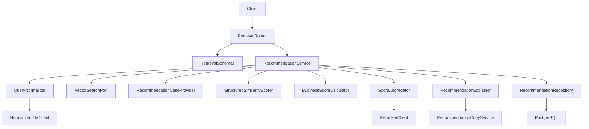
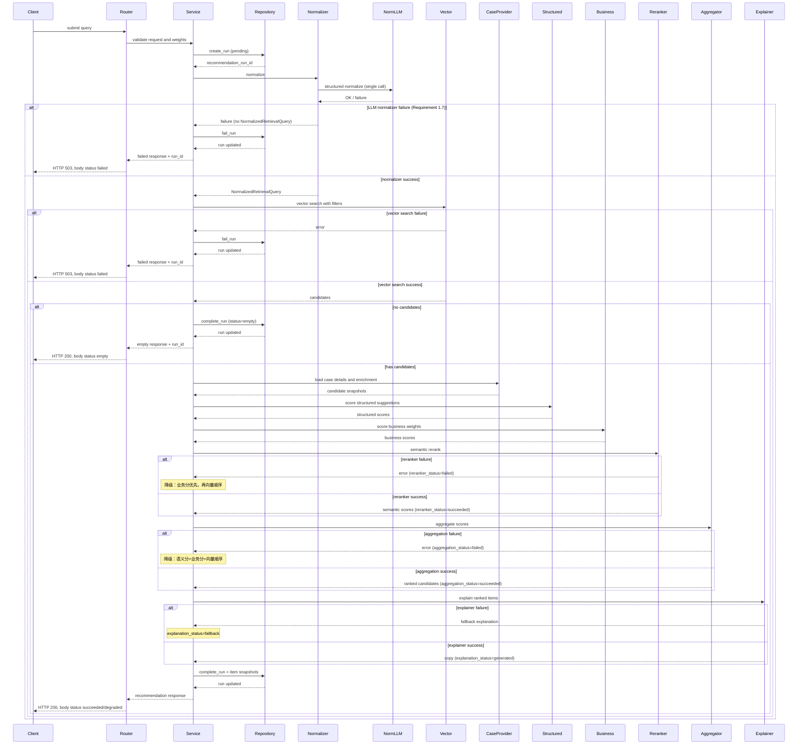
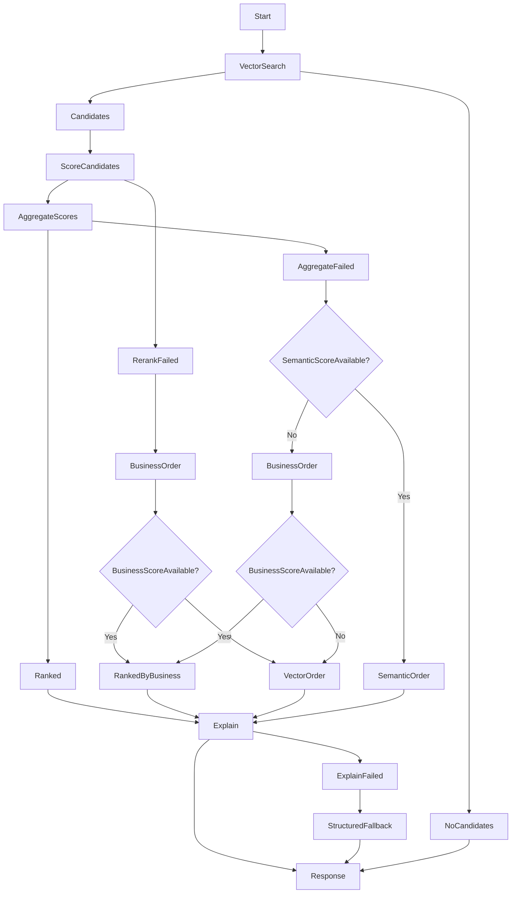
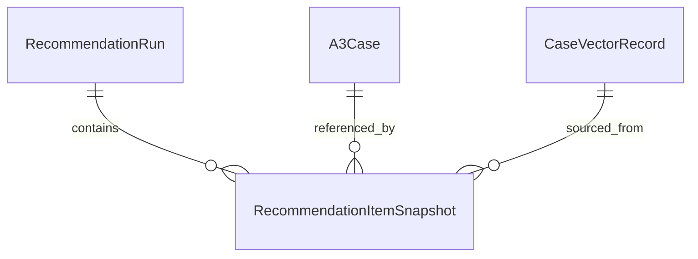
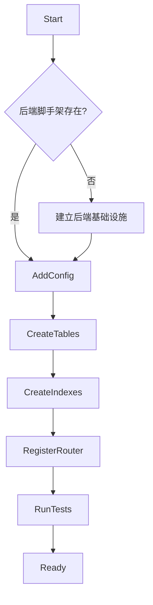

# Design Document

## Overview

`cbr-retrieval-recommendation` 在问题侧向量索引之上编排混合式案例推理（Hybrid CBR）推荐。流程如下：接收用户当前问题、基础过滤条件与可选业务权重；通过单次 LLM normalizer 产出标准化检索文本与 `query_structured_suggestions`；消费 `case-vector-indexing` 返回的问题语义向量候选；补齐候选详情及 `CaseEnrichmentResult.structured_suggestions`；再计算结构化局部相似度、远程 reranker 语义相似度与业务参数分；最后由自实现的 `ScoreAggregator` 加权聚合，输出可解释、可追溯的 Top-K 相似案例。

本设计沿用 Python + FastAPI + PostgreSQL。推荐服务自持查询、候选、评分、运行记录与响应契约。`ScoreAggregator` 仅对已返回的候选集做归一化、重加权与加权求和，不向全量 SQL casebase 另行发起检索。推荐解释优先调用 `llm-case-enrichment` 的推荐文案；失败则降级为基于结构化候选信息的说明。

**重要说明**: 当前仓库中 `backend/` 目录尚未建立，本设计文档作为**目标架构蓝图**，描述后端脚手架建立后的模块组织、接口契约和集成模式。

**前置依赖保证（第 1 次强调）**：依据 `.kiro/steering/roadmap.md`，本规格依赖 `a3-case-management`、`llm-case-enrichment`、`case-vector-indexing`，以及它们提供的基础设施（FastAPI 脚手架、统一配置、共享 LLM 客户端、数据库与错误处理）。**实施本规格时，上述能力视为已就绪**。设计评审与实施计划**不应把「前置未就绪」列为本规格的风险**。验收条目见 `Migration Strategy`。

### Goals

- 提供手动相似案例检索入口，支持 Top-K、结构化过滤、业务权重参数和空结果元数据。
- 消费问题侧向量搜索原语并保留候选来源、向量分值和索引版本。
- 使用 `qwen3-reranker-8b` 生成纯语义相似度分值，并基于 `structured_suggestions` 计算结构化局部相似度。
- 使用 `ScoreAggregator` 在候选集内聚合语义分、结构化局部相似度和业务参数分，得到最终排序。
- 组装包含案例引用、核心步骤、分值明细、推荐理由和注意事项的响应。
- 保存推荐运行和推荐项引用，供后续反馈规格关联，不吸收反馈持久化。

### Non-Goals

- 不实现 A3 案例 CRUD、案例基础字段生命周期或复杂权限。
- 不生成或维护 embedding、pgvector 向量表、向量粗检索 SQL 和索引状态。
- 不生成 LLM 案例摘要、标签建议或长期推荐文案结果。
- 不保存有用/无用、评分、采纳状态或反馈学习排序。
- 不实现前端页面、自动推送渠道、经营指标触发、巡检触发、行业库加权或多轮追问。

## Boundary Commitments

### This Spec Owns

- `RetrievalQuery`、`RecommendationRun`、`RecommendationItemSnapshot`、评分明细和对外推荐响应契约。
- 查询输入摘要/标准化、过滤条件校验、业务权重校验和实际过滤条件回显。
- 向量搜索候选消费、候选详情补齐、结构化局部相似度、业务参数分、分值聚合、远程 reranker 调用和降级排序。
- 推荐结果组装：分值明细、最终排序位置、案例引用、核心步骤、解释状态和来源引用。
- 推荐运行可观测性：运行标识、候选数量、模型 id、耗时、错误和降级状态。

### Out of Boundary

- `A3Case` 基础实体、案例创建、编辑、详情和列表查询。
- `CaseEnrichmentResult` 的生成、审核、持久化和过期判断。
- `CaseVectorRecord`、embedding 生成、pgvector 索引、向量刷新、查询向量生成和搜索底层实现。
- 推荐反馈保存、采纳状态、评分、有用/无用和学习排序（但删除推荐记录时**必须**同步调用反馈删除接口清理关联反馈）。
- 前端 UI、自动消息推送、行业库高权重候选搜索和复杂多轮问答。

### Allowed Dependencies

- `a3-case-management` 的案例读取契约：`case_id`、基础 A3 字段、状态、过滤字段、解决步骤、效果结果、`updated_at`。
- `llm-case-enrichment` 的 `RecommendationCopyService` 或等价 API，**仅**用于解释已排序候选，且不得改变排序；**不得**与本规格的查询 LLM normalizer 复用同一 LLM 客户端实现或工厂（保持 spec 边界独立；见下方 `NormalizerLLMClient` 快照）。
- `case-vector-indexing` 的 `VectorSearchService` 或 `/api/vector-search`：标准化用户问题、过滤条件、Top-K 问题语义候选、向量分值和索引元数据。
- `recommendation-feedback` 的删除接口（DELETE `/api/recommendation-feedback`）：删除推荐运行或推荐项快照时，**必须**同步调用该接口清理关联反馈记录，确保不产生悬空引用。
- Python 3.11+、FastAPI、Pydantic、SQLAlchemy、Alembic、pytest。
- 自实现 `ScoreAggregator` 执行候选集内的归一化、重加权和加权聚合；远程 reranker 默认 model `qwen3-reranker-8b`，并使用独立 `api_key/model/base_url`。

### Dependency Contract Snapshot

为减少跨规格漂移，本规格冻结最小可执行依赖契约。下列任一必填字段、错误语义或版本策略发生变化，均视为破坏性变更，须触发 `Revalidation Triggers`。

#### `a3-case-management` (RecommendationCaseProvider)

- Required input: `case_id` 列表（来自向量候选）。
- Required output fields:
  - `case_id`（string）
  - `status`（可用于过滤与可用性判断）
  - `problem_summary` 或 `problem_description`（至少一个可用）
  - `core_solution_steps`（可为空，但需显式缺失）
  - `outcome_summary` 或等价结果字段（可为空，但需显式缺失）
  - `brand_id`、`store_id`、`problem_type`、`tags`、`created_at`、`updated_at`（过滤与业务评分依赖）
- Tolerant fields: 标题、扩展业务字段、展示附加信息。
- Error contract: `not_found` 与 `forbidden` 必须可区分；单候选失败不得导致整批崩溃，需返回缺失标记。

#### `case-vector-indexing` (VectorSearchPort)

- Required request fields: `query_text`、`top_k`、`filters`（标准化后）。
- Required response envelope（`VectorCandidateBatch` 层级，名称以实现为准）:
  - `search_ref` 或等价向量搜索运行引用（必填，用于运行记录与排障）
  - `index_version` 或等价索引版本标识（必填；若上游仅提供批次级版本，则置于批次层即可）
- Required fields **per candidate**（`VectorCandidate`）:
  - `case_id`、`vector_id`
  - `similarity_score`（向量分）
  - `index_status`（可检索状态；与 Requirement `2.2`、`2.6` 一致）
- Required behavior: 仅返回可检索候选；空候选返回稳定的空列表与元数据；批次或任一候选缺少上述必填字段时，`VectorSearchPort` **须**映射为 `invalid_response`，不得仅凭部分候选静默继续。
- Error contract: 至少可映射到 `timeout`、`unavailable`、`invalid_response`。

#### `llm-case-enrichment` (RecommendationCopyService)

- Required input: 已排序候选列表（含 `case_id` 与排序位置）及查询摘要。
- Required behavior:
  - 不增删候选，不改变顺序；
  - 输出与输入 `case_id` 一一对应；
  - 失败时返回可判定状态以触发结构化降级解释。
- Required output fields: `recommendation_reason`、`reference_points`、`cautions`、`source_references` 或明确失败状态。

#### Query Normalizer LLM 调用（使用共享 LLM 客户端）

- **实现方式**：`QueryNormalizer` 通过 `backend/app/core/llm_client.py` 提供的共享 `LLMClient` 类执行 LLM 外呼。
- **配置独立**：仅绑定「LLM normalizer」配置段（`api_key` / `model_id` / `base_url` / timeout / retry 等），与 `llm-case-enrichment` 的文案 LLM、embedding、reranker 三套配置彼此独立。**多模型配置隔离基础设施由 `llm-case-enrichment` 规格建立**（详见该规格的「多模型配置隔离策略」章节），本规格复用该基础设施并使用 `NormalizerLLMConfig` 配置类。
- **共享客户端职责**：HTTP 调用、重试逻辑、超时处理、错误映射（timeout/rate-limited/provider-error/invalid-response）等基础设施能力。
- **本规格职责**：定义 LLM normalizer 的 prompt 模板、输入输出 schema、结果校验逻辑；单次外呼返回可被 Pydantic 校验的结构化结果，包含标准化检索文本与 `query_structured_suggestions`；失败语义对齐 Requirement `1.7` / Failure Mode Matrix 中 LLM normalizer 失败路径。
- **边界说明**：共享 `LLMClient` 的实现细节（如 HTTP 库选型、重试算法）由 `backend/app/core/` 模块拥有；本规格只定义调用契约和配置命名空间，不拥有客户端实现。

#### Version & Compatibility Policy

- 版本策略: 上游接口以「向后兼容优先」；允许新增字段，删除或重命名必需字段视为 breaking。
- 兼容策略: 适配器层提供字段别名映射（仅限已登记等价字段）；**`contract_version` 落在表 `recommendation_runs` 的独立列**（应用常量或配置注入的版本标识，如 `mvp-1`、semver），在 **`create_run` 时写入**，本条运行的 **`fail_run` / `complete_run` 不得改写该列**，便于按契约快照排查回归。
- 变更检测: 在契约测试中固定最小字段快照；上线前执行依赖契约回归测试。
- **模型配置隔离**: 多模型配置隔离基础设施由 `llm-case-enrichment` 规格建立，详见该规格的「多模型配置隔离策略」章节。本规格复用该基础设施。

### Revalidation Triggers

- 上游案例过滤字段、状态语义、详情响应、解决步骤或效果字段变化。
- 向量搜索请求/响应、候选分值语义、索引状态、问题侧向量输入策略或过滤字段变化。
- 推荐文案接口的请求/响应、候选顺序保证或失败语义变化。
- 查询 LLM normalizer（`NormalizerLLMClient`）的请求/响应 schema、`api_key/model_id/base_url`、超时、重试或供应商响应格式变化。
- 聚合算法、reranker `api_key/model/base_url`、分值范围或供应商响应格式变化。
- 下游反馈规格需要改变 `recommendation_run_id` 或 `recommendation_item_id` 引用契约。
- 下游反馈规格删除接口（DELETE `/api/recommendation-feedback`）的请求/响应契约或错误语义变化。

## Architecture

### Target Architecture Foundation

**重要说明**: 当前仓库中 `backend/` 目录尚未建立，本设计文档作为**目标架构蓝图**，描述后端脚手架建立后的集成模式。

**前置依赖保证（第 2 次说明）**：实施本规格时，前置规格（`a3-case-management`、`llm-case-enrichment`、`case-vector-indexing`）**须已提供** `backend/app/cases`、`backend/app/enrichment`、`backend/app/vector_indexing`、统一配置、错误映射、数据库会话与迁移基础。本规格新增 `backend/app/retrieval`，仅经公开服务或 API 端口读取上游能力，**不得**直接改动上游表或内部状态。

**实施前提（由前置规格提供，必然就绪）**:
- FastAPI 项目脚手架（应用入口、路由注册、中间件）
- 统一配置管理（`backend/app/core/config.py`）
- 共享 LLM 客户端基础设施（`backend/app/core/llm_client.py`）
- 数据库连接池与会话管理（`backend/app/db/`）
- 统一错误映射与响应格式（`backend/app/core/errors.py`）
- Alembic 迁移框架配置

### Architecture Pattern & Boundary Map




**Architecture Integration**:

- Selected pattern: 轻量分层 FastAPI 模块 + Ports/Adapters。领域服务对齐系统契约；`ScoreAggregator`、向量搜索、`NormalizerLLMClient`（仅用于查询规范化）、推荐文案、结构化局部评分、业务评分与 reranker 均经端口或独立适配层隔离。
- Domain/feature boundaries: `RecommendationService` 承载端到端检索推荐；`VectorSearchPort` 只消费候选；`StructuredSimilarityScorer` 与 `BusinessScoreCalculator` 只产出评分明细；`RecommendationExplainer` 只产出解释，**不得**改动排序。
- Existing patterns preserved: 沿用上游 FastAPI、Pydantic、SQLAlchemy/Alembic、统一错误响应、数据库会话与隐私日志策略。
- New components rationale: 推荐须独立记录运行；自实现 `ScoreAggregator` 负责加权聚合；reranker 与查询规范化 LLM 与 enrichment 文案 LLM **不复用客户端**；业务参数分与结构化局部相似度须显式落库/落响应，并与「解释 vs 排序」职责分离。
- Dependency direction（依赖方向）: 配置与契约靠内层；**`RecommendationService`** 编排 `QueryNormalizer`、`VectorSearchPort`、`RecommendationCaseProvider`、`StructuredSimilarityScorer`、`BusinessScoreCalculator`、`RerankerClient`、`ScoreAggregator`、`RecommendationExplainer`、`RecommendationRepository`；**`RetrievalRouter` 仅依赖 `RecommendationService`**。Ports、Aggregator、Repository 等均由 Service 注入或调用，**不是**「Repository 驱动 Service」的倒置分层。`retrieval` 可读 `cases`、`vector_indexing`、`enrichment` 的公开契约，**不得**反向修改其实现或持久化。

### Technology Stack


| Layer              | Choice / Version                    | Role in Feature       | Notes                          |
| ------------------ | ----------------------------------- | --------------------- | ------------------------------ |
| Backend / Services | Python 3.11+ + FastAPI              | 暴露检索推荐 API            | 延续前置规格                         |
| Validation         | Pydantic                            | 查询、过滤、候选、响应和错误 schema | 强类型边界                          |
| Data / Storage     | PostgreSQL                          | 保存推荐运行和推荐项快照          | 不保存向量数组或反馈                     |
| ORM / Migration    | SQLAlchemy + Alembic                | 新增推荐运行表和索引            | 不修改上游表                         |
| Score Aggregation  | 自实现 `ScoreAggregator`                  | 候选集内的归一化、重加权和加权聚合   | 简单、可控、易测试，不依赖外部 CBR 框架 |
| LLM Normalizer     | Remote LLM service                  | 生成标准化查询与 `query_structured_suggestions` | 与 embedding/reranker 配置隔离       |
| External AI        | Remote reranker `qwen3-reranker-8b` | 候选相关性精排               | 通过 `RerankerClient` 适配；与 LLM/embedding 配置隔离 |
| Testing            | pytest + FastAPI TestClient         | 单元、API、降级和集成测试        | 外部依赖使用 fake client             |


## File Structure Plan

### Directory Structure

```text
backend/
├── app/
│   ├── core/
│   │   ├── config.py                         # 增加 retrieval、ScoreAggregator、LLM normalizer/reranker/embedding 独立配置、Top-K、超时、重试和隐私配置
│   │   ├── errors.py                         # 增加 RETRIEVAL_*、RERANKER_*、AGGREGATION_* 错误码
│   │   └── llm_client.py                     # 共享 LLM 客户端：HTTP 调用、重试、超时、错误映射等基础设施
│   ├── db/
│   │   └── base.py                           # 纳入 retrieval ORM metadata
│   ├── cases/
│   │   └── service.py                        # 被 RecommendationCaseProvider 读取案例详情
│   ├── enrichment/
│   │   └── recommendation_copy.py            # 被 RecommendationExplainer 调用
│   ├── vector_indexing/
│   │   └── search.py                         # 被 VectorSearchPort 调用
│   └── retrieval/
│       ├── models.py                         # 推荐运行（含 `contract_version` 列）、推荐项快照和状态枚举 ORM 模型
│       ├── schemas.py                        # 检索请求、过滤、候选、响应和错误 schema
│       ├── query.py                          # QueryNormalizer：单次 LLM normalizer、Top-K、过滤和业务权重校验
│       ├── vector_port.py                    # 向量搜索端口和候选原语映射
│       ├── case_provider.py                  # 推荐项所需案例详情补齐
│       ├── structured_similarity.py          # structured_suggestions 局部相似度评分
│       ├── business_scoring.py               # 业态、门店等级、时间等业务参数分
│       ├── score_aggregator.py               # 自实现的归一化、重加权和加权聚合
│       ├── reranker_client.py                # qwen3-reranker-8b 远程重排适配
│       ├── explainer.py                      # 调用推荐文案并生成降级解释
│       ├── repository.py                     # 推荐运行、候选分值和降级状态持久化
│       ├── service.py                        # 端到端检索推荐流程编排
│       └── router.py                         # 相似案例推荐 API 端点
├── alembic/
│   └── versions/
│       └── <revision>_create_recommendation_runs.py
└── tests/
    └── retrieval/
        ├── test_query_validation.py          # 查询、过滤和 Top-K 校验测试
        ├── test_llm_normalizer.py            # LLM normalizer 成功、超时、不可解析响应与配置缺失
        ├── test_vector_port.py               # 向量候选映射、空结果和失败测试
        ├── test_reranker_client.py           # reranker 分值、错误和超时映射测试
        ├── test_score_aggregator.py          # 归一化、重加权、聚合和降级排序测试
        ├── test_recommendation_service.py    # 端到端组装、缺失字段和运行记录测试
        ├── test_retrieval_api.py             # API 成功、空结果、降级和错误响应测试
        └── test_retrieval_privacy.py         # 日志和运行记录敏感信息边界测试
```

### Modified Files

- `backend/app/main.py` — 仅追加注册 `RetrievalRouter`，不改写应用入口基础实现。
- `backend/app/core/config.py` — 仅追加推荐检索开关、Top-K 上限、默认聚合权重，以及 `NormalizerLLMConfig` 和 `RerankerConfig` 配置类（复用 `llm-case-enrichment` 建立的多模型配置隔离基础设施）；不拥有共享配置基础设施。
- `backend/app/core/errors.py` — 仅追加检索推荐、分值聚合和 reranker 错误码映射，不拥有 `ErrorMapper` 基础实现。
- `backend/app/core/llm_client.py` — 共享 LLM 客户端基础设施，供 `llm-case-enrichment` 和本规格共同使用；本规格不拥有该文件，只定义调用契约和配置命名空间。
- `backend/app/db/base.py` — 仅追加导入 `retrieval` ORM metadata，不拥有数据库基础设施。
- `backend/app/vector_indexing/search.py` — 不改变向量搜索契约，仅供 `VectorSearchPort` 调用。
- `backend/app/enrichment/recommendation_copy.py` — 不改变文案契约，仅供 `RecommendationExplainer` 调用。
- `backend/app/cases/service.py` — 不改变案例契约，仅供 `RecommendationCaseProvider` 读取详情。

## System Flows

### 推荐检索流程




### 降级流程




## Requirements Traceability

下表中「降级流程」列与 `Failure Mode Matrix` 一致；矩阵已约定组合故障优先级（例如 `reranker + aggregation` 双失败时为「业务分优先，再回退向量顺序」）。


| Requirement | Summary            | Components                                                                                   | Interfaces                 | Flows  |
| ----------- | ------------------ | -------------------------------------------------------------------------------------------- | -------------------------- | ------ |
| 1.1         | 接收问题、Top-K、过滤和业务权重 | RetrievalRouter, RetrievalSchemas                                                            | RecommendationRequest      | 推荐检索流程 |
| 1.2         | 支持基础硬过滤字段          | QueryNormalizer, RetrievalSchemas                                                            | RetrievalFilters           | 推荐检索流程 |
| 1.3         | 查询与过滤错误            | QueryNormalizer, ErrorMapper                                                                 | ValidationErrorResponse    | 推荐检索流程 |
| 1.4         | 无命中过滤结果            | RecommendationService, VectorSearchPort                                                      | RecommendationResponse     | 降级流程   |
| 1.5         | 回显规范化过滤            | RetrievalSchemas                                                                             | AppliedFilters             | 推荐检索流程 |
| 1.6         | LLM normalizer 产出检索文本与查询侧结构化 | QueryNormalizer                                                                              | NormalizedRetrievalQuery   | 推荐检索流程 |
| 1.7         | LLM normalizer 失败终止（fail closed） | QueryNormalizer, RecommendationService, ErrorMapper                                           | SummarizationFailedResponse | 降级流程   |
| 2.1         | 调用问题语义向量搜索候选       | VectorSearchPort                                                                             | VectorSearchRequest        | 推荐检索流程 |
| 2.2         | 只用可检索候选            | VectorSearchPort, RecommendationService                                                      | VectorCandidate            | 推荐检索流程 |
| 2.3         | 向量空候选              | RecommendationService                                                                        | NoHitMetadata              | 降级流程   |
| 2.4         | 向量搜索失败             | VectorSearchPort, ErrorMapper                                                                | RETRIEVAL_VECTOR_FAILED    | 降级流程   |
| 2.5         | 保留候选来源             | RecommendationRepository                                                                     | RecommendationRun          | 推荐检索流程 |
| 2.6         | 向量批次必选字段校验         | VectorSearchPort, RecommendationService, ErrorMapper                                          | VectorCandidateBatch       | 降级流程   |
| 3.1         | 语义精排               | RerankerClient                                                                               | RerankRequest              | 推荐检索流程 |
| 3.2         | 结构化局部相似度           | StructuredSimilarityScorer                                                                   | StructuredSimilarityScore  | 推荐检索流程 |
| 3.3         | 候选不足               | RecommendationService                                                                        | RecommendationMetadata     | 降级流程   |
| 3.4         | 重排失败降级             | RerankerClient, RecommendationService                                                        | DegradedRanking            | 降级流程   |
| 3.5         | 业务参数分              | BusinessScoreCalculator                                                                      | BusinessScore              | 推荐检索流程 |
| 3.6         | 不使用反馈排序            | RecommendationService                                                                        | module boundary            | 推荐检索流程 |
| 4.1         | 分值聚合评分        | ScoreAggregator                                                                              | AggregateScoreRequest      | 推荐检索流程 |
| 4.2         | 默认权重和请求权重          | QueryNormalizer, ScoreAggregator                                                             | ScoreWeights               | 推荐检索流程 |
| 4.3         | 保留分值明细             | RetrievalSchemas, RecommendationRepository                                                   | RecommendationItem         | 推荐检索流程 |
| 4.4         | 聚合失败降级             | ScoreAggregator, RecommendationService                                                       | DegradedRanking            | 降级流程   |
| 4.5         | 聚合器不重新检索       | ScoreAggregator                                                                              | module boundary            | 推荐检索流程 |
| 4.6         | `final_score` 默认 0 语义 | ScoreAggregator, RecommendationService, RetrievalSchemas, RecommendationRepository           | RecommendationItem, score_breakdown | 降级流程   |
| 5.1         | 返回 Top-K 推荐        | RecommendationService                                                                        | RecommendationResponse     | 推荐检索流程 |
| 5.2         | 推荐项字段              | RecommendationCaseProvider, RetrievalSchemas                                                 | RecommendationItem         | 推荐检索流程 |
| 5.3         | 保留引用关系             | RecommendationRepository                                                                     | RecommendationItemSnapshot | 推荐检索流程 |
| 5.4         | 缺失字段标记             | RecommendationCaseProvider, RecommendationExplainer                                          | MissingFieldInfo           | 降级流程   |
| 5.5         | 不写回上游              | RecommendationService                                                                        | module boundary            | 推荐检索流程 |
| 6.1         | 返回推荐理由             | RecommendationExplainer                                                                      | ExplanationResult          | 推荐检索流程 |
| 6.2         | 解释不改排序             | RecommendationExplainer                                                                      | RecommendationCopyRequest  | 推荐检索流程 |
| 6.3         | 文案失败降级             | RecommendationExplainer                                                                      | FallbackExplanation        | 降级流程   |
| 6.4         | 区分分值和说明            | RetrievalSchemas                                                                             | RecommendationItem         | 推荐检索流程 |
| 6.5         | 避免黑盒推荐             | RecommendationService, RetrievalSchemas                                                      | TraceableRecommendation    | 推荐检索流程 |
| 7.1         | 运行记录               | RecommendationRepository                                                                     | RecommendationRun          | 推荐检索流程 |
| 7.2         | 反馈引用标识             | RetrievalSchemas, RecommendationRepository                                                   | run and item IDs           | 推荐检索流程 |
| 7.3         | 模型状态和耗时            | RerankerClient, RecommendationRepository                                                     | RerankMetadata             | 推荐检索流程 |
| 7.4         | 配置失败和供应商失败         | RerankerClient, ScoreAggregator, RecommendationExplainer, RecommendationService, ErrorMapper | DegradedStatus             | 降级流程   |
| 7.5         | 敏感信息保护             | RecommendationRepository, ErrorMapper                                                        | SafeLogContext             | 全部流程   |


## Components and Interfaces


| Component                  | Domain/Layer        | Intent                              | Req Coverage                      | Key Dependencies                        | Contracts      |
| -------------------------- | ------------------- | ----------------------------------- | --------------------------------- | --------------------------------------- | -------------- |
| RetrievalRouter            | API                 | 暴露相似案例推荐入口                          | 1.1, 1.3, 5.1, 7.2                | RecommendationService P0                | API            |
| RetrievalSchemas           | API/Data Contract   | 定义请求、过滤、权重、候选、评分、响应和状态              | 1.1, 1.5, 3.5, 4.3, 4.6, 5.2, 6.4 | Pydantic P0                             | API, State     |
| QueryNormalizer            | Domain Service      | 标准化查询、Top-K、过滤条件和业务权重；调用共享 LLM 客户端执行 normalizer | 1.2, 1.3, 1.6, 1.7, 4.2          | Config P0, LLMClient (shared) P0       | Service        |
| VectorSearchPort           | Integration         | 调用问题语义向量搜索并映射候选原语                   | 2.1, 2.2, 2.3, 2.4, 2.5, 2.6      | VectorSearchService P0                  | Service        |
| RecommendationCaseProvider | Integration         | 补齐推荐展示、精排和结构化评分所需案例快照               | 3.2, 5.2, 5.4                     | CaseService P0, EnrichmentRepository P1 | Service        |
| StructuredSimilarityScorer | Domain Service      | 基于 `structured_suggestions` 计算局部相似度 | 3.2, 7.4                          | CaseEnrichmentResult P1                 | Service        |
| BusinessScoreCalculator    | Domain Service      | 根据业务权重和候选业务字段计算业务参数分                | 3.5, 7.4                          | Config P0                               | Service        |
| ScoreAggregator            | Domain Service      | 自实现的归一化、重加权和加权聚合              | 4.1, 4.2, 4.4, 4.5, 4.6           | Config P0                               | Service        |
| RerankerClient             | External Adapter    | 调用 `qwen3-reranker-8b` 并归一化纯语义分值    | 3.1, 7.3, 7.4                     | Remote reranker P0                      | Service        |
| RecommendationExplainer    | Domain Service      | 获取推荐文案或生成结构化降级解释                    | 6.1, 6.2, 6.3                     | RecommendationCopyService P1            | Service        |
| RecommendationRepository   | Data Access         | 保存推荐运行、候选快照、评分明细和状态                 | 2.5, 4.3, 4.6, 5.3, 7.1, 7.5      | PostgreSQL P0                           | Service, State |
| RecommendationService      | Application Service | 编排端到端检索、评分、聚合、解释和持久化；使用 `RecommendationRunContext` 上下文管理器保证运行记录终态一致性 | 1.4, 1.7, 2.3, 3.3, 4.1, 4.6, 5.1, 5.5, 6.5 | all core components P0                  | Service        |
| ErrorMapper                | API Support         | 输出稳定错误码并脱敏日志                        | 1.3, 1.7, 2.4, 7.4, 7.5           | FastAPI P0                              | API            |


### API Layer

#### RetrievalRouter


| Field        | Detail             |
| ------------ | ------------------ |
| Intent       | 提供手动相似案例推荐 HTTP 入口 |
| Requirements | 1.1, 1.3, 4.1, 6.2 |


**API Contract**


| Method | Endpoint                             | Request                 | Response                    | Errors   |
| ------ | ------------------------------------ | ----------------------- | --------------------------- | -------- |
| POST   | `/api/recommendations/similar-cases` | `RecommendationRequest` | `RecommendationResponse`    | 422, 503 |
| GET    | `/api/recommendations/runs/{run_id}` | path `run_id`           | `RecommendationRunResponse` | 404      |


**Implementation Notes**

- POST 端点对已进入 `recommend_similar_cases` 的请求（通过 Router/schema 校验后）：**须**在调用 LLM normalizer / `VectorSearchPort` **之前**执行 `RecommendationRepository.create_run`（或等价操作）取得 `recommendation_run_id`。Requirement `1.7`（LLM normalizer 失败）路径：**不得**调用向量搜索；**须**在该 run 上调用 `fail_run`（或等价终态写入）后返回响应，且响应 **必须** 携带同一 `recommendation_run_id` 以供审计与下游关联。成功、空候选与降级路径在完成流水线后调用 `complete_run`（或等价）并持久化推荐项快照。
- Requirement `1.3`（问题文本为空、Top-K 越界、过滤格式无效等）在进入上述运行记录流水线之前即返回 **422**，**不**创建推荐运行记录。
- **运行记录创建时机决策树**：
  ```
  422 路径（不创建运行记录）：
  - query_text 为空或仅包含空白字符
  - top_k 越界（≤0 或超过配置上限）
  - filters 格式无效（JSON 解析失败、字段类型错误、日期格式错误）
  - business_weights 格式无效或超出配置范围
  
  503 路径（须创建运行记录）：
  - 通过 Router 层 schema 校验后，进入 RecommendationService.recommend_similar_cases
  - LLM normalizer 失败（超时、限流、配置缺失、响应不可解析）
  - 向量搜索失败（超时、不可用、返回不可解析结果）
  
  200 路径（须创建运行记录）：
  - 向量搜索返回空候选（status: empty）
  - 有候选但排序降级（status: degraded）
  - 成功返回推荐（status: succeeded）
  ```
- GET 端点只返回运行状态和候选快照元数据（含 **`contract_version`**），不返回完整查询原文或完整案例正文。

#### 运行终态不变量（Req 1.7 / 7.1）

- 一旦 `create_run` 成功，同一请求在返回客户端之前**必须**将对应 run 置于与响应体一致的终态（`complete_run` / `fail_run` 或等价写入）；禁止在业务逻辑正常返回后仍留下「已创建但未终态」的运行记录。
- **编排守卫**：`RecommendationService`（或等价应用服务）须在单入口内通过 **`try`/`finally` 或专用「运行收尾」上下文**保证：normalizer、向量、评分、重排、聚合、解释或组装任一环节出现未捕获异常时，若 `create_run` 已成功，**须在 `finally` 中按已收集的阶段结果补写 `fail_run` 或重试写入终态**（若写终态本身失败，按下文 HTTP 矩阵返回 5xx，并保留可观测错误记录；**不得**仅靠全局 middleware 收口）。
- **验收**：集成测试须覆盖 normalizer 失败、向量搜索失败、流水线中段异常、`fail_run`/`complete_run` 写库失败等分支；断言在客户端收到响应后，`recommendation_run_id` 对应行的终态与 POST body 的 `status`、`error_code` 口径一致，且无「长期未终态」的记录泄漏（运行级 `status` 应为 `succeeded`、`empty`、`degraded`、`failed` 之一）。

#### 多上游依赖与契约门禁（Req 2.1 / 2.6 / 5.2）

- 开发与联调顺序对齐 **`Dependency Contract Snapshot`** 中的 P0/P1；本模块单测与 `RecommendationService` 集成测试**优先**采用 **Fake** 的 `VectorSearchPort`、`RecommendationCaseProvider`、`NormalizerLLMClient`、`RerankerClient`、`RecommendationCopyService`，再与真实 `case-vector-indexing`、`a3-case-management`、`llm-case-enrichment` 做契约或环境联调。
- 任一上游删除/重命名必填字段或变更错误语义时，须触发 **`Revalidation Triggers`**；合并前须跑快照最小字段集的 **fixture / 契约回归**（与 Req 2.6「缺字段即 invalid」一致），禁止「部分候选静默继续」。

### Domain Layer

#### RecommendationService


| Field        | Detail                            |
| ------------ | --------------------------------- |
| Intent       | 端到端编排检索推荐流程                       |
| Requirements | 1.4, 1.7, 2.3, 2.6, 3.3, 4.1, 4.5, 4.6, 5.5, 6.1 |


**Service Interface**

```python
class RecommendationService:
    def recommend_similar_cases(self, request: RecommendationRequest) -> RecommendationResponse: ...
    def get_run(self, run_id: str) -> RecommendationRunResponse: ...
```

- Preconditions: 查询请求已通过 schema 解析；向量搜索配置和推荐配置可用（normalizer 失败路径不要求向量端口可达，但仍须能写入运行终态）。
- Postconditions: 已通过 schema 校验并进入本服务的请求：**须**先 `create_run` 再执行后续步骤；成功、空结果、`empty`、`degraded` 或 Requirement `1.7` 失败路径 **均须** 将对应 run 置于一致终态（`complete_run` / `fail_run` 等）并在 POST 响应中返回同一 `recommendation_run_id`；**须**遵守上文「运行终态不变量」（含未捕获异常时的 `finally` 收口）。Requirement `1.3` 在进入本服务主流程之前由 Router 拦截时 **不**创建运行记录。
- Invariants: 不写回案例、LLM 派生结果、向量记录或反馈表；解释失败不改变排序。

**运行记录终态保证**（实现指导）:

为降低运行终态一致性实现的复杂度，建议采用**上下文管理器**，替代手写 `try-finally` 与布尔标记：

```python
# backend/app/retrieval/run_context.py

from contextlib import contextmanager
from typing import Optional
from .repository import RecommendationRepository
from .schemas import RecommendationRequest, ErrorData


class RecommendationRunContext:
    """
    推荐运行上下文管理器
    
    职责：
    1. 自动创建运行记录（__enter__）
    2. 保证运行记录终态一致性（__exit__）
    3. 处理未捕获异常时的收尾逻辑
    """
    
    def __init__(
        self,
        repository: RecommendationRepository,
        request: RecommendationRequest
    ):
        self.repository = repository
        self.request = request
        self.run_id: Optional[str] = None
        self.completed = False
    
    def __enter__(self):
        """创建运行记录"""
        self.run_id = self.repository.create_run(
            query_hash=hash(self.request.query_text),
            filters=self.request.filters,
            weights=self.request.business_weights or default_weights,
            top_k=self.request.top_k
        )
        return self.run_id
    
    def __exit__(self, exc_type, exc_val, exc_tb):
        """保证运行记录终态"""
        if self.completed:
            # 已通过 complete() 或 fail() 写入终态
            return False
        
        # 未预期的异常：尝试写入失败终态
        if exc_type is not None:
            try:
                self.repository.fail_run(
                    run_id=self.run_id,
                    error=ErrorData(
                        code='INTERNAL_ERROR',
                        message='推荐流程异常终止',
                        internal_reason=str(exc_val)
                    )
                )
            except Exception as persist_error:
                # 持久化本身失败：记录但不再抛出
                logger.critical(
                    f"Failed to persist run failure: {persist_error}",
                    extra={'run_id': self.run_id}
                )
        else:
            # 正常退出但未写入终态：记录告警
            logger.warning(
                f"Run {self.run_id} exited without terminal state",
                extra={'run_id': self.run_id}
            )
        
        return False  # 不抑制异常
    
    def complete(self, result):
        """标记运行成功完成"""
        self.repository.complete_run(self.run_id, result)
        self.completed = True
    
    def fail(self, error: ErrorData):
        """标记运行失败"""
        self.repository.fail_run(self.run_id, error)
        self.completed = True
```

**使用示例**:

```python
def recommend_similar_cases(self, request: RecommendationRequest) -> RecommendationResponse:
    """
    端到端检索推荐流程，使用上下文管理器保证运行记录终态一致性
    """
    with RecommendationRunContext(self.repository, request) as run_id:
        try:
            # 步骤 1: 查询标准化（可能失败 - Requirement 1.7）
            try:
                normalized = self.normalizer.normalize(request)
            except (NormalizerTimeout, NormalizerRateLimited, 
                    NormalizerConfigMissing, NormalizerInvalidResponse) as e:
                # LLM normalizer 失败：fail closed
                context.fail(ErrorData(
                    code='QUERY_SUMMARIZATION_FAILED',
                    message='当前无法理解您的问题，请稍后重试',
                    internal_reason=type(e).__name__
                ))
                return RecommendationResponse(
                    recommendation_run_id=run_id,
                    status='failed',
                    error_code='QUERY_SUMMARIZATION_FAILED',
                    message='当前无法理解您的问题，请稍后重试'
                )
            
            # 步骤 2-7: 向量搜索、评分、聚合、解释...
            # （实现略，与原设计相同）
            
            # 步骤 8: 持久化运行结果
            context.complete(RunResult(
                status='succeeded' if not degraded else 'degraded',
                items=explained,
                reranker_status=reranker_status,
                aggregation_status=aggregation_status
            ))
            
            return RecommendationResponse(
                recommendation_run_id=run_id,
                status='succeeded' if not degraded else 'degraded',
                items=explained
            )
        
        except Exception as e:
            # 未预期的异常：上下文管理器会自动处理
            logger.error(f"Unexpected error: {e}", extra={'run_id': run_id})
            raise
```

**要点**:
1. **实现更简单**：不必手搓 `run_completed` 与整块 `finally`
2. **收尾自动化**：`__exit__` 在未捕获异常时仍可尽力写入终态
3. **语义直观**：`with` 直接表达「一次推荐的运行记录生命周期」
4. **可测**：上下文管理器可单独做单测

**原手动实现方式**（备选）:

```python
def recommend_similar_cases(self, request: RecommendationRequest) -> RecommendationResponse:
    """
    端到端检索推荐流程，保证运行记录终态一致性。
    
    关键设计决策：
    1. create_run 在所有业务逻辑之前执行（第一步）
    2. 所有可能失败的步骤包裹在 try-except-finally 中
    3. finally 块保证运行记录必定写入终态
    4. 每个异常分支返回包含 run_id 的响应
    """
    # 第一步：创建运行记录（在任何可能失败的操作之前）
    run_id = self.repository.create_run(
        query_hash=hash(request.query_text),
        filters=request.filters,
        weights=request.business_weights or default_weights,
        top_k=request.top_k
    )
    
    run_completed = False  # 终态写入标记
    
    try:
        # 步骤 1: 查询标准化（可能失败 - Requirement 1.7）
        try:
            normalized = self.normalizer.normalize(request)
        except (NormalizerTimeout, NormalizerRateLimited, 
                NormalizerConfigMissing, NormalizerInvalidResponse) as e:
            # LLM normalizer 失败：fail closed，不调用向量搜索
            self.repository.fail_run(
                run_id=run_id,
                error=ErrorData(
                    code='QUERY_SUMMARIZATION_FAILED',
                    message='当前无法理解您的问题，请稍后重试',  # 用户可读，脱敏
                    internal_reason=type(e).__name__  # 内部日志用
                )
            )
            run_completed = True
            return RecommendationResponse(
                recommendation_run_id=run_id,
                status='failed',
                error_code='QUERY_SUMMARIZATION_FAILED',
                message='当前无法理解您的问题，请稍后重试'
            )
        
        # 步骤 2: 向量搜索（可能失败或返回空结果）
        try:
            candidates = self.vector_port.search(normalized)
        except (VectorSearchTimeout, VectorSearchUnavailable, 
                VectorSearchInvalidResponse) as e:
            self.repository.fail_run(
                run_id=run_id,
                error=ErrorData(code='VECTOR_SEARCH_FAILED', ...)
            )
            run_completed = True
            return RecommendationResponse(
                recommendation_run_id=run_id,
                status='failed',
                error_code='VECTOR_SEARCH_FAILED',
                message='检索服务暂时不可用，请稍后重试'
            )
        
        if not candidates:
            # 空候选：正常终态，非失败
            self.repository.complete_run(
                run_id=run_id,
                result=RunResult(status='empty', candidate_count=0)
            )
            run_completed = True
            return RecommendationResponse(
                recommendation_run_id=run_id,
                status='empty',
                items=[],
                metadata={'no_hit_reason': 'no_candidates_after_filters'}
            )
        
        # 步骤 3-7: 补齐详情、评分、重排、聚合、解释（降级但不失败）
        snapshots = self.case_provider.load(candidates)
        structured_scores = self.structured_scorer.score(normalized, snapshots)
        business_scores = self.business_scorer.score(normalized, snapshots)
        
        # Reranker 失败触发降级，但不终止流程
        try:
            semantic_scores = self.reranker.rerank(normalized, snapshots)
            reranker_status = 'succeeded'
        except RerankerError:
            semantic_scores = None
            reranker_status = 'failed'
        
        # ScoreAggregator 聚合失败触发降级
        try:
            ranked = self.aggregator.aggregate(
                query=normalized,
                candidates=self._merge_scores(snapshots, structured_scores, 
                                               business_scores, semantic_scores)
            )
            aggregation_status = 'succeeded'
        except AggregationError:
            # 降级排序：语义分 > 业务分 > 向量分
            ranked = self._fallback_ranking(snapshots, semantic_scores, business_scores)
            aggregation_status = 'failed'
        
        # 解释失败触发文案降级，但不影响排序
        try:
            explained = self.explainer.explain(normalized, ranked)
            explanation_status = 'generated'
        except ExplainerError:
            explained = self._fallback_explanation(ranked)
            explanation_status = 'fallback'
        
        # 步骤 8: 持久化运行结果
        degraded = (reranker_status == 'failed' or 
                   aggregation_status == 'failed' or 
                   explanation_status == 'fallback')
        
        self.repository.complete_run(
            run_id=run_id,
            result=RunResult(
                status='degraded' if degraded else 'succeeded',
                items=explained,
                reranker_status=reranker_status,
                aggregation_status=aggregation_status,
                degraded_reason=self._determine_degraded_reason(
                    reranker_status, aggregation_status, explanation_status
                )
            )
        )
        run_completed = True
        
        return RecommendationResponse(
            recommendation_run_id=run_id,
            status='degraded' if degraded else 'succeeded',
            items=explained,
            degraded_reason=... if degraded else None
        )
    
    except Exception as e:
        # 未预期的异常：记录错误并尝试写入失败终态
        logger.error(f"Unexpected error in recommendation flow: {e}", 
                    extra={'run_id': run_id})
        if not run_completed:
            try:
                self.repository.fail_run(
                    run_id=run_id,
                    error=ErrorData(code='INTERNAL_ERROR', ...)
                )
            except Exception as persist_error:
                # 持久化本身失败：记录但不再抛出
                logger.critical(f"Failed to persist run failure: {persist_error}",
                              extra={'run_id': run_id})
        raise  # 重新抛出，由上层中间件处理 5xx 响应
    
    finally:
        # 最终检查：如果因为某种原因终态未写入，记录告警
        if not run_completed:
            logger.warning(f"Run {run_id} exited without terminal state write",
                         extra={'run_id': run_id})
```

**关键实现要点**:
1. **调用顺序**: `create_run` → `normalize` → `search` → ... → `complete_run`/`fail_run`
2. **异常分类**: LLM normalizer 和向量搜索失败返回 `failed`；重排/聚合/解释失败返回 `degraded`
3. **终态保证**: 使用 `run_completed` 标记 + `finally` 块确保审计完整性
4. **脱敏原则**: 用户可读 `message` 不包含完整问题原文、供应商错误或内部堆栈

#### QueryNormalizer


| Field        | Detail             |
| ------------ | ------------------ |
| Intent       | 统一查询和过滤输入；编排单次 LLM normalizer 产出检索用文本与查询侧结构化画像 |
| Requirements | 1.1, 1.2, 1.3, 1.5, 1.6, 1.7 |


**Service Interface**

```python
class QueryNormalizer:
    def normalize(self, request: RecommendationRequest) -> NormalizedRetrievalQuery: ...
```

- **前置条件**：请求已通过 `RetrievalRouter` 层 schema 校验（`query_text` 非空、`top_k` 在范围内、`filters` 与 `business_weights` 格式合法）；调用本方法前，`RecommendationRepository.create_run` 已成功返回 `recommendation_run_id`。
- 校验 `query_text` 非空、`top_k` 在配置范围内。
- **LLM normalizer（单次外呼）**：经 **`backend/app/core/llm_client.py`** 中的共享 `LLMClient` 调用，注入本规格「LLM normalizer」配置段（与 `llm-case-enrichment` 文案 LLM 配置隔离）。单次响应须同时给出：（1）向量搜索与 reranker 所用的标准化/摘要查询文本，写入 `NormalizedRetrievalQuery`；（2）与上述查询文本同窗绑定的查询侧结构化画像 `query_structured_suggestions`，供后续结构化局部相似度使用（MVP 可不纳入评分）。**禁止**拆成两次 LLM 调用分别生成摘要与结构化画像。
- LLM normalizer 若在任一路径失败（超时、限流、配置缺失或响应不可解析），本次检索整体 **fail closed**，**不得**回退用原始 `query_text` 继续检索。产品语义为「当前无法理解用户问题」，故不产生向量候选；**`RecommendationService`** 在已 `create_run` 的前提下调用 `fail_run`（或等价）收口，并向客户端返回稳定失败态、`recommendation_run_id` 及可读提示（脱敏规则见 Error Strategy / HTTP 映射）。
- 过滤字段映射到向量搜索契约，保留应用后的过滤条件。
- 校验业务权重参数在配置范围内，未提供时使用默认权重。
- 对暂未支持的过滤字段返回字段级错误，不静默忽略。

#### StructuredSimilarityScorer


| Field        | Detail           |
| ------------ | ---------------- |
| Intent       | 基于结构化派生结果计算局部相似度 |
| Requirements | 3.2, 7.4         |


**Service Interface**

```python
class StructuredSimilarityScorer:
    def score(self, query: NormalizedRetrievalQuery, candidates: list[CandidateSnapshot]) -> list[StructuredSimilarityScore]: ...
```

- 查询侧输入为 `NormalizedRetrievalQuery.query_structured_suggestions`（与标准化查询文本在同一 LLM normalizer 响应中产出）；候选侧为 `CaseEnrichmentResult.structured_suggestions`。
- **MVP 策略**：评分标记为 `skipped`，同时 LLM normalizer 仍须生成 `query_structured_suggestions` 并写入 `NormalizedRetrievalQuery`。**业务理由**：结构化局部相似度尚未经 PoC 校验，生产效果不定；MVP 先落地字段与数据，暂不纳入聚合，便于线上观察质量、为后续开启计算留口子（**无须**改 normalizer 或追加调用）。
- Schema、运行记录和响应必须预留该评分项；评分 `skipped` **不省略** LLM normalizer 已成功产出的 `query_structured_suggestions`。
- 不生成 embedding，不改变候选集合，只输出可解释的局部相似度明细。

#### BusinessScoreCalculator


| Field        | Detail        |
| ------------ | ------------- |
| Intent       | 计算业务参数适配分     |
| Requirements | 3.5, 4.2, 7.4 |


**Service Interface**

```python
class BusinessScoreCalculator:
    def score(self, query: NormalizedRetrievalQuery, candidates: list[CandidateSnapshot]) -> list[BusinessScore]: ...
```

- 支持相同业态、相近门店等级、同品牌、时间接近度等可配置评分因子。
- 请求可在受控范围内调整业务权重；超出范围返回字段级错误。
- 输出业务参数分和每个因子的贡献明细，供聚合和响应解释使用。

#### ScoreAggregator


| Field        | Detail                 |
| ------------ | ---------------------- |
| Intent       | 自实现的归一化、重加权和加权聚合 |
| Requirements | 4.1, 4.2, 4.4, 4.5, 4.6 |


**Service Interface**

```python
class ScoreAggregator:
    def aggregate(self, query: NormalizedRetrievalQuery, candidates: list[ScoredCandidate]) -> AggregateRankingResult: ...
```

- **Preconditions**: 
  - 候选来自 `VectorSearchPort`，并已带有向量相似度、reranker 语义分、结构化局部相似度和业务参数分。
  - **至少一个候选至少有一个有效分项**（向量分、语义分、结构化分、业务分之一非空）。若所有候选的所有可聚合分项均缺失，调用方应在进入聚合前标记为 `aggregation_unavailable` 并走降级路径，不调用本聚合器。
- **Postconditions**: 返回保持候选来源的最终排序、聚合分和权重元数据；失败时返回降级原因。
- **Invariants**: 只处理传入候选集，不从全量 SQL casebase 重新检索；不读取反馈数据。
- **核心设计说明**：`ScoreAggregator` 为本规格聚合层，在候选集内完成分值归一化、缺失分项重加权、加权求和与排序决策。

**实现职责清单**:

1. **输入预处理**: 接收 `ScoredCandidate`（包含原始分值）
2. **分值归一化**: 执行 Score Normalization Policy 中的 min-max 归一化算法，处理越界值裁剪
3. **缺失分项重加权**: 对缺失分项的候选，按有效分项集合重新计算权重（`w'_k = w_k / sum(w_j, j in A)`）
4. **加权求和**: 计算 `final_score = Σ (w'_k * norm_k)`，其中 `k ∈ A`（有效分项集合）
5. **并列打破**: 当 `final_score` 相同时，按固定顺序（语义分 > 业务分 > 向量分 > 更新时间 > case_id）打破并列
6. **输出映射**: 返回 `AggregateRankingResult`，保留原始分值、归一化分值、权重元数据和 `final_score_source` 标识
7. **降级处理**: 聚合失败时，返回降级原因并触发 Failure Mode Matrix 中定义的降级排序路径

**实现示例**:

```python
# backend/app/retrieval/score_aggregator.py

from typing import List, Dict, Optional
from pydantic import BaseModel


class ScoredCandidate(BaseModel):
    """已评分的候选案例"""
    case_id: str
    vector_score: float
    semantic_score: Optional[float] = None
    structured_score: Optional[float] = None
    business_score: Optional[float] = None


class AggregatedCandidate(BaseModel):
    """聚合后的候选案例"""
    case_id: str
    final_score: float
    score_breakdown: Dict[str, float]
    normalized_scores: Dict[str, float]
    effective_weights: Dict[str, float]


class ScoreAggregator:
    """
    分值聚合器
    
    职责：
    1. 分值归一化（min-max normalization）
    2. 缺失分项重加权
    3. 加权求和聚合
    4. 并列打破
    """
    
    def __init__(self, default_weights: Dict[str, float]):
        """
        Args:
            default_weights: 默认权重，如 {
                'vector': 0.3,
                'semantic': 0.4,
                'structured': 0.1,
                'business': 0.2
            }
        """
        self.default_weights = default_weights
    
    def aggregate(
        self,
        candidates: List[ScoredCandidate],
        weights: Optional[Dict[str, float]] = None
    ) -> List[AggregatedCandidate]:
        """
        聚合候选案例分值
        
        Args:
            candidates: 已评分的候选列表
            weights: 可选的自定义权重，覆盖默认权重
        
        Returns:
            聚合并排序后的候选列表
        """
        if not candidates:
            return []
        
        # 使用自定义权重或默认权重
        weights = weights or self.default_weights
        
        # 1. 归一化各维度分值
        normalized = self._normalize_scores(candidates)
        
        # 2. 计算每个候选的有效权重（处理缺失分项）
        aggregated = []
        for candidate, norm_scores in zip(candidates, normalized):
            effective_weights = self._compute_effective_weights(
                norm_scores, weights
            )
            
            # 3. 加权求和
            final_score = sum(
                effective_weights[key] * norm_scores[key]
                for key in norm_scores.keys()
            )
            
            aggregated.append(AggregatedCandidate(
                case_id=candidate.case_id,
                final_score=final_score,
                score_breakdown={
                    'vector': candidate.vector_score,
                    'semantic': candidate.semantic_score,
                    'structured': candidate.structured_score,
                    'business': candidate.business_score,
                },
                normalized_scores=norm_scores,
                effective_weights=effective_weights
            ))
        
        # 4. 排序（包含并列打破）
        return self._sort_with_tiebreak(aggregated, candidates)
    
    def _normalize_scores(
        self, candidates: List[ScoredCandidate]
    ) -> List[Dict[str, float]]:
        """Min-max 归一化（详见 Score Normalization Policy）"""
        # 实现略，见 Score Normalization & Aggregation Policy 章节
        pass
    
    def _compute_effective_weights(
        self, scores: Dict[str, float], weights: Dict[str, float]
    ) -> Dict[str, float]:
        """计算有效权重（处理缺失分项）"""
        available_keys = scores.keys()
        available_weights = {k: weights[k] for k in available_keys if k in weights}
        
        if not available_weights:
            return 
        
        total_weight = sum(available_weights.values())
        return {k: v / total_weight for k, v in available_weights.items()}
    
    def _sort_with_tiebreak(
        self,
        aggregated: List[AggregatedCandidate],
        original: List[ScoredCandidate]
    ) -> List[AggregatedCandidate]:
        """排序并打破并列"""
        # 实现略，见 Score Normalization & Aggregation Policy 章节
        pass
```

**设计决策说明**:

详细的技术选型分析见 research.md。

#### Score Normalization & Aggregation Policy

为确保多源分值在同一量纲下可比较，聚合前必须执行统一归一化。归一化仅作用于当前请求的候选集合，不做跨请求全局统计。

- **Input score domains**
  - `vector_similarity_score`: 期望 `0..1`，若上游返回越界值先裁剪到 `0..1`。
  - `semantic_similarity_score`: 供应商原始值范围不固定，必须先转为归一化分值。
  - `structured_similarity_score`: 业务规则输出统一为 `0..1`；`skipped` 时视为缺失。
  - `business_score`: 原始业务分允许任意正区间，聚合前必须归一化到 `0..1`。
- **Normalization algorithm**
  - 设某分项候选原始值为 `x_i`，候选集最小值 `min_x`，最大值 `max_x`。
  - 若 `max_x > min_x`，则 `norm_i = (x_i - min_x) / (max_x - min_x)`。
  - 若 `max_x == min_x`：
    - **若所有候选该分项均为 0**：统一置为 `0.0`（表示该分项无区分度且无实际贡献，避免引入虚假权重）。
    - **若所有候选该分项均为非零相同值**：统一置为 `1.0`（表示该分项对区分排序无贡献，但不引入偏置）。
  - 所有 `norm_i` 最终再执行一次 `clip(0, 1)`。
- **Missing score handling**
  - 某候选分项缺失时，不以 `0` 填充；采用“有效分项重加权”。
  - 设原始权重为 `w_v/w_s/w_st/w_b`，对当前候选存在的分项集合 `A` 重新计算
  `w'_k = w_k / sum(w_j, j in A)`。
  - 若某候选仅剩 1 个有效分项，则该分项权重为 `1.0`。
  - 若候选所有可聚合分项均缺失，则该候选标记 `aggregation_unavailable`，并按降级路径参与排序。
- **`final_score` 与聚合公式（与 Requirement `4.6` 对齐）**
  - 聚合成功且分项集合 `A` 非空：`final_score = Σ (w'_k * norm_k)`，其中 `k ∈ A`。
  - `aggregation_unavailable`，或排序来自 `Failure Mode Matrix` 降级路径且本次无可信聚合分时：`final_score = 0.0`（物理列默认 `0`）；禁止用虚构非零分冒充聚合结果。
  - `score_breakdown` 须同时包含：各分项原始分/归一化分/缺失标记/原始权重与重加权；以及 `final_score_source`（建议取值 `aggregated` | `default_zero_not_aggregated`），避免下游将 `0` 误解为「向量相似度为零」。

**`final_score=0` 的两种语义**：
  1. **真实聚合结果为低分**：`score_breakdown.final_score_source='aggregated'` 且 `final_score=0` 或接近 `0`，表示该候选在所有分项上得分都很低，聚合后最终分接近 `0`。
  2. **未聚合或降级路径**：`score_breakdown.final_score_source='default_zero_not_aggregated'` 且 `final_score=0`，表示该候选未完成聚合（例如所有可聚合分项均缺失）或排序来自降级路径，`0` 为占位符而非真实聚合分。
  
  下游（反馈分析、前端展示、监控）解读 `final_score=0` 时，须结合 `final_score_source`。
- **Deterministic tie-break**
  - `final_score` 并列时按以下固定顺序打破并列：
    1. `semantic_similarity_score_norm`（高优先）
    2. `business_score_norm`
    3. `vector_similarity_score_norm`
    4. `case_updated_at`（新者优先；若缺失则使用 `created_at` 替代）
    5. `case_id` 字典序（保证稳定输出；若缺失则记录错误并按候选列表原始顺序保持稳定）

#### RecommendationExplainer


| Field        | Detail                  |
| ------------ | ----------------------- |
| Intent       | 为已排序候选生成解释或降级说明         |
| Requirements | 5.1, 5.2, 5.3, 5.4, 5.5 |


**Service Interface**

```python
class RecommendationExplainer:
    def explain(self, query: NormalizedRetrievalQuery, ranked: list[RerankedCandidate]) -> ExplanationResult: ...
```

- 调用 `RecommendationCopyService` 时保持输入候选顺序和 `case_id`。
- 文案失败时生成结构化降级解释：推荐理由状态、可用字段、缺失字段、注意事项占位。
- 不返回任何排序修改或新增候选。

### Integration and External Adapters

#### VectorSearchPort


| Field        | Detail                       |
| ------------ | ---------------------------- |
| Intent       | 消费向量搜索原语                     |
| Requirements | 2.1, 2.2, 2.3, 2.4, 2.5, 2.6 |


**Service Interface**

```python
class VectorSearchPort:
    def search(self, query: NormalizedRetrievalQuery) -> VectorCandidateBatch: ...
```

- Input maps to `VectorSearchRequest` with `query_text`、`top_k` and filters.
- Output **`VectorCandidateBatch`**（必选信封字段）：`search_ref`、`index_version`（定义见 `Dependency Contract Snapshot` — `case-vector-indexing`）。
- Output **每条 `VectorCandidate`（必选）**：`case_id`、`vector_id`、`similarity_score`、`index_status`；可选保留 `distance`、`case_updated_at`、`input_content_hash`、过滤元数据等与展示或并列打破有关的字段。
- 若批次缺少 `search_ref`/`index_version`，或任一候选缺少上述必选字段，视为 `invalid_response`，映射为向量搜索失败路径（与 Requirement `2.6` 一致）。
- Errors map to `RETRIEVAL_VECTOR_FAILED`、`RETRIEVAL_VECTOR_TIMEOUT` or validation errors.

#### RerankerClient


| Field        | Detail                  |
| ------------ | ----------------------- |
| Intent       | 调用远程 reranker 并统一响应     |
| Requirements | 3.1, 3.2, 3.4, 6.3, 6.4 |


**Service Interface**

```python
class RerankerClient:
    def rerank(self, request: RerankRequest) -> RerankResponse: ...
```

- Default config: `api_key`、`model_id="qwen3-reranker-8b"`、`base_url`、timeout、max_candidates、privacy_acknowledged；仅用于 Reranker，不复用 LLM 或 Embedding 配置。
- Input: 标准化查询文本、可选 instruction、按向量候选顺序排列的候选问题画像文档和 `case_id`。
- Output: one semantic relevance score per input candidate, normalized to `0..1` when provider supports it; raw score kept in metadata when needed.
- Errors: `RERANKER_TIMEOUT`、`RERANKER_RATE_LIMITED`、`RERANKER_PROVIDER_ERROR`、`RERANKER_INVALID_RESPONSE`、`RERANKER_CONFIG_MISSING`。

### Data Layer

#### RecommendationRepository


| Field        | Detail                  |
| ------------ | ----------------------- |
| Intent       | 保存推荐运行和推荐项快照            |
| Requirements | 2.5, 4.3, 6.1, 6.2, 6.5 |


**Service Interface**

```python
class RecommendationRepository:
    def create_run(self, run: RecommendationRunCreate) -> RecommendationRunRecord: ...
    def complete_run(self, run_id: str, result: RecommendationRunResult) -> RecommendationRunRecord: ...
    def fail_run(self, run_id: str, error: RecommendationErrorData) -> RecommendationRunRecord: ...
    def get_run(self, run_id: str) -> RecommendationRunRecord | None: ...
```

- 保存查询哈希和过滤条件，不保存完整查询原文。
- **`create_run` 写入 `contract_version` 独立列**（取值来自配置或代码常量，整条运行生命周期不变）；**同时写入 `reranker_status='pending'`**（数据库列默认值与显式写入择一，对外语义一致即可）。
- 保存候选引用、分值和状态，不保存向量数组或完整案例正文。
- 数据库异常映射为稳定系统错误，不暴露 SQL 或供应商细节。

## Data Models

### Domain Model




`RecommendationRun` 是本规格的运行聚合根。`A3Case` 和 `CaseVectorRecord` 由上游拥有，推荐项只保存引用、分值、状态和必要快照，供响应和反馈关联。

### Logical Data Model

**RecommendationRun**


| Field                    | Type     | Required | Notes                                      |
| ------------------------ | -------- | -------- | ------------------------------------------ |
| `recommendation_run_id`  | string   | yes      | 推荐运行标识                                     |
| `query_text_hash`        | string   | yes      | 查询文本哈希                                     |
| `applied_filters`        | object   | yes      | 规范化过滤条件                                    |
| `score_weights`          | object   | yes      | 语义分、结构化局部相似度和业务分的聚合权重                      |
| `contract_version`       | string   | yes      | 依赖契约版本标识（与 **Version & Compatibility Policy** 对齐）；`create_run` 写入后本条运行不变 |
| `requested_top_k`        | integer  | yes      | 请求数量                                       |
| `returned_count`         | integer  | yes      | 返回数量                                       |
| `vector_candidate_count` | integer  | yes      | 向量候选数量                                     |
| `status`                 | enum     | yes      | `succeeded`, `empty`, `degraded`, `failed` |
| `degraded_reason`        | string   | no       | 降级原因                                       |
| `reranker_model_id`      | string   | yes      | 默认 `qwen3-reranker-8b`；`create_run` 时即可写入配置中的默认 model，与 `reranker_status` 解耦 |
| `reranker_status`        | string   | yes      | **`pending`（默认值）**、`succeeded`、`failed`、`skipped`（见下文「Reranker 状态语义」） |
| `aggregation_status`     | string   | yes      | `succeeded`, `failed`, `skipped`           |
| `latency_ms`             | integer  | yes      | 总耗时                                        |
| `created_at`             | datetime | yes      | 创建时间                                       |
| `updated_at`             | datetime | yes      | 更新时间                                       |

**Reranker 状态语义（`reranker_status`）**

- **`pending`（默认）**：`create_run` 写入即为该值；语义为「尚未得到重排外呼的最终结果」——含流水线进行中，或**终态已落库但从未调用** `RerankerClient`（如 Requirement `1.7` LLM normalizer 失败、向量搜索失败、空候选短路等）。**禁止**与 `failed` 混用：`failed` 仅表示已发起重排外呼且发生供应商/超时/限流/不可解析等失败。
- **`succeeded`**：重排外呼成功并完成分值写入（或等价成功语义）。
- **`failed`**：已发起重排外呼且失败。
- **`skipped`**：实现中明确选择不调用远程 reranker 的配置或分支（若 MVP 始终调用则可为保留值）。

**与 Requirement 7.1 的表述对齐**：文档中的「错误类型」与 Failure Mode Matrix、POST 响应中的稳定分类一致（含 `error_code` 及与 `degraded_reason` 配套的语义）。`fail_run` / `complete_run` 写入运行记录时须与对外响应同一口径，便于审计与聚合；物理存储可将该类信息与现有字段组合承载（例如在运行写入结构或 jsonb 扩展载荷中保留 `error_code`），本设计不限定具体列名，避免与脚手架过早绑定。

**RecommendationItemSnapshot**


| Field                         | Type     | Required | Notes                                                                          |
| ----------------------------- | -------- | -------- | ------------------------------------------------------------------------------ |
| `recommendation_item_id`      | string   | yes      | 下游反馈引用；**禁止**等于字面 `RUN`（Requirement 7.6，`recommendation-feedback` 运行级哨兵保留） |
| `recommendation_run_id`       | string   | yes      | 所属运行                                                                           |
| `case_id`                     | string   | yes      | 上游案例标识                                                                         |
| `vector_id`                   | string   | yes      | 向量候选来源                                                                         |
| `rank`                        | integer  | yes      | 最终排序                                                                           |
| `vector_similarity_score`     | float    | yes      | 向量相似度                                                                          |
| `semantic_similarity_score`   | float    | no       | reranker 纯语义相似度，降级时为空                                                          |
| `structured_similarity_score` | float    | no       | 结构化局部相似度，MVP 可为空或 skipped                                                      |
| `business_score`              | float    | no       | 业务参数分                                                                          |
| `final_score`                 | float    | yes      | 成功聚合时为聚合最终分；未聚合或降级路径无可信聚合分时为 `0.0`（须与 `score_breakdown.final_score_source` 一致） |
| `score_breakdown`             | object   | yes      | 分值来源、权重和因子贡献                                                                   |
| `explanation_status`          | enum     | yes      | `generated`, `fallback`, `unavailable`                                         |
| `missing_fields`              | array    | yes      | 候选缺失字段                                                                         |
| `case_updated_at`             | datetime | yes      | 候选案例版本                                                                         |
| `created_at`                  | datetime | yes      | 创建时间                                                                           |


### Physical Data Model

**Table: `recommendation_runs`**


| Column                   | Type         | Constraint  |
| ------------------------ | ------------ | ----------- |
| `recommendation_run_id`  | varchar(64)  | primary key |
| `query_text_hash`        | varchar(128) | not null    |
| `applied_filters`        | jsonb        | not null    |
| `score_weights`          | jsonb        | not null    |
| `contract_version`       | varchar(64)  | not null    |
| `requested_top_k`        | integer      | not null    |
| `returned_count`         | integer      | not null    |
| `vector_candidate_count` | integer      | not null    |
| `status`                 | varchar(32)  | not null    |
| `degraded_reason`        | varchar(128) | nullable    |
| `reranker_model_id`      | varchar(128) | not null    |
| `reranker_status`        | varchar(32)  | not null, default `'pending'` |
| `aggregation_status`     | varchar(32)  | not null    |
| `latency_ms`             | integer      | not null    |
| `created_at`             | timestamptz  | not null    |
| `updated_at`             | timestamptz  | not null    |


**Table: `recommendation_item_snapshots`**


| Column                        | Type             | Constraint            |
| ----------------------------- | ---------------- | --------------------- |
| `recommendation_item_id`      | varchar(64)      | primary key           |
| `recommendation_run_id`       | varchar(64)      | not null              |
| `case_id`                     | varchar(64)      | not null              |
| `vector_id`                   | varchar(64)      | not null              |
| `rank`                        | integer          | not null              |
| `vector_similarity_score`     | double precision | not null              |
| `semantic_similarity_score`   | double precision | nullable              |
| `structured_similarity_score` | double precision | nullable              |
| `business_score`              | double precision | nullable              |
| `final_score`                 | double precision | not null, default `0` |
| `score_breakdown`             | jsonb            | not null              |
| `explanation_status`          | varchar(32)      | not null              |
| `missing_fields`              | jsonb            | not null              |
| `case_updated_at`             | timestamptz      | not null              |
| `created_at`                  | timestamptz      | not null              |


**Indexes**

- `recommendation_runs`: `created_at`, `status`, `query_text_hash`
- `recommendation_item_snapshots`: `recommendation_run_id`, `case_id`, `(recommendation_run_id, rank)`

**Identifier constraint**

- `recommendation_item_id` 不得等于字面 `'RUN'`（Requirement 7.6；为下游 `recommendation-feedback` 运行级哨兵保留）。生成或写入快照前须校验；若冲突则视为内部错误并 fail closed，不得向客户端返回该项标识为 `'RUN'`。

### Data Contracts & Integration

**RecommendationRequest**

- `query_text`: required non-empty text.
- `top_k`: positive integer bounded by config。**MVP**：同一字段同时约束向量搜索请求的召回上限与响应返回条数上限（不与单独的 `return_top_k` / `candidate_top_k` 拆分；若后续需要扩大召回池再在契约或配置中引入独立上限）。
- `filters`: optional `brand_id`, `store_id`, `problem_type`, `tags`, `case_status` or upstream `status`, `created_at_from`, `created_at_to`.
- `business_weights`: optional weights for business factors such as business type, store tier, brand affinity and recency; bounded by config.

**NormalizedRetrievalQuery**（`QueryNormalizer.normalize` 输出，实现命名可调整）

- 由 schema 校验后的请求字段与 **单次 LLM normalizer** 输出合并而成。
- **标准化查询文本**：映射至 `VectorSearchPort` / reranker 的查询字段（与 Requirement `1.6` 一致；不得使用原始 `query_text` 绕过 LLM 产出）。
- **`query_structured_suggestions`**：与标准化查询文本同窗产出；MVP 下结构化分项评分可为 `skipped`，但该字段在 LLM normalizer 成功时仍应落地到本对象。
- **规范化过滤条件**、**有效业务权重**、`top_k` 等与向量检索调用一致。

**RecommendationResponse**

- `recommendation_run_id`
- `contract_version`: 与 `recommendation_runs.contract_version` 一致（`create_run` 写入的运行级契约快照）。
- `status`: `succeeded`, `empty`, `degraded`, `failed`
- `applied_filters`
- `score_weights`: effective aggregation weights.
- `query_metadata`: query hash, requested Top-K, candidate count, returned count, latency.
- `items`: ordered `RecommendationItem`.
- `degraded_reason`: optional.

**RecommendationRunResponse**（GET `/api/recommendations/runs/{run_id}`）

- 运行级字段须包含 **`contract_version`**（同名独立列），其余运行元数据与 **`RecommendationRun`** 逻辑模型一致且不返回完整查询原文、完整案例正文（见上文 Implementation Notes）。

**RecommendationItem**

- `recommendation_item_id`（禁止字面 `'RUN'`，与 Requirement 7.6 及快照一致）, `case_id`, `rank`
- `case_reference`: title/description preview, brand/store/filter summary, `case_updated_at`
- `core_solution_steps`, `outcome_summary`, `structured_suggestions_summary`, `missing_fields`
- `vector_similarity_score`, `semantic_similarity_score`, `structured_similarity_score`, `business_score`, `final_score`, `score_metadata`（其中 `score_breakdown` / `score_metadata` 须能表达 Requirement `4.6` 的 `final_score_source` 语义）
- `recommendation_reason`, `reference_points`, `cautions`, `source_references`, `explanation_status`

## Error Handling

### Error Strategy

- Requirement `1.3` 类输入错误：在创建运行记录之前即返回字段级 **422**；不调用向量搜索，不写推荐运行表。
- 查询标准化文本与 `query_structured_suggestions` 由同一次 LLM normalizer 生成且为必经步骤；若该步骤失败则 body `status` 为 `failed`，不允许使用原始问题文本回退检索；运行记录路径：**create_run → fail_run**，响应 **必须** 包含 `recommendation_run_id`（见 Requirement `1.7`）。响应须包含面向用户的可读 `message`（或等价字段），说明当前无法理解问题、请稍后重试或联系管理员等通用措辞；不得返回完整 `query_text`、提示词或供应商原始错误正文。
- 向量搜索失败导致请求失败，因为没有可信候选来源；推荐服务不直接查询 pgvector 兜底。
- Reranker 失败不伪造分值，优先按业务分排序，若业务分不可用再回退向量顺序，并标记状态。
- 推荐解释失败不改变候选，返回结构化降级解释。
- 运行记录和日志只保留哈希、标识、状态、分值和错误码。

### Failure Mode Matrix

**MVP 降级策略说明**：下列降级排序（业务分优先、语义分优先等）属于初版约定，**首要目标是跑通业务与链路**。各降级分支的业务优先级（例如业务分是否真优于向量分）须在 MVP 上线后结合真实反馈与数据再验证、调优；**当前阶段不要求把降级策略做到穷尽最优**。


| Failure Mode          | Trigger                                                                             | Ranking Source           | Response Status                   | `degraded_reason`                 | Metadata Requirements                                                                             |
| --------------------- | ----------------------------------------------------------------------------------- | ------------------------ | --------------------------------- | --------------------------------- | ------------------------------------------------------------------------------------------------- |
| LLM normalizer 失败       | `QueryNormalizer` 单次 LLM normalizer 失败（timeout/rate-limited/config-missing/invalid response；标准化查询文本或 `query_structured_suggestions` 不可解析） | N/A（未进入候选检索）             | `failed`                          | `query_summarization_failed`      | `recommendation_run_id`（**必选**：须先 `create_run` 再 `fail_run`）, `error_code`, `summarization_status`, `llm_model_id`, `reranker_status=pending`（未调用重排）, 用户可读 `message`（脱敏） |
| 向量搜索失败                | `VectorSearchPort` timeout/unavailable/invalid response                             | N/A（无可信候选）               | `failed`                          | `vector_search_failed`            | `recommendation_run_id`, `error_code`, `vector_status`, `reranker_status=pending`（未调用重排）                                            |
| 向量搜索空结果               | 候选列表为空                                                                              | N/A（空列表）                 | `empty`                           | `no_candidates`                   | `vector_candidate_count=0`, `applied_filters`, `query_hash`, `reranker_status=pending`（无候选故未调用重排）                                       |
| 仅 reranker 失败         | `RerankerClient` timeout/rate-limited/provider error                                | 业务分优先，业务分不可用时向量顺序        | `degraded`                        | `reranker_failed`                 | `reranker_status=failed`, `aggregation_status`                                                    |
| 仅分值聚合失败            | `ScoreAggregator` aggregate error                                                   | 语义分优先；若语义分缺失则业务分；再回退向量顺序 | `degraded`                        | `aggregation_failed`              | `aggregation_status=failed`, `fallback_rank_source`                                               |
| reranker + 分值聚合同时失败 | reranker 失败且 aggregate 失败                                                           | **业务分优先**，业务分不可用时向量顺序    | `degraded`                        | `reranker_and_aggregation_failed` | `reranker_status=failed`, `aggregation_status=failed`, `fallback_rank_source`                     |
| 仅解释失败                 | `RecommendationCopyService` 失败或返回不可解析                                               | 保持既有排序不变                 | `succeeded` 或 `degraded`（仅当上游已降级） | `explanation_fallback`            | `explanation_status=fallback`, `missing_fields`                                                   |
| 候选详情部分缺失              | 案例详情或结构化字段不完整                                                                       | 保持既有排序，缺失字段标记            | `succeeded` 或 `degraded`          | `partial_candidate_data`          | `missing_fields`, `item_status`                                                                   |


决策优先级（互斥与组合规则）：

1. LLM normalizer（摘要文本 + `query_structured_suggestions`）失败优先级最高，直接 `failed`（不允许回退原始问题继续检索）。
2. 通过 LLM normalizer 阶段后，向量搜索失败优先级最高，直接 `failed`（不允许伪造候选）。
3. 在有候选前提下，排序降级优先级为：`reranker + aggregation` 组合失败 > 单点排序失败 > 解释失败。
4. 解释失败只影响文案状态，不得覆盖已确定的排序降级原因。

### Error Categories and Responses

- **User Errors (4xx)**: 空查询、Top-K 越界、无效过滤字段、无效时间范围。
- **Business Logic Errors (409/422)**: 候选详情不可用、候选引用不一致、推荐运行不存在。
- **External Dependency Errors (503)**: LLM normalizer 失败（Requirement `1.7`）、向量搜索不可用或超时、向量端口返回不可解析结果（映射为依赖失败时）。
- **System Errors (5xx)**: 数据库连接、事务持久化或未知运行时错误。
- **说明（文案类外部依赖）**: 推荐文案（`RecommendationCopyService`）失败走解释降级，**不**提升整请求为 503；HTTP 仍为 **200**，body `status` 为 `succeeded` 或在与上游降级叠加时为 `degraded`（见 Failure Mode「仅解释失败」）。Reranker 失败同理：**200** + body `degraded`（见矩阵）。

### HTTP 状态码与 body `status` 映射（POST `/api/recommendations/similar-cases`）

以下为推荐客户端与网关对齐用约定；实现须保证同一故障矩阵行不因分支差异返回冲突组合。

| 场景 | HTTP | 响应体 `status`（若有） | 备注 |
| --- | --- | --- | --- |
| Requirement `1.3` 校验失败 | **422** | 不适用（错误契约） | **不**创建 `recommendation_run` |
| LLM normalizer 失败（Requirement `1.7`） | **503** | `failed` | **须** `create_run` + `fail_run`，响应含 `recommendation_run_id` |
| 向量搜索失败（无可信候选） | **503** | `failed` | **须**已持久化 run 终态（与实现顺序一致） |
| 向量空候选 | **200** | `empty` | 含 `recommendation_run_id` 与未命中元数据 |
| 有候选且排序降级（reranker / 聚合等矩阵行） | **200** | `degraded` | 含 items 与降级原因 |
| 有候选且未触发排序降级（含「仅解释失败」触发的文案降级） | **200** | `succeeded` 或与上游叠加的 `degraded` | 解释降级不改变 HTTP |
| `create_run` / `fail_run` / `complete_run` 自身持久化失败 | **500** 或 **503**（实现择一固定） | `failed`（若仍能组装 body） | 归类 System / 基础设施错误 |

GET `/api/recommendations/runs/{run_id}`：**404** 表示运行不存在；其它服务端错误 **5xx**。

### Monitoring

- Logs: request accepted, vector searched, case snapshots loaded, rerank started, rerank completed, explanation completed, run persisted.
- Metrics: search latency, rerank latency, explanation latency, empty result rate, rerank degradation rate, explanation fallback rate, error rate by dependency.
- Logs and error responses include `recommendation_run_id`、错误码、模型 id 和状态，不包含完整问题原文、完整案例正文、向量数组或供应商原始错误。
- **`reranker_status=pending` 的解读**：仅表示「未得到重排外呼最终结果或未进入重排」，**不是**供应商失败；告警规则应与 `failed` 区分。

## Testing Strategy

### Unit Tests

- `QueryNormalizer` 拒绝空查询、Top-K 越界、无效过滤字段和越界业务权重，并回显规范化过滤与有效权重。
- `QueryNormalizer` 通过共享 `LLMClient` 调用 LLM normalizer，映射成功解析、超时、限流、配置缺失与响应不可解析。
- `QueryNormalizer` 在 LLM normalizer 失败时返回失败语义（不调用向量端口），且错误载荷包含脱敏的用户可读 `message`。
- `RecommendationService`：LLM normalizer 失败时断言已执行 `create_run` → `fail_run`，POST 响应含 `recommendation_run_id`，且不调用 `VectorSearchPort`；运行记录 **`reranker_status=pending`**（未调用重排）。
- `StructuredSimilarityScorer` 基于 `structured_suggestions` 输出局部相似度，MVP skipped 时也返回稳定元数据。
- `BusinessScoreCalculator` 按业态、门店等级、品牌和时间等因子输出业务参数分和贡献明细。
- `VectorSearchPort` 正确映射向量候选、空候选和向量搜索失败；缺少批次 `search_ref`/`index_version` 或候选缺少 `index_status` 等必选字段时映射为 `invalid_response`（Requirement `2.6`）。
- `RerankerClient` 映射成功分值、超时、限流、供应商失败和响应格式错误。
- `ScoreAggregator` 只对传入候选集聚合排序；聚合成功时返回最终分；`aggregation_unavailable` 或降级路径下 `final_score` 为 `0.0` 且 `score_breakdown.final_score_source = default_zero_not_aggregated`（Requirement `4.6`）。
- **`ScoreAggregator` 边界情况测试**：
  - 所有候选某分项均为 0 时，归一化为 `0.0`（不引入虚假权重）。
  - 所有候选某分项均为相同非零值时，归一化为 `1.0`（无区分度但不偏置）。
  - 某候选所有可聚合分项均缺失时，标记 `aggregation_unavailable` 并按降级路径排序。
  - 并列打破时 `case_updated_at` 缺失，使用 `created_at` 替代。
  - 并列打破时 `case_id` 缺失（理论上不应发生），记录错误并按原始顺序保持稳定。
- `RecommendationExplainer` 保持候选顺序，文案失败时返回结构化降级解释。

### Integration Tests

- POST `/api/recommendations/similar-cases` 在 fake vector、fake reranker 和 fake copy service 下返回 Top-K 推荐项；运行记录 **`reranker_status=succeeded`**（重排外呼成功路径）。
- LLM normalizer 失败（fake 超时或不可解析）：HTTP **503**，body `failed`，含 `recommendation_run_id`，数据库运行记录为失败终态；**未**调用向量搜索；**`reranker_status=pending`**。
- 向量搜索失败（fake 超时或不可用）：HTTP **503**，body `failed`，含 `recommendation_run_id`，数据库运行记录为失败终态；**`reranker_status=pending`**。
- 向量搜索返回空结果时，响应包含空列表、运行标识和未命中元数据；**`reranker_status=pending`**（无候选故未调用重排）。
- Reranker 失败时，响应状态为 degraded，候选按业务分优先降级，业务分不可用时回退向量顺序，且 `semantic_similarity_score` 为空。
- `ScoreAggregator` 聚合失败时，响应状态为 degraded，保留语义分、业务分和结构化分，按语义分优先降级；语义分缺失时回退业务分，再回退向量顺序。
- Reranker 与 `ScoreAggregator` 同时失败时，响应状态为 degraded，候选按业务分优先，业务分不可用时回退向量顺序，并标记 `reranker_and_aggregation_failed`。
- 候选缺少摘要、步骤或效果字段时，推荐项保留候选并返回 `missing_fields`。
- GET `/api/recommendations/runs/{run_id}` 返回运行和候选快照元数据。
- **未捕获异常时运行记录终态一致性**：模拟 `CaseProvider` 抛出未预期异常，验证 `RecommendationRunContext` 上下文管理器能正确写入 `fail_run` 或记录告警，且数据库中不存在长期停留在非终态的运行记录。
- **配置隔离回归测试**（复用 `llm-case-enrichment` 建立的基础设施）：
  - 验证修改 `RerankerConfig.timeout_ms` 不影响 `NormalizerLLMConfig` 的调用参数。
  - 验证 `NormalizerLLMConfig` 和 `RerankerConfig` 是独立实例（`id()` 检查）。

### Contract and Boundary Tests

- 推荐响应包含 `recommendation_run_id`、`recommendation_item_id`、分值明细和权重元数据，可被反馈规格引用。
- 推荐服务不写入 `a3_cases`、`case_enrichment_results`、`case_vectors` 或反馈表。
- 推荐文案输出不能新增候选、删除候选或改变候选排序。
- 自实现的 `ScoreAggregator` 不依赖外部 CBR 框架，不泄漏内部对象到数据库或 API 响应。
- **配置隔离验证**（复用 `llm-case-enrichment` 建立的基础设施）: 
  - 验证 `NormalizerLLMConfig` 和 `RerankerConfig` 在 `backend/app/core/config.py` 中独立定义（由 `llm-case-enrichment` 规格建立）。
  - 验证修改某一模型配置（如 `RerankerConfig.base_url`）不影响 `NormalizerLLMConfig` 的调用参数。
  - 验证两个配置对象在应用启动时独立构造，不共享实例引用（`id()` 检查）。

### Security and Privacy Tests

- 日志、错误响应和运行记录不包含完整问题原文、完整案例正文、完整向量数组或供应商原始响应。
- 生产 reranker 配置缺少 api_key、model、base_url、超时、凭据来源或隐私确认时 fail closed。
- 外发 reranker payload 只包含查询和候选重排所需文本，不包含反馈、向量数组或未授权字段。

### Performance / Load

- `top_k` 和 reranker `max_candidates` 受配置限制，避免无界候选重排。
- 推荐接口在 reranker 超时后按配置降级，不无限等待外部供应商。
- 常用运行查询通过 `recommendation_run_id` 和 `(recommendation_run_id, rank)` 索引完成。

## Security Considerations

- 当前问题和案例内容视为敏感业务数据，日志只保存哈希、标识和状态。
- Reranker 和推荐文案请求必须裁剪为任务最小输入。
- 供应商配置需要显式确认数据保留和隐私策略，缺失时生产调用失败关闭。
- 错误响应不暴露供应商原始错误、数据库异常、提示词或候选全文。

## Performance & Scalability

- MVP 默认同步完成向量候选消费、重排和解释；超时后按可定义路径降级。
- **MVP 召回规模表述**：请求中的 `top_k` 即向量侧召回上限与最终返回条数上限（见上文 **RecommendationRequest**）；全局配置仍可设硬上限以防滥用。若后续产品需要「召回池大于返回 K」，再在契约或配置层引入独立的 `candidate_top_k` 等字段，与本 MVP 表述区分。
- 运行记录保存轻量快照，避免把完整案例正文复制到推荐表。
- 若后续需要异步推荐或批量推送，可在保持 API 响应契约的前提下扩展任务队列；本规格不实现。

## Recommendation Record Lifecycle & Cascade Deletion

### Deletion Trigger Scenarios

推荐运行和推荐项快照的删除可能由以下场景触发：

1. **数据保留策略**：定期清理过期推荐记录（如保留 90 天）。
2. **案例删除级联**：当案例被删除时，相关推荐记录应同步清理。
3. **手动清理**：运维或管理员主动删除特定推荐运行。

### Cascade Deletion Contract

当本规格删除推荐运行或推荐项快照时，**必须**同步调用 `recommendation-feedback` 规格的删除接口，确保不产生悬空引用。

**删除接口调用契约**：

```python
# backend/app/retrieval/service.py 或 repository.py

async def delete_recommendation_run(run_id: str):
    """
    删除推荐运行及其关联的推荐项快照和反馈记录
    
    职责：
    1. 删除推荐项快照
    2. 调用反馈规格删除接口清理关联反馈
    3. 删除推荐运行记录
    """
    # 1. 删除推荐项快照
    await recommendation_repository.delete_items_by_run(run_id)
    
    # 2. 调用反馈规格删除接口（同步清理反馈记录）
    try:
        await feedback_client.delete_feedback(recommendation_run_id=run_id)
    except FeedbackServiceError as e:
        # 反馈删除失败不阻塞推荐记录删除，但需记录告警
        logger.warning(
            f"Failed to delete feedback for run {run_id}: {e}",
            extra={'run_id': run_id, 'error': str(e)}
        )
    
    # 3. 删除推荐运行记录
    await recommendation_repository.delete_run(run_id)


async def delete_recommendation_items(item_ids: list[str]):
    """
    删除推荐项快照及其关联反馈记录
    
    职责：
    1. 调用反馈规格删除接口清理关联反馈
    2. 删除推荐项快照
    """
    # 1. 调用反馈规格删除接口（按推荐项批量删除反馈）
    for item_id in item_ids:
        try:
            await feedback_client.delete_feedback(recommendation_item_id=item_id)
        except FeedbackServiceError as e:
            logger.warning(
                f"Failed to delete feedback for item {item_id}: {e}",
                extra={'item_id': item_id, 'error': str(e)}
            )
    
    # 2. 删除推荐项快照
    await recommendation_repository.delete_items(item_ids)
```

**集成要点**：

- 删除推荐运行时，先删除推荐项快照，再调用反馈删除接口，最后删除推荐运行记录。
- 反馈删除失败不阻塞推荐记录删除，但需记录告警日志，便于运维排查。
- 定时清理任务应在删除推荐记录前调用反馈删除接口。
- 案例删除触发的级联删除应遵循相同流程。

**测试覆盖**：

- 验证删除推荐运行时调用反馈删除接口。
- 验证反馈删除失败不阻塞推荐记录删除。
- 验证删除后反馈表中无悬空引用。

## Migration Strategy



### 前置依赖验收标准

**前置依赖保证（第 3 次说明）**：依据 `.kiro/steering/roadmap.md`，本规格依赖 `a3-case-management`、`llm-case-enrichment`、`case-vector-indexing`，**实施时视为已就绪**。设计评审与实施计划**不应将「前置未就绪、基建缺口、上游契约不一致」列为本规格的架构风险或阻塞项**。

下列验收标准用于确认前置依赖是否满足本规格集成假设（冒烟性质，**不作为**「前置缺失」的风险论证）：

#### 1. FastAPI 项目脚手架（由前置规格提供）
- [ ] `backend/app/main.py` 存在且可启动
- [ ] 路由注册机制可用（可通过 `app.include_router()` 注册新路由）
- [ ] 全局异常处理和中间件已配置

#### 2. 统一配置管理（由前置规格提供）
- [ ] `backend/app/core/config.py` 存在
- [ ] 支持环境变量和配置文件加载
- [ ] 可扩展新的配置类（本规格需添加 `NormalizerLLMConfig`、`RerankerConfig`、推荐检索配置）

#### 3. 共享 LLM 客户端（由前置规格提供）
- [ ] `backend/app/core/llm_client.py` 存在并提供 `LLMClient` 类
- [ ] 支持配置命名空间或依赖注入（可传入独立配置对象）
- [ ] 提供 HTTP 调用、重试、超时、错误映射等基础能力
- [ ] 错误映射至少包含：`timeout`、`rate-limited`、`provider-error`、`invalid-response`

#### 4. 数据库基础设施（由前置规格提供）
- [ ] `backend/app/db/base.py` 存在并提供连接池和会话管理
- [ ] SQLAlchemy + Alembic 已配置
- [ ] ORM metadata 注册机制可用（可导入新模型到 `Base.metadata`）

#### 5. 统一错误处理（由前置规格提供）
- [ ] `backend/app/core/errors.py` 存在并提供 `ErrorMapper` 或等价机制
- [ ] 支持扩展新的错误码（本规格需添加 `RETRIEVAL_*`、`RERANKER_*`、`AGGREGATION_*` 错误码）
- [ ] 提供脱敏日志和稳定响应格式

#### 6. 上游规格契约（由前置规格提供）
- [ ] `a3-case-management` 提供案例读取 API，返回字段符合 `Dependency Contract Snapshot` 定义
- [ ] `llm-case-enrichment` 提供 `RecommendationCopyService` 或等价 API
- [ ] `case-vector-indexing` 提供 `VectorSearchService` 或 `/api/vector-search` 端点

**验收方式**：在开始实施本规格前，执行以下快速检查：
1. 启动后端应用，确认无配置或导入错误
2. 调用一个前置规格的 API 端点（如案例详情查询），确认响应格式符合预期
3. 检查 `backend/app/core/config.py` 和 `backend/app/core/llm_client.py` 的接口，确认可扩展

### 本规格迁移步骤

1. **AddConfig**: 在 `backend/app/core/config.py` 中追加推荐检索配置（Top-K 上限、LLM normalizer/embedding/reranker 独立配置）
2. **CreateTables**: 通过 Alembic 新增 `recommendation_runs` 和 `recommendation_item_snapshots` 表
3. **CreateIndexes**: 创建运行查询和候选关联索引
4. **RegisterRouter**: 在 `backend/app/main.py` 中注册 `RetrievalRouter`
5. **RunTests**: 执行单元测试、集成测试和契约测试

### 回滚策略

迁移新增 `recommendation_runs` 和 `recommendation_item_snapshots` 表及索引，不修改案例、LLM 派生、向量或反馈表。回滚应删除本规格新增表；若已有反馈规格引用推荐运行，回滚前必须先停用反馈写入或迁移引用。