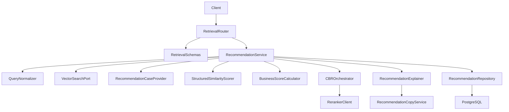
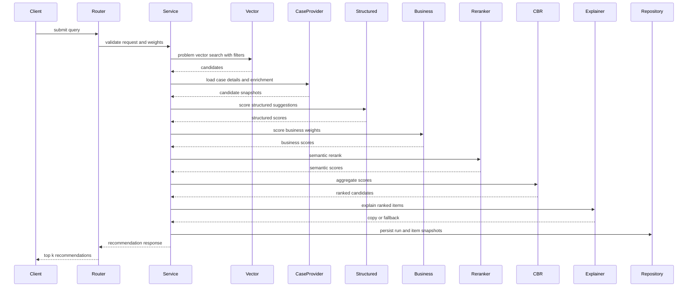
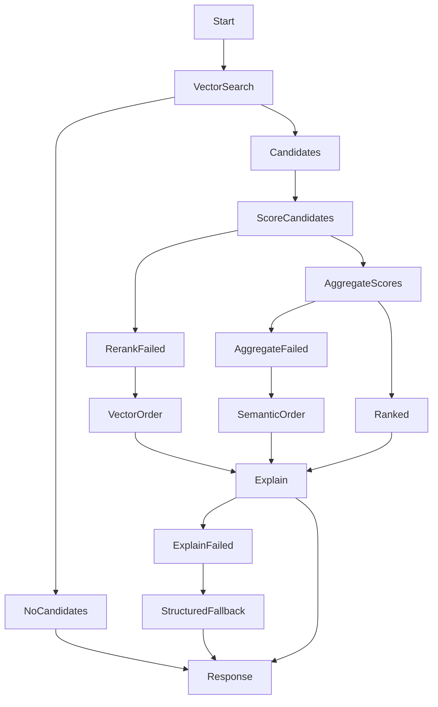
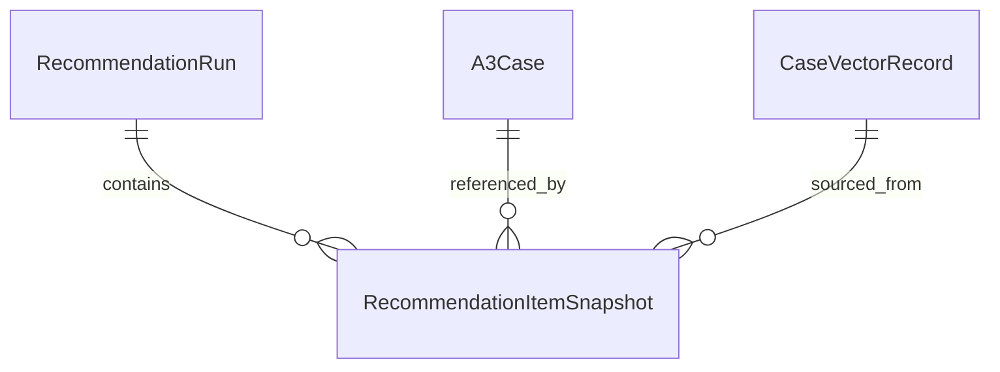
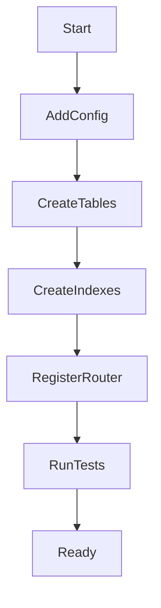

# Design Document

## Overview

`cbr-retrieval-recommendation` 在问题侧向量索引之上提供混合式案例推理（Hybrid CBR）推荐编排。它接收用户当前问题、基础过滤条件和可选业务权重参数，生成问题摘要或标准化查询，消费 `case-vector-indexing` 的问题语义向量候选，补齐候选详情和 `CaseEnrichmentResult.structured_suggestions` 后，计算结构化局部相似度、远程 reranker 语义相似度和业务参数分，并通过 CBRKit 适配层加权聚合，最终返回可解释、可追溯的 Top-K 相似案例。

本设计延续 Python + FastAPI + PostgreSQL 后端路线。推荐服务定义自己的查询、候选、评分、运行记录和响应契约；CBRKit 只处理向量搜索已返回的候选集，不从全量 SQL casebase 独立发起检索，不拥有持久化模型，也不向外泄漏内部对象。推荐解释优先消费 `llm-case-enrichment` 的推荐文案能力，失败时按结构化候选信息降级。

### Goals

- 提供手动相似案例检索入口，支持 Top-K、结构化过滤、业务权重参数和空结果元数据。
- 消费问题侧向量搜索原语并保留候选来源、向量分值和索引版本。
- 使用 `qwen3-reranker-8b` 生成纯语义相似度分值，并基于 `structured_suggestions` 计算结构化局部相似度。
- 使用 CBRKit 在候选集内聚合语义分、结构化局部相似度和业务参数分，得到最终排序。
- 组装包含案例引用、核心步骤、分值明细、推荐理由和注意事项的响应。
- 保存推荐运行和推荐项引用，供后续反馈规格关联，不吸收反馈持久化。

### Non-Goals

- 不实现 A3 案例 CRUD、案例基础字段生命周期或复杂权限。
- 不生成或维护 embedding、pgvector 向量表、向量粗检索 SQL 和索引状态。
- 不生成 LLM 案例摘要、标签建议或长期推荐文案结果。
- 不保存有用/无用、评分、采纳状态或反馈学习排序。
- 不实现前端页面、自动推送渠道、经营指标触发、巡检触发、行业库加权或多轮追问。

## Boundary Commitments

### This Spec Owns

- `RetrievalQuery`、`RecommendationRun`、`RecommendationItemSnapshot`、评分明细和对外推荐响应契约。
- 查询输入摘要/标准化、过滤条件校验、业务权重校验和实际过滤条件回显。
- 向量搜索候选消费、候选详情补齐、结构化局部相似度、业务参数分、CBRKit 聚合适配、远程 reranker 调用和降级排序。
- 推荐结果组装：分值明细、最终排序位置、案例引用、核心步骤、解释状态和来源引用。
- 推荐运行可观测性：运行标识、候选数量、模型 id、耗时、错误和降级状态。

### Out of Boundary

- `A3Case` 基础实体、案例创建、编辑、详情和列表查询。
- `CaseEnrichmentResult` 的生成、审核、持久化和过期判断。
- `CaseVectorRecord`、embedding 生成、pgvector 索引、向量刷新、查询向量生成和搜索底层实现。
- 推荐反馈保存、采纳状态、评分、有用/无用和学习排序。
- 前端 UI、自动消息推送、行业库高权重候选搜索和复杂多轮问答。

### Allowed Dependencies

- `a3-case-management` 的案例读取契约：`case_id`、基础 A3 字段、状态、过滤字段、解决步骤、效果结果、`updated_at`。
- `llm-case-enrichment` 的 `RecommendationCopyService` 或等价 API，用于解释已排序候选，且不得改变排序。
- `case-vector-indexing` 的 `VectorSearchService` 或 `/api/vector-search`：标准化用户问题、过滤条件、Top-K 问题语义候选、向量分值和索引元数据。
- Python 3.11+、FastAPI、Pydantic、SQLAlchemy、Alembic、pytest。
- CBRKit 作为候选集内的可替换编排/重排适配库；远程 reranker 默认 model `qwen3-reranker-8b`，并使用独立 `provider/model/base_url`。

### Revalidation Triggers

- 上游案例过滤字段、状态语义、详情响应、解决步骤或效果字段变化。
- 向量搜索请求/响应、候选分值语义、索引状态、问题侧向量输入策略或过滤字段变化。
- 推荐文案接口的请求/响应、候选顺序保证或失败语义变化。
- CBRKit 适配 API、reranker `provider/model/base_url`、分值范围或供应商响应格式变化。
- 下游反馈规格需要改变 `recommendation_run_id` 或 `recommendation_item_id` 引用契约。

## Architecture

### Existing Architecture Analysis

前置规格计划建立 `backend/app/cases`、`backend/app/enrichment`、`backend/app/vector_indexing`、统一配置、错误映射、数据库会话和迁移基础。本规格新增 `backend/app/retrieval`，只通过公开服务或 API 端口读取上游能力，不直接修改上游表或内部状态。

### Architecture Pattern & Boundary Map



**Architecture Integration**:
- Selected pattern: 轻量分层 FastAPI 模块 + Ports/Adapters。领域服务使用系统契约；CBRKit、向量搜索、推荐文案、结构化局部评分、业务评分和 reranker 都通过端口或独立服务隔离。
- Domain/feature boundaries: `RecommendationService` 拥有检索推荐流程；`VectorSearchPort` 只消费候选；`StructuredSimilarityScorer` 和 `BusinessScoreCalculator` 只生成评分明细；`RecommendationExplainer` 只生成解释，不改变排序。
- Existing patterns preserved: 复用上游 FastAPI、Pydantic、SQLAlchemy/Alembic、统一错误响应、数据库会话和隐私日志策略。
- New components rationale: 推荐需要独立记录运行、隔离 CBRKit、隔离 reranker 供应商差异，显式保存业务参数分和结构化局部相似度，并防止推荐解释与排序职责混淆。
- Dependency direction: `Config → Schemas → Ports → Orchestrator → Repository → Service → Router`。`retrieval` 可以读取 `cases`、`vector_indexing`、`enrichment` 的公开契约，但不得反向修改它们。

### Technology Stack

| Layer | Choice / Version | Role in Feature | Notes |
|-------|------------------|-----------------|-------|
| Backend / Services | Python 3.11+ + FastAPI | 暴露检索推荐 API | 延续前置规格 |
| Validation | Pydantic | 查询、过滤、候选、响应和错误 schema | 强类型边界 |
| Data / Storage | PostgreSQL | 保存推荐运行和推荐项快照 | 不保存向量数组或反馈 |
| ORM / Migration | SQLAlchemy + Alembic | 新增推荐运行表和索引 | 不修改上游表 |
| CBR Orchestration | CBRKit via adapter | 向量搜索已返回候选的编排和重排流程封装 | 可替换，不从全量 casebase 独立检索，不泄漏内部对象 |
| External AI | Remote reranker `qwen3-reranker-8b` | 候选相关性精排 | 通过 `RerankerClient` 适配 |
| Testing | pytest + FastAPI TestClient | 单元、API、降级和集成测试 | 外部依赖使用 fake client |

## File Structure Plan

### Directory Structure

```text
backend/
├── app/
│   ├── core/
│   │   ├── config.py                         # 增加 retrieval、CBRKit、reranker、Top-K、超时和隐私配置
│   │   └── errors.py                         # 增加 RETRIEVAL_*、RERANKER_*、CBR_* 错误码
│   ├── db/
│   │   └── base.py                           # 纳入 retrieval ORM metadata
│   ├── cases/
│   │   └── service.py                        # 被 RecommendationCaseProvider 读取案例详情
│   ├── enrichment/
│   │   └── recommendation_copy.py            # 被 RecommendationExplainer 调用
│   ├── vector_indexing/
│   │   └── search.py                         # 被 VectorSearchPort 调用
│   └── retrieval/
│       ├── models.py                         # 推荐运行、推荐项快照和状态枚举 ORM 模型
│       ├── schemas.py                        # 检索请求、过滤、候选、响应和错误 schema
│       ├── query.py                          # 查询摘要/标准化、Top-K、过滤条件和业务权重校验
│       ├── vector_port.py                    # 向量搜索端口和候选原语映射
│       ├── case_provider.py                  # 推荐项所需案例详情补齐
│       ├── structured_similarity.py          # structured_suggestions 局部相似度评分
│       ├── business_scoring.py               # 业态、门店等级、时间等业务参数分
│       ├── cbr_orchestrator.py               # CBRKit 候选集适配和加权聚合端口
│       ├── reranker_client.py                # qwen3-reranker-8b 远程重排适配
│       ├── explainer.py                      # 调用推荐文案并生成降级解释
│       ├── repository.py                     # 推荐运行、候选分值和降级状态持久化
│       ├── service.py                        # 端到端检索推荐流程编排
│       └── router.py                         # 相似案例推荐 API 端点
├── alembic/
│   └── versions/
│       └── <revision>_create_recommendation_runs.py
└── tests/
    └── retrieval/
        ├── test_query_validation.py          # 查询、过滤和 Top-K 校验测试
        ├── test_vector_port.py               # 向量候选映射、空结果和失败测试
        ├── test_reranker_client.py           # reranker 分值、错误和超时映射测试
        ├── test_cbr_orchestrator.py          # CBRKit 适配和降级排序测试
        ├── test_recommendation_service.py    # 端到端组装、缺失字段和运行记录测试
        ├── test_retrieval_api.py             # API 成功、空结果、降级和错误响应测试
        └── test_retrieval_privacy.py         # 日志和运行记录敏感信息边界测试
```

### Modified Files

- `backend/app/main.py` — 仅追加注册 `RetrievalRouter`，不改写应用入口基础实现。
- `backend/app/core/config.py` — 仅追加推荐检索开关、Top-K 上限、CBRKit、reranker provider/model/base_url、超时、重试和隐私配置值，不拥有共享配置基础设施。
- `backend/app/core/errors.py` — 仅追加检索推荐、CBR 编排和 reranker 错误码映射，不拥有 `ErrorMapper` 基础实现。
- `backend/app/db/base.py` — 仅追加导入 `retrieval` ORM metadata，不拥有数据库基础设施。
- `backend/app/vector_indexing/search.py` — 不改变向量搜索契约，仅供 `VectorSearchPort` 调用。
- `backend/app/enrichment/recommendation_copy.py` — 不改变文案契约，仅供 `RecommendationExplainer` 调用。
- `backend/app/cases/service.py` — 不改变案例契约，仅供 `RecommendationCaseProvider` 读取详情。

## System Flows

### 推荐检索流程



### 降级流程



## Requirements Traceability

| Requirement | Summary | Components | Interfaces | Flows |
|-------------|---------|------------|------------|-------|
| 1.1 | 接收问题、Top-K、过滤和业务权重 | RetrievalRouter, RetrievalSchemas | RecommendationRequest | 推荐检索流程 |
| 1.2 | 支持基础硬过滤字段 | QueryNormalizer, RetrievalSchemas | RetrievalFilters | 推荐检索流程 |
| 1.3 | 查询与过滤错误 | QueryNormalizer, ErrorMapper | ValidationErrorResponse | 推荐检索流程 |
| 1.4 | 无命中过滤结果 | RecommendationService, VectorSearchPort | RecommendationResponse | 降级流程 |
| 1.5 | 回显规范化过滤 | RetrievalSchemas | AppliedFilters | 推荐检索流程 |
| 1.6 | 查询摘要/标准化 | QueryNormalizer | NormalizedRetrievalQuery | 推荐检索流程 |
| 2.1 | 调用问题语义向量搜索候选 | VectorSearchPort | VectorSearchRequest | 推荐检索流程 |
| 2.2 | 只用可检索候选 | VectorSearchPort, RecommendationService | VectorCandidate | 推荐检索流程 |
| 2.3 | 向量空候选 | RecommendationService | NoHitMetadata | 降级流程 |
| 2.4 | 向量搜索失败 | VectorSearchPort, ErrorMapper | RETRIEVAL_VECTOR_FAILED | 降级流程 |
| 2.5 | 保留候选来源 | RecommendationRepository | RecommendationRun | 推荐检索流程 |
| 3.1 | 语义精排 | RerankerClient | RerankRequest | 推荐检索流程 |
| 3.2 | 结构化局部相似度 | StructuredSimilarityScorer | StructuredSimilarityScore | 推荐检索流程 |
| 3.3 | 候选不足 | RecommendationService | RecommendationMetadata | 降级流程 |
| 3.4 | 重排失败降级 | RerankerClient, RecommendationService | DegradedRanking | 降级流程 |
| 3.5 | 业务参数分 | BusinessScoreCalculator | BusinessScore | 推荐检索流程 |
| 3.6 | 不使用反馈排序 | RecommendationService | module boundary | 推荐检索流程 |
| 4.1 | CBRKit 聚合评分 | CBROrchestrator | AggregateScoreRequest | 推荐检索流程 |
| 4.2 | 默认权重和请求权重 | QueryNormalizer, CBROrchestrator | ScoreWeights | 推荐检索流程 |
| 4.3 | 保留分值明细 | RetrievalSchemas, RecommendationRepository | RecommendationItem | 推荐检索流程 |
| 4.4 | 聚合失败降级 | CBROrchestrator, RecommendationService | DegradedRanking | 降级流程 |
| 4.5 | CBRKit 不重新检索 | CBROrchestrator | module boundary | 推荐检索流程 |
| 5.1 | 返回 Top-K 推荐 | RecommendationService | RecommendationResponse | 推荐检索流程 |
| 5.2 | 推荐项字段 | RecommendationCaseProvider, RetrievalSchemas | RecommendationItem | 推荐检索流程 |
| 5.3 | 保留引用关系 | RecommendationRepository | RecommendationItemSnapshot | 推荐检索流程 |
| 5.4 | 缺失字段标记 | RecommendationCaseProvider, RecommendationExplainer | MissingFieldInfo | 降级流程 |
| 5.5 | 不写回上游 | RecommendationService | module boundary | 推荐检索流程 |
| 6.1 | 返回推荐理由 | RecommendationExplainer | ExplanationResult | 推荐检索流程 |
| 6.2 | 解释不改排序 | RecommendationExplainer | RecommendationCopyRequest | 推荐检索流程 |
| 6.3 | 文案失败降级 | RecommendationExplainer | FallbackExplanation | 降级流程 |
| 6.4 | 区分分值和说明 | RetrievalSchemas | RecommendationItem | 推荐检索流程 |
| 6.5 | 避免黑盒推荐 | RecommendationService, RetrievalSchemas | TraceableRecommendation | 推荐检索流程 |
| 7.1 | 运行记录 | RecommendationRepository | RecommendationRun | 推荐检索流程 |
| 7.2 | 反馈引用标识 | RetrievalSchemas, RecommendationRepository | run and item IDs | 推荐检索流程 |
| 7.3 | 模型状态和耗时 | RerankerClient, RecommendationRepository | RerankMetadata | 推荐检索流程 |
| 7.4 | 配置失败和供应商失败 | RerankerClient, RecommendationExplainer, ErrorMapper | DegradedStatus | 降级流程 |
| 7.5 | 敏感信息保护 | RecommendationRepository, ErrorMapper | SafeLogContext | 全部流程 |

## Components and Interfaces

| Component | Domain/Layer | Intent | Req Coverage | Key Dependencies | Contracts |
|-----------|--------------|--------|--------------|------------------|-----------|
| RetrievalRouter | API | 暴露相似案例推荐入口 | 1.1, 1.3, 5.1, 7.2 | RecommendationService P0 | API |
| RetrievalSchemas | API/Data Contract | 定义请求、过滤、权重、候选、评分、响应和状态 | 1.1, 1.5, 3.5, 4.3, 5.2, 6.4 | Pydantic P0 | API, State |
| QueryNormalizer | Domain Service | 标准化查询、Top-K、过滤条件和业务权重 | 1.2, 1.3, 1.6, 4.2 | Config P0 | Service |
| VectorSearchPort | Integration | 调用问题语义向量搜索并映射候选原语 | 2.1, 2.2, 2.4 | VectorSearchService P0 | Service |
| RecommendationCaseProvider | Integration | 补齐推荐展示、精排和结构化评分所需案例快照 | 3.2, 5.2, 5.4 | CaseService P0, EnrichmentRepository P1 | Service |
| StructuredSimilarityScorer | Domain Service | 基于 `structured_suggestions` 计算局部相似度 | 3.2, 7.4 | CaseEnrichmentResult P1 | Service |
| BusinessScoreCalculator | Domain Service | 根据业务权重和候选业务字段计算业务参数分 | 3.5, 7.4 | Config P0 | Service |
| CBROrchestrator | Domain Service | 封装 CBRKit 在候选集内的加权聚合流程 | 4.1, 4.2, 4.4, 4.5 | CBRKit P1 | Service |
| RerankerClient | External Adapter | 调用 `qwen3-reranker-8b` 并归一化纯语义分值 | 3.1, 7.3, 7.4 | Remote reranker P0 | Service |
| RecommendationExplainer | Domain Service | 获取推荐文案或生成结构化降级解释 | 6.1, 6.2, 6.3 | RecommendationCopyService P1 | Service |
| RecommendationRepository | Data Access | 保存推荐运行、候选快照、评分明细和状态 | 2.5, 4.3, 5.3, 7.1, 7.5 | PostgreSQL P0 | Service, State |
| RecommendationService | Application Service | 编排端到端检索、评分、聚合、解释和持久化 | 1.4, 2.3, 3.3, 4.1, 5.1, 5.5, 6.5 | all core components P0 | Service |
| ErrorMapper | API Support | 输出稳定错误码并脱敏日志 | 1.3, 2.4, 7.4, 7.5 | FastAPI P0 | API |

### API Layer

#### RetrievalRouter

| Field | Detail |
|-------|--------|
| Intent | 提供手动相似案例推荐 HTTP 入口 |
| Requirements | 1.1, 1.3, 4.1, 6.2 |

**API Contract**

| Method | Endpoint | Request | Response | Errors |
|--------|----------|---------|----------|--------|
| POST | `/api/recommendations/similar-cases` | `RecommendationRequest` | `RecommendationResponse` | 422, 503 |
| GET | `/api/recommendations/runs/{run_id}` | path `run_id` | `RecommendationRunResponse` | 404 |

**Implementation Notes**
- POST 端点始终返回 `recommendation_run_id`，包括空候选和降级成功响应。
- GET 端点只返回运行状态和候选快照元数据，不返回完整查询原文或完整案例正文。

### Domain Layer

#### RecommendationService

| Field | Detail |
|-------|--------|
| Intent | 端到端编排检索推荐流程 |
| Requirements | 1.4, 2.3, 3.3, 4.1, 4.5, 5.5, 6.1 |

**Service Interface**

```python
class RecommendationService:
    def recommend_similar_cases(self, request: RecommendationRequest) -> RecommendationResponse: ...
    def get_run(self, run_id: str) -> RecommendationRunResponse: ...
```

- Preconditions: 查询请求已通过 schema 解析；向量搜索配置和推荐配置可用。
- Postconditions: 成功、空结果或降级响应均保存运行记录。
- Invariants: 不写回案例、LLM 派生结果、向量记录或反馈表；解释失败不改变排序。

#### QueryNormalizer

| Field | Detail |
|-------|--------|
| Intent | 统一查询和过滤输入 |
| Requirements | 1.1, 1.2, 1.3, 1.5 |

**Service Interface**

```python
class QueryNormalizer:
    def normalize(self, request: RecommendationRequest) -> NormalizedRetrievalQuery: ...
```

- 校验 `query_text` 非空、`top_k` 在配置范围内。
- 生成或接收用户问题摘要/标准化查询文本，作为向量搜索和 reranker 的统一查询输入。
- 过滤字段映射到向量搜索契约，保留应用后的过滤条件。
- 校验业务权重参数在配置范围内，未提供时使用默认权重。
- 对暂未支持的过滤字段返回字段级错误，不静默忽略。

#### StructuredSimilarityScorer

| Field | Detail |
|-------|--------|
| Intent | 基于结构化派生结果计算局部相似度 |
| Requirements | 3.2, 7.4 |

**Service Interface**

```python
class StructuredSimilarityScorer:
    def score(self, query: NormalizedRetrievalQuery, candidates: list[CandidateSnapshot]) -> list[StructuredSimilarityScore]: ...
```

- 输入来自当前问题的标准化结构和候选 `CaseEnrichmentResult.structured_suggestions`。
- MVP 可返回 `skipped` 状态和空分值，但 schema、运行记录和响应必须预留该评分项。
- 不生成 embedding，不改变候选集合，只输出可解释的局部相似度明细。

#### BusinessScoreCalculator

| Field | Detail |
|-------|--------|
| Intent | 计算业务参数适配分 |
| Requirements | 3.5, 4.2, 7.4 |

**Service Interface**

```python
class BusinessScoreCalculator:
    def score(self, query: NormalizedRetrievalQuery, candidates: list[CandidateSnapshot]) -> list[BusinessScore]: ...
```

- 支持相同业态、相近门店等级、同品牌、时间接近度等可配置评分因子。
- 请求可在受控范围内调整业务权重；超出范围返回字段级错误。
- 输出业务参数分和每个因子的贡献明细，供 CBRKit 聚合和响应解释使用。

#### CBROrchestrator

| Field | Detail |
|-------|--------|
| Intent | 封装 CBRKit 候选集适配与加权聚合流程 |
| Requirements | 4.1, 4.2, 4.4, 4.5 |

**Service Interface**

```python
class CBROrchestrator:
    def aggregate(self, query: NormalizedRetrievalQuery, candidates: list[ScoredCandidate]) -> AggregateRankingResult: ...
```

- Preconditions: 候选来自 `VectorSearchPort`，并已带有向量相似度、reranker 语义分、结构化局部相似度和业务参数分。
- Postconditions: 返回保持候选来源的最终排序、聚合分和权重元数据；失败时返回降级原因。
- Invariants: CBRKit 只处理传入候选集，不从全量 SQL casebase 重新检索；其内部对象不进入数据库和 API 响应；不读取反馈数据。

#### RecommendationExplainer

| Field | Detail |
|-------|--------|
| Intent | 为已排序候选生成解释或降级说明 |
| Requirements | 5.1, 5.2, 5.3, 5.4, 5.5 |

**Service Interface**

```python
class RecommendationExplainer:
    def explain(self, query: NormalizedRetrievalQuery, ranked: list[RerankedCandidate]) -> ExplanationResult: ...
```

- 调用 `RecommendationCopyService` 时保持输入候选顺序和 `case_id`。
- 文案失败时生成结构化降级解释：推荐理由状态、可用字段、缺失字段、注意事项占位。
- 不返回任何排序修改或新增候选。

### Integration and External Adapters

#### VectorSearchPort

| Field | Detail |
|-------|--------|
| Intent | 消费向量搜索原语 |
| Requirements | 2.1, 2.2, 2.3, 2.4, 2.5 |

**Service Interface**

```python
class VectorSearchPort:
    def search(self, query: NormalizedRetrievalQuery) -> VectorCandidateBatch: ...
```

- Input maps to `VectorSearchRequest` with `query_text`、`top_k` and filters.
- Output includes candidate `case_id`、`vector_id`、`similarity_score`、`distance`、`case_updated_at`、`input_content_hash` and filter metadata.
- Errors map to `RETRIEVAL_VECTOR_FAILED`、`RETRIEVAL_VECTOR_TIMEOUT` or validation errors.

#### RerankerClient

| Field | Detail |
|-------|--------|
| Intent | 调用远程 reranker 并统一响应 |
| Requirements | 3.1, 3.2, 3.4, 6.3, 6.4 |

**Service Interface**

```python
class RerankerClient:
    def rerank(self, request: RerankRequest) -> RerankResponse: ...
```

- Default config: `provider`、`model_id="qwen3-reranker-8b"`、`base_url`、timeout、max_candidates、privacy_acknowledged；仅用于 Reranker，不复用 LLM 或 Embedding 配置。
- Input: 标准化查询文本、可选 instruction、按向量候选顺序排列的候选问题画像文档和 `case_id`。
- Output: one semantic relevance score per input candidate, normalized to `0..1` when provider supports it; raw score kept in metadata when needed.
- Errors: `RERANKER_TIMEOUT`、`RERANKER_RATE_LIMITED`、`RERANKER_PROVIDER_ERROR`、`RERANKER_INVALID_RESPONSE`、`RERANKER_CONFIG_MISSING`。

### Data Layer

#### RecommendationRepository

| Field | Detail |
|-------|--------|
| Intent | 保存推荐运行和推荐项快照 |
| Requirements | 2.5, 4.3, 6.1, 6.2, 6.5 |

**Service Interface**

```python
class RecommendationRepository:
    def create_run(self, run: RecommendationRunCreate) -> RecommendationRunRecord: ...
    def complete_run(self, run_id: str, result: RecommendationRunResult) -> RecommendationRunRecord: ...
    def fail_run(self, run_id: str, error: RecommendationErrorData) -> RecommendationRunRecord: ...
    def get_run(self, run_id: str) -> RecommendationRunRecord | None: ...
```

- 保存查询哈希和过滤条件，不保存完整查询原文。
- 保存候选引用、分值和状态，不保存向量数组或完整案例正文。
- 数据库异常映射为稳定系统错误，不暴露 SQL 或供应商细节。

## Data Models

### Domain Model



`RecommendationRun` 是本规格的运行聚合根。`A3Case` 和 `CaseVectorRecord` 由上游拥有，推荐项只保存引用、分值、状态和必要快照，供响应和反馈关联。

### Logical Data Model

**RecommendationRun**

| Field | Type | Required | Notes |
|-------|------|----------|-------|
| `recommendation_run_id` | string | yes | 推荐运行标识 |
| `query_text_hash` | string | yes | 查询文本哈希 |
| `applied_filters` | object | yes | 规范化过滤条件 |
| `score_weights` | object | yes | 语义分、结构化局部相似度和业务分的聚合权重 |
| `requested_top_k` | integer | yes | 请求数量 |
| `returned_count` | integer | yes | 返回数量 |
| `vector_candidate_count` | integer | yes | 向量候选数量 |
| `status` | enum | yes | `succeeded`, `empty`, `degraded`, `failed` |
| `degraded_reason` | string | no | 降级原因 |
| `reranker_model_id` | string | yes | 默认 `qwen3-reranker-8b` |
| `reranker_status` | string | yes | `succeeded`, `failed`, `skipped` |
| `aggregation_status` | string | yes | `succeeded`, `failed`, `skipped` |
| `latency_ms` | integer | yes | 总耗时 |
| `created_at` | datetime | yes | 创建时间 |
| `updated_at` | datetime | yes | 更新时间 |

**RecommendationItemSnapshot**

| Field | Type | Required | Notes |
|-------|------|----------|-------|
| `recommendation_item_id` | string | yes | 下游反馈引用 |
| `recommendation_run_id` | string | yes | 所属运行 |
| `case_id` | string | yes | 上游案例标识 |
| `vector_id` | string | yes | 向量候选来源 |
| `rank` | integer | yes | 最终排序 |
| `vector_similarity_score` | float | yes | 向量相似度 |
| `semantic_similarity_score` | float | no | reranker 纯语义相似度，降级时为空 |
| `structured_similarity_score` | float | no | 结构化局部相似度，MVP 可为空或 skipped |
| `business_score` | float | no | 业务参数分 |
| `final_score` | float | yes | CBRKit 聚合后的最终排序分 |
| `score_breakdown` | object | yes | 分值来源、权重和因子贡献 |
| `explanation_status` | enum | yes | `generated`, `fallback`, `unavailable` |
| `missing_fields` | array | yes | 候选缺失字段 |
| `case_updated_at` | datetime | yes | 候选案例版本 |
| `created_at` | datetime | yes | 创建时间 |

### Physical Data Model

**Table: `recommendation_runs`**

| Column | Type | Constraint |
|--------|------|------------|
| `recommendation_run_id` | varchar(64) | primary key |
| `query_text_hash` | varchar(128) | not null |
| `applied_filters` | jsonb | not null |
| `score_weights` | jsonb | not null |
| `requested_top_k` | integer | not null |
| `returned_count` | integer | not null |
| `vector_candidate_count` | integer | not null |
| `status` | varchar(32) | not null |
| `degraded_reason` | varchar(128) | nullable |
| `reranker_model_id` | varchar(128) | not null |
| `reranker_status` | varchar(32) | not null |
| `aggregation_status` | varchar(32) | not null |
| `latency_ms` | integer | not null |
| `created_at` | timestamptz | not null |
| `updated_at` | timestamptz | not null |

**Table: `recommendation_item_snapshots`**

| Column | Type | Constraint |
|--------|------|------------|
| `recommendation_item_id` | varchar(64) | primary key |
| `recommendation_run_id` | varchar(64) | not null |
| `case_id` | varchar(64) | not null |
| `vector_id` | varchar(64) | not null |
| `rank` | integer | not null |
| `vector_similarity_score` | double precision | not null |
| `semantic_similarity_score` | double precision | nullable |
| `structured_similarity_score` | double precision | nullable |
| `business_score` | double precision | nullable |
| `final_score` | double precision | not null |
| `score_breakdown` | jsonb | not null |
| `explanation_status` | varchar(32) | not null |
| `missing_fields` | jsonb | not null |
| `case_updated_at` | timestamptz | not null |
| `created_at` | timestamptz | not null |

**Indexes**
- `recommendation_runs`: `created_at`, `status`, `query_text_hash`
- `recommendation_item_snapshots`: `recommendation_run_id`, `case_id`, `(recommendation_run_id, rank)`

### Data Contracts & Integration

**RecommendationRequest**
- `query_text`: required non-empty text.
- `top_k`: positive integer bounded by config.
- `filters`: optional `brand_id`, `store_id`, `problem_type`, `tags`, `case_status` or upstream `status`, `created_at_from`, `created_at_to`.
- `business_weights`: optional weights for business factors such as business type, store tier, brand affinity and recency; bounded by config.

**RecommendationResponse**
- `recommendation_run_id`
- `status`: `succeeded`, `empty`, `degraded`, `failed`
- `applied_filters`
- `score_weights`: effective aggregation weights.
- `query_metadata`: query hash, requested Top-K, candidate count, returned count, latency.
- `items`: ordered `RecommendationItem`.
- `degraded_reason`: optional.

**RecommendationItem**
- `recommendation_item_id`, `case_id`, `rank`
- `case_reference`: title/description preview, brand/store/filter summary, `case_updated_at`
- `core_solution_steps`, `outcome_summary`, `structured_suggestions_summary`, `missing_fields`
- `vector_similarity_score`, `semantic_similarity_score`, `structured_similarity_score`, `business_score`, `final_score`, `score_metadata`
- `recommendation_reason`, `reference_points`, `cautions`, `source_references`, `explanation_status`

## Error Handling

### Error Strategy

- 输入错误在调用向量搜索前返回字段级 422。
- 向量搜索失败导致请求失败，因为没有可信候选来源；推荐服务不直接查询 pgvector 兜底。
- Reranker 失败不伪造分值，降级到向量顺序并标记状态。
- 推荐解释失败不改变候选，返回结构化降级解释。
- 运行记录和日志只保留哈希、标识、状态、分值和错误码。

### Error Categories and Responses

- **User Errors (4xx)**: 空查询、Top-K 越界、无效过滤字段、无效时间范围。
- **Business Logic Errors (409/422)**: 候选详情不可用、候选引用不一致、推荐运行不存在。
- **External Dependency Errors (503)**: 向量搜索不可用、reranker 超时或供应商失败、推荐文案服务失败。
- **System Errors (5xx)**: 数据库连接、事务持久化或未知运行时错误。

### Monitoring

- Logs: request accepted, vector searched, case snapshots loaded, rerank started, rerank completed, explanation completed, run persisted.
- Metrics: search latency, rerank latency, explanation latency, empty result rate, rerank degradation rate, explanation fallback rate, error rate by dependency.
- Logs and error responses include `recommendation_run_id`、错误码、模型 id 和状态，不包含完整问题原文、完整案例正文、向量数组或供应商原始错误。

## Testing Strategy

### Unit Tests

- `QueryNormalizer` 拒绝空查询、Top-K 越界、无效过滤字段和越界业务权重，并回显规范化过滤与有效权重。
- `StructuredSimilarityScorer` 基于 `structured_suggestions` 输出局部相似度，MVP skipped 时也返回稳定元数据。
- `BusinessScoreCalculator` 按业态、门店等级、品牌和时间等因子输出业务参数分和贡献明细。
- `VectorSearchPort` 正确映射向量候选、空候选和向量搜索失败。
- `RerankerClient` 映射成功分值、超时、限流、供应商失败和响应格式错误。
- `CBROrchestrator` 只对传入候选集聚合排序；聚合成功时返回最终分，聚合失败时按语义精排或向量候选原始顺序降级。
- `RecommendationExplainer` 保持候选顺序，文案失败时返回结构化降级解释。

### Integration Tests

- POST `/api/recommendations/similar-cases` 在 fake vector、fake reranker 和 fake copy service 下返回 Top-K 推荐项。
- 向量搜索返回空结果时，响应包含空列表、运行标识和未命中元数据。
- Reranker 失败时，响应状态为 degraded，候选按向量顺序或业务分降级返回且 `semantic_similarity_score` 为空。
- CBRKit 聚合失败时，响应状态为 degraded，保留语义分、业务分和结构化分，`final_score` 使用降级规则生成并标记来源。
- 候选缺少摘要、步骤或效果字段时，推荐项保留候选并返回 `missing_fields`。
- GET `/api/recommendations/runs/{run_id}` 返回运行和候选快照元数据。

### Contract and Boundary Tests

- 推荐响应包含 `recommendation_run_id`、`recommendation_item_id`、分值明细和权重元数据，可被反馈规格引用。
- 推荐服务不写入 `a3_cases`、`case_enrichment_results`、`case_vectors` 或反馈表。
- 推荐文案输出不能新增候选、删除候选或改变候选排序。
- CBRKit 内部对象不进入数据库记录或 API 响应。

### Security and Privacy Tests

- 日志、错误响应和运行记录不包含完整问题原文、完整案例正文、完整向量数组或供应商原始响应。
- 生产 reranker 配置缺少 provider、model、base_url、超时、凭据来源或隐私确认时 fail closed。
- 外发 reranker payload 只包含查询和候选重排所需文本，不包含反馈、向量数组或未授权字段。

### Performance / Load

- `top_k` 和 reranker `max_candidates` 受配置限制，避免无界候选重排。
- 推荐接口在 reranker 超时后按配置降级，不无限等待外部供应商。
- 常用运行查询通过 `recommendation_run_id` 和 `(recommendation_run_id, rank)` 索引完成。

## Security Considerations

- 当前问题和案例内容视为敏感业务数据，日志只保存哈希、标识和状态。
- Reranker 和推荐文案请求必须裁剪为任务最小输入。
- 供应商配置需要显式确认数据保留和隐私策略，缺失时生产调用失败关闭。
- 错误响应不暴露供应商原始错误、数据库异常、提示词或候选全文。

## Performance & Scalability

- MVP 默认同步完成向量候选消费、重排和解释；超时后按可定义路径降级。
- 候选向量搜索数量应高于返回 Top-K 但受配置上限控制，例如 `candidate_top_k` 与 `return_top_k` 分离。
- 运行记录保存轻量快照，避免把完整案例正文复制到推荐表。
- 若后续需要异步推荐或批量推送，可在保持 API 响应契约的前提下扩展任务队列；本规格不实现。

## Migration Strategy



迁移新增 `recommendation_runs` 和 `recommendation_item_snapshots` 表及索引，不修改案例、LLM 派生、向量或反馈表。回滚应删除本规格新增表；若已有反馈规格引用推荐运行，回滚前必须先停用反馈写入或迁移引用。
