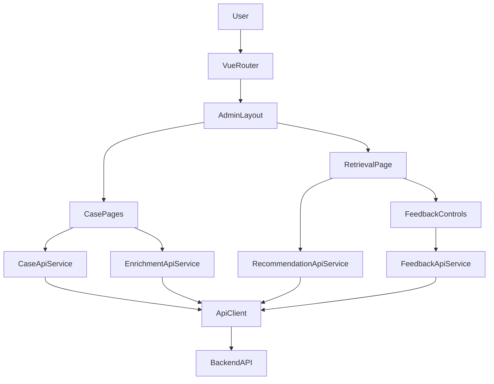
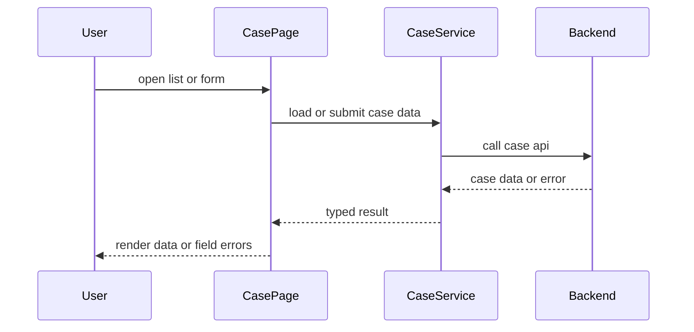
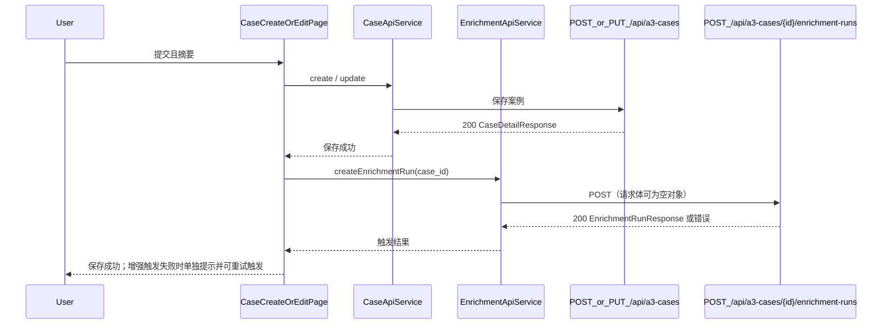
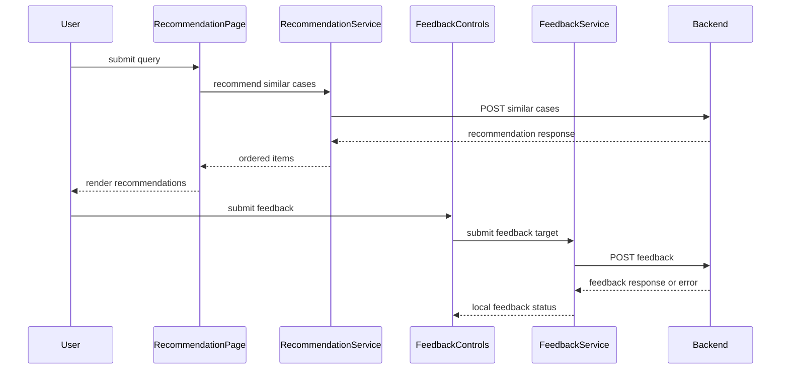
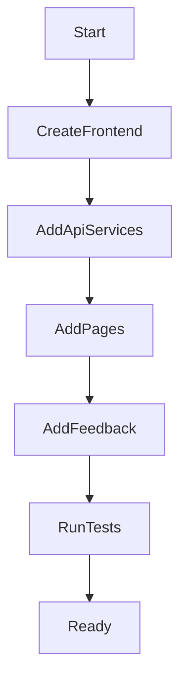

# Design Document

## Overview

`mvp-admin-frontend` 提供 Vue 3 基础后台页面，让业务、产品、督导和后台验证人员可以完成案例录入、案例查看、相似案例检索、推荐结果观察和反馈提交。该前端是 MVP 闭环的操作入口，不拥有任何后端业务规则、持久化、检索排序、LLM 生成或反馈学习职责。

当前仓库没有 `frontend/` 应用代码。本设计新建一个轻量 Vue 3 + TypeScript 前端应用，集中封装上游案例、推荐和反馈 API 契约，并按页面边界组织案例管理、推荐展示和反馈控件。

### Goals

- 建立 Vue 3 MVP 后台应用结构、路由、布局和基础状态处理。
- 提供案例列表、详情、创建和编辑页面。
- 在「提交且摘要」操作中协调案例保存（`a3-case-management`）与增强运行创建（`llm-case-enrichment`）：先完成 `POST /api/a3-cases` 或 `PUT /api/a3-cases/{case_id}`，成功后再调用 `POST /api/a3-cases/{case_id}/enrichment-runs`；不等待增强任务完成，也不轮询增强结果。
- 提供相似案例检索页面，展示后端返回的 Top-K 推荐、分值、解释和降级状态。
- 提供运行级和推荐项级反馈控件，反馈失败不影响推荐结果可见性。
- 用 TypeScript 类型和 API service 集中对齐上游契约。

### Non-Goals

- 不实现后端 API、数据库、向量索引、CBR 重排、LLM 文案生成或反馈持久化。
- 不实现复杂权限、品牌多租户、经营数据看板、消息推送、邮件推送或行业库审核。
- 不引入重型后台模板、复杂设计系统、离线缓存或移动端专属流程。
- 不在前端重新排序推荐、重新计算相似度或生成推荐理由。

## Boundary Commitments

### This Spec Owns

- `frontend/` Vue 3 应用脚手架、路由、基础布局和页面导航。
- 案例管理页面：列表、详情、创建、编辑和字段级错误展示。
- 检索推荐页面：查询表单、过滤条件、推荐响应展示、空结果和降级状态。
- 推荐反馈控件：运行级反馈和推荐项级反馈的提交状态。
- 前端 API 客户端、TypeScript 数据契约、基础错误/加载/空状态组件。

### Out of Boundary

- 案例基础数据模型、校验规则和持久化。
- LLM 摘要、结构化提取、标签建议、推荐文案生成和审核。
- embedding、pgvector、向量搜索、分数加权聚合、reranker 调用和推荐运行持久化。
- 推荐反馈保存、幂等规则、统计查询和学习排序。
- 复杂权限、菜单配置平台、经营指标看板、消息渠道和移动端深度适配。

### Allowed Dependencies

- `a3-case-management` API：`/api/a3-cases` 创建、编辑、详情和列表查询。
- `cbr-retrieval-recommendation` API：`/api/recommendations/similar-cases` 推荐检索。
- `recommendation-feedback` API：`/api/recommendation-feedback` 反馈提交。
- `llm-case-enrichment` API：仅消费「创建增强运行」等与后台管理相关的端点（当前 MVP 为 `POST /api/a3-cases/{case_id}/enrichment-runs`），用于在案例保存成功后触发异步增强；前端不实现摘要生成、校验或轮询，推荐页对增强产物的消费仍以后端聚合/详情契约为准。
- Vue 3、TypeScript、Vite、Vue Router；可选轻量状态管理库仅用于跨页面状态。

### Revalidation Triggers

- 上游 API 路径、请求字段、响应字段、枚举、状态或错误结构变化。
- `llm-case-enrichment` 中与案例表单联动的触发类端点（如 `enrichment-runs`）契约变化。
- 推荐响应中 `recommendation_run_id`、`recommendation_item_id`、分值或解释状态语义变化。
- 反馈提交字段、有用性或幂等规则变化。
- 产品要求新增权限、多租户、看板、消息推送或移动端优先体验。
- 前端技术栈从 Vue 3、Vite 或 TypeScript 迁移到其它方案。

## Architecture

### Existing Architecture Analysis

仓库当前尚无`backend/` 实现目录。上游规格已经规划 FastAPI 后端 API，本规格以前端消费者身份对齐这些契约。由于没有既有前端模式可继承，本设计采用最小可验证 Vue 3 单页后台应用。

### Architecture Pattern & Boundary Map



**Architecture Integration**:
- Selected pattern: Vue 3 单页应用 + 页面组件 + 领域 API service。页面负责交互，service 负责契约映射，通用组件负责状态展示。
- Domain/feature boundaries: 案例页面以 `CaseApiService` 为权威来源消费案例 CRUD；在用户显式选择「提交且摘要」时，由案例创建/编辑页在保存成功后调用 `EnrichmentApiService` 触发增强运行（与 `a3-case-management`、`llm-case-enrichment` 设计中的跨规格事务语义一致）。推荐页面只展示推荐响应；反馈控件只提交反馈，不改变推荐结果。
- Existing patterns preserved: 延续 roadmap 的 Vue 3 前端约束和 MVP 轻量原则。
- New components rationale: 需要集中 API 客户端和类型定义，避免页面直接散落后端字段。
- Dependency direction: `types → apiClient → domain api services → composables/stores → pages/components → router/app`。页面不得绕过 service 直接拼接上游契约。

### Technology Stack

| Layer | Choice / Version | Role in Feature | Notes |
|-------|------------------|-----------------|-------|
| Frontend | Vue 3 + TypeScript | 后台页面与组件开发 | 满足 roadmap |
| Build | Vite | 前端开发、构建和测试集成 | 新建轻量应用 |
| Routing | Vue Router | 案例、详情、表单、推荐页面路由 | MVP 基础导航 |
| State | Composition API + 可选轻量 store | 管理页面请求状态和当前推荐结果 | 避免复杂全局状态 |
| Styling | 原生 CSS 或轻量 scoped CSS | 基础布局、表单、表格和状态提示 | 不引入重型设计系统 |
| Testing | Vitest + Vue Test Utils | 组件、API 映射和页面交互测试 | E2E 可后续接入 Playwright |
| Type Generation | openapi-typescript | 从 OpenAPI 契约生成前端类型 | 保证契约一致性 |

## File Structure Plan

### Directory Structure

```text
frontend/
├── package.json                         # 前端依赖、脚本和测试命令
├── index.html                           # Vite 入口 HTML
├── tsconfig.json                        # TypeScript 配置
├── vite.config.ts                       # Vite、测试和代理配置
├── src/
│   ├── main.ts                          # Vue 应用启动和路由注册
│   ├── App.vue                          # 根组件和全局布局挂载点
│   ├── router/
│   │   └── index.ts                     # 后台路由定义
│   ├── api/
│   │   ├── generated/                   # openapi-typescript 生成的类型（禁止手动编辑）
│   │   │   ├── cases.ts                 # 来源：a3-case-management.openapi.yaml
│   │   │   ├── recommendations.ts       # 来源：cbr-retrieval-recommendation.openapi.yaml
│   │   │   ├── feedback.ts              # 来源：recommendation-feedback.openapi.yaml
│   │   │   └── enrichment.ts            # 来源：llm-case-enrichment.openapi.yaml
│   │   ├── client.ts                    # fetch 封装、错误映射和请求配置
│   │   ├── errors.ts                    # API 错误类型、字段错误和状态分类
│   │   ├── cases.ts                     # 案例 API service（引用 generated 类型）
│   │   ├── recommendations.ts           # 推荐检索 API service（引用 generated 类型）
│   │   ├── feedback.ts                  # 推荐反馈 API service（引用 generated 类型）
│   │   └── enrichment.ts                # 案例增强触发 API service（引用 generated 类型）
│   ├── components/
│   │   ├── layout/
│   │   │   └── AdminLayout.vue          # 案例与推荐导航、页面容器
│   │   ├── common/
│   │   │   ├── LoadingState.vue         # 加载状态展示
│   │   │   ├── EmptyState.vue           # 空结果展示
│   │   │   └── ErrorNotice.vue          # 错误和重试提示
│   │   ├── cases/
│   │   │   ├── CaseFilterBar.vue        # 案例列表筛选
│   │   │   ├── CaseTable.vue            # 案例列表（Keyset 分页 + "加载更多"按钮）
│   │   │   ├── CaseForm.vue             # 创建和编辑表单
│   │   │   └── CaseDetailPanel.vue      # 案例详情展示
│   │   ├── recommendations/
│   │   │   ├── RecommendationSearchForm.vue # 检索输入和过滤条件
│   │   │   ├── RecommendationSummary.vue    # 运行元数据和降级状态
│   │   │   └── RecommendationCard.vue       # 单条推荐项展示
│   │   └── feedback/
│   │       └── FeedbackControls.vue      # 运行级和推荐项级反馈控件
│   ├── composables/
│   │   ├── useAsyncState.ts             # loading/error/data 通用状态
│   │   ├── useCases.ts                  # 案例列表、详情和表单用例
│   │   ├── useRecommendations.ts        # 检索推荐用例
│   │   └── useFeedback.ts               # 反馈提交用例
│   ├── pages/
│   │   ├── CaseListPage.vue             # 案例列表页
│   │   ├── CaseCreatePage.vue           # 案例创建页
│   │   ├── CaseEditPage.vue             # 案例编辑页
│   │   ├── CaseDetailPage.vue           # 案例详情页
│   │   └── RecommendationPage.vue       # 相似案例检索与反馈页
│   └── styles/
│       └── base.css                     # 基础布局、表单、表格和状态样式
└── tests/
    ├── api/
    │   ├── cases.test.ts                # 案例 API 映射测试
    │   ├── enrichment.test.ts           # 增强触发 API 映射测试
    │   ├── recommendations.test.ts      # 推荐响应映射测试
    │   └── feedback.test.ts             # 反馈请求映射测试
    ├── components/
    │   ├── CaseForm.test.ts             # 案例表单校验和错误展示
    │   ├── RecommendationCard.test.ts   # 推荐项展示和降级提示
    │   └── FeedbackControls.test.ts     # 反馈提交成功和失败状态
    └── pages/
        └── RecommendationPage.test.ts   # 检索到反馈的页面流程
```

### Modified Files

- 当前没有既有前端文件需要修改；实施阶段应新建上述 `frontend/` 结构。
- 根级配置文件是否需要纳入 monorepo 脚本，由实施阶段根据已有包管理方式决定。

## System Flows

### 案例管理流程



### 「提交且摘要」跨规格流程

与 `.kiro/specs/a3-case-management/design.md`、`llm-case-enrichment/design.md` 对齐：用户点击「提交且摘要」后，前端须先完成案例持久化，再触发增强运行；两个后端规格无共享数据库事务，由前端编排 HTTP 调用顺序。



**语义约束**：

- 案例保存失败（非 2xx）：不得调用 `enrichment-runs`；向用户展示保存/校验错误。
- 案例保存成功：再调用 `POST /api/a3-cases/{case_id}/enrichment-runs`；仅等待该 HTTP 响应表示「已接受运行」，**不**轮询增强完成、**不**阻塞 UI 直至 LLM 产出写入。
- 增强触发失败（4xx/5xx/网络）：案例已落库仍可查看；页面展示「摘要生成触发失败」类提示，并允许用户重试触发（再次 POST `enrichment-runs`），与上游「增强失败可稍后重试」一致。

### 推荐与反馈流程



反馈提交只更新控件状态，不刷新或重排推荐列表。

## Requirements Traceability

| Requirement | Summary | Components | Interfaces | Flows |
|-------------|---------|------------|------------|-------|
| 1.1 | 基础导航入口 | AdminLayout, Router | route config | 案例管理流程 |
| 1.2 | 页面切换和返回路径 | AdminLayout, Router | route meta | 案例管理流程 |
| 1.3 | 不展示越界菜单 | AdminLayout | navigation model | None |
| 1.4 | 页面加载失败提示 | ErrorNotice, useAsyncState | ApiError | 案例管理流程 |
| 1.5 | 桌面后台验证场景 | base.css, AdminLayout | layout contract | None |
| 2.1 | 案例列表字段 | CaseTable, CaseApiService | CaseListItem | 案例管理流程 |
| 2.2 | 案例筛选 | CaseFilterBar, useCases | CaseListQuery | 案例管理流程 |
| 2.3 | 空列表分页 | EmptyState, CaseTable | PaginatedCaseListResponse | 案例管理流程 |
| 2.4 | 案例详情 | CaseDetailPanel | CaseDetailResponse | 案例管理流程 |
| 2.5 | 排除内部字段 | CaseApiService, CaseDetailPanel | UI field mapping | 案例管理流程 |
| 3.1 | 新建案例表单 | CaseForm | CreateCaseRequest | 案例管理流程 |
| 3.2 | 编辑字段保护 | CaseForm, CaseEditPage | UpdateCaseRequest | 案例管理流程 |
| 3.3 | 提交成功展示 | useCases, CaseForm | CaseDetailResponse | 案例管理流程 |
| 3.4 | 字段级错误 | ErrorNotice, CaseForm | ValidationError | 案例管理流程 |
| 3.5 | 不等待 AI 完成或轮询增强 | CaseForm, CaseCreatePage, CaseEditPage, CaseApiService, EnrichmentApiService | module boundary | 案例管理流程、「提交且摘要」跨规格流程 |
| 3.6 | 「提交且摘要」编排 | CaseForm, CaseCreatePage, CaseEditPage, EnrichmentApiService | POST enrichment-runs | 「提交且摘要」跨规格流程 |
| 4.1 | 检索输入 | RecommendationSearchForm | RecommendationRequest | 推荐与反馈流程 |
| 4.2 | 推荐元数据展示 | RecommendationSummary | RecommendationResponse | 推荐与反馈流程 |
| 4.3 | 推荐项展示 | RecommendationCard | RecommendationItem | 推荐与反馈流程 |
| 4.4 | 空结果和降级 | RecommendationSummary, EmptyState | degraded status | 推荐与反馈流程 |
| 4.5 | 不本地排序或生成 | useRecommendations | module boundary | 推荐与反馈流程 |
| 5.1 | 运行级反馈 | FeedbackControls | FeedbackCreateRequest | 推荐与反馈流程 |
| 5.2 | 推荐项级反馈 | FeedbackControls | FeedbackCreateRequest | 推荐与反馈流程 |
| 5.3 | 反馈成功状态 | useFeedback, FeedbackControls | FeedbackResponse | 推荐与反馈流程 |
| 5.4 | 反馈失败不影响推荐 | FeedbackControls, ErrorNotice | ApiError | 推荐与反馈流程 |
| 5.5 | 反馈不改变推荐 | useFeedback, RecommendationPage | module boundary | 推荐与反馈流程 |
| 6.1 | 只用定义接口 | CaseApiService, EnrichmentApiService, RecommendationApiService, FeedbackApiService | API services | All |
| 6.2 | 状态可观察 | LoadingState, EmptyState, ErrorNotice, useAsyncState | UiAsyncState | All |
| 6.3 | 上游变化重校验 | API types | contract mapping | All |
| 6.4 | 敏感信息保护 | ApiClient, ErrorNotice | safe error model | All |
| 6.5 | 轻量 MVP 边界 | AdminLayout, file structure | module boundary | All |

## Components and Interfaces

| Component | Domain/Layer | Intent | Req Coverage | Key Dependencies | Contracts |
|-----------|--------------|--------|--------------|------------------|-----------|
| AdminLayout | UI Layout | 提供基础导航、页面容器和当前位置 | 1.1, 1.2, 1.3, 1.5 | Vue Router P0 | State |
| ApiClient | Integration | 统一 HTTP 调用、错误解析和脱敏错误模型 | 1.4, 6.1, 6.2, 6.4 | fetch P0 | Service |
| CaseApiService | Integration | 消费案例 CRUD 和查询 API（Keyset 分页） | 2.1, 2.2, 2.4, 3.3, 6.1 | ApiClient P0 | API |
| EnrichmentApiService | Integration | 消费 `llm-case-enrichment` 中与案例保存编排相关的 API（MVP：`POST /api/a3-cases/{case_id}/enrichment-runs`） | 3.5, 3.6, 6.1 | ApiClient P0 | API |
| CaseForm | UI Form | 创建和编辑 A3 案例基础字段；提供「提交且摘要」等提交意图 | 3.1, 3.2, 3.4, 3.5, 3.6 | CaseApiService P0（提交由页面编排） | State |
| CaseTable | UI Display | 展示案例列表、Keyset 分页结果和"加载更多"按钮 | 2.1, 2.3, 2.5 | CaseApiService P0 | State |
| CaseDetailPanel | UI Display | 展示案例完整基础字段 | 2.4, 2.5 | CaseApiService P0 | State |
| RecommendationApiService | Integration | 消费相似案例推荐 API | 4.1, 4.2, 4.3, 4.4, 4.5 | ApiClient P0 | API |
| RecommendationSearchForm | UI Form | 收集问题、Top-K 和过滤条件 | 4.1 | RecommendationApiService P0 | State |
| RecommendationSummary | UI Display | 展示运行标识、状态、元数据和降级原因 | 4.2, 4.4 | RecommendationApiService P0 | State |
| RecommendationCard | UI Display | 展示单条推荐项、分值、理由和来源 | 4.3, 4.5 | RecommendationApiService P0 | State |
| FeedbackApiService | Integration | 提交运行级和推荐项级反馈（MVP 匿名策略） | 5.1, 5.2, 5.3, 5.4, 6.1 | ApiClient P0 | API |
| FeedbackControls | UI Form | 展示反馈控件和局部提交状态（有用性+备注） | 5.1, 5.2, 5.3, 5.4, 5.5 | FeedbackApiService P0 | State |
| useAsyncState | UI State | 统一 loading、empty、error、success 状态 | 1.4, 6.2 | Vue Composition API P0 | State |

### API Integration Layer

#### 环境与认证（MVP）

- **全匿名（产品决策）**：MVP 阶段后端 API 不要求认证，前端不实现登录、会话续期、Token 或角色权限框架；请求不附带 Bearer、API Key 或其它鉴权 Header。所有需要用户标识的场景（如反馈提交的 `actor_id`）统一使用匿名占位符 `anonymous_user`。这是 MVP 产品边界决策，不是设计缺陷。
  - **MVP 实现策略**：`FeedbackApiService` 在提交反馈时统一注入 `actor_id: "anonymous_user"`，前端组件无需关心该字段。
  - **后续演进路径**：若后续产品规格要求真实用户认证，需单独立项为"用户认证规格"，届时 `FeedbackApiService` 将从鉴权逻辑（如认证上下文、Vuex store 或 Composition API）中读取真实用户标识，前端无需修改反馈提交的业务逻辑。
- **前后端一体化架构（重要设计原则）**：本系统前后端作为单一产品一体开发和部署，前后端是内部模块的相互调用关系，不是外部系统集成。API 类型定义以后端规格文档（`a3-case-management`、`cbr-retrieval-recommendation`、`recommendation-feedback`、`llm-case-enrichment`）中的 OpenAPI 契约为权威来源，通过 `openapi-typescript` 自动生成前端 TypeScript 类型，并结合代码审查和集成测试保证字段映射的正确性。详见下方「Contract Synchronization」小节。
- **开发环境代理**：本地联调通过 Vite `server.proxy` 将约定前缀（例如 `/api`）转发到本机或内网后端地址，由开发服务器代发同源请求。代理目标可用环境变量（例如 `VITE_API_PROXY_TARGET`）注入构建/开发环境，**不得**把密钥类凭据写入仓库或打包进静态资源。
- **MVP 部署策略（单节点同源部署）**：MVP 阶段前后端部署在同一节点上，前端静态资源由后端 FastAPI 应用托管（通过 `StaticFiles` 中间件或 Nginx 反向代理），前端请求后端 API 为同源请求，无需配置 CORS。具体部署方式：
  - **方式 1（FastAPI 托管）**：FastAPI 应用挂载 `StaticFiles` 中间件，将前端构建产物（`frontend/dist`）托管在根路径或 `/admin` 路径下，API 路由保持 `/api` 前缀，前端通过相对路径访问 API。
  - **方式 2（Nginx 反向代理）**：Nginx 同时托管前端静态资源和反向代理后端 API，前端和 API 共享同一域名和端口，前端通过相对路径访问 API。
  - **环境变量注入**：前端构建时通过 `VITE_API_BASE_URL` 环境变量注入 API base URL（开发环境为空或 `/api`，生产环境为 `/api` 或绝对路径），`ApiClient` 根据环境变量动态拼接请求路径。
  - **后续扩展**：验证无误后，若需要前后端分离部署或多节点部署，需单独评估 CORS 配置、CDN 托管、负载均衡和会话管理策略，并修订本设计。

#### Contract Synchronization

前后端一体化开发不意味着类型定义可以手动维护。本设计使用 `openapi-typescript` 从后端 OpenAPI 契约自动生成前端 TypeScript 类型，消除字段映射漂移风险。

**类型生成流程**

```
docs/contracts/*.openapi.yaml  →  openapi-typescript  →  frontend/src/api/generated/*.ts
           (权威来源)                (自动转换)              (前端消费，禁止手动编辑)
```

**类型文件存放**

| 目录 | 用途 | 维护方式 |
|------|------|---------|
| `frontend/src/api/generated/` | 从 OpenAPI 契约生成的类型定义 | 自动生成，禁止手动编辑 |
| `frontend/src/api/*.ts` (cases, recommendations, feedback, enrichment) | API service 层，引用 generated 类型 | 手动编写，消费生成类型 |

生成的类型文件按契约来源分文件：

- `generated/cases.ts` — 来源：`a3-case-management.openapi.yaml`
- `generated/recommendations.ts` — 来源：`cbr-retrieval-recommendation.openapi.yaml`
- `generated/feedback.ts` — 来源：`recommendation-feedback.openapi.yaml`
- `generated/enrichment.ts` — 来源：`llm-case-enrichment.openapi.yaml`

**生成命令**

```bash
# 从后端 OpenAPI 契约生成前端类型
npx openapi-typescript docs/contracts/a3-case-management.openapi.yaml -o frontend/src/api/generated/cases.ts
npx openapi-typescript docs/contracts/cbr-retrieval-recommendation.openapi.yaml -o frontend/src/api/generated/recommendations.ts
npx openapi-typescript docs/contracts/recommendation-feedback.openapi.yaml -o frontend/src/api/generated/feedback.ts
npx openapi-typescript docs/contracts/llm-case-enrichment.openapi.yaml -o frontend/src/api/generated/enrichment.ts
```

`package.json` 中注册为 npm script：

```json
{
  "scripts": {
    "generate:types": "node ./scripts/generate-types.mjs"
  }
}
```

**生成时机**

| 场景 | 操作 | 说明 |
|------|------|------|
| 开发时 | `npm run generate:types` | 后端契约变更后手动执行 |
| CI 流水线 | `npm run generate:types && git diff --exit-code` | 校验生成文件与提交文件一致，不一致则 CI 失败 |

**契约维护职责**

| 角色 | 职责 | 产出物 |
|------|------|--------|
| 后端规格（`a3-case-management`、`cbr-retrieval-recommendation`、`recommendation-feedback`） | 在 `design.md` 中定义 API 契约（端点、请求/响应 schema、错误码）后，同步维护对应的 `.openapi.yaml` 文件 | `docs/contracts/*.openapi.yaml` |
| 前端规格（`mvp-admin-frontend`） | 从 `.openapi.yaml` 文件自动生成前端类型，消费生成类型实现 API service 层 | `frontend/src/api/generated/*.ts`、`frontend/src/api/*.ts` |

**契约变更响应流程**

1. **后端规格修改 API 设计**：后端规格在 `design.md` 中修改 API 契约（字段、枚举、错误码）后，必须同步更新 `docs/contracts/*.openapi.yaml` 文件。
2. **通知前端规格**：后端规格提交契约变更后，需在 PR 或协作渠道中通知前端规格（标注影响的端点和字段）。
3. **前端重新生成类型**：前端开发者拉取最新代码后执行 `npm run generate:types`。
4. **适配新契约**：若生成的类型导致编译错误，更新对应的 API service 层（`cases.ts`、`recommendations.ts`、`feedback.ts`）以适配新契约。
5. **集成测试验证**：运行集成测试验证字段映射正确性（特别是枚举值、必填字段、嵌套对象）。
6. **提交变更**：提交更新后的生成文件和 service 代码。

**契约一致性保障**

- **实施前校验**：在 tasks.md 中增加"契约一致性校验"任务，实施阶段需验证 `.openapi.yaml` 文件与后端规格 `design.md` 的字段、枚举、错误码是否一致。
- **CI 自动校验**：CI 流水线执行 `npm run generate:types && git diff --exit-code` 检查生成文件是否与提交文件一致，不一致则 CI 失败（说明开发者修改了契约但未重新生成类型）。
- **降级方案**：若 `.openapi.yaml` 文件暂时不完整或与后端规格不一致，可在实施阶段手动编写前端类型定义（`frontend/src/api/types/*.ts`），并在 tasks.md 中标记为技术债务，待契约文件完善后迁移到自动生成。

#### ApiClient

| Field | Detail |
|-------|--------|
| Intent | 统一前端 HTTP 调用、响应解析和错误模型 |
| Requirements | 1.4, 6.1, 6.2, 6.4 |

**Responsibilities & Constraints**
- 遵循上文「环境与认证（MVP）」：匿名、开发代理下的 base URL 与路径约定。
- 统一设置 API base URL、JSON headers、超时或取消策略。
- 将字段级错误、未找到、冲突、降级成功和系统错误映射为前端可处理结构。
- 错误对象只包含稳定 `code`、用户可读 `message`、可选 `fields` 和 HTTP status，不保存完整敏感正文。

**Service Interface**

```typescript
type ApiResult<T> = { ok: true; data: T } | { ok: false; error: ApiError };

interface ApiClient {
  get<T>(path: string, query?: Record<string, string | number | boolean | undefined>): Promise<ApiResult<T>>;
  post<TRequest, TResponse>(path: string, body: TRequest): Promise<ApiResult<TResponse>>;
  put<TRequest, TResponse>(path: string, body: TRequest): Promise<ApiResult<TResponse>>;
}
```

### Case Management UI

#### CaseApiService

| Field | Detail |
|-------|--------|
| Intent | 封装 `a3-case-management` API 契约 |
| Requirements | 2.1, 2.2, 2.4, 3.3, 6.1 |

**API Contract**

| Method | Endpoint | Request | Response | Errors |
|--------|----------|---------|----------|--------|
| POST | `/api/a3-cases` | `CreateCaseRequest` | `CaseDetailResponse` | 400, 422, 500 |
| PUT | `/api/a3-cases/{case_id}` | `UpdateCaseRequest` | `CaseDetailResponse` | 404, 409, 422, 500 |
| GET | `/api/a3-cases/{case_id}` | path `case_id` | `CaseDetailResponse` | 404, 500 |
| GET | `/api/a3-cases` | `CaseListQuery` (Keyset 分页) | `PaginatedCaseListResponse` | 422, 500 |

**Implementation Notes**
- `CaseForm` 将 `context`、`solution_steps`、`outcome` 作为结构化输入区域处理，提交前转换为上游请求结构。
- 编辑模式禁止向 `UpdateCaseRequest` 发送 `case_id` 和 `created_at`。
- 列表和详情展示不映射 embedding、相似度、推荐运行或反馈内部字段。
- **「提交且摘要」**：由 `CaseForm` 发出 `submit` 事件的 `intent: 'submit-with-summary'`（与「保存并关闭」相同，案例 `status` 为 `active`）；`CaseCreatePage` / `CaseEditPage` 在 `CaseApiService` 返回成功后调用 `EnrichmentApiService.createEnrichmentRun(case_id)`，不得在未保存成功时调用增强接口。
- **Keyset 分页策略**：后端使用 Keyset 分页（`cursor_created_at`、`cursor_case_id`、`limit`），前端维护当前页最后一条记录的 `created_at` 和 `case_id` 作为下一页 cursor。UI 使用"加载更多"按钮触发下一页加载（MVP 优先保证可控性和测试覆盖），不实现"上一页"功能，不提供页码跳转。根据 `next_cursor_created_at` 是否为 null 判断 `has_next_page` 并控制按钮可见性。

**"加载更多"按钮状态机**

| 状态 | 触发条件 | 按钮行为 | 用户可见文案 | 说明 |
|------|---------|---------|-------------|------|
| `hidden` | 首次加载为空列表（`items: []` 且 `next_cursor_created_at: null`）或 `has_next_page: false` | 按钮隐藏 | - | 无更多数据时不展示按钮 |
| `idle` | 有下一页（`has_next_page: true`）且未加载中 | 按钮可点击 | "加载更多" | 用户可点击触发下一页加载 |
| `loading` | 用户点击"加载更多"后，正在请求下一页 | 按钮禁用，显示 loading 图标 | "加载中..." | 防止重复点击，`useCases` 维护 `isLoadingMore` 状态 |
| `error` | 加载下一页失败（网络错误、后端 500） | 按钮可点击 | "重试" | 点击后重新请求当前 cursor，错误提示在按钮上方展示 |

**防重复请求策略**：
- `useCases` composable 维护 `isLoadingMore: boolean` 状态。
- 加载中时（`isLoadingMore: true`），忽略新的"加载更多"请求。
- 加载完成或失败后，重置 `isLoadingMore: false`。

**错误展示位置**：
- 加载失败时在列表底部（按钮上方）展示错误提示（使用 `ErrorNotice` 组件）。
- 错误提示不影响已加载的列表数据可见性。
- 用户可点击"重试"按钮或刷新页面恢复。

#### CaseForm

| Field | Detail |
|-------|--------|
| Intent | 创建和编辑 A3 案例基础字段；通过 `submit` 的 meta.intent 区分「存为草稿」「保存并关闭 / 创建并关闭」「提交且摘要」 |
| Requirements | 3.1, 3.2, 3.3, 3.4, 3.5, 3.6 |

**State Management**
- State model: 表单草稿、字段错误、提交中、提交成功、提交失败。
- Persistence: 不把完整表单草稿写入 localStorage。
- Invariants: 表单只提交案例基础字段；「提交且摘要」在保存成功后的增强触发由页面层完成，表单组件不直接调用 `EnrichmentApiService`。
- Submit intents: `save-draft`（`status: draft`）、`save-and-close`（`status: active`）、`submit-with-summary`（`status: active`，由页面在保存成功后触发 `POST .../enrichment-runs`）。

#### EnrichmentApiService（案例增强触发）

| Field | Detail |
|-------|--------|
| Intent | 封装 `llm-case-enrichment` 中与案例保存编排相关的 API（MVP 仅 `createEnrichmentRun`） |
| Requirements | 3.5, 3.6, 6.1 |

**API Contract**

| Method | Endpoint | Request | Response | Errors |
|--------|----------|---------|----------|--------|
| POST | `/api/a3-cases/{case_id}/enrichment-runs` | `CreateEnrichmentRunRequest`（可为 `{}`） | `EnrichmentRunResponse` | 404, 409, 422, 503 |

**Implementation Notes**
- 由案例创建/编辑页在案例 `POST`/`PUT` 成功之后调用；调用方只关心 HTTP 结果是否表示运行已创建/已接受，不解析或展示完整增强产物（详情页若展示派生字段，由案例详情契约与后端聚合策略决定）。

### Retrieval and Recommendation UI

#### RecommendationApiService

| Field | Detail |
|-------|--------|
| Intent | 封装推荐检索 API 契约 |
| Requirements | 4.1, 4.2, 4.3, 4.4, 4.5 |

**API Contract**

| Method | Endpoint | Request | Response | Errors |
|--------|----------|---------|----------|--------|
| POST | `/api/recommendations/similar-cases` | `RecommendationRequest` | `RecommendationResponse` | 422, 503 |

**Implementation Notes**
- `RecommendationResponse.items` 按后端顺序渲染，前端不得重新排序。
- 降级状态、候选不足和缺失字段都作为用户可见状态展示。
- 推荐结果保留在页面状态中，反馈失败不会清空推荐响应。

#### RecommendationCard

| Field | Detail |
|-------|--------|
| Intent | 展示单条推荐项的可解释内容 |
| Requirements | 4.3, 4.4, 4.5 |

**Responsibilities & Constraints**
- 展示 `recommendation_item_id`、`case_id`、`rank`、`case_reference`、`core_solution_steps`、`outcome_summary`、`vector_similarity_score`、`semantic_similarity_score`、`structured_similarity_score`、`business_score`、`final_score`、`recommendation_reason`、`reference_points`、`cautions`、`source_references`、`explanation_status`。
- `semantic_similarity_score` 或结构化分为空时显示后端降级说明，不伪造分值。
- 缺失字段使用 `missing_fields` 提示，不隐藏整条可用推荐。

### Feedback UI

#### FeedbackApiService

| Field | Detail |
|-------|--------|
| Intent | 封装推荐反馈提交 API 契约 |
| Requirements | 5.1, 5.2, 5.3, 5.4, 6.1 |

**API Contract**

| Method | Endpoint | Request | Response | Errors |
|--------|----------|---------|----------|--------|
| POST | `/api/recommendation-feedback` | `FeedbackCreateRequest` | `FeedbackResponse` | 400, 404, 409, 422 |

**Implementation Notes**
- 运行级反馈仅发送 `recommendation_run_id`，推荐项级反馈同时发送 `recommendation_item_id`。
- 默认 `source_channel` 为 `admin_web`。
- **MVP 匿名策略（产品决策）**：`actor_id` 字段由 `FeedbackApiService` 统一注入固定占位符 `anonymous_user`，前端组件无需关心该字段。这是 MVP 产品边界决策，后端 API 不要求认证。若后续需要真实用户标识，应单独立项实现认证规格并修订本设计。
- 可生成一次性 `idempotency_key` 避免重复点击造成重复提交；后端仍是幂等权威。

#### FeedbackControls

| Field | Detail |
|-------|--------|
| Intent | 提供反馈输入、提交和局部状态 |
| Requirements | 5.1, 5.2, 5.3, 5.4, 5.5 |

**State Management**
- State model: `idle`, `submitting`, `saved`, `failed`。
- Persistence: 不持久化完整备注；提交成功后只显示后端返回状态。
- Invariants: 反馈控件不修改推荐列表、排序、分值或解释文本。
- **MVP 反馈字段**：只支持有用性（`usefulness`: useful/not_useful/unknown）和备注（`comment`）。不实现评分（rating）和采纳状态（adoption_status）字段，这些字段不在后端契约中。

## Data Models

### Data Contracts & Integration

本节定义前端数据模型与后端 API 契约的映射关系。所有字段命名、类型和枚举值严格对齐 `docs/contracts/` 目录下的 OpenAPI 规格文件。

#### 案例管理数据模型

**CaseListItem**（对应 `a3-case-management.openapi.yaml` § CaseListItem）

| 前端字段 | 后端字段 | 类型 | 说明 | 映射规则 |
|---------|---------|------|------|---------|
| `case_id` | `case_id` | string | 案例唯一标识 | 直接映射 |
| `problem_description_preview` | `problem_description_preview` | string | 问题描述预览（后端截断） | 直接映射，后端返回截断后的预览文本 |
| `store_profile` | `store_profile` | StoreProfile | 门店档案 | 直接映射对象 |
| `store_profile.store_id` | `store_profile.store_id` | string | 门店标识 | 从嵌套对象提取 |
| `store_profile.store_name` | `store_profile.store_name` | string | 门店名称 | 从嵌套对象提取 |
| `store_profile.brand_id` | `store_profile.brand_id` | string | 品牌标识 | 从嵌套对象提取 |
| `store_profile.brand_name` | `store_profile.brand_name` | string | 品牌名称 | 从嵌套对象提取 |
| `store_profile.business_type` | `store_profile.business_type` | string | 业态类型 | 从嵌套对象提取 |
| `store_profile.store_scale` | `store_profile.store_scale` | string | 门店规模 | 从嵌套对象提取 |
| `store_profile.franchise_type` | `store_profile.franchise_type` | string | 加盟类型 | 从嵌套对象提取 |
| `store_profile.city` | `store_profile.city` | string | 城市 | 从嵌套对象提取 |
| `store_profile.city_tier` | `store_profile.city_tier` | string | 城市规模 | 从嵌套对象提取 |
| `problem_type` | `problem_type` | ProblemType | 问题类型枚举 | 直接映射，枚举值：`service`, `quality`, `operation`, `hygiene`, `staffing`, `other` |
| `status` | `status` | CaseStatus | 案例状态枚举 | 直接映射，枚举值：`draft`, `active`, `archived` |
| `created_at` | `created_at` | string (date-time) | 创建时间 | 直接映射 ISO 8601 格式 |
| `updated_at` | `updated_at` | string (date-time) | 更新时间 | 直接映射 ISO 8601 格式 |

**PaginatedCaseListResponse**（对应 `a3-case-management.openapi.yaml` § PaginatedCaseListResponse）

| 前端字段 | 后端字段 | 类型 | 说明 | 映射规则 |
|---------|---------|------|------|---------|
| `items` | `items` | CaseListItem[] | 案例列表 | 直接映射对象数组 |
| `limit` | `limit` | integer | 每页数量 | 直接映射 |
| `next_cursor_created_at` | `next_cursor_created_at` | string (date-time) \| null | 下一页 cursor（创建时间） | 直接映射（可选），null 表示无下一页 |
| `next_cursor_case_id` | `next_cursor_case_id` | string \| null | 下一页 cursor（案例 ID） | 直接映射（可选），null 表示无下一页 |

**Keyset 分页前端适配**：
- 前端维护 `current_cursor: { created_at: string | null, case_id: string | null }` 状态。
- 首次加载不传 cursor；加载下一页时传入 `next_cursor_created_at` 和 `next_cursor_case_id`。
- 根据响应中 `next_cursor_created_at` 是否为 null 判断 `has_next_page`。
- UI 使用"加载更多"按钮触发下一页加载（MVP 优先保证可控性和测试覆盖），不实现"上一页"功能，不提供页码跳转和总数显示。

**CaseDetailResponse**（对应 `a3-case-management.openapi.yaml` § CaseDetailResponse）

| 前端字段 | 后端字段 | 类型 | 说明 | 映射规则 |
|---------|---------|------|------|---------|
| 继承 `CaseListItem` 所有字段 | - | - | - | - |
| `problem_description` | `problem_description` | string | 完整问题描述 | 直接映射，替换列表中的 `problem_description_preview` |
| `context` | `context` | Context | 场景上下文对象 | 直接映射对象，包含 `scene` 必填字段和可选扩展字段 |
| `context.scene` | `context.scene` | string | 场景描述 | 从嵌套对象提取 |
| `root_cause` | `root_cause` | string | 根因分析 | 直接映射 |
| `solution_steps` | `solution_steps` | SolutionStep[] | 解决步骤数组 | 直接映射对象数组 |
| `solution_steps[].order` | `solution_steps[].order` | integer | 步骤顺序 | 从数组元素提取 |
| `solution_steps[].content` | `solution_steps[].content` | string | 步骤内容 | 从数组元素提取 |
| `solution_steps[].extra` | `solution_steps[].extra` | object | 可选扩展字段 | 从数组元素提取（可选） |
| `outcome` | `outcome` | Outcome | 效果结果对象 | 直接映射对象 |
| `outcome.result` | `outcome.result` | OutcomeResult | 效果枚举 | 从嵌套对象提取，枚举值：`improved`, `no_change`, `unknown` |
| `outcome.notes` | `outcome.notes` | string | 效果备注 | 从嵌套对象提取 |

**CreateCaseRequest / UpdateCaseRequest**（对应 `a3-case-management.openapi.yaml` § CreateCaseRequest / UpdateCaseRequest）

前端表单字段直接映射到后端请求 schema，不做额外转换。编辑模式禁止发送 `case_id` 和 `created_at`。

#### 推荐检索数据模型

**RecommendationRequest**（对应 `cbr-retrieval-recommendation.openapi.yaml` § RecommendationRequest）

| 前端字段 | 后端字段 | 类型 | 说明 | 映射规则 |
|---------|---------|------|------|---------|
| `query_text` | `query_text` | string | 查询文本 | 直接映射，必填，非空 |
| `top_k` | `top_k` | integer | 返回数量 | 直接映射，范围 1-100，默认 20 |
| `filters` | `filters` | RecommendationFilters | 过滤条件对象 | 直接映射对象（可选） |
| `filters.brand_id` | `filters.brand_id` | string | 品牌过滤 | 从嵌套对象提取（可选） |
| `filters.store_id` | `filters.store_id` | string | 门店过滤 | 从嵌套对象提取（可选） |
| `filters.business_type` | `filters.business_type` | string | 业态过滤 | 从嵌套对象提取（可选） |
| `filters.store_scale` | `filters.store_scale` | string | 门店规模过滤 | 从嵌套对象提取（可选） |
| `filters.franchise_type` | `filters.franchise_type` | string | 加盟类型过滤 | 从嵌套对象提取（可选） |
| `filters.city` | `filters.city` | string | 城市过滤 | 从嵌套对象提取（可选） |
| `filters.city_tier` | `filters.city_tier` | string | 城市规模过滤 | 从嵌套对象提取（可选） |
| `filters.problem_type` | `filters.problem_type` | string | 问题类型过滤 | 从嵌套对象提取（可选） |
| `filters.tags` | `filters.tags` | string[] | 标签过滤 | 从嵌套对象提取（可选） |
| `filters.case_status` | `filters.case_status` | string | 案例状态过滤 | 从嵌套对象提取（可选） |
| `filters.created_at_from` | `filters.created_at_from` | string (date-time) | 创建时间起始 | 从嵌套对象提取（可选） |
| `filters.created_at_to` | `filters.created_at_to` | string (date-time) | 创建时间截止 | 从嵌套对象提取（可选） |
| `business_weights` | `business_weights` | BusinessWeights | 业务权重对象 | 直接映射对象（可选），MVP 阶段前端不提供权重调整 UI |

**RecommendationResponse**（对应 `cbr-retrieval-recommendation.openapi.yaml` § RecommendationResponse）

| 前端字段 | 后端字段 | 类型 | 说明 | 映射规则 |
|---------|---------|------|------|---------|
| `recommendation_run_id` | `recommendation_run_id` | string | 推荐运行标识 | 直接映射 |
| `contract_version` | `contract_version` | string | 契约版本 | 直接映射 |
| `status` | `status` | RecommendationStatus | 推荐状态枚举 | 直接映射，枚举值：`succeeded`, `empty`, `degraded`, `failed` |
| `message` | `message` | string \| null | 状态消息 | 直接映射（可选） |
| `error_code` | `error_code` | string \| null | 错误码 | 直接映射（可选） |
| `degraded_reason` | `degraded_reason` | DegradedReason \| null | 降级原因枚举 | 直接映射（可选），枚举值见契约文件 |
| `applied_filters` | `applied_filters` | object | 实际应用的过滤条件 | 直接映射对象 |
| `score_weights` | `score_weights` | object | 分值权重 | 直接映射对象 |
| `query_metadata` | `query_metadata` | QueryMetadata | 查询元数据 | 直接映射对象 |
| `query_metadata.query_hash` | `query_metadata.query_hash` | string | 查询哈希 | 从嵌套对象提取 |
| `query_metadata.requested_top_k` | `query_metadata.requested_top_k` | integer | 请求数量 | 从嵌套对象提取 |
| `query_metadata.vector_candidate_count` | `query_metadata.vector_candidate_count` | integer | 向量候选数 | 从嵌套对象提取 |
| `query_metadata.returned_count` | `query_metadata.returned_count` | integer | 实际返回数 | 从嵌套对象提取 |
| `query_metadata.latency_ms` | `query_metadata.latency_ms` | integer | 延迟毫秒数 | 从嵌套对象提取 |
| `items` | `items` | RecommendationItem[] | 推荐项数组 | 直接映射对象数组，按后端顺序渲染 |

**RecommendationItem**（对应 `cbr-retrieval-recommendation.openapi.yaml` § RecommendationItem）

| 前端字段 | 后端字段 | 类型 | 说明 | 映射规则 |
|---------|---------|------|------|---------|
| `recommendation_item_id` | `recommendation_item_id` | string \| null | 推荐项标识 | 直接映射，null 表示运行级推荐 |
| `case_id` | `case_id` | string | 案例标识 | 直接映射 |
| `rank` | `rank` | integer | 排序位置 | 直接映射，从 1 开始 |
| `case_reference` | `case_reference` | CaseReference | 案例引用对象 | 直接映射对象，后端返回预处理的引用信息 |
| `case_reference.title_preview` | `case_reference.title_preview` | string | 标题预览 | 从嵌套对象提取 |
| `case_reference.description_preview` | `case_reference.description_preview` | string | 描述预览 | 从嵌套对象提取 |
| `case_reference.brand_summary` | `case_reference.brand_summary` | string \| null | 品牌摘要 | 从嵌套对象提取（可选） |
| `case_reference.store_summary` | `case_reference.store_summary` | string \| null | 门店摘要 | 从嵌套对象提取（可选） |
| `case_reference.filter_summary` | `case_reference.filter_summary` | string \| null | 过滤摘要 | 从嵌套对象提取（可选） |
| `case_reference.case_updated_at` | `case_reference.case_updated_at` | string (date-time) | 案例更新时间 | 从嵌套对象提取 |
| `core_solution_steps` | `core_solution_steps` | string[] | 核心解决步骤 | 直接映射字符串数组 |
| `outcome_summary` | `outcome_summary` | string \| null | 效果摘要 | 直接映射（可选） |
| `structured_suggestions_summary` | `structured_suggestions_summary` | string \| null | 结构化建议摘要 | 直接映射（可选） |
| `vector_similarity_score` | `vector_similarity_score` | number | 向量相似度 | 直接映射浮点数 |
| `semantic_similarity_score` | `semantic_similarity_score` | number \| null | 语义相似度 | 直接映射（可选），降级时为 null |
| `structured_similarity_score` | `structured_similarity_score` | number \| null | 结构化相似度 | 直接映射（可选），降级时为 null |
| `business_score` | `business_score` | number \| null | 业务参数分 | 直接映射（可选） |
| `final_score` | `final_score` | number | 最终聚合分 | 直接映射浮点数，降级时可为 0.0 |
| `score_breakdown` | `score_breakdown` | ScoreBreakdown | 分值明细 | 直接映射对象 |
| `score_breakdown.final_score_source` | `score_breakdown.final_score_source` | ScoreFinalSource | 分值来源枚举 | 从嵌套对象提取，枚举值：`aggregated`, `default_zero_not_aggregated` |
| `score_breakdown.weights` | `score_breakdown.weights` | object | 权重明细 | 从嵌套对象提取（可选） |
| `score_breakdown.factors` | `score_breakdown.factors` | object | 因子明细 | 从嵌套对象提取（可选） |
| `recommendation_reason` | `recommendation_reason` | string \| null | 推荐理由 | 直接映射（可选） |
| `reference_points` | `reference_points` | string[] | 可参考解决点 | 直接映射字符串数组 |
| `cautions` | `cautions` | string[] | 注意事项 | 直接映射字符串数组 |
| `source_references` | `source_references` | string[] | 来源引用 | 直接映射字符串数组 |
| `explanation_status` | `explanation_status` | ExplanationStatus | 解释状态枚举 | 直接映射，枚举值：`generated`, `fallback`, `unavailable` |
| `missing_fields` | `missing_fields` | string[] | 缺失字段列表 | 直接映射字符串数组 |

#### 推荐反馈数据模型

**FeedbackCreateRequest**（对应 `recommendation-feedback.openapi.yaml` § FeedbackCreateRequest）

| 前端字段 | 后端字段 | 类型 | 说明 | 映射规则 |
|---------|---------|------|------|---------|
| `recommendation_run_id` | `recommendation_run_id` | string | 推荐运行标识 | 直接映射，必填 |
| `recommendation_item_id` | `recommendation_item_id` | string \| null | 推荐项标识 | 直接映射（可选），null 表示运行级反馈 |
| `usefulness` | `usefulness` | Usefulness | 有用性枚举 | 直接映射，枚举值：`useful`, `not_useful`, `unknown` |
| `comment` | `comment` | string \| null | 反馈备注 | 直接映射（可选），最大长度 2000 |
| `actor_id` | `actor_id` | string | 反馈提交者标识 | 由 `FeedbackApiService` 统一注入固定占位符 `anonymous_user`（MVP 产品决策：后端 API 不要求认证） |
| `source_channel` | `source_channel` | SourceChannel | 来源渠道枚举 | 直接映射，固定值 `admin_web` |

**MVP 反馈字段边界**：后端契约只支持 `usefulness` 和 `comment`，不包含 `rating`（1-5 评分）和 `adoption_status`（采纳状态）字段。前端不实现这些字段的 UI 控件。

**FeedbackResponse**（对应 `recommendation-feedback.openapi.yaml` § FeedbackResponse）

| 前端字段 | 后端字段 | 类型 | 说明 | 映射规则 |
|---------|---------|------|------|---------|
| `feedback_id` | `feedback_id` | string | 反馈标识 | 直接映射 |
| `recommendation_run_id` | `recommendation_run_id` | string | 推荐运行标识 | 直接映射 |
| `recommendation_item_id` | `recommendation_item_id` | string \| null | 推荐项标识 | 直接映射（可选） |
| `case_id` | `case_id` | string \| null | 案例标识 | 直接映射（可选） |
| `usefulness` | `usefulness` | Usefulness | 有用性枚举 | 直接映射 |
| `comment` | `comment` | string \| null | 反馈备注 | 直接映射（可选） |
| `target_scope` | `target_scope` | TargetScope | 反馈目标范围枚举 | 直接映射，枚举值：`run`, `item` |
| `created_at` | `created_at` | string (date-time) | 创建时间 | 直接映射 ISO 8601 格式 |
| `updated_at` | `updated_at` | string (date-time) | 更新时间 | 直接映射 ISO 8601 格式 |

## Error Handling

### Error Strategy

- API service 将后端错误统一映射为 `ApiError`，页面只消费稳定错误分类。
- 字段级错误展示在对应表单区域；页面级错误展示在 `ErrorNotice`。
- 空列表、空推荐和降级成功是可见状态，不作为不可恢复异常。
- 反馈错误仅影响当前 `FeedbackControls`，不清空推荐结果。

### Error Categories and Responses

- **User Errors (4xx)**: 字段校验失败、无效筛选、备注过长；展示字段错误和修正提示。
- **Not Found (404)**: 案例、推荐运行或推荐项不存在；展示返回列表或重试入口。
- **Conflict (409)**: 案例不可编辑、反馈目标不匹配或幂等冲突；展示状态冲突说明。
- **Dependency Degraded**: 推荐重排或解释降级；展示降级原因并保留可用推荐项。
- **System Errors (5xx/503)**: 后端或外部依赖失败；展示稳定错误和重试入口。

### Error Mapping Rules

ApiClient 根据 HTTP 状态码和后端 `ErrorResponse` 结构（`code`、`message`、`fields`、`meta`）映射为前端 `ApiError` 类型。

#### HTTP 状态码映射

| HTTP Status | 错误分类 | 前端处理策略 | 示例场景 |
|-------------|---------|-------------|---------|
| 200 | 成功（可能包含降级状态） | 正常渲染，展示降级提示 | 推荐降级成功、空结果 |
| 400 | User Error | 展示业务错误提示 | 门店不存在（STORE_NOT_FOUND） |
| 404 | Not Found | 展示资源不存在提示和返回入口 | 案例不存在、推荐运行不存在 |
| 409 | Conflict | 展示状态冲突说明 | 案例状态不可编辑、反馈目标不匹配 |
| 422 | Validation Error | 展示字段级错误 | 字段校验失败、分页参数错误 |
| 503 | Dependency Unavailable | 展示依赖不可用提示和重试入口 | 向量搜索失败、LLM 服务不可用 |
| 500 | Internal Error | 展示系统错误和重试入口 | 内部异常 |

#### 后端错误码映射

**案例管理 API 错误码**（来源：`a3-case-management.openapi.yaml`）

| 后端错误码 | HTTP Status | 前端分类 | 用户提示 | 展示位置 |
|-----------|-------------|---------|---------|---------|
| `VALIDATION_ERROR` | 422 | Validation Error | 字段校验失败，请检查输入 | 对应字段或表单顶部 |
| `STORE_NOT_FOUND` | 400 | User Error | 门店信息不存在，请检查门店标识 | 表单顶部 |
| `CASE_NOT_FOUND` | 404 | Not Found | 案例不存在或已被删除 | 页面级提示 + 返回列表入口 |
| `CASE_STATE_CONFLICT` | 409 | Conflict | 案例状态不允许此操作（如归档后不可编辑） | 页面级提示 + 当前状态说明 |
| `INTERNAL_ERROR` | 500 | System Error | 系统异常，请稍后重试 | 页面级提示 + 重试按钮 |

**推荐检索 API 错误码**（来源：`cbr-retrieval-recommendation.openapi.yaml`）

| 后端错误码 | HTTP Status | 前端分类 | 用户提示 | 展示位置 |
|-----------|-------------|---------|---------|---------|
| `VALIDATION_ERROR` | 422 | Validation Error | 查询参数无效，请检查输入 | 搜索表单顶部 |
| `QUERY_SUMMARIZATION_FAILED` | 503 | Dependency Unavailable | 查询理解服务暂时不可用，请稍后重试 | 页面级提示 + 重试按钮 |
| `VECTOR_SEARCH_FAILED` | 503 | Dependency Unavailable | 向量搜索服务暂时不可用，请稍后重试 | 页面级提示 + 重试按钮 |
| `RECOMMENDATION_RUN_NOT_FOUND` | 404 | Not Found | 推荐运行不存在 | 页面级提示 |
| `INTERNAL_ERROR` | 500 | System Error | 系统异常，请稍后重试 | 页面级提示 + 重试按钮 |

**推荐反馈 API 错误码**（来源：`recommendation-feedback.openapi.yaml`）

| 后端错误码 | HTTP Status | 前端分类 | 用户提示 | 展示位置 |
|-----------|-------------|---------|---------|---------|
| `VALIDATION_ERROR` | 422 | Validation Error | 反馈内容无效，请检查输入 | 反馈控件内 |
| `FEEDBACK_TARGET_NOT_FOUND` | 404 | Not Found | 推荐运行或推荐项不存在 | 反馈控件内 + 保留推荐结果 |
| `FEEDBACK_TARGET_MISMATCH` | 409 | Conflict | 推荐项不属于当前推荐运行 | 反馈控件内 + 保留推荐结果 |
| `INTERNAL_ERROR` | 500 | System Error | 反馈提交失败，请稍后重试 | 反馈控件内 + 重试按钮 |

#### 降级状态处理

推荐 API 返回 200 状态码但 `status` 为 `degraded` 时，不作为错误处理，而是正常渲染推荐结果并展示降级提示：

| `degraded_reason` | 用户提示 | 展示位置 |
|------------------|---------|---------|
| `query_summarization_failed` | 查询理解服务降级，推荐结果可能不够精确 | RecommendationSummary |
| `vector_search_failed` | 向量搜索服务降级，推荐结果可能不够精确 | RecommendationSummary |
| `no_candidates` | 未找到匹配的候选案例 | EmptyState |
| `reranker_failed` | 推荐排序服务降级，结果按向量相似度排序 | RecommendationSummary |
| `aggregation_failed` | 分值聚合服务降级，结果按向量相似度排序 | RecommendationSummary |
| `reranker_and_aggregation_failed` | 推荐排序和分值聚合服务降级，结果按向量相似度排序 | RecommendationSummary |
| `explanation_fallback` | 推荐解释生成降级，使用默认解释文案 | RecommendationCard（explanation_status: fallback） |
| `partial_candidate_data` | 部分案例数据不完整 | RecommendationCard（missing_fields 列表） |

#### 字段级错误处理

当 HTTP 422 且 `ErrorResponse.fields` 数组非空时，提取字段级错误并映射到对应表单字段：

```typescript
interface FieldError {
  field: string;      // 字段路径，如 "problem_description", "store_profile.store_id"
  message: string;    // 用户可读错误消息
}

interface ApiError {
  code: string;
  message: string;
  status: number;
  fields?: FieldError[];  // 字段级错误数组
}
```

**字段错误展示规则**：
- 单字段错误：在对应输入框下方展示红色错误提示
- 多字段错误：在表单顶部展示错误摘要 + 各字段下方展示具体错误
- 嵌套字段错误（如 `store_profile.store_id`）：在对应嵌套表单区域展示

#### 错误脱敏规则

ApiClient 构造 `ApiError` 时遵循以下脱敏规则（对应需求 6.4）：
- 只保留 `code`、`message`、`status`、`fields`，不保存完整后端响应
- 不记录 `meta` 中的敏感字段（如完整案例内容、查询文本、向量数组）
- 错误日志只记录 `code` 和 `status`，不记录用户输入或后端堆栈

### Monitoring

- 前端可在开发模式记录路由、HTTP status 和稳定错误码。
- 禁止记录完整案例正文、完整查询文本、向量数组、反馈备注全文或供应商原始错误。

## Testing Strategy

### Unit Tests

- `ApiClient` 映射成功响应、字段级错误、404、409、503 和系统错误。
- `CaseApiService` 正确处理 Keyset 分页参数（cursor_created_at、cursor_case_id）和响应（next_cursor）。
- `CaseForm` 提交创建和编辑字段，提供「提交且摘要」意图（`submit-with-summary`），禁止编辑 `case_id` 与 `created_at`，并展示字段错误。
- `CaseTable` 根据 `next_cursor_created_at` 是否为 null 判断 `has_next_page`，正确传递 cursor 参数，"加载更多"按钮根据 `has_next_page` 控制可见性。
- `RecommendationCard` 展示分值明细、解释状态、缺失字段和语义/结构化评分为空的降级提示。
- `FeedbackApiService` 统一注入 `actor_id: "anonymous_user"` 和 `source_channel: "admin_web"`（MVP 产品决策：后端 API 不要求认证）。
- `FeedbackControls` 只展示有用性（useful/not_useful/unknown）和备注输入，支持运行级和推荐项级反馈，并在失败时保留推荐上下文。

### Integration Tests

- 案例列表页按筛选条件请求 `/api/a3-cases`（Keyset 分页），正确传递 cursor 参数并展示空结果分页。
- 案例列表页点击"加载更多"按钮时传入 `next_cursor_created_at` 和 `next_cursor_case_id`，加载下一页数据并追加到列表。
- 案例详情页请求 `/api/a3-cases/{case_id}` 并排除向量、推荐和反馈内部字段。
- 推荐页提交 `/api/recommendations/similar-cases` 后展示运行元数据和有序推荐项。
- 反馈控件向 `/api/recommendation-feedback` 提交运行级和推荐项级反馈，请求中包含 `actor_id: "anonymous_user"` 和 `source_channel: "admin_web"`（MVP 产品决策：后端 API 不要求认证）。
- 推荐降级和反馈失败同时出现时，推荐项仍然可见。

### Contract Consistency Tests

契约一致性测试保证前端类型与后端 OpenAPI 契约的字段级同步。

**CI 类型一致性校验**

CI 流水线中执行以下检查，确保生成的类型文件与提交的版本一致：

```bash
# 重新生成类型文件
npm run generate:types
# 检查是否有未提交的变更（生成文件与提交文件不一致则 CI 失败）
git diff --exit-code frontend/src/api/generated/
```

若 `git diff` 有输出，说明开发者修改了后端契约但未重新生成前端类型，CI 直接失败并提示执行 `npm run generate:types`。

**集成测试字段映射验证**

集成测试在 mock 或真实后端响应的基础上，验证前端 service 层对生成类型的使用是否正确：

| 测试场景 | 验证内容 |
|---------|---------|
| 案例列表响应映射 | `CaseApiService.list()` 返回的对象字段与生成的 `CaseListItem` 类型一致，必填字段不为空 |
| 案例详情响应映射 | `CaseApiService.detail()` 返回的对象包含 `problem_description`、`context`、`solution_steps`、`outcome` 等详情字段 |
| 推荐响应映射 | `RecommendationApiService.recommend()` 返回的 `items` 数组中每个元素包含 `rank`、`final_score`、`recommendation_reason` 等字段 |
| 反馈请求映射 | `FeedbackApiService.submit()` 发送的请求体包含 `recommendation_run_id`、`usefulness`、`actor_id`、`source_channel` 字段 |
| 增强触发请求 | `EnrichmentApiService.createEnrichmentRun()` 对 `POST /api/a3-cases/{case_id}/enrichment-runs` 发送符合 `CreateEnrichmentRunRequest` 的请求体（MVP 可为 `{}`） |
| 枚举值覆盖 | 响应中的 `status`、`problem_type`、`explanation_status` 等枚举字段值在生成类型中有对应定义 |

### E2E/UI Tests

- 用户创建案例后返回详情页并看到案例标识和更新时间。
- 用户从列表打开详情，再返回列表保留基础导航路径。
- 用户在案例列表页点击"加载更多"按钮，看到新的案例数据追加到列表并更新按钮状态（无更多数据时按钮禁用或隐藏）。
- 用户输入问题、Top-K 和过滤条件后看到推荐结果、相似度和推荐理由。
- 用户对推荐项提交有用性反馈和备注，成功状态显示在对应卡片区域。

## Security Considerations

- 不在浏览器持久化完整案例、完整查询正文、完整反馈备注或供应商原始错误。
- 错误提示使用稳定错误码和用户可理解消息，避免泄漏后端堆栈或数据库细节。
- 前端不实现复杂权限，但页面结构不应假设跨品牌访问一定被允许；后续权限由后端或独立权限规格控制。

## Performance & Scalability

- MVP 以同步请求和页面级 loading 为主。
- 列表分页使用 Keyset 分页，依赖后端返回的 cursor，不在前端一次性拉取全量案例。UI 使用"加载更多"按钮触发下一页加载。
- 推荐 Top-K 和候选数量由后端控制，前端只渲染返回结果。
- 组件保持轻量，避免为 MVP 引入大体积图表库或复杂 UI 框架。

## Migration Strategy



本规格只新增 `frontend/` 前端应用和测试，不迁移数据库，也不修改后端表结构。若后续 monorepo 需要统一脚本，可在根级配置中添加前端构建和测试命令。
