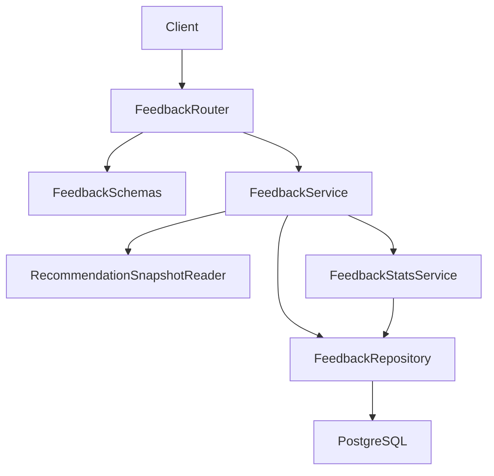
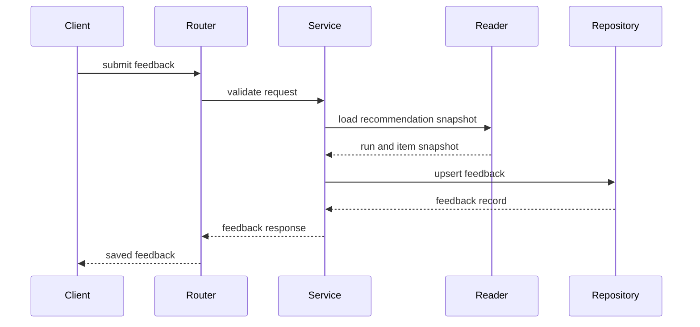
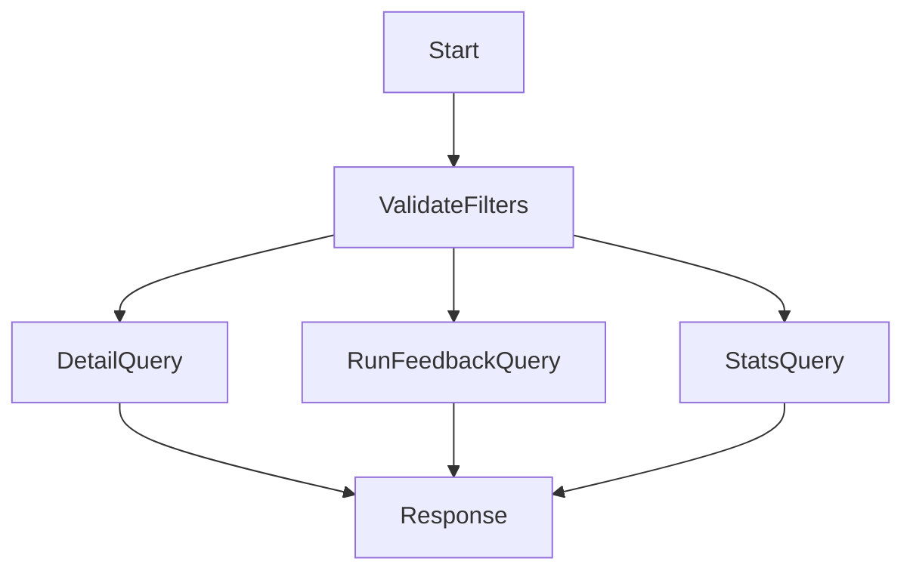
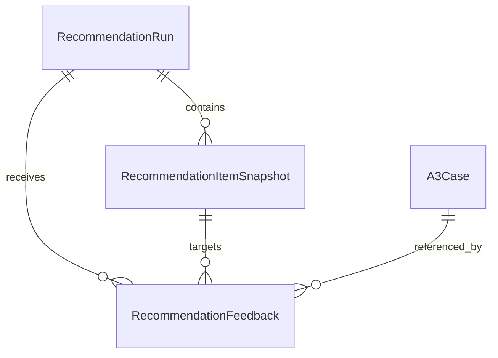
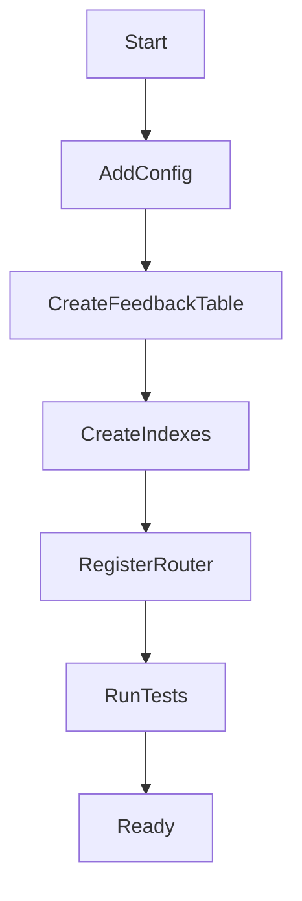

# Design Document

## Overview

`recommendation-feedback` 在推荐检索之后提供独立反馈闭环。它接收用户对一次推荐运行或某条推荐项的有用性、评分、采纳状态和备注，保存推荐查询与命中上下文快照，并提供反馈明细与基础统计查询。

本设计延续 Python + FastAPI + PostgreSQL 后端路线。反馈模块只读取 `cbr-retrieval-recommendation` 的推荐运行和推荐项快照，不触发检索、重排、解释生成，也不写回案例、向量索引或推荐运行记录。

### Goals

- 提供推荐反馈提交能力，支持运行级和推荐项级反馈。
- 保存有用/无用、简单评分、采纳状态、备注和反馈来源。
- 关联推荐运行、推荐项、命中案例、查询哈希、可选脱敏查询摘要、过滤条件和分值快照。
- 提供反馈明细、单次推荐运行反馈和基础统计查询。
- 保持反馈链路失败不阻塞用户查看推荐结果。

### Non-Goals

- 不实现相似案例检索、向量召回、CBRKit 重排或推荐解释生成。
- 不实现前端 UI、反馈控件、复杂权限体系或运营分析看板。
- 不基于反馈自动调权、学习排序、A/B 实验或行业库审核。
- 不把反馈写回案例质量评分、向量索引、推荐运行或推荐项快照。

## Boundary Commitments

### This Spec Owns

- `RecommendationFeedback`、反馈状态枚举、幂等规则和反馈查询契约。
- 反馈提交 API、反馈明细查询 API、推荐运行反馈查询 API 和基础统计 API。
- 推荐运行与推荐项引用校验，以及分析所需查询与命中快照复制。
- 反馈隐私边界、失败状态、并发重复提交的一致性规则。

### Out of Boundary

- 推荐召回、排序、解释、推荐运行生成和推荐项快照生成。
- 案例创建、案例内容修改、案例质量评分、embedding 和 pgvector 索引维护。
- 前端交互、后台页面、复杂权限模型、BI 看板和实验平台。
- 反馈学习排序、自动权重调整和主动推送策略。

### Allowed Dependencies

- `cbr-retrieval-recommendation` 的 `recommendation_run_id`、`recommendation_item_id`、推荐运行元数据和推荐项快照。
- 后续后台前端可以调用本规格 API，但本规格不依赖前端实现。
- Python 3.11+、FastAPI、Pydantic、SQLAlchemy、Alembic、PostgreSQL、pytest。
- 现有应用配置、数据库会话、错误响应和隐私日志约定。

### Revalidation Triggers

- 上游推荐运行或推荐项标识、状态、查询元数据、分值字段、解释状态字段发生变化。
- 上游推荐记录不再提供可复制的查询哈希或命中快照。
- 产品要求将反馈结果实时影响推荐排序、案例评分或行业库入选。
- 前端或分析侧要求新增复杂统计维度、权限隔离或批量导出。

## Architecture

### Existing Architecture Analysis

前置规格计划建立 `backend/app/retrieval`，其中 `RecommendationRun` 和 `RecommendationItemSnapshot` 保存推荐运行与推荐项引用。本规格新增 `backend/app/feedback`，通过 `RecommendationSnapshotReader` 读取上游推荐快照并复制必要上下文。

### Architecture Pattern & Boundary Map



**Architecture Integration**:
- Selected pattern: 轻量分层 FastAPI 模块。API、服务、上游快照读取、持久化和统计分层明确。
- Domain/feature boundaries: `FeedbackService` 只拥有反馈生命周期；`RecommendationSnapshotReader` 只读上游推荐快照；`FeedbackStatsService` 只读反馈数据生成基础聚合。
- Existing patterns preserved: 复用前置规格规划的 FastAPI、Pydantic、SQLAlchemy/Alembic、统一错误码和隐私日志。
- New components rationale: 反馈需要独立持久化、幂等提交、快照复制和基础统计，不能混入推荐检索流程。
- Dependency direction: `Schemas → Reader → Repository → Stats → Service → Router`。`feedback` 可以读取 `retrieval` 公开契约，但 `retrieval` 不依赖 `feedback`。

### Technology Stack

| Layer | Choice / Version | Role in Feature | Notes |
|-------|------------------|-----------------|-------|
| Backend / Services | Python 3.11+ + FastAPI | 暴露反馈提交和查询 API | 延续前置规格 |
| Validation | Pydantic | 请求、响应、枚举和错误 schema | 强类型边界 |
| Data / Storage | PostgreSQL | 保存反馈记录和快照字段 | 与 MVP 单库策略一致 |
| ORM / Migration | SQLAlchemy + Alembic | 新增反馈表、约束和索引 | 不修改上游表 |
| Testing | pytest + FastAPI TestClient | 单元、API、并发、隐私测试 | 上游快照使用 fake reader |

## File Structure Plan

### Directory Structure

```text
backend/
├── app/
│   ├── core/
│   │   ├── config.py                         # 增加反馈备注长度、幂等和统计默认配置
│   │   └── errors.py                         # 增加 FEEDBACK_* 错误码
│   ├── db/
│   │   └── base.py                           # 纳入 feedback ORM metadata
│   ├── retrieval/
│   │   └── repository.py                     # 被 RecommendationSnapshotReader 只读推荐快照
│   └── feedback/
│       ├── models.py                         # 推荐反馈 ORM、枚举和约束
│       ├── schemas.py                        # 反馈提交、查询、统计和响应 schema
│       ├── snapshot_reader.py                # 推荐运行和推荐项快照读取端口
│       ├── repository.py                     # 反馈 upsert、查询和聚合数据访问
│       ├── stats.py                          # 有用率、平均评分、采纳率等基础统计
│       ├── service.py                        # 反馈提交、校验、幂等和查询编排
│       └── router.py                         # 推荐反馈 API 端点
├── alembic/
│   └── versions/
│       └── <revision>_create_recommendation_feedback.py
└── tests/
    └── feedback/
        ├── test_feedback_submission.py       # 提交、校验和幂等测试
        ├── test_feedback_snapshot.py         # 推荐运行和推荐项关联快照测试
        ├── test_feedback_queries.py          # 明细、运行级查询和过滤测试
        ├── test_feedback_stats.py            # 基础统计测试
        └── test_feedback_privacy.py          # 隐私、日志和边界测试
```

### Modified Files

- `backend/app/main.py` — 仅追加注册 `FeedbackRouter`，不改写应用入口基础实现。
- `backend/app/core/config.py` — 仅追加反馈备注最大长度、幂等键设置和统计默认窗口，不拥有共享配置基础设施。
- `backend/app/core/errors.py` — 仅追加反馈校验、上游快照缺失、幂等冲突和查询错误码映射，不拥有 `ErrorMapper` 基础实现。
- `backend/app/db/base.py` — 仅追加导入 `feedback` ORM metadata，不拥有数据库基础设施。
- `backend/app/retrieval/repository.py` — 不改变上游写入契约，仅提供只读推荐快照访问。

## System Flows

### 反馈提交流程



### 查询与统计流程



## Requirements Traceability

| Requirement | Summary | Components | Interfaces | Flows |
|-------------|---------|------------|------------|-------|
| 1.1 | 接收反馈提交字段 | FeedbackRouter, FeedbackSchemas, FeedbackService | FeedbackCreateRequest | 反馈提交流程 |
| 1.2 | 推荐项属于推荐运行 | RecommendationSnapshotReader, FeedbackService | RecommendationSnapshot | 反馈提交流程 |
| 1.3 | 支持运行级反馈 | FeedbackSchemas, FeedbackRepository | FeedbackTarget | 反馈提交流程 |
| 1.4 | 标识错误拒绝 | RecommendationSnapshotReader, ErrorMapper | FEEDBACK_TARGET_NOT_FOUND | 反馈提交流程 |
| 1.5 | 不触发推荐逻辑 | FeedbackService | module boundary | 反馈提交流程 |
| 2.1 | 有用性枚举 | FeedbackSchemas, FeedbackRepository | usefulness enum | 反馈提交流程 |
| 2.2 | 1-5 评分 | FeedbackSchemas | rating validation | 反馈提交流程 |
| 2.3 | 采纳状态 | FeedbackSchemas, FeedbackRepository | adoption enum | 反馈提交流程 |
| 2.4 | 字段级校验 | FeedbackRouter, FeedbackSchemas | ValidationErrorResponse | 反馈提交流程 |
| 2.5 | 重复提交幂等 | FeedbackService, FeedbackRepository | idempotency key | 反馈提交流程 |
| 3.1 | 保存查询上下文 | RecommendationSnapshotReader, FeedbackRepository | FeedbackSnapshot | 反馈提交流程 |
| 3.2 | 保存推荐项快照 | RecommendationSnapshotReader, FeedbackRepository | FeedbackItemSnapshot | 反馈提交流程 |
| 3.3 | 保存审计字段 | FeedbackRepository | audit fields | 反馈提交流程 |
| 3.4 | 不回写上游 | FeedbackService, FeedbackRepository | module boundary | 反馈提交流程 |
| 3.5 | 上游快照不完整拒绝 | RecommendationSnapshotReader, ErrorMapper | FEEDBACK_SNAPSHOT_INCOMPLETE | 反馈提交流程 |
| 4.1 | 明细过滤 | FeedbackRepository, FeedbackRouter | FeedbackQueryRequest | 查询与统计流程 |
| 4.2 | 运行反馈查询 | FeedbackService, FeedbackRepository | RunFeedbackResponse | 查询与统计流程 |
| 4.3 | 基础统计 | FeedbackStatsService | FeedbackStatsResponse | 查询与统计流程 |
| 4.4 | 空结果 | FeedbackRepository, FeedbackStatsService | empty response | 查询与统计流程 |
| 4.5 | 返回推荐引用字段 | FeedbackSchemas, FeedbackRepository | FeedbackListItem | 查询与统计流程 |
| 5.1 | 失败不影响推荐结果 | FeedbackService, ErrorMapper | stable error | 反馈提交流程 |
| 5.2 | 隐私保护 | FeedbackRepository, ErrorMapper | SafeLogContext | 全部流程 |
| 5.3 | 备注校验 | FeedbackSchemas | comment validation | 反馈提交流程 |
| 5.4 | 并发一致 | FeedbackRepository | unique constraint | 反馈提交流程 |
| 5.5 | 数据出口不学习排序 | FeedbackStatsService, FeedbackRepository | read-only exports | 查询与统计流程 |

## Components and Interfaces

| Component | Domain/Layer | Intent | Req Coverage | Key Dependencies | Contracts |
|-----------|--------------|--------|--------------|------------------|-----------|
| FeedbackRouter | API | 暴露反馈提交、查询和统计入口 | 1.1, 2.4, 4.1, 4.2, 4.3 | FeedbackService P0 | API |
| FeedbackSchemas | API/Data Contract | 定义反馈请求、枚举、查询和响应 | 1.1, 1.3, 2.1, 2.2, 2.3, 5.3 | Pydantic P0 | API, State |
| RecommendationSnapshotReader | Integration | 只读上游推荐运行和推荐项快照 | 1.2, 1.4, 3.1, 3.2, 3.5 | retrieval repository P0 | Service |
| FeedbackRepository | Data Access | 保存反馈、幂等更新、过滤查询和聚合读取 | 2.5, 3.1, 3.2, 3.3, 5.4 | PostgreSQL P0 | Service, State |
| FeedbackStatsService | Domain Service | 生成有用率、平均评分和采纳率 | 4.3, 4.4, 5.5 | FeedbackRepository P0 | Service |
| FeedbackService | Application Service | 编排校验、快照读取、upsert 和响应 | 1.5, 2.5, 3.4, 5.1 | all core components P0 | Service |
| ErrorMapper | API Support | 输出稳定错误码并脱敏日志 | 1.4, 2.4, 3.5, 5.1, 5.2 | FastAPI P0 | API |

### API Layer

#### FeedbackRouter

| Field | Detail |
|-------|--------|
| Intent | 提供推荐反馈提交、查询和统计 HTTP 入口 |
| Requirements | 1.1, 2.4, 4.1, 4.2, 4.3 |

**API Contract**

| Method | Endpoint | Request | Response | Errors |
|--------|----------|---------|----------|--------|
| POST | `/api/recommendation-feedback` | `FeedbackCreateRequest` | `FeedbackResponse` | 400, 404, 409, 422 |
| GET | `/api/recommendation-feedback` | query filters | `FeedbackListResponse` | 422 |
| GET | `/api/recommendation-feedback/runs/{run_id}` | path `run_id` | `RunFeedbackResponse` | 404 |
| GET | `/api/recommendation-feedback/stats` | query filters | `FeedbackStatsResponse` | 422 |

### Domain Layer

#### FeedbackService

| Field | Detail |
|-------|--------|
| Intent | 编排反馈提交、快照复制、幂等更新和查询响应 |
| Requirements | 1.2, 1.3, 1.5, 2.5, 3.4, 5.1, 5.4 |

**Service Interface**

```python
class FeedbackService:
    def submit_feedback(self, request: FeedbackCreateRequest, actor: FeedbackActor) -> FeedbackResponse: ...
    def list_feedback(self, query: FeedbackQuery) -> FeedbackListResponse: ...
    def get_run_feedback(self, run_id: str) -> RunFeedbackResponse: ...
    def get_stats(self, query: FeedbackStatsQuery) -> FeedbackStatsResponse: ...
```

- Preconditions: 请求已通过 schema 解析；提交者标识可用；上游推荐快照可读。
- Postconditions: 有效反馈保存或更新为一条最终记录；无效目标不产生部分写入。
- Invariants: 不触发推荐、重排、解释或上游写回；运行级反馈允许推荐项为空。

#### RecommendationSnapshotReader

| Field | Detail |
|-------|--------|
| Intent | 读取推荐运行和推荐项快照并校验引用关系 |
| Requirements | 1.2, 1.4, 3.1, 3.2, 3.5 |

**Service Interface**

```python
class RecommendationSnapshotReader:
    def load_target(self, run_id: str, item_id: str | None) -> RecommendationFeedbackTarget: ...
```

- 返回查询哈希、可选脱敏或截断查询摘要、过滤条件、候选数量、返回数量、案例标识、排序、分值和解释状态。
- 若推荐项不属于推荐运行，返回 `FEEDBACK_TARGET_MISMATCH`。
- 若缺少必要快照字段，返回 `FEEDBACK_SNAPSHOT_INCOMPLETE`。

#### FeedbackStatsService

| Field | Detail |
|-------|--------|
| Intent | 基于反馈记录计算基础质量指标 |
| Requirements | 4.3, 4.4, 5.5 |

**Service Interface**

```python
class FeedbackStatsService:
    def summarize(self, query: FeedbackStatsQuery) -> FeedbackStatsResponse: ...
```

- 统计反馈数量、有用率、平均评分、采纳率。
- 支持按推荐运行、案例和时间范围聚合。
- 只读反馈数据，不发布排序学习事件。

### Data Layer

#### FeedbackRepository

| Field | Detail |
|-------|--------|
| Intent | 保存反馈聚合根、快照字段和查询统计 |
| Requirements | 2.5, 3.1, 3.2, 3.3, 4.1, 4.2, 4.4, 4.5, 5.4 |

**Service Interface**

```python
class FeedbackRepository:
    def upsert_feedback(self, feedback: FeedbackCreate) -> FeedbackRecord: ...
    def list_feedback(self, query: FeedbackQuery) -> list[FeedbackRecord]: ...
    def get_run_feedback(self, run_id: str) -> list[FeedbackRecord]: ...
    def aggregate_stats(self, query: FeedbackStatsQuery) -> FeedbackStatsData: ...
```

- 幂等键优先；无幂等键时按用户、推荐运行、推荐项目标做唯一约束。
- 同一目标并发提交使用数据库唯一约束和事务保持最终一致。
- 日志只记录标识、状态和错误码，不记录完整查询正文或完整备注。

## Data Models

### Domain Model



`RecommendationFeedback` 是本规格聚合根。运行级反馈只引用 `RecommendationRun`；推荐项级反馈同时引用 `RecommendationRun`、`RecommendationItemSnapshot` 和命中 `A3Case`。

### Logical Data Model

**RecommendationFeedback**

| Field | Type | Required | Notes |
|-------|------|----------|-------|
| `feedback_id` | string | yes | 反馈标识 |
| `recommendation_run_id` | string | yes | 上游推荐运行 |
| `recommendation_item_id` | string | no | 为空表示运行级反馈 |
| `case_id` | string | no | 推荐项级反馈必填 |
| `actor_id` | string | yes | 提交者 |
| `source_channel` | enum | yes | `admin_web`, `api`, `system` |
| `usefulness` | enum | yes | `useful`, `not_useful`, `unknown` |
| `rating` | integer | no | 1-5 |
| `adoption_status` | enum | yes | `adopted`, `not_adopted`, `pending` |
| `comment` | text | no | 长度受配置限制 |
| `idempotency_key` | string | no | 幂等提交 |
| `query_text_hash` | string | yes | 查询哈希 |
| `query_summary_snapshot` | text | no | 上游提供时复制的脱敏或截断查询摘要，不要求完整查询原文 |
| `applied_filters_snapshot` | object | yes | 推荐运行过滤条件 |
| `run_candidate_count` | integer | yes | 候选数量 |
| `run_returned_count` | integer | yes | 返回数量 |
| `item_rank` | integer | no | 推荐项排序 |
| `vector_similarity_score` | float | no | 向量相似度 |
| `semantic_similarity_score` | float | no | reranker 纯语义相似度 |
| `structured_similarity_score` | float | no | 结构化局部相似度 |
| `business_score` | float | no | 业务参数分 |
| `final_score` | float | yes | 最终聚合分 |
| `explanation_status` | enum | no | 推荐解释状态 |
| `created_at` | datetime | yes | 创建时间 |
| `updated_at` | datetime | yes | 更新时间 |

### Physical Data Model

**Table: `recommendation_feedback`**

| Column | Type | Constraint |
|--------|------|------------|
| `feedback_id` | varchar(64) | primary key |
| `recommendation_run_id` | varchar(64) | not null |
| `recommendation_item_id` | varchar(64) | nullable |
| `case_id` | varchar(64) | nullable |
| `actor_id` | varchar(64) | not null |
| `source_channel` | varchar(32) | not null |
| `usefulness` | varchar(32) | not null |
| `rating` | integer | nullable, check 1..5 |
| `adoption_status` | varchar(32) | not null |
| `comment` | text | nullable |
| `idempotency_key` | varchar(128) | nullable |
| `query_text_hash` | varchar(128) | not null |
| `query_summary_snapshot` | text | nullable |
| `applied_filters_snapshot` | jsonb | not null |
| `run_candidate_count` | integer | not null |
| `run_returned_count` | integer | not null |
| `item_rank` | integer | nullable |
| `vector_similarity_score` | double precision | nullable |
| `semantic_similarity_score` | double precision | nullable |
| `structured_similarity_score` | double precision | nullable |
| `business_score` | double precision | nullable |
| `final_score` | double precision | not null |
| `explanation_status` | varchar(32) | nullable |
| `created_at` | timestamptz | not null |
| `updated_at` | timestamptz | not null |

**Indexes and Constraints**

- Unique: `idempotency_key` when not null.
- Unique: `(actor_id, recommendation_run_id, coalesce(recommendation_item_id, 'RUN'))` for latest target feedback.
- Indexes: `recommendation_run_id`, `recommendation_item_id`, `case_id`, `actor_id`, `created_at`, `usefulness`, `adoption_status`, `rating`.

### Data Contracts & Integration

**FeedbackCreateRequest**
- `recommendation_run_id`: required.
- `recommendation_item_id`: optional.
- `usefulness`: `useful`、`not_useful`、`unknown`.
- `rating`: optional integer 1-5.
- `adoption_status`: `adopted`、`not_adopted`、`pending`.
- `comment`: optional bounded text.
- `source_channel`: optional, defaults to `admin_web`.
- `idempotency_key`: optional.

**FeedbackResponse**
- `feedback_id`
- `recommendation_run_id`
- `recommendation_item_id`
- `case_id`
- `usefulness`
- `rating`
- `adoption_status`
- `comment`
- `target_scope`: `run` or `item`
- `created_at`
- `updated_at`

**FeedbackListItem**
- feedback response fields
- `query_text_hash`
- optional `query_summary_snapshot`
- `applied_filters_snapshot`
- `item_rank`
- `vector_similarity_score`
- `semantic_similarity_score`
- `structured_similarity_score`
- `business_score`
- `final_score`
- `explanation_status`

## Error Handling

### Error Strategy

- 输入字段错误在读取上游快照前返回 422。
- 推荐运行或推荐项不存在返回 404。
- 推荐项与运行不匹配或快照不完整返回 409。
- 幂等冲突返回当前最终记录或稳定 409，避免重复写入。
- 数据库错误返回稳定系统错误，并在日志中脱敏。

### Error Categories and Responses

- **User Errors (4xx)**: 非法枚举、评分越界、备注过长、无效时间范围。
- **Business Logic Errors (409/404)**: 推荐目标不存在、推荐项不属于运行、上游快照不完整、幂等键冲突。
- **System Errors (5xx)**: 数据库连接、事务失败、未知运行时错误。

### Monitoring

- Logs: feedback accepted, snapshot loaded, feedback upserted, query executed, stats computed.
- Metrics: submit success rate, submit error rate, target missing rate, average rating, usefulness ratio, adoption ratio.
- Logs and error responses include `feedback_id`、`recommendation_run_id`、错误码和状态，不包含完整查询文本、完整案例正文、向量数组或敏感门店信息。

## Testing Strategy

### Unit Tests

- `FeedbackSchemas` 校验有用性、评分范围、采纳状态、备注长度和运行级目标。
- `RecommendationSnapshotReader` 校验运行存在、推荐项归属、快照完整和缺失错误。
- `FeedbackRepository` 校验幂等 upsert、唯一约束、并发最终一致和过滤查询。
- `FeedbackStatsService` 校验有用率、平均评分、采纳率和空结果零值。

### Integration Tests

- POST `/api/recommendation-feedback` 在 fake recommendation snapshot 下保存运行级反馈。
- POST `/api/recommendation-feedback` 保存推荐项级反馈，并复制案例、排序和分值快照。
- GET `/api/recommendation-feedback` 支持按运行、案例、用户、时间、有用性、评分和采纳状态过滤。
- GET `/api/recommendation-feedback/runs/{run_id}` 返回运行级和项级反馈。
- GET `/api/recommendation-feedback/stats` 返回基础聚合指标。

### Contract and Boundary Tests

- 反馈提交不调用推荐检索、重排或解释服务。
- 反馈保存不修改推荐运行、推荐项快照、案例、向量索引或反馈外数据。
- 上游 `recommendation_item_id` 不属于 `recommendation_run_id` 时拒绝保存。
- 后续消费者可以按推荐运行、推荐项和案例读取反馈数据出口。

### Security and Privacy Tests

- 日志、错误响应和统计结果不包含完整查询文本、完整案例正文、向量数组或完整备注。
- 备注长度和基础内容校验可阻止明显不可用或过长内容。
- 并发重复提交最终只保留同一用户同一反馈目标的一条最新记录。

### Performance / Load

- 常用查询通过 `recommendation_run_id`、`case_id`、`created_at`、`usefulness` 和 `adoption_status` 索引完成。
- 基础统计仅覆盖 MVP 所需聚合，避免在请求路径中执行复杂分析。
- 反馈提交只读取一次上游推荐快照并写入一条反馈记录，失败不影响推荐结果已展示状态。

## Security Considerations

- 反馈记录只要求查询哈希；可选查询摘要必须来自上游已脱敏或截断字段，禁止要求或保存完整查询原文。
- 反馈备注可能包含敏感业务信息，必须限制长度并在日志中只记录是否存在。
- API 错误不暴露数据库异常、上游 repository 细节或完整快照内容。

## Performance & Scalability

- MVP 采用同步提交反馈，单次写入应保持轻量。
- 统计查询限定过滤条件和时间范围，后续大规模分析可由独立分析规格消费反馈表。
- 反馈表保留必要快照，避免运行统计依赖上游推荐记录生命周期。

## Migration Strategy



迁移新增 `recommendation_feedback` 表、唯一约束和查询索引，不修改 `recommendation_runs`、`recommendation_item_snapshots`、案例表或向量表。回滚删除反馈表；若已有分析流程消费反馈数据，回滚前需暂停消费并备份数据。
