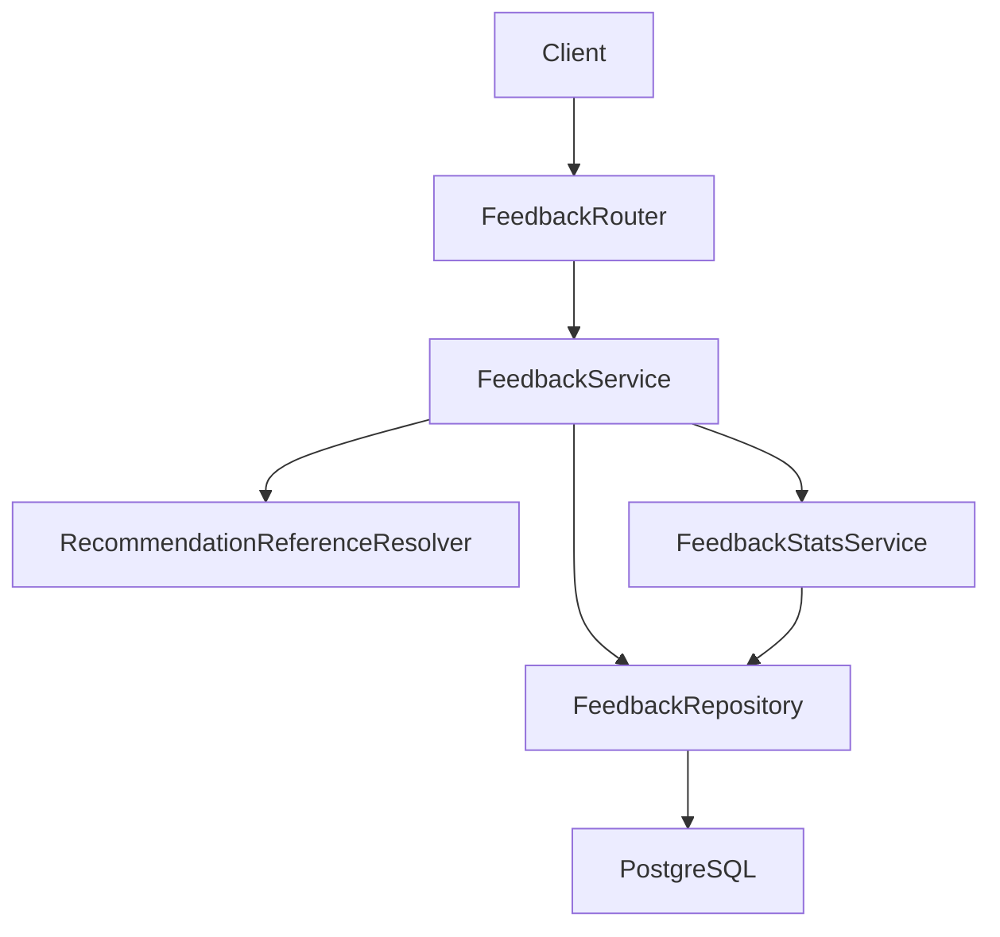
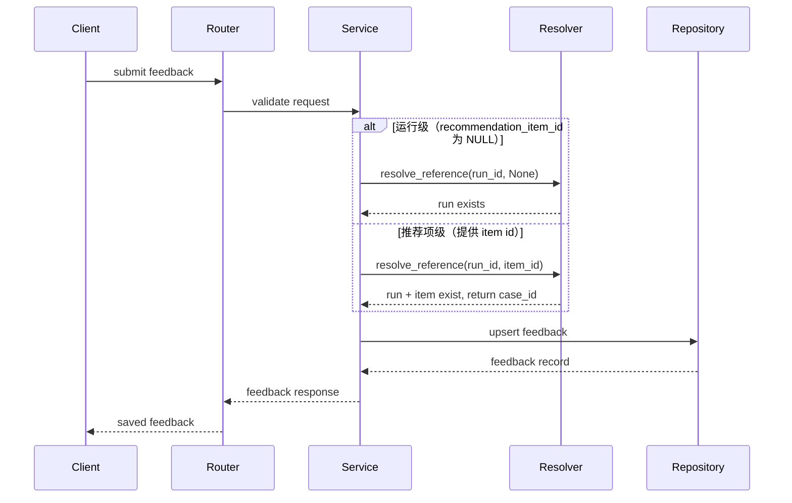
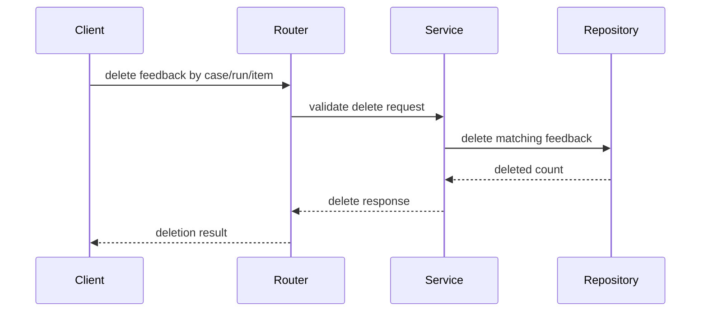
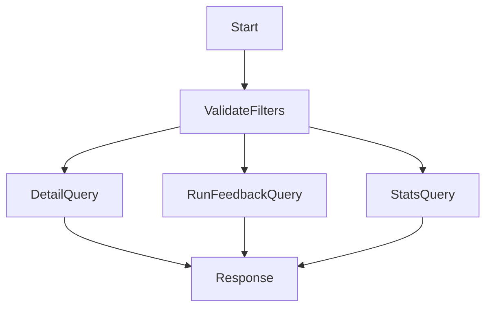
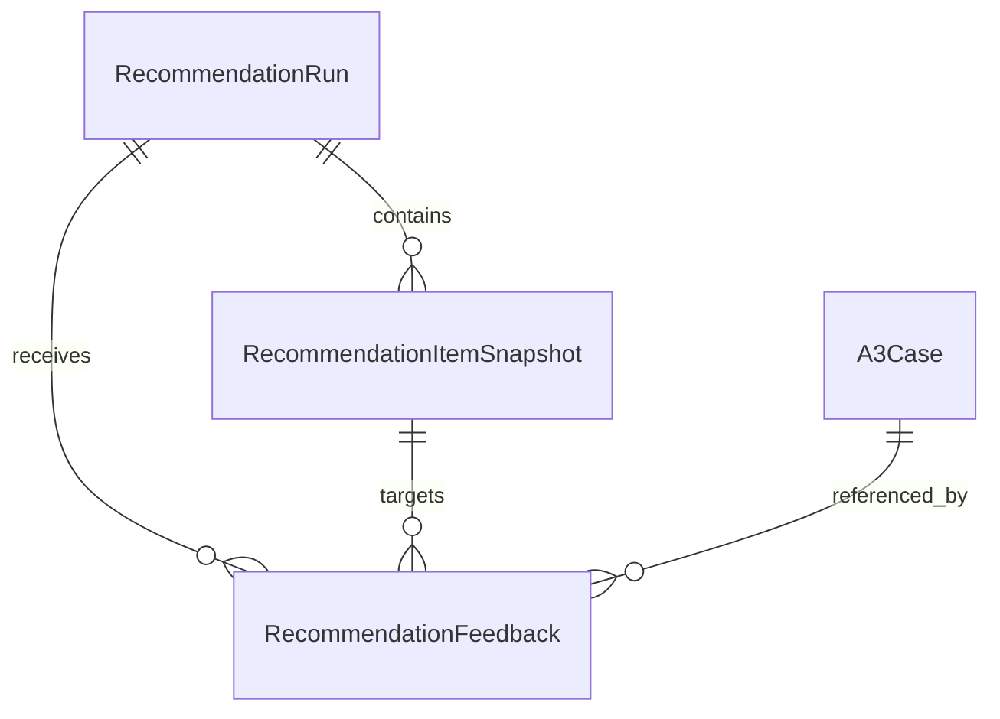
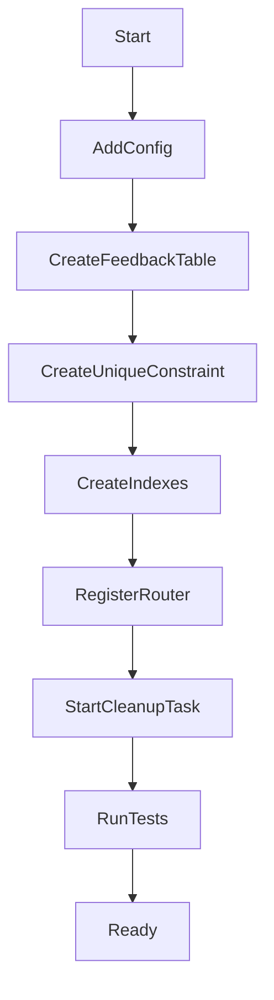

# Design Document

## Overview

`recommendation-feedback` 在推荐检索之后提供独立反馈闭环。它接收用户对一次整体推荐（即一次推荐运行）或其中某条推荐项的**有用性**与**可选反馈备注**，并提供反馈明细、统计查询和删除能力。

本设计延续 Python + FastAPI + PostgreSQL 后端路线。反馈模块只关联 `cbr-retrieval-recommendation` 的推荐运行和推荐项标识，不触发检索、重排、解释生成，也不写回案例、向量索引或推荐运行记录。

### Terminology

- `整体推荐`：一次查询返回的一整组推荐结果，对应一个 `recommendation_run_id`。
- `推荐运行` / `run 级` / `运行级`：与“整体推荐”同义，表示反馈目标是整组推荐结果。
- `推荐项` / `item 级`：整体推荐中的单条推荐结果，对应一个 `recommendation_item_id`。

### Goals

- 提供推荐反馈提交能力，支持整体推荐级（运行级，`recommendation_item_id` 为 NULL）和推荐项级反馈。
- 保存有用/无用、可选备注、反馈来源和审计字段。
- 关联推荐运行、推荐项和命中案例标识。
- 提供反馈明细、单次推荐运行反馈和基础统计查询。
- 提供反馈删除能力，支持案例删除触发和定时清理无效记录。
- 通过数据库唯一约束保证同一用户对同一目标的反馈幂等性。
- 保持反馈链路失败不阻塞用户查看推荐结果。

### Non-Goals

- 不实现相似案例检索、向量召回、CBRKit 重排或推荐解释生成。
- 不实现前端 UI、反馈控件、复杂权限体系或运营分析看板。
- 不基于反馈自动调权、学习排序、A/B 实验或行业库审核。
- 不把反馈写回案例质量评分、向量索引、推荐运行或推荐项快照。
- 不在反馈表中冗余存储查询快照、过滤条件快照、分值快照或解释状态（通过关联查询 `recommendation_runs` 和 `recommendation_item_snapshots` 获取）。
- 不负责长期质量分析所需的反馈数据归档操作，该操作属运维领域，应由独立的归档规格或运维流程在上游推荐记录删除前完成。当前设计不保证跨周期的质量分析能力。

## Boundary Commitments

### This Spec Owns

- `RecommendationFeedback`、反馈状态枚举和反馈查询契约。
- 反馈提交 API、反馈删除 API、反馈明细查询 API、推荐运行反馈查询 API 和基础统计 API。
- 推荐运行与推荐项引用解析（只读上游标识和关联数据，不复制快照）。
- 反馈隐私边界、失败状态和数据库唯一约束幂等规则。
- 定时清理无效反馈记录的后台任务（清理悬空引用和过期记录）。

### Out of Boundary

- 推荐召回、排序、解释、推荐运行生成和推荐项快照生成。
- 案例创建、案例内容修改、案例质量评分、embedding 和 pgvector 索引维护。
- 前端交互、后台页面、复杂权限模型、BI 看板和实验平台。
- 反馈学习排序、自动权重调整和主动推送策略。

### Allowed Dependencies

- `cbr-retrieval-recommendation` 的 `recommendation_run_id` 和 `recommendation_item_id`（只读标识，不读取推荐运行元数据或推荐项快照）。
- `a3-case-management` 的 `case_id`（只读标识，用于关联命中案例）。
- 后续后台前端可以调用本规格 API，但本规格不依赖前端实现。
- Python 3.11+、FastAPI、Pydantic、SQLAlchemy、Alembic、PostgreSQL 15+、pytest。
- 现有应用配置、数据库会话、错误响应和隐私日志约定。

### Revalidation Triggers

- 上游推荐运行或推荐项标识契约发生变化。
- 产品要求将反馈结果实时影响推荐排序、案例评分或行业库入选。
- 前端或分析侧要求新增复杂统计维度、权限隔离或批量导出。
- 需要在反馈表中冗余存储查询快照、过滤条件快照或分值快照（当前通过关联查询获取）。

## Architecture

### Existing Architecture Analysis

前置规格计划建立 `backend/app/retrieval`，其中 `RecommendationRun` 和 `RecommendationItemSnapshot` 保存推荐运行与推荐项引用。本规格新增 `backend/app/feedback`，通过 `RecommendationReferenceResolver` 解析上游推荐运行和推荐项标识，校验存在性与一致性，并返回关联数据（如 `case_id`）。查询上下文（查询哈希、过滤条件、候选数量等）和推荐项详细信息（分值、排序位置等）通过关联查询 `recommendation_runs` 和 `recommendation_item_snapshots` 获取，不在反馈表中冗余存储。

### Data Lifecycle Constraints

- **反馈记录生命周期与上游推荐记录绑定**：反馈记录的存续依赖于上游 `recommendation_runs` 和 `recommendation_item_snapshots` 的保留。
- **级联删除机制**：
  - **主路径**：`cbr-retrieval-recommendation` 删除推荐运行或推荐项快照时，同步调用本规格的删除接口（DELETE `/api/recommendation-feedback`），确保不产生悬空引用。
  - **兜底机制**：定时清理任务（`FeedbackCleanupService`）定期扫描并删除悬空引用的反馈记录，作为数据一致性的兜底保障。
- **质量分析时间窗口**：需求 3.1、3.2 的"后续分析召回质量和解释质量"能力受限于上游推荐记录的保留周期。如需长期质量分析（如跨季度趋势、模型迭代对比），应由独立的分析规格在上游删除前归档反馈数据快照。
- **删除触发场景**：
  - 上游推荐记录因存储策略、隐私合规或数据保留政策被清理时触发（主路径：上游主动调用本规格删除接口）。
  - 案例被删除时，上游可能级联删除相关推荐记录，进而触发反馈删除（主路径：上游主动调用本规格删除接口）。
  - 用户主动删除反馈（通过本规格 API）。
  - 定时清理任务识别并删除悬空引用（兜底机制）。

### Architecture Pattern & Boundary Map




**Architecture Integration**:

- Selected pattern: 轻量分层 FastAPI 模块。API、服务、上游引用解析、持久化和统计分层明确。
- Domain/feature boundaries: `FeedbackService` 只拥有反馈生命周期；`RecommendationReferenceResolver` 解析上游推荐标识，校验存在性与一致性，并返回关联数据（如 `case_id`）；`FeedbackStatsService` 只读反馈数据生成基础聚合。
- Existing patterns preserved: 复用前置规格规划的 FastAPI、Pydantic、SQLAlchemy/Alembic、统一错误码和隐私日志。
- New components rationale: 反馈需要独立持久化、引用解析和基础统计，不能混入推荐检索流程。
- Dependency direction: `Router → FeedbackService`；`FeedbackService` 编排 `RecommendationReferenceResolver`、`FeedbackRepository` 与 `FeedbackStatsService`（查询路径可为 Service→Stats→Repository）。`FeedbackSchemas` 仅作为 Router 入站/出站契约（Pydantic），不参与运行时依赖链编排。`feedback` 可以读取 `retrieval` 公开契约，但 `retrieval` 不依赖 `feedback`。

### Technology Stack


| Layer              | Choice / Version            | Role in Feature    | Notes                             |
| ------------------ | --------------------------- | ------------------ | --------------------------------- |
| Backend / Services | Python 3.11+ + FastAPI      | 暴露反馈提交、删除和查询 API   | 延续前置规格                            |
| Validation         | Pydantic                    | 请求、响应、枚举和错误 schema | 强类型边界                             |
| Data / Storage     | PostgreSQL 15+              | 保存反馈记录和审计字段        | 使用 `UNIQUE NULLS NOT DISTINCT` 约束 |
| ORM / Migration    | SQLAlchemy + Alembic        | 新增反馈表、约束和索引        | 不修改上游表                            |
| Testing            | pytest + FastAPI TestClient | 单元、API、并发、隐私测试     | 上游引用使用 fake validator             |


## File Structure Plan

### Directory Structure

```text
backend/
├── app/
│   ├── core/
│   │   ├── config.py                         # 增加反馈备注长度、统计默认配置和定时清理配置
│   │   └── errors.py                         # 增加 FEEDBACK_* 错误码
│   ├── db/
│   │   └── base.py                           # 纳入 feedback ORM metadata
│   ├── retrieval/
│   │   └── repository.py                     # 被 RecommendationReferenceResolver 只读推荐标识和关联数据
│   └── feedback/
│       ├── models.py                         # 推荐反馈 ORM、枚举和约束
│       ├── schemas.py                        # 反馈提交、删除、查询、统计和响应 schema
│       ├── reference_resolver.py             # 推荐运行和推荐项引用解析（校验存在性并返回关联数据）
│       ├── repository.py                     # 反馈 upsert、删除、查询和聚合数据访问
│       ├── stats.py                          # 有用率及有用性分布等基础统计
│       ├── service.py                        # 反馈提交、删除、引用解析和查询编排
│       ├── cleanup.py                        # 定时清理无效反馈记录的后台任务
│       └── router.py                         # 推荐反馈 API 端点
├── alembic/
│   └── versions/
│       └── <revision>_create_recommendation_feedback.py
└── tests/
    └── feedback/
        ├── test_feedback_submission.py       # 提交和引用解析测试
        ├── test_feedback_deletion.py         # 删除反馈测试
        ├── test_feedback_reference.py        # 推荐运行和推荐项引用解析测试
        ├── test_feedback_queries.py          # 明细、运行级查询和过滤测试
        ├── test_feedback_stats.py            # 基础统计测试
        ├── test_feedback_cleanup.py          # 定时清理任务测试
        └── test_feedback_privacy.py          # 隐私、日志和边界测试
```

### Modified Files

- `backend/app/main.py` — 仅追加注册 `FeedbackRouter` 和启动定时清理任务，不改写应用入口基础实现。
- `backend/app/core/config.py` — 仅追加反馈备注最大长度、统计默认窗口和定时清理间隔配置，不拥有共享配置基础设施。
- `backend/app/core/errors.py` — 仅追加反馈校验、上游引用缺失和查询错误码映射，不拥有 `ErrorMapper` 基础实现。
- `backend/app/db/base.py` — 仅追加导入 `feedback` ORM metadata，不拥有数据库基础设施。
- `backend/app/retrieval/repository.py` — 不改变上游写入契约，仅提供只读推荐标识和关联数据访问（如 `case_id`）。

## System Flows

### 反馈提交流程




### 反馈删除流程




**删除触发场景**：

1. **用户主动删除**：通过 API 直接删除特定反馈记录。
2. **上游级联删除**：`cbr-retrieval-recommendation` 删除推荐运行或推荐项快照时，调用本规格删除接口清理关联反馈。
3. **案例删除触发**：案例被删除时，上游可能级联删除相关推荐记录，进而触发反馈删除。

**级联删除示例**（由上游 `cbr-retrieval-recommendation` 触发）：

```python
# 上游删除推荐运行时的伪代码
def delete_recommendation_run(run_id: str):
    # 1. 删除推荐项快照
    delete_recommendation_items(run_id)
    # 2. 调用反馈规格删除接口
    feedback_client.delete_feedback(recommendation_run_id=run_id)
    # 3. 删除推荐运行记录
    delete_run_record(run_id)
```

### 查询与统计流程




## Requirements Traceability


| Requirement | Summary                              | Components                                       | Interfaces                                    | Flows         |
| ----------- | ------------------------------------ | ------------------------------------------------ | --------------------------------------------- | ------------- |
| 1.1         | 接收反馈提交字段                             | FeedbackRouter, FeedbackSchemas, FeedbackService | FeedbackCreateRequest                         | 反馈提交流程        |
| 1.2         | 推荐项属于推荐运行                            | RecommendationReferenceResolver, FeedbackService | RecommendationReference                       | 反馈提交流程        |
| 1.3         | 支持整体推荐级（运行级）反馈                       | FeedbackSchemas, FeedbackRepository              | FeedbackTarget                                | 反馈提交流程        |
| 1.4         | 标识错误拒绝                               | RecommendationReferenceResolver, ErrorMapper     | FEEDBACK_TARGET_NOT_FOUND                     | 反馈提交流程        |
| 1.5         | 不触发推荐逻辑                              | FeedbackService                                  | module boundary                               | 反馈提交流程        |
| 2.1         | 有用性枚举                                | FeedbackSchemas, FeedbackRepository              | usefulness enum                               | 反馈提交流程        |
| 2.2         | 可选反馈备注                               | FeedbackSchemas                                  | optional comment                              | 反馈提交流程        |
| 2.3         | 字段级校验                                | FeedbackRouter, FeedbackSchemas                  | ValidationErrorResponse                       | 反馈提交流程        |
| 2.4         | 重复提交幂等                               | FeedbackRepository                               | unique constraint                             | 反馈提交流程        |
| 3.1         | 保存推荐引用，查询上下文通过关联查询获取；反馈记录生命周期与上游记录绑定 | FeedbackRepository                               | recommendation_run_id, recommendation_item_id | 反馈提交流程、反馈删除流程 |
| 3.2         | 保存推荐项关联，详细信息通过关联查询获取；反馈记录生命周期与上游记录绑定 | FeedbackRepository                               | case_id field                                 | 反馈提交流程、反馈删除流程 |
| 3.3         | 保存审计字段                               | FeedbackRepository                               | audit fields                                  | 反馈提交流程        |
| 3.4         | 不回写上游                                | FeedbackService, FeedbackRepository              | module boundary                               | 反馈提交流程        |
| 3.5         | 上游引用不存在拒绝                            | RecommendationReferenceResolver, ErrorMapper     | FEEDBACK_TARGET_NOT_FOUND                     | 反馈提交流程        |
| 4.1         | 明细过滤                                 | FeedbackRepository, FeedbackRouter               | FeedbackQueryRequest                          | 查询与统计流程       |
| 4.2         | 运行反馈查询                               | FeedbackService, FeedbackRepository              | RunFeedbackResponse                           | 查询与统计流程       |
| 4.3         | 基础统计                                 | FeedbackStatsService                             | FeedbackStatsResponse                         | 查询与统计流程       |
| 4.4         | 空结果                                  | FeedbackRepository, FeedbackStatsService         | empty response                                | 查询与统计流程       |
| 4.5         | 返回推荐引用字段                             | FeedbackSchemas, FeedbackRepository              | FeedbackListItem                              | 查询与统计流程       |
| 5.1         | 失败不影响推荐结果                            | FeedbackService, ErrorMapper                     | stable error                                  | 反馈提交流程        |
| 5.2         | 隐私保护                                 | FeedbackRepository, ErrorMapper                  | SafeLogContext                                | 全部流程          |
| 5.3         | 备注校验                                 | FeedbackSchemas                                  | comment validation                            | 反馈提交流程        |
| 5.4         | 并发幂等                                 | FeedbackRepository                               | unique constraint                             | 反馈提交流程        |
| 5.5         | 数据出口不学习排序                            | FeedbackStatsService, FeedbackRepository         | read-only exports                             | 查询与统计流程       |


## Components and Interfaces


| Component                       | Domain/Layer        | Intent                                     | Req Coverage                 | Key Dependencies        | Contracts      |
| ------------------------------- | ------------------- | ------------------------------------------ | ---------------------------- | ----------------------- | -------------- |
| FeedbackRouter                  | API                 | 暴露反馈提交、删除、查询和统计入口                          | 1.1, 4.1, 4.2, 4.3           | FeedbackService P0      | API            |
| FeedbackSchemas                 | API/Data Contract   | 定义反馈请求、枚举、查询和响应                            | 1.1, 1.3, 2.1, 2.2, 2.3, 5.3 | Pydantic P0             | API, State     |
| RecommendationReferenceResolver | Integration         | 解析上游推荐运行和推荐项引用，校验存在性与一致性，返回关联数据（如 case_id） | 1.2, 1.4, 3.5                | retrieval repository P0 | Service        |
| FeedbackRepository              | Data Access         | 保存反馈、删除反馈、过滤查询和聚合读取                        | 2.4, 3.1, 3.2, 3.3, 5.4      | PostgreSQL P0           | Service, State |
| FeedbackStatsService            | Domain Service      | 生成有用率与有用性分布                                | 4.3, 4.4, 5.5                | FeedbackRepository P0   | Service        |
| FeedbackCleanupService          | Background Task     | 定时清理悬空引用和过期反馈记录                            | 数据一致性维护                      | FeedbackRepository P0   | Background     |
| FeedbackService                 | Application Service | 编排引用解析、upsert、删除和响应                        | 1.5, 2.4, 3.4, 5.1           | all core components P0  | Service        |
| ErrorMapper                     | API Support         | 输出稳定错误码并脱敏日志                               | 1.4, 3.5, 5.1, 5.2           | FastAPI P0              | API            |


### API Layer

#### FeedbackRouter


| Field        | Detail                    |
| ------------ | ------------------------- |
| Intent       | 提供推荐反馈提交、删除、查询和统计 HTTP 入口 |
| Requirements | 1.1, 2.4, 4.1, 4.2, 4.3   |


**API Contract**


| Method | Endpoint                                     | Request                                | Response                 | Errors        |
| ------ | -------------------------------------------- | -------------------------------------- | ------------------------ | ------------- |
| POST   | `/api/recommendation-feedback`               | `FeedbackCreateRequest`                | `FeedbackResponse`       | 400, 404, 422 |
| DELETE | `/api/recommendation-feedback`               | query filters (case_id/run_id/item_id) | `FeedbackDeleteResponse` | 422           |
| GET    | `/api/recommendation-feedback`               | query filters                          | `FeedbackListResponse`   | 422           |
| GET    | `/api/recommendation-feedback/runs/{run_id}` | path `run_id`                          | `RunFeedbackResponse`    | 404           |
| GET    | `/api/recommendation-feedback/stats`         | query filters                          | `FeedbackStatsResponse`  | 422           |


### Domain Layer

#### FeedbackService


| Field        | Detail                       |
| ------------ | ---------------------------- |
| Intent       | 编排反馈提交、删除、引用解析和查询响应          |
| Requirements | 1.2, 1.3, 1.5, 2.4, 3.4, 5.1 |


**Service Interface**

```python
class FeedbackService:
    def submit_feedback(self, request: FeedbackCreateRequest, actor: FeedbackActor) -> FeedbackResponse: ...
    def delete_feedback(self, filters: FeedbackDeleteFilters) -> FeedbackDeleteResponse: ...
    def list_feedback(self, query: FeedbackQuery) -> FeedbackListResponse: ...
    def get_run_feedback(self, run_id: str) -> RunFeedbackResponse: ...
    def get_stats(self, query: FeedbackStatsQuery) -> FeedbackStatsResponse: ...
```

- Preconditions: 请求已通过 schema 解析；提交者标识可用；上游推荐标识可读。
- Postconditions: 有效反馈保存或更新为一条最终记录；无效目标不产生部分写入；删除操作返回删除数量。
- Invariants: 不触发推荐、重排、解释或上游写回；整体推荐级（运行级）反馈的 `recommendation_item_id` 为 NULL；推荐项级反馈的 `recommendation_item_id` 为非 NULL 上游标识。

#### RecommendationReferenceResolver


| Field        | Detail                        |
| ------------ | ----------------------------- |
| Intent       | 解析推荐运行和推荐项引用，校验存在性与一致性，返回关联数据 |
| Requirements | 1.2, 1.4, 3.5                 |


**Service Interface**

```python
class RecommendationReferenceResolver:
    def resolve_reference(self, run_id: str, item_id: str | None) -> RecommendationReference: ...
```

- `item_id` 为 `None`：解析整体推荐级（运行级）目标，只需推荐运行存在。
- `item_id` 为非空：解析推荐运行存在且推荐项归属于该运行，并返回关联的 `case_id`。
- 返回 `RecommendationReference`：包含 `run_id`、`item_id`（可为 None）、`case_id`（推荐项级必填，运行级为 None）。
- 若推荐运行不存在或推荐项不属于推荐运行，抛出 `FEEDBACK_TARGET_NOT_FOUND` 或 `FEEDBACK_TARGET_MISMATCH`。

#### FeedbackStatsService


| Field        | Detail         |
| ------------ | -------------- |
| Intent       | 基于反馈记录计算基础质量指标 |
| Requirements | 4.3, 4.4, 5.5  |


**Service Interface**

```python
class FeedbackStatsService:
    def summarize(self, query: FeedbackStatsQuery) -> FeedbackStatsResponse: ...
```

- 统计反馈数量、有用率和有用性分布（`useful` / `not_useful` / `unknown`）。
- 支持按推荐运行、案例和时间范围聚合。
- 只读反馈数据，不发布排序学习事件。

#### FeedbackCleanupService


| Field        | Detail          |
| ------------ | --------------- |
| Intent       | 定时清理悬空引用和过期反馈记录 |
| Requirements | 数据一致性维护         |


**Service Interface**

```python
class FeedbackCleanupService:
    def cleanup_orphaned_feedback(self) -> CleanupResult: ...
```

- 定时扫描反馈表，识别引用不存在的推荐运行或推荐项的反馈记录（悬空引用）。
- 删除悬空引用的反馈记录，保证数据一致性。
- 清理间隔通过配置项 `feedback_cleanup_interval_seconds` 指定（默认 3600 秒，即 1 小时）。
- 清理任务在应用启动时自动启动，作为后台任务运行。启动初始化失败时记录错误日志但**不阻塞应用启动**。
- 清理任务运行失败时记录错误日志，下一个清理周期自动重试（无需额外重试逻辑）。
- 不提供手动触发清理的 API 端点。
- 记录清理日志：清理时间、扫描记录数、删除记录数和清理耗时。
- 清理失败不影响主业务流程（反馈提交、查询、统计），只记录错误日志。

**清理逻辑**

```python
# 伪代码示例
def cleanup_orphaned_feedback():
    # 1. 查找引用不存在的推荐运行的反馈记录
    orphaned_by_run = """
        SELECT f.feedback_id 
        FROM recommendation_feedback f
        LEFT JOIN recommendation_runs r ON f.recommendation_run_id = r.run_id
        WHERE r.run_id IS NULL
    """
    
    # 2. 查找引用不存在的推荐项的反馈记录（仅针对推荐项级反馈）
    orphaned_by_item = """
        SELECT f.feedback_id 
        FROM recommendation_feedback f
        LEFT JOIN recommendation_item_snapshots i ON f.recommendation_item_id = i.item_id
        WHERE f.recommendation_item_id IS NOT NULL AND i.item_id IS NULL
    """
    
    # 3. 删除悬空记录
    deleted_count = delete_feedback_by_ids(orphaned_ids)
    
    # 4. 记录清理结果
    log_cleanup_result(deleted_count, scan_count, duration)
```

**失败处理策略**

```python
# 应用启动时初始化清理任务（不阻塞启动）
def start_cleanup_task():
    try:
        cleanup_service = FeedbackCleanupService(repository, config)
        asyncio.create_task(cleanup_service.run_periodic())
    except Exception as e:
        # 启动初始化失败：记录错误日志，不阻塞应用启动
        logger.error(f"Failed to start cleanup task: {e}")

# 清理任务周期运行（失败不影响下一个周期）
async def run_periodic(self):
    while True:
        try:
            self.cleanup_orphaned_feedback()
        except Exception as e:
            # 单次清理失败：记录错误日志，下一个周期自动重试
            logger.error(f"Cleanup task failed: {e}")
        await asyncio.sleep(self.cleanup_interval)
```

**配置项**

- `feedback_cleanup_interval_seconds`：清理间隔（秒），默认 3600（1 小时）。
- `feedback_cleanup_batch_size`：单次清理批次大小，默认 1000，避免长事务。

### Data Layer

#### FeedbackRepository


| Field        | Detail                                      |
| ------------ | ------------------------------------------- |
| Intent       | 保存反馈聚合根、删除反馈和查询统计                           |
| Requirements | 2.4, 3.1, 3.2, 3.3, 4.1, 4.2, 4.4, 4.5, 5.4 |


**Service Interface**

```python
class FeedbackRepository:
    def upsert_feedback(self, feedback: FeedbackCreate) -> FeedbackRecord: ...
    def delete_feedback(self, filters: FeedbackDeleteFilters) -> int: ...
    def list_feedback(self, query: FeedbackQuery) -> list[FeedbackRecord]: ...
    def get_run_feedback(self, run_id: str) -> list[FeedbackRecord]: ...
    def aggregate_stats(self, query: FeedbackStatsQuery) -> FeedbackStatsData: ...
```

- 唯一约束：`(actor_id, recommendation_run_id, recommendation_item_id)` UNIQUE NULLS NOT DISTINCT（PostgreSQL 15+）。
- 运行级反馈的 `recommendation_item_id` 为 NULL。
- 同一目标并发提交使用数据库唯一约束和事务保持最终一致。
- 删除操作支持按 `case_id`、`recommendation_run_id`、`recommendation_item_id` 过滤。
- 日志只记录标识、状态和错误码，不记录完整备注。
- 查询上下文（查询哈希、过滤条件等）和推荐项详细信息（分值、排序位置等）通过关联查询 `recommendation_runs` 和 `recommendation_item_snapshots` 获取，不在反馈表中冗余存储。

## Data Models

### Domain Model




`RecommendationFeedback` 是本规格聚合根。持久化列 `recommendation_item_id = NULL` 表示整体推荐级（运行级）反馈（仅关联推荐运行）；取值不为 NULL 时表示绑定上游推荐项，语义上关联 `RecommendationRun`、对应 `RecommendationItemSnapshot` 与命中 `A3Case`。

### Logical Data Model

**RecommendationFeedback**


| Field                    | Type     | Required | Notes                             |
| ------------------------ | -------- | -------- | --------------------------------- |
| `feedback_id`            | string   | yes      | 反馈标识                              |
| `recommendation_run_id`  | string   | yes      | 上游推荐运行                            |
| `recommendation_item_id` | string   | no       | NULL 表示整体推荐级（运行级）；非 NULL 为上游推荐项标识 |
| `case_id`                | string   | no       | 整体推荐级（运行级）为 NULL；推荐项级必填（从上游推荐项获取） |
| `actor_id`               | string   | yes      | 提交者                               |
| `source_channel`         | enum     | yes      | `admin_web`, `api`, `system`      |
| `usefulness`             | enum     | yes      | `useful`, `not_useful`, `unknown` |
| `comment`                | text     | no       | 长度受配置限制                           |
| `created_at`             | datetime | yes      | 创建时间                              |
| `updated_at`             | datetime | yes      | 更新时间                              |


### Physical Data Model

**Table: `recommendation_feedback`**


| Column                   | Type        | Constraint             |
| ------------------------ | ----------- | ---------------------- |
| `feedback_id`            | varchar(64) | primary key            |
| `recommendation_run_id`  | varchar(64) | not null               |
| `recommendation_item_id` | varchar(64) | nullable（NULL 表示运行级反馈） |
| `case_id`                | varchar(64) | nullable               |
| `actor_id`               | varchar(64) | not null               |
| `source_channel`         | varchar(32) | not null               |
| `usefulness`             | varchar(32) | not null               |
| `comment`                | text        | nullable               |
| `created_at`             | timestamptz | not null               |
| `updated_at`             | timestamptz | not null               |


**Indexes and Constraints**

- Unique: `(actor_id, recommendation_run_id, recommendation_item_id)` UNIQUE NULLS NOT DISTINCT。
- Indexes: `recommendation_run_id`, `recommendation_item_id`, `case_id`, `actor_id`, `created_at`, `usefulness`。

**唯一约束（PostgreSQL 15+）**

项目锁定 PostgreSQL 15+，直接使用 `UNIQUE NULLS NOT DISTINCT` 约束：

```sql
ALTER TABLE recommendation_feedback 
ADD CONSTRAINT unique_feedback_target 
UNIQUE NULLS NOT DISTINCT (actor_id, recommendation_run_id, recommendation_item_id);
```

### Data Contracts & Integration

**FeedbackCreateRequest**

- `recommendation_run_id`: required.
- `recommendation_item_id`: optional；省略或为 `None` 表示运行级反馈，持久化为 NULL；提供非空值表示推荐项级反馈。
- `usefulness`: `useful`、`not_useful`、`unknown`.
- `comment`: optional bounded text.
- `source_channel`: optional, defaults to `admin_web`.

**FeedbackDeleteFilters**

- `case_id`: optional，按案例删除反馈。
- `recommendation_run_id`: optional，按推荐运行删除反馈。
- `recommendation_item_id`: optional，按推荐项删除反馈。
- 至少提供一个过滤条件。

**FeedbackResponse**

- `feedback_id`
- `recommendation_run_id`
- `recommendation_item_id`（运行级为 `None`）
- `case_id`
- `usefulness`
- `comment`
- `target_scope`: `run` or `item`
- `created_at`
- `updated_at`

**FeedbackDeleteResponse**

- `deleted_count`: 删除的反馈数量

**FeedbackListItem**

- feedback response fields
- `actor_id`
- `source_channel`

## Error Handling

### Error Strategy

- 输入字段错误在解析上游引用前返回 422（非法枚举、备注过长等）。
- 推荐运行或推荐项不存在返回 404。
- 推荐项与运行不匹配返回 409。
- 数据库唯一约束冲突时，使用 upsert 更新现有记录，保证幂等性。
- 数据库错误返回稳定系统错误，并在日志中脱敏。

### Error Categories and Responses

- **User Errors (4xx)**: 非法枚举、备注过长、无效时间范围。
- **Business Logic Errors (409/404)**: 推荐目标不存在、推荐项不属于运行。
- **System Errors (5xx)**: 数据库连接、事务失败、未知运行时错误。

### Monitoring

- Logs: feedback accepted, reference resolved, feedback upserted, feedback deleted, query executed, stats computed, cleanup executed.
- Metrics: submit success rate, submit error rate, target missing rate, usefulness ratio, usefulness distribution, delete count, cleanup orphaned count, cleanup duration.
- Logs and error responses include `feedback_id`、`recommendation_run_id`、错误码和状态，不包含完整备注或敏感门店信息。

## Testing Strategy

### Unit Tests

- `FeedbackSchemas` 校验有用性、备注长度、运行级目标（`recommendation_item_id` 为 None）。
- `RecommendationReferenceResolver` 校验运行存在、推荐项归属和引用一致性，返回关联数据（如 `case_id`）。
- `FeedbackRepository` 校验唯一约束、并发幂等、删除操作和过滤查询。
- `FeedbackStatsService` 校验有用率、有用性分布和空结果零值。
- `FeedbackCleanupService` 校验悬空引用识别、批量删除和清理日志记录。

### Integration Tests

- POST `/api/recommendation-feedback` 在 fake recommendation reference 下保存运行级反馈（`recommendation_item_id` 为 None）。
- POST `/api/recommendation-feedback` 保存推荐项级反馈，并关联案例标识。
- POST `/api/recommendation-feedback` 并发重复提交时通过数据库唯一约束保证幂等性。
- DELETE `/api/recommendation-feedback` 按 `case_id`、`recommendation_run_id`、`recommendation_item_id` 删除反馈。
- GET `/api/recommendation-feedback` 支持按运行、案例、用户、时间和有用性过滤。
- GET `/api/recommendation-feedback/runs/{run_id}` 返回运行级和项级反馈。
- GET `/api/recommendation-feedback/stats` 返回基础聚合指标。
- `FeedbackCleanupService` 定时清理任务在应用启动后自动运行，并按配置间隔执行清理。
- `FeedbackCleanupService` 清理悬空引用后，查询反馈表验证悬空记录已被删除。
- `FeedbackCleanupService` 启动初始化失败时记录错误日志但不阻塞应用启动。

### Contract and Boundary Tests

- 反馈提交不调用推荐检索、重排或解释服务。
- 反馈保存不修改推荐运行、推荐项快照、案例、向量索引或反馈外数据。
- 上游 `recommendation_item_id` 不属于 `recommendation_run_id` 时拒绝保存。
- 后续消费者可以按推荐运行、推荐项和案例读取反馈数据出口。
- 上游删除推荐运行或推荐项快照时，通过调用本规格删除接口级联清理反馈记录，验证不产生悬空引用。
- 定时清理任务只删除悬空引用的反馈记录，不删除有效反馈。
- 定时清理任务失败不影响主业务流程（反馈提交、查询、统计）。

### Security and Privacy Tests

- 日志、错误响应和统计结果不包含完整备注或敏感门店信息。
- 备注长度和基础内容校验可阻止明显不可用或过长内容。
- 并发重复提交通过数据库唯一约束保证幂等性。

### Performance / Load

- 常用查询通过 `recommendation_run_id`、`case_id`、`created_at` 和 `usefulness` 索引完成。
- 基础统计仅覆盖 MVP 所需聚合，避免在请求路径中执行复杂分析。
- 反馈提交只读取一次上游推荐引用并写入一条反馈记录，失败不影响推荐结果已展示状态。
- 数据库唯一约束保证并发提交的幂等性，无需额外的分布式锁或防抖机制。
- 定时清理任务使用批量删除（默认批次大小 1000），避免长事务和锁竞争。

## Security Considerations

- 反馈记录只关联推荐运行和推荐项标识，不保存查询快照或分值快照。
- 反馈备注可能包含敏感业务信息，必须限制长度并在日志中只记录是否存在。
- API 错误不暴露数据库异常、上游 repository 细节或完整备注内容。

## Performance & Scalability

- MVP 采用同步提交反馈，单次写入应保持轻量。
- 数据库唯一约束保证并发提交的幂等性，无需额外的分布式锁或防抖机制。
- 统计查询限定过滤条件和时间范围，后续大规模分析可由独立分析规格消费反馈表。
- 反馈表只保存核心字段和推荐引用，查询上下文和推荐项详细信息通过关联查询获取。
- 定时清理任务在后台运行，不阻塞主业务流程，清理失败只记录日志不影响反馈提交和查询。

## Migration Strategy




迁移新增 `recommendation_feedback` 表、唯一约束（PostgreSQL 15+ 的 `UNIQUE NULLS NOT DISTINCT`）和查询索引，不修改 `recommendation_runs`、`recommendation_item_snapshots`、案例表或向量表。应用启动时自动启动定时清理任务。回滚删除反馈表和停止清理任务；若已有分析流程消费反馈数据，回滚前需暂停消费并备份数据。