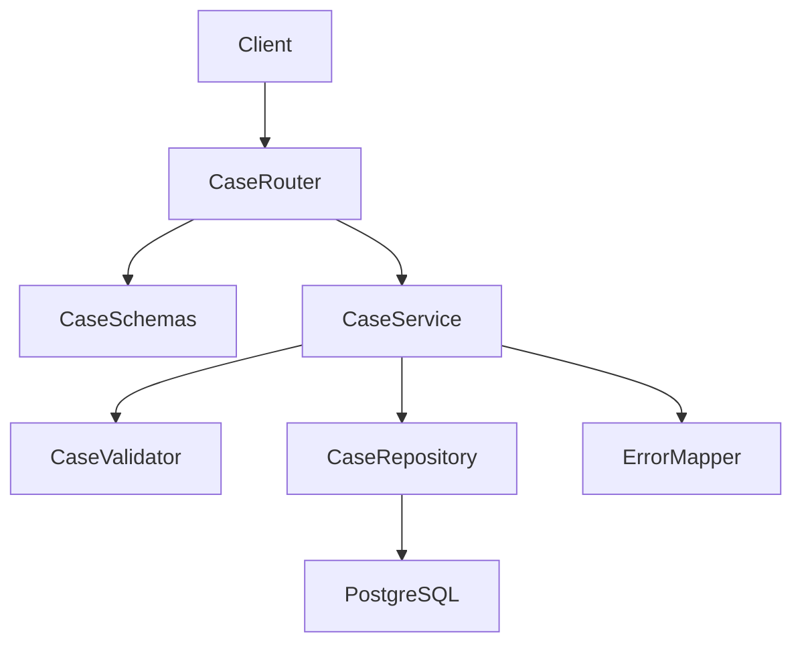

# A3 Case Management Design Appendix

本文承接 `.kiro/specs/a3-case-management/design.md` 中迁移出的扩展说明，目标是保留背景、实现细节和跨规格协作细节，避免主设计文档过长。

## 1. Cross-Spec Coordination（详细版）

### 1.1 提交且摘要

用户在前端点击“提交且摘要”属于跨 `a3-case-management` 与 `llm-case-enrichment` 的业务流程。

1. 前端先调用本规格创建/更新案例接口（保存基础案例数据）。
2. 基础保存成功后，再异步调用增强规格接口触发摘要/结构化增强。
3. 若增强失败，不回滚已保存案例；前端提示“摘要生成失败”并提供重试入口。

职责边界：

- `a3-case-management`：只负责基础案例 CRUD 与基础状态。
- `llm-case-enrichment`：只负责增强产物，不回写基础案例核心字段。
- 两者通过 API 解耦，不共享数据库事务。

### 1.2 删除案例与级联删除

删除为跨规格事务，本规格的边界如下：

- 本规格基础删除接口：`POST /api/a3-cases/delete`
  - 执行 `a3_cases` 物理删除，不主动触发下游删除。
- 本规格协调接口：`POST /api/a3-cases/cascade-delete`
  - 由协调器按顺序编排本规格与下游规格删除。
  - 前端应优先调用协调接口作为统一删除入口。

更完整的级联删除流程与失败处理，见 [cascade-deletion-design](./cascade-deletion-design.md)。

## 2. Architecture Expansion

### 2.1 参考分层



分层职责：

- Router：HTTP 契约与错误映射入口
- Schemas：请求/响应结构与基础边界校验
- Service：业务规则与事务编排
- Repository：持久化与查询
- Validator：字段/步骤/状态规则集中校验

### 2.2 技术栈补充

- Backend：Python 3.11+ + FastAPI
- Validation：Pydantic
- Data：PostgreSQL
- ORM/Migration：SQLAlchemy + Alembic
- Test：pytest + FastAPI TestClient

## 3. Requirements Traceability（扩展追踪）

主文档只保留最小映射原则；此处保留扩展映射口径：

- 需求组 1（数据模型与边界）主要落在 `CaseSchemas`、`A3CaseModel`、`StoreInfoModel`、`CaseRepository`。
- 需求组 2（校验与约束）主要落在 `CaseValidator`、`CaseService`、`ErrorMapper`。
- 需求组 3/4/5（创建、编辑、查询）主要落在 `CaseRouter` + `CaseService` + `CaseRepository`。
- 需求组 6（删除与级联）主要落在 `CaseService`、`CaseDeleteCoordinator`、`CaseRouter`。
- 需求组 7（稳定契约）主要落在 `CaseSchemas` 与统一错误包络。

## 4. Components and Interface Details

### 4.1 CaseService（扩展约束）

- 创建时生成稳定 `case_id`、状态与时间戳。
- 编辑时先加载现有案例并校验状态流转与可变字段。
- 删除支持任意状态；不存在案例返回 `CASE_NOT_FOUND`。
- `store_id` 必须在 `store_infos` 中存在，且案例流程不写 `store_infos`。

### 4.2 CaseDeleteCoordinator（扩展约束）

- 协调器部署在本规格服务内。
- 下游失败不阻塞上游删除，失败信息写入 `partial_failures`。
- 接口需幂等，重复调用不产生额外副作用。

### 4.3 CaseRepository（扩展约束）

- `store_infos` 只读关联查询，不执行 CUD。
- 列表默认稳定排序：`created_at desc, case_id desc`。
- Keyset cursor 必须成对出现：`cursor_created_at` + `cursor_case_id`。

## 5. Data Model Details

## 5.1 逻辑模型补充

- `A3Case` 为聚合根。
- `StoreInfo` 为外部主数据镜像，业务生命周期归外部系统。
- `A3Case.store_id -> StoreInfo.store_id` 必须成立。

### 5.2 最小 JSONB 约束

- `solution_steps`：数组元素必须包含 `order`（从 1 连续递增）与 `content`（非空）
- `context`：至少包含 `scene`
- `outcome`：至少包含 `result` 与 `notes`
- `OutcomeResult`：`improved | no_change | unknown`

### 5.3 状态语义扩展说明

- `draft`、`active` 可编辑；`archived` 只读。
- 允许：`draft -> active`，`active -> archived`
- 不允许：`draft -> archived`、`archived -> *`
- 状态冲突返回 `409 CASE_STATE_CONFLICT`，并在 `meta` 携带 `current_status`。

## 6. Pagination and Query Expansion

列表采用 keyset 分页：

- 排序：`created_at desc, case_id desc`
- cursor：`cursor_created_at` + `cursor_case_id`
- 成对约束：只提供其一时返回 `422 VALIDATION_ERROR`
- 常用过滤：品牌、门店、业态、规模、加盟类型、城市、城市级别、问题类型、状态、创建时间范围

参考查询条件：

- `created_at < :cursor_created_at OR (created_at = :cursor_created_at AND case_id < :cursor_case_id)`

## 7. Error and Monitoring Expansion

统一错误结构示意：

```json
{
  "code": "STRING_CODE",
  "message": "human readable message",
  "fields": [
    { "field": "problem_type", "message": "must be one of ..." }
  ],
  "meta": {
    "current_status": "archived"
  }
}
```

补充规则：

- `VALIDATION_ERROR`：字段缺失、枚举非法、步骤非法、cursor 不合法
- `STORE_NOT_FOUND`：`store_id` 引用了不存在镜像
- `CASE_NOT_FOUND`：案例不存在
- `CASE_STATE_CONFLICT`：状态不可编辑或非法流转
- `INTERNAL_ERROR`：系统或数据库异常

日志建议：

- 记录 create/update/list-fail/not-found 等关键事件
- 避免输出完整案例正文与敏感上下文

## 8. Migration and Rollback Notes

迁移层面：

- 新增 `store_infos`（镜像）与 `a3_cases`（基础案例）表
- 增加外键和常用过滤索引
- 不内置业务种子数据（测试可用夹具注入）

回滚层面：

- 删除本规格新增表与索引
- 不影响后续下游规格表结构

