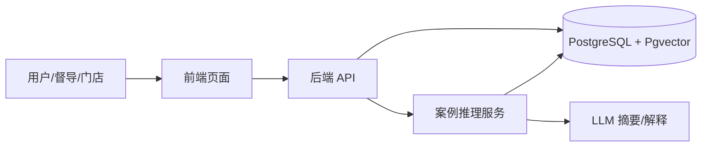

## 1. 文档目标

> 文档职责声明（Derived）：
> 本文档是 `docs/product-overview.md` 的 MVP 阶段落地子集，负责定义当前迭代的交付边界、非目标与技术实现收敛。
> 本文档不重定义长期产品愿景；如与产品愿景冲突，以 `docs/product-overview.md` 为准。

本项目面向门店/督导的 A3 辅导场景，目标是通过 **A3 标准流程 + CBR 案例推理 + AI**，把历史辅导案例沉淀为可检索知识资产，并在新问题出现时自动推荐相似案例与解决思路 。**MVP**版本，优先验证“案例入库、结构化、向量检索、相似案例推荐、基础反馈”这一最小闭环 。

## 2. 目标

MVP 核心目标包括:

- A3 案例创建、编辑、查询
- 案例字段结构化存储
- 案例向量化入库
- 相似案例检索与返回
- 推荐结果解释
- 基础反馈记录
- 基础后台管理页面 

非功能范围:

不做复杂多轮问答与 Agent 编排。
不做自动工单流转和外部系统双向写入。
不做复杂规则引擎与多模态分析。
不做全量训练平台或离线特征工程平台 。

## 3. 技术栈

- **案例推理引擎**：案例推理编排、检索与重排
- **PostgreSQL + Pgvector**：存储案例、向量和反馈
- **Embedding 模型**：采用 BGE-M3（模型id: bge-large-zh）
- **Reranker 模型**: 采用 Qwen3-Reranker-8B （模型id: qwen3-reranker-8b）
- **LLM**：用于摘要、结构化、推荐文案生成，采用 deepseek-v4-flash 模型
- **后端**：Python + FastAPI
- **前端**：Vue

## 4. 业务流程

## 4.1 案例创建流程

1. 用户创建 A3 案例
2. 填写问题、上下文、解决方案、结果等内容
3. 系统做基础校验
4. 生成案例摘要与向量
5. 写入 PostgreSQL 与 Pgvector
6. 生成可检索状态 

## 4.2 案例检索流程

1. 用户输入新问题
2. 系统对输入做标准化
3. 生成查询向量
4. 在 Pgvector 中做 Top-K 检索
5. 案例推理引擎对召回结果进行重排与组装
6. 返回相似案例与推荐步骤 

## 4.3 反馈流程

1. 用户查看推荐结果
2. 对结果标记有用/无用或评分
3. 记录查询文本、命中案例、反馈结果
4. 用于后续优化召回权重和结果排序

## 5. 功能需求

## 5.1 A3 案例管理

- 新增案例
- 编辑案例
- 查看案例详情
- 案例列表查询

## 5.2 案例结构化

A3 案例应至少包含以下字段：

- 问题描述
- 门店/品牌信息
- 问题类型
- 场景上下文
- 根因分析
- 解决步骤
- 效果结果
- 标签
- 创建时间 

## 5.3 案例推荐

- 支持按当前问题检索历史案例
- 支持返回 Top-K 相似案例
- 支持展示推荐理由
- 支持展示相似度分值
- 支持按基础条件过滤，如品牌、业态、门店类型、区域 

## 5.4 反馈管理

- 支持反馈“有用/无用”
- 支持简单评分
- 支持记录是否采纳

## 6 方案原则

- MVP 优先，避免过度设计
- 单库优先，减少部署复杂度
- 结构化字段与向量检索并行，兼顾过滤与语义召回
- 召回结果必须可解释，避免纯黑盒

## 7. 系统架构

系统采用”应用层 + 检索层 + 数据层”三层结构
- 应用层负责页面与 API
- 检索层由案例推理引擎承担
- 数据层使用 PostgreSQL + Pgvector 保存案例和向量
- LLM 主要用于文本摘要、结构化提取和推荐结果生成，不承担主检索职责

