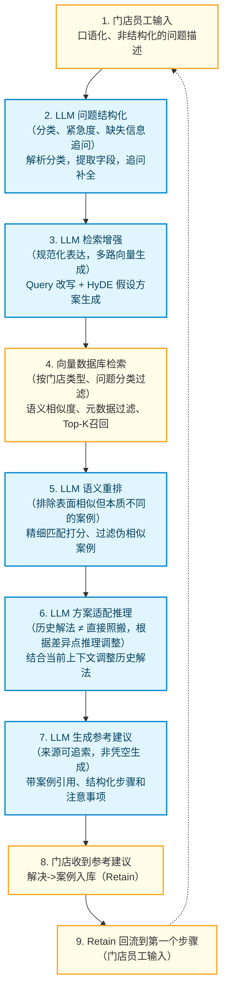

# 慧运营·A3+CBR 实现方案

> 文档职责声明（Canonical）：
> 本文档是产品层的单一权威入口，负责定义长期愿景、核心场景、能力边界与关键原则。
> 如与其他产品说明存在差异，以本文档为准；MVP 相关的阶段性收敛以 `docs/mvp-product.md` 作为补充约束。

## 1 产品目标

基于**精益 A3 方法论 + CBR + AI**，实现：

1. 为门店/督导提供**结构化 A3 辅导模版**，引导正确的问题解决步骤；
2. 将每次辅导成果**自动记录、归集**，形成知识库；
3. 通过 AI **自动推送**相似解决方案至同类问题门店/督导；
4. 跨品牌数据聚合，形成**行业场景方案库**，持续反哺平台。

## 2. 用户角色

| 角色                             | 职责                        | 诉求                                                         |
| -------------------------------- | --------------------------- | ------------------------------------------------------------ |
| **门店（店长/员工）**            | 接受辅导、执行改善          | 1. 快速获取辅导方法<br />2. 提供正确的目标改善方法，沉淀到知识库 |
| **督导**                         | 负责门店巡检与运营/经营辅导 | 同上                                                         |
| **品牌运营管理者**               | 品牌内部全局管理与运营      | 1. 全局掌握辅导成效<br />2. 积累 / 整理品牌内部知识资产      |
| **平台管理员**（慧运营运营团队） | 管理行业方案库              | 1. 跨品牌聚合优质解决方案<br />2. 积累 / 整理全行业知识资产  |

## 3. 核心使用场景

### 3.1 门店提出问题 / 督导发现问题，启动 A3 辅导流程

- 督导在巡检或经营辅导过程中发现门店问题，使用 A3 模板记录：例如：“xxx门店，近期翻台率为300%，低于目标值 20%。原因是因为出餐效率降低；对此指定整改方案：xxx ……”，督导按步骤完成辅导，并系统记录包括整改的全程。
- 上述过程也可以是门店自行发起 / 记录

### 3.2 同类问题智能推送

在场景一中，用户可以在输入问题描述后点击某个按钮，或自动弹出其它门店出现同类问题时的解决方案供参考。它可能是：

- 已经被证明是有效的方案
- 其它门店的解决思路和过程

### 3.3 知识库的沉淀

包括如下集中场景：

- 督导 / 门店在任意时间主动发起新的 A3 辅导任务。系统自动进行结构化处理：提取问题类型、门店信息、标签、摘要等重新入库
- 当经营数据分析模块检测到某些指标低于目标阈值，系统自动发起“A3 辅导任务”，要求督导 / 品牌运营管理者进行填写
- 品牌运营管理者 / 平台管理员手动录入
- 从巡检报告中“扫描 –> 智能提取 / 比较 –> 发起 A3 辅导任务”（可以只针对特定类型的问题）

### 3.4 行业库的聚合

平台管理员定期从各品牌知识库中聚合优质方案，脱敏后建立行业级场景方案库，形成慧运营平台的核心数据资产

## 4. 模块架构

由 5 个模块形成闭环：

> 发现问题 → A3辅导执行 → 知识沉淀 → AI推送 → 行业聚合

```
┌─────────────────────────────────────────────────────────┐
│                    智慧辅导引擎 SCE                       │
│                                                         │
│  ┌──────────────┐  ┌──────────────┐  ┌──────────────┐   │
│  │ A3 辅导模版    │→ │ 辅导过程记录   │→ │ 知识库管理     │   │
│  │ 引导引擎       │  │ & 数据追踪    │  │ & 归集        │   │
│  └──────────────┘  └──────────────┘  └──────────────┘   │
│                            │                    │       │
│                            ▼                    ▼       │
│                    ┌──────────────────────────────────┐ │
│                    │       CBR + AI 智能推送  案库      │ │
│                    └──────────────────────────────────┘ │
│                                      │                  │
│                                      ▼                  │
│                    ┌──────────────────────────────────┐ │
│                    │    AI 智能推送 & 行业方案库         │ │
│                    └──────────────────────────────────┘ │
└─────────────────────────────────────────────────────────┘
```

### 4.1 A3 案例引擎

**A3 辅导案例**

包含 A3 标准步骤，包含：背景、现状、目标、根因分析、对策方案、实施计划、效果确认、标准化

**行为触发（通过A3模板创建辅导记录）**

- 督导 / 门店手动触发
- 巡检报告触发
- 经营指标偏离了阈值触发
- 品牌经营者 / 平台管理者手动触发

**案例匹配**

4 个步骤：

1. 维度匹配：品牌，门店属性（业态、城市、规模等）、问题类型…
2. 语义匹配：**基于案例推理（Case-Based Reasoning, CBR）**
3. 讲匹配到的案例进行综合 & 总结
4. 返回总结与相关原始案例

### 4.2 过程与数据追踪

对每一个 A3 辅导任务全程进行结构化数据记录，自动拉取经营数据进行目标对比（**假如问题与指标相关，则可以比较 “基线 & 当前值 & 目标值 & 同类门店均值” **），形成可视化的改善追踪看板。

数据追踪可以将辅导过程用操作时间线记录下来：

1. 首次填写时间、最后修改时间
2. 关键数据变更节点，如指标变化明显、达标等
3. 关键步骤变更，如：制定了对策方案、实施计划的每个节点等
4. 沟通记录
5. AI 的推荐方案，采纳 / 忽略记录
6. 最终是否纳入标准库

### 4.3 知识库的管理 & 归集

每个完成的 A3 辅导任务可自动或人工触发入库操作，生成结构化的知识库条目，按品牌和问题类型自动归集分类。

**知识库的存储**

- **结构化案例信息**保存在关系数据库中：问题类型、品牌、标签、业态…
- **总结 & 摘要 & 原始案例** 保存在向量库中

**知识库条目的结构**

| 字段         | 来源                                                         |
| ------------ | ------------------------------------------------------------ |
| 问题描述     | AI 自动摘要                                                  |
| 核心根因     | 结构化标签                                                   |
| 解决方案摘要 | AI 自动摘要                                                  |
| 改善效果数据 | 手动填写 **+ 自动填充（基线/目标/最终值/改善率）**           |
| 关联 SOP     | 链接至 SOP 管理模块                                          |
| 适用标签     | AI 摘要 + 人工补充。包括：业态、问题类型、门店规模、季节性等 |
| 质量评分     | **AI 评分 +** 人工评分，基于步骤完整度 + 改善效果            |
| 入库时间     | 自动记录                                                     |

**知识库结构化设计**

门店属性（示例，非定稿）：

```json
{
  "id": 12345678,
  "name": "韭菜园旗舰店",
  "store_type": "旗舰店",
  "region": "中南/湖南/长沙",
  "city_size": "一线城市",
  "brand": {
    "brand_name": "睿博数据",
    "category": "火锅",
    "size": "large"
  },
  "created_at": "2024-03-15",
}
```

案例（示例，非定稿）：

```json
{
  "case_id": "CASE-2024-001",
  "problem": {
    "description": "收银系统在高峰期频繁卡顿，影响结账速度",
    "category": "IT设备",
    "store_type": "旗舰店",
    "region": "华南",
    "severity": "high"
  },
  "context": {
    "store_size": "large",
    "peak_hours": true,
    "concurrent_users": 12
  },
  "solution": {
    "steps": ["检查网络带宽占用", "发现库存同步任务抢占资源", "将同步任务调整至凌晨执行"],
    "root_cause": "后台定时任务与高峰期冲突",
    "resolution_time_hours": 2
  },
  "outcome": "resolved",
  "tags": ["收银", "性能", "定时任务", "网络"],
  "created_at": "2024-03-15",
  "embedding": [0.23, -0.11, ...]  // 向量化后存入
}
```

**知识库条目入库流程**

```
1.辅导任务完成
    ↓
2. 系统检查步骤完整度（≥6/8 步骤已填写且有效）
    ↓
3. AI 自动生成：
  · 问题摘要（基于 S1/S2 内容）
  · 方案摘要（基于 S5 内容）
  · 适用标签建议
    ↓
4. 辅导人员审核并确认（可修改 AI 生成内容）
    ↓
5. 写入品牌知识库（status: PUBLISHED）
    ↓
6. 触发行业库入库审核 (根据评分入选、脱敏)
```

**向量化策略**

向量化是实现“语义搜索”、“基于案例推理（CBR）”的基础。

- 将文字转换为向量（处理语义）：向量化使用云端部署的 **BGE-M3（模型id: bge-large-zh）** 实现，中文召回率可以达到 80%+。
- 对已经初步检索出来的一批候选结果，做更精细的重新排序使用云端部署的 **Reranker（模型Id：qwen3-reranker-8b）**实现。
- 向量库：负责案例数据的存储和语义检索。我们将使用 **pgvector** 实现，它是 PostgreSQL 的扩展，可以与业务数据库一体化部署。如果超过百万规模，备选 Milvus。
- 数据库使用 **PostgreSQL**，与 pgvector 一体化部署。案例数据与业务数据在同一个库，事务一致性有保障。

### 4.4 基于CBR + AI 的智能推送

**1. 核心功能**

基于知识库中的历史解决方案，通过 AI 能力实现：向面临同类问题的门店和督导主动/被动推送相关案例 & 解决方案

**2. 基于“规则”的知识库与 RAG 知识库的问题**

- "如果…则…" 这样的规则难以穷举
- RAG 知识库使用 chunk + 语义搜索难以满足要求
  - chunk 粗暴分割了完整条目
  - 无法区分**“冲红”**与**“作废”**这样的业务语义，甚至不理解**“10点”**与**“上午”**的异同

**3. What is CBR**

案例推理（Case-Based Reasoning，CBR） 是人工智能领域的一种推理范式，其核心思想来源于人类解决问题的自然方式：用过去的经验来应对新问题。

其应用领域包括：医学诊断、法律裁决、客服与故障排除等

**4. CBR 实现技术栈**

- **案例推理引擎（Python）  +  pgvector  +  BGE_M3 + Reranker**
- pgvector 支持 ANN 近似检索，性能良好，百万级数据支撑
- LLM：DeepSeek（OpenAI兼容即可，具体选型试情形而定）

**5. AI (LLM) 在 CBR 中的作用**

整体流程如下，其中 2、3、5、6、7 步骤需要 LLM 参与



**推送触发**

当下列条件满足时，讲触发“检索 & 推送”动作

- 新建辅导任务，督导 / 门店输入问题，且结构化后
- 门店经营数据入库，检测到关键指标偏离（需事先配置）
- 填写巡检报告时，巡检项关联到 SOP，SOP触发（需事先配置哪些SOP参与检测）
- 手动填写 A3 报告，手动点击“案例检索”按钮（MVP快速验证）

**推送内容（待定）**

- 问题摘要
- 核心解决步骤、改善效果
- 类似门店案例：按照相关性排序，最多 N 条

**推送渠道**

- 慧运营 App 内消息
- 邮件推送（单例 + 聚合）
- 平台内部消息，由客成代推

### 4.5 行业知识库

> **体验型知识库（Experiential Knowledge Base）**
>
> 与 RAG 不同，在 CBR 语境中体验型知识库（Experiential Knowledge Base），与规则型知识库（Rule Base）并列

**数据脱敏**

- 门店名称、品牌名称、位置等可识别信息
- 保留业态、规模、问题类型、解决步骤、改善效果


**入库条件**

- 数据完整：问题、方案、效果、评分等；
- 品牌运营管理者标记为“优质/推荐”等；
- 质量评分大于 x 分；
- 改善效果有依据：基线、目标、最终值
- 品牌授权（待定）


**入库触发**

- 案例进入品牌案例库
- 定期采集，聚合审核
- 平台管理者 & 授权者手动撰写，直接入库

> 行业库条目在 AI 推送时有更高权重


## 5. 构建与集成方案

### 5.1 构建方案

作为独立产品研发，与慧运营分离，因为：

- 技术路线与慧运营独立
- 避免业务 & 架构包袱

### 5.2 集成

主要包括与“经营数据管理系统”的集成、与“慧运营”的集成。

- MVP 阶段，经营数据直接从“慧运营”获取
- 未来可以集成其它系统如 CRM 等

本系统与慧运营使用 API 方式集成，事件监听采用 MQ 消息推送：

| 集成模块         | 集成方式       | 说明                                               |
| ---------------- | -------------- | -------------------------------------------------- |
| **经营数据分析** | API 调用       | 拉取指标实际值（支持历史趋势和实时值）             |
| **巡检模块**     | 事件监听 + API | 巡检问题项触发辅导任务创建                         |
| **SOP 管理**     |                | 慧运营内将 A3 标准化时关联 SOP；SOP 可反查关联任务 |
| **人员管理**     | 复制           | 督导、店长、运营管理等角色权限复用                 |
| **训练模块**     | 事件监听 + API | 优质 A3 案例可一键导出为培训素材                   |

### MVP 方案

- 手动 A3 案例入库，包括门店属性与案例信息
- A3 案例结构化：由 LLL 结构化案例信息
- A3 案例向量化（含自动评分）并存入向量数据库（品牌知识库）
- 手动 A3 案例入库时，手动检索相似案例，获得**参考建议与案例索引**（！核心功能：CBR案例推理，检索质量验证）

